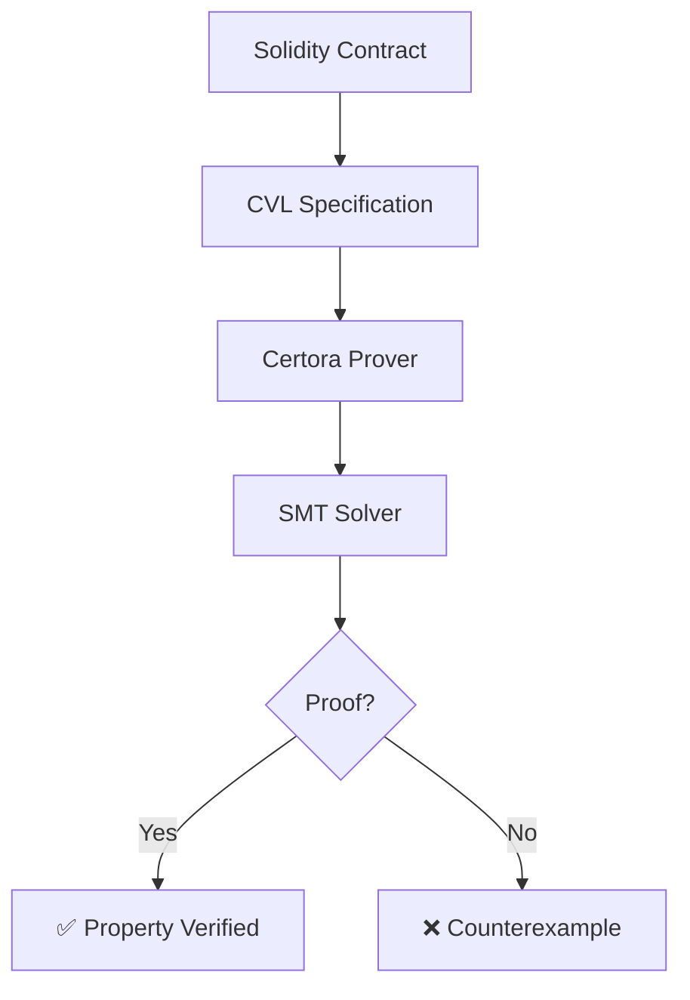

# Certora Formal Verification Guide

**Last Updated**: October 13, 2025
**Tool Version**: Certora Prover v7.12.1
**Language Support**: Solidity (EVM), Move, Solana
**License**: Commercial (free tier available)

---

## Table of Contents

1. [Introduction to Formal Verification](#introduction-to-formal-verification)
2. [What is Certora Prover?](#what-is-certora-prover)
3. [CVL (Certora Verification Language)](#cvl-certora-verification-language)
4. [Vulnerability Patterns](#vulnerability-patterns)
5. [Writing CVL Specifications](#writing-cvl-specifications)
6. [Configuration & Usage](#configuration--usage)
7. [Best Practices](#best-practices)
8. [Interpreting Results](#interpreting-results)
9. [Comparison with Other Tools](#comparison-with-other-tools)
10. [Troubleshooting](#troubleshooting)
11. [Resources](#resources)

---

## Introduction to Formal Verification

### What is Formal Verification?

Formal verification is a mathematical approach to proving software correctness. Unlike testing which checks specific cases, formal verification proves properties hold for **ALL possible inputs and execution paths**.

#### Analogy: Testing vs Formal Verification

**Testing** is like checking if a bridge can hold:
- 10 cars ✅
- 100 cars ✅
- 1000 cars ✅
- Conclusion: "Probably safe" (but we haven't checked 1001 cars!)

**Formal Verification** is like mathematically proving:
- Bridge supports X tons
- Each car weighs ≤ Y tons
- Maximum cars = X / Y
- Conclusion: "Guaranteed safe for ≤ (X/Y) cars" (mathematical proof!)

### Why Formal Verification?

**Problem with Testing**:
```solidity
function transfer(address to, uint256 amount) public {
    require(balances[msg.sender] >= amount);
    balances[msg.sender] -= amount;
    balances[to] += amount;
}
```

Testing might check:
- Transfer 100 tokens ✅
- Transfer 1000 tokens ✅
- Transfer from account with 0 balance ✅ (reverts correctly)

But testing misses:
- Integer overflow when `balances[to] = MAX_UINT256 - 50` and `amount = 100`
- Reentrancy attacks
- Edge cases with specific address combinations

**Formal Verification** mathematically proves:
- No integer overflows for ANY amount
- Balance conservation for ALL transfers
- Access control for ALL callers

### Verification Methods Compared

| Method | Coverage | Guarantees | Speed | Skill Level |
|--------|----------|------------|-------|-------------|
| **Unit Testing** | Specific cases | None | Fast | Low |
| **Fuzzing** | Random sampling | Probabilistic | Medium | Medium |
| **Symbolic Execution** | All paths | Path coverage | Slow | Medium |
| **Formal Verification** | All inputs & paths | Mathematical proof | Slowest | High |

### When to Use Formal Verification

**✅ Use Certora When**:
- High-value contracts ($10M+ TVL)
- Critical protocol logic
- Complex invariants to prove
- Multi-contract interactions
- Upgrade/migration safety
- Regulatory compliance needed

**❌ Skip Certora When**:
- Low-value contracts
- Simple token contracts
- No budget for commercial tools
- Tight deadlines (<1 week)
- No CVL expertise available

---

## What is Certora Prover?

### Overview

Certora Prover is a commercial formal verification tool that uses **SMT (Satisfiability Modulo Theories)** solvers to mathematically prove smart contract properties.

**Key Features**:
1. **CVL Specifications**: Domain-specific language for writing properties
2. **Automatic Verification**: Generates and checks invariants automatically
3. **Counterexamples**: Provides concrete examples when properties fail
4. **Multi-Contract**: Verifies interactions between multiple contracts
5. **Cloud Infrastructure**: Scalable verification on Certora's servers

### How Certora Works



1. **Input**: Solidity contract + CVL specification
2. **Compilation**: Certora compiles both to intermediate representation
3. **Verification**: SMT solver attempts to prove properties
4. **Output**: Either a proof (✅) or counterexample (❌)

### Industry Usage

Certora is used by leading DeFi protocols:

- **Aave**: $10B+ TVL - Formal verification of lending protocol
- **Compound**: $3B+ TVL - Formal verification of money markets
- **Uniswap**: $5B+ TVL - Formal verification of AMM logic
- **MakerDAO**: $8B+ TVL - Formal verification of stablecoin system

### Cost & Licensing

**Free Tier** (https://www.certora.com/signup):
- ~100 verification hours/month
- Full feature access
- Community support
- Perfect for open source projects

**Commercial**:
- Unlimited verification hours
- Priority queue
- Dedicated support
- SLA guarantees
- Required for production deployments

---

## CVL (Certora Verification Language)

### What is CVL?

CVL is a domain-specific language for writing formal specifications. It's similar to Solidity but includes constructs for expressing mathematical properties.

### CVL File Structure

```cvl
// 1. Method Declarations
methods {
    function totalSupply() external returns (uint256) envfree;
    function balanceOf(address) external returns (uint256) envfree;
    function transfer(address, uint256) external returns (bool);
}

// 2. Ghost Variables (auxiliary state)
ghost mathint sumOfBalances {
    init_state axiom sumOfBalances == 0;
}

// 3. Hooks (monitor state changes)
hook Sstore balances[KEY address a] uint256 newBalance (uint256 oldBalance) {
    havoc sumOfBalances assuming
        sumOfBalances@new == sumOfBalances@old + newBalance - oldBalance;
}

// 4. Invariants (always-true properties)
invariant totalSupplyIsSum()
    to_mathint(totalSupply()) == sumOfBalances

// 5. Rules (conditional properties)
rule transferPreservesBalance(address from, address to, uint256 amount) {
    uint256 balanceFromBefore = balanceOf(from);
    uint256 balanceToBefore = balanceOf(to);

    env e;
    transfer(e, to, amount);

    uint256 balanceFromAfter = balanceOf(from);
    uint256 balanceToAfter = balanceOf(to);

    assert balanceFromBefore + balanceToBefore ==
           balanceFromAfter + balanceToAfter;
}
```

### Key CVL Concepts

#### 1. Methods Declaration

Declares which contract functions to verify:

```cvl
methods {
    // envfree: pure/view functions (don't need transaction environment)
    function totalSupply() external returns (uint256) envfree;
    function balanceOf(address) external returns (uint256) envfree;

    // State-changing functions need environment
    function transfer(address, uint256) external returns (bool);
    function mint(address, uint256) external;
}
```

#### 2. Invariants

Properties that must hold after **every transaction**:

```cvl
// Example: Total supply never negative
invariant totalSupplyNonNegative()
    totalSupply() >= 0

// Example: Each balance never exceeds total supply
invariant balanceNotGreaterThanSupply(address user)
    balanceOf(user) <= totalSupply()
```

#### 3. Rules

Properties that must hold under **specific conditions**:

```cvl
// Example: Transfer increases recipient balance
rule transferIncreasesBalance(address to, uint256 amount) {
    uint256 balanceBefore = balanceOf(to);

    env e;
    require e.msg.sender != to;  // Pre-condition
    transfer(e, to, amount);

    uint256 balanceAfter = balanceOf(to);

    assert balanceAfter == balanceBefore + amount;  // Post-condition
}
```

#### 4. Ghost Variables

Auxiliary variables for tracking complex properties:

```cvl
ghost mathint totalTransfers {
    init_state axiom totalTransfers == 0;
}

hook Sstore balances[KEY address a] uint256 newBalance (uint256 oldBalance) {
    if (newBalance > oldBalance) {
        havoc totalTransfers assuming totalTransfers@new == totalTransfers@old + 1;
    }
}

invariant transferCountMatchesState()
    totalTransfers > 0 => totalSupply() > 0
```

#### 5. Hooks

Monitor state changes during execution:

```cvl
// Monitor balance updates
hook Sstore balances[KEY address addr] uint256 newValue (uint256 oldValue) {
    // Track changes to balances mapping
    require newValue >= 0;
}

// Monitor storage updates
hook Sstore currentSlot uint256 value {
    // Track changes to specific storage slot
    require value <= MAX_VALUE;
}
```

### CVL Syntax Reference

| Construct | Purpose | Example |
|-----------|---------|---------|
| `methods` | Declare functions | `function totalSupply() external envfree` |
| `invariant` | Always-true property | `invariant supply > 0` |
| `rule` | Conditional property | `rule transferWorks()` |
| `ghost` | Auxiliary variable | `ghost mathint sum` |
| `hook` | State monitor | `hook Sstore balances[...]` |
| `env e` | Transaction environment | `transfer(e, to, amount)` |
| `require` | Pre-condition | `require amount > 0` |
| `assert` | Post-condition | `assert balance >= 0` |
| `to_mathint` | Unbounded arithmetic | `to_mathint(x) + to_mathint(y)` |
| `envfree` | Pure/view function | `returns (uint256) envfree` |
| `@new` / `@old` | State versions | `sum@new == sum@old + 1` |

---

## Vulnerability Patterns

### Pattern 1: Integer Overflow/Underflow

**What It Proves**: Arithmetic operations stay within bounds

**Vulnerable Code**:
```solidity
// Solidity <0.8: No automatic overflow/underflow protection
pragma solidity ^0.7.0;

contract VulnerableToken {
    mapping(address => uint256) public balances;

    function unsafeAdd(uint256 a, uint256 b) public pure returns (uint256) {
        return a + b;  // Can overflow if a + b > MAX_UINT256
    }

    function unsafeSub(uint256 a, uint256 b) public pure returns (uint256) {
        return a - b;  // Can underflow if a < b
    }

    function mint(address to, uint256 amount) public {
        balances[to] += amount;  // Overflow: 255 + 1 = 0 in uint8
    }
}
```

**Real-World Impact**:
- **BeautyChain (BEC) 2018**: Integer overflow allowed attacker to generate unlimited tokens
- **SMT Token 2018**: Similar overflow bug, token value crashed to $0

**CVL Specification**:
```cvl
rule noOverflowInAdd(uint256 a, uint256 b) {
    env e;
    uint256 result = unsafeAdd(e, a, b);

    // Prove result equals mathematical sum (no overflow)
    assert to_mathint(result) == to_mathint(a) + to_mathint(b);
}

rule noUnderflowInSub(uint256 a, uint256 b) {
    env e;
    require a >= b;  // Pre-condition
    uint256 result = unsafeSub(e, a, b);

    // Prove result equals mathematical difference (no underflow)
    assert to_mathint(result) == to_mathint(a) - to_mathint(b);
}

invariant balanceNeverOverflows(address user)
    balances[user] <= max_uint256
```

**Secure Fix**:
```solidity
// Solidity >=0.8: Built-in overflow/underflow protection
pragma solidity ^0.8.0;

contract SecureToken {
    mapping(address => uint256) public balances;

    function safeAdd(uint256 a, uint256 b) public pure returns (uint256) {
        return a + b;  // Automatically reverts on overflow
    }

    function safeSub(uint256 a, uint256 b) public pure returns (uint256) {
        return a - b;  // Automatically reverts on underflow
    }

    function mint(address to, uint256 amount) public {
        balances[to] += amount;  // Safe: reverts on overflow
    }
}
```

---

### Pattern 2: Reentrancy

**What It Proves**: State updates occur before external calls (Checks-Effects-Interactions pattern)

**Vulnerable Code**:
```solidity
contract VulnerableBank {
    mapping(address => uint256) public balances;

    function deposit() public payable {
        balances[msg.sender] += msg.value;
    }

    function withdraw(uint256 amount) public {
        require(balances[msg.sender] >= amount, "Insufficient balance");

        // VULNERABILITY: External call BEFORE state update
        (bool success, ) = msg.sender.call{value: amount}("");
        require(success, "Transfer failed");

        balances[msg.sender] -= amount;  // State update AFTER external call
    }
}
```

**Real-World Impact**:
- **The DAO 2016**: $60M stolen via reentrancy attack
- **Cream Finance 2021**: $130M stolen via reentrancy

**Attack Scenario**:
```solidity
contract Attacker {
    VulnerableBank bank;
    uint256 public attackCount = 0;

    function attack() public payable {
        bank.deposit{value: 1 ether}();
        bank.withdraw(1 ether);  // Triggers reentrancy
    }

    receive() external payable {
        if (attackCount < 10) {
            attackCount++;
            bank.withdraw(1 ether);  // Re-enter before balance updated!
        }
    }
}
```

**CVL Specification**:
```cvl
rule noReentrancyInWithdraw(address user, uint256 amount) {
    uint256 balanceBefore = balances[user];

    env e;
    withdraw(e, amount);

    uint256 balanceAfter = balances[user];

    // Prove balance decreases atomically (no reentrancy)
    assert balanceAfter == balanceBefore - amount;

    // Prove no partial state visible
    assert balanceAfter < balanceBefore =>
           balanceBefore - balanceAfter == amount;
}

// Invariant: Contract balance >= sum of user balances
invariant contractBalanceAtLeastSumOfBalances()
    address(this).balance >= sumOfAllBalances()
```

**Secure Fix**:
```solidity
import "@openzeppelin/contracts/security/ReentrancyGuard.sol";

contract SecureBank is ReentrancyGuard {
    mapping(address => uint256) public balances;

    function withdraw(uint256 amount) public nonReentrant {
        require(balances[msg.sender] >= amount, "Insufficient balance");

        // STATE UPDATE BEFORE EXTERNAL CALL
        balances[msg.sender] -= amount;

        // External call AFTER state update
        (bool success, ) = msg.sender.call{value: amount}("");
        require(success, "Transfer failed");
    }
}
```

---

### Pattern 3: Access Control Violations

**What It Proves**: Only authorized addresses can call privileged functions

**Vulnerable Code**:
```solidity
contract VulnerableWallet {
    address public owner;
    mapping(address => bool) public admins;

    constructor() {
        owner = msg.sender;
    }

    // VULNERABILITY: No access control
    function setOwner(address newOwner) public {
        owner = newOwner;  // Anyone can become owner!
    }

    // VULNERABILITY: Weak access control
    function addAdmin(address newAdmin) public {
        require(msg.sender == owner || admins[msg.sender], "Not authorized");
        admins[newAdmin] = true;  // Admins can add themselves as owner!
    }

    // VULNERABILITY: Missing access control
    function withdrawAll() public {
        payable(msg.sender).transfer(address(this).balance);  // Anyone can withdraw!
    }
}
```

**Real-World Impact**:
- **Parity Multi-Sig 2017**: $30M stolen due to access control bug
- **Poly Network 2021**: $600M stolen (later returned) via access control exploit

**CVL Specification**:
```cvl
rule onlyOwnerCanSetOwner(address newOwner) {
    address ownerBefore = owner();

    env e;
    setOwner(e, newOwner);

    address ownerAfter = owner();

    // Prove only current owner can change ownership
    assert ownerBefore != ownerAfter => e.msg.sender == ownerBefore;
}

rule onlyOwnerCanAddAdmin(address newAdmin) {
    env e;
    addAdmin(e, newAdmin);

    // Prove only owner can add admins
    assert admins[newAdmin] => e.msg.sender == owner();
}

rule onlyOwnerCanWithdraw() {
    uint256 balanceBefore = address(this).balance;

    env e;
    withdrawAll(e);

    uint256 balanceAfter = address(this).balance;

    // Prove only owner can withdraw funds
    assert balanceAfter < balanceBefore => e.msg.sender == owner();
}
```

**Secure Fix**:
```solidity
import "@openzeppelin/contracts/access/Ownable.sol";
import "@openzeppelin/contracts/access/AccessControl.sol";

contract SecureWallet is Ownable, AccessControl {
    bytes32 public constant ADMIN_ROLE = keccak256("ADMIN_ROLE");

    constructor() {
        _grantRole(DEFAULT_ADMIN_ROLE, msg.sender);
    }

    function setOwner(address newOwner) public onlyOwner {
        transferOwnership(newOwner);
    }

    function addAdmin(address newAdmin) public onlyRole(DEFAULT_ADMIN_ROLE) {
        grantRole(ADMIN_ROLE, newAdmin);
    }

    function withdrawAll() public onlyOwner {
        payable(msg.sender).transfer(address(this).balance);
    }
}
```

---

### Pattern 4: Token Supply Conservation

**What It Proves**: Total supply equals sum of all balances

**Vulnerable Code**:
```solidity
contract VulnerableToken {
    mapping(address => uint256) public balances;
    uint256 public totalSupply;

    function mint(address to, uint256 amount) public {
        balances[to] += amount;
        // BUG: Forgot to update totalSupply!
    }

    function burn(address from, uint256 amount) public {
        require(balances[from] >= amount);
        balances[from] -= amount;
        totalSupply -= amount;  // Only burn updates totalSupply
    }

    function transfer(address to, uint256 amount) public {
        require(balances[msg.sender] >= amount);
        balances[msg.sender] -= amount;
        balances[to] += amount;
        // totalSupply unchanged (correct for transfer)
    }
}
```

**Real-World Impact**:
- Total supply discrepancy breaks DeFi integrations
- Price oracles report incorrect values
- AMM pools become imbalanced

**CVL Specification**:
```cvl
methods {
    function totalSupply() external returns (uint256) envfree;
    function balanceOf(address) external returns (uint256) envfree;
}

// Ghost variable: Sum of all balances
ghost mathint sumOfBalances {
    init_state axiom sumOfBalances == 0;
}

// Hook: Update sum when balances change
hook Sstore balances[KEY address addr] uint256 newBalance (uint256 oldBalance) {
    havoc sumOfBalances assuming
        sumOfBalances@new == sumOfBalances@old + newBalance - oldBalance;
}

// Invariant: Total supply equals sum of balances
invariant totalSupplyIsSum()
    to_mathint(totalSupply()) == sumOfBalances
    {
        preserved mint(address to, uint256 amount) with (env e) {
            require sumOfBalances + amount <= max_uint256;
        }
    }
```

**Secure Fix**:
```solidity
contract SecureToken {
    mapping(address => uint256) public balances;
    uint256 public totalSupply;

    function mint(address to, uint256 amount) public {
        balances[to] += amount;
        totalSupply += amount;  // Fixed: Update totalSupply
    }

    function burn(address from, uint256 amount) public {
        require(balances[from] >= amount);
        balances[from] -= amount;
        totalSupply -= amount;
    }

    function transfer(address to, uint256 amount) public {
        require(balances[msg.sender] >= amount);
        balances[msg.sender] -= amount;
        balances[to] += amount;
        // totalSupply unchanged (correct)
    }
}
```

---

### Pattern 5: State Consistency

**What It Proves**: Contract invariants hold across all states

**Vulnerable Code**:
```solidity
contract VulnerableVault {
    uint256 public totalDeposits;
    uint256 public totalWithdrawals;
    mapping(address => uint256) public deposits;

    function deposit() public payable {
        deposits[msg.sender] += msg.value;
        totalDeposits += msg.value;
    }

    function withdraw(uint256 amount) public {
        require(deposits[msg.sender] >= amount, "Insufficient balance");

        deposits[msg.sender] -= amount;
        // BUG: Forgot to update totalWithdrawals!

        payable(msg.sender).transfer(amount);
    }

    function emergencyWithdraw() public onlyOwner {
        uint256 balance = address(this).balance;
        payable(owner).transfer(balance);
        // BUG: Forgot to update totalWithdrawals!
    }
}
```

**CVL Specification**:
```cvl
// Invariant: Contract balance equals deposits minus withdrawals
invariant balanceMatchesAccounting()
    to_mathint(address(this).balance) ==
    to_mathint(totalDeposits()) - to_mathint(totalWithdrawals())

// Invariant: totalWithdrawals never exceeds totalDeposits
invariant withdrawalsNotGreaterThanDeposits()
    totalWithdrawals() <= totalDeposits()

// Invariant: Each user's deposit not greater than totalDeposits
invariant userDepositNotGreaterThanTotal(address user)
    deposits[user] <= totalDeposits()
```

**Secure Fix**:
```solidity
contract SecureVault {
    uint256 public totalDeposits;
    uint256 public totalWithdrawals;
    mapping(address => uint256) public deposits;

    function withdraw(uint256 amount) public {
        require(deposits[msg.sender] >= amount, "Insufficient balance");

        deposits[msg.sender] -= amount;
        totalWithdrawals += amount;  // Fixed: Update accounting

        payable(msg.sender).transfer(amount);
    }

    function emergencyWithdraw() public onlyOwner {
        uint256 balance = address(this).balance;
        totalWithdrawals += balance;  // Fixed: Update accounting
        payable(owner).transfer(balance);
    }
}
```

---

### Pattern 6: Atomicity Violations

**What It Proves**: Operations complete atomically (all-or-nothing)

**Vulnerable Code**:
```solidity
contract VulnerableExchange {
    mapping(address => uint256) public ethBalances;
    mapping(address => uint256) public tokenBalances;

    function swapEthForTokens(uint256 ethAmount) public {
        require(ethBalances[msg.sender] >= ethAmount, "Insufficient ETH");

        ethBalances[msg.sender] -= ethAmount;

        // What if this calculation overflows or reverts?
        uint256 tokenAmount = calculateTokenAmount(ethAmount);

        tokenBalances[msg.sender] += tokenAmount;
        // If this line reverts, ETH is lost but tokens not received!
    }

    function calculateTokenAmount(uint256 ethAmount) internal view returns (uint256) {
        // Complex calculation that might revert
        return ethAmount * getPrice() / 1e18;
    }
}
```

**CVL Specification**:
```cvl
rule swapIsAtomic(address user, uint256 ethAmount) {
    uint256 ethBefore = ethBalances[user];
    uint256 tokenBefore = tokenBalances[user];

    env e;
    require e.msg.sender == user;

    swapEthForTokens@withrevert(e, ethAmount);

    uint256 ethAfter = ethBalances[user];
    uint256 tokenAfter = tokenBalances[user];

    // If swap succeeded, both balances must change
    assert !lastReverted =>
        (ethAfter == ethBefore - ethAmount && tokenAfter > tokenBefore);

    // If swap failed, no balance changes
    assert lastReverted =>
        (ethAfter == ethBefore && tokenAfter == tokenBefore);
}
```

**Secure Fix**:
```solidity
contract SecureExchange {
    mapping(address => uint256) public ethBalances;
    mapping(address => uint256) public tokenBalances;

    function swapEthForTokens(uint256 ethAmount) public {
        require(ethBalances[msg.sender] >= ethAmount, "Insufficient ETH");

        // Calculate BEFORE state changes
        uint256 tokenAmount = calculateTokenAmount(ethAmount);
        require(tokenAmount > 0, "Invalid token amount");

        // Both state changes or neither (atomic)
        ethBalances[msg.sender] -= ethAmount;
        tokenBalances[msg.sender] += tokenAmount;
    }
}
```

---

### Pattern 7: Liveness Properties

**What It Proves**: Operations eventually complete (no deadlocks)

**Vulnerable Code**:
```solidity
contract VulnerableLock {
    bool public locked;
    uint256 public lastUnlockTime;

    function criticalSection() public {
        require(!locked, "Already locked");

        locked = true;

        // What if this reverts? Lock stays true forever!
        complexOperation();

        locked = false;
        lastUnlockTime = block.timestamp;
    }

    function complexOperation() internal {
        // Complex operation that might revert
        require(someCondition(), "Operation failed");
    }
}
```

**CVL Specification**:
```cvl
rule noDeadlock() {
    bool lockedBefore = locked();

    env e1;
    criticalSection@withrevert(e1);

    // After any call (successful or failed), lock should be released
    env e2;
    require e2.block.timestamp > lastUnlockTime();

    criticalSection@withrevert(e2);

    // Prove we can always call again (no permanent deadlock)
    assert !locked() || lastReverted;
}

rule lockEventuallyReleased() {
    bool lockedBefore = locked();

    env e;
    method f;
    calldataarg args;
    f(e, args);

    // Prove lock doesn't stay true indefinitely
    assert locked() => (locked() != lockedBefore || lastReverted);
}
```

**Secure Fix**:
```solidity
import "@openzeppelin/contracts/security/ReentrancyGuard.sol";

contract SecureLock is ReentrancyGuard {
    uint256 public lastOperationTime;

    function criticalSection() public nonReentrant {
        // nonReentrant automatically unlocks even if reverts
        complexOperation();
        lastOperationTime = block.timestamp;
    }

    function complexOperation() internal {
        require(someCondition(), "Operation failed");
    }
}
```

---

### Pattern 8: Safety Properties

**What It Proves**: Bad states are unreachable

**Vulnerable Code**:
```solidity
contract VulnerableStateMachine {
    enum State { Initialized, Active, Paused, Terminated }
    State public currentState;

    function initialize() public {
        require(currentState == State.Initialized);
        currentState = State.Active;
    }

    function pause() public {
        currentState = State.Paused;  // Can pause from ANY state!
    }

    function terminate() public {
        currentState = State.Terminated;  // Can terminate from ANY state!
    }

    function unpause() public {
        require(currentState == State.Paused);
        currentState = State.Active;  // Can unpause terminated contract!
    }
}
```

**CVL Specification**:
```cvl
enum State { Initialized, Active, Paused, Terminated }

rule terminatedIsTerminal() {
    require currentState() == State.Terminated;

    env e;
    method f;
    calldataarg args;
    f(e, args);

    // Prove terminated state is terminal (no transitions out)
    assert currentState() == State.Terminated;
}

rule cannotPauseTerminated() {
    require currentState() == State.Terminated;

    env e;
    pause@withrevert(e);

    // Prove pause reverts when terminated
    assert lastReverted;
}

rule onlyActiveToPaused() {
    State stateBefore = currentState();

    env e;
    pause(e);

    State stateAfter = currentState();

    // Prove can only pause from Active state
    assert stateAfter == State.Paused => stateBefore == State.Active;
}
```

**Secure Fix**:
```solidity
contract SecureStateMachine {
    enum State { Initialized, Active, Paused, Terminated }
    State public currentState;

    modifier inState(State requiredState) {
        require(currentState == requiredState, "Invalid state");
        _;
    }

    modifier notTerminated() {
        require(currentState != State.Terminated, "Contract terminated");
        _;
    }

    function initialize() public inState(State.Initialized) {
        currentState = State.Active;
    }

    function pause() public inState(State.Active) {
        currentState = State.Paused;
    }

    function unpause() public inState(State.Paused) {
        currentState = State.Active;
    }

    function terminate() public notTerminated {
        currentState = State.Terminated;
    }
}
```

---

## Writing CVL Specifications

### Step 1: Start with Simple Invariants

**Goal**: Prove basic always-true properties

```cvl
// Example: ERC20 token
methods {
    function totalSupply() external returns (uint256) envfree;
    function balanceOf(address) external returns (uint256) envfree;
}

// Start with simple invariants
invariant totalSupplyNonNegative()
    totalSupply() >= 0

invariant balanceNotGreaterThanSupply(address user)
    balanceOf(user) <= totalSupply()

invariant balanceNonNegative(address user)
    balanceOf(user) >= 0
```

### Step 2: Add Parametric Rules

**Goal**: Prove properties for specific functions

```cvl
// Example: Transfer function
rule transferDecreasesFrom(address from, address to, uint256 amount) {
    uint256 balanceBefore = balanceOf(from);

    env e;
    require e.msg.sender == from;
    require from != to;

    transfer(e, to, amount);

    uint256 balanceAfter = balanceOf(from);

    assert balanceAfter == balanceBefore - amount;
}

rule transferIncreasesTo(address from, address to, uint256 amount) {
    uint256 balanceBefore = balanceOf(to);

    env e;
    require e.msg.sender == from;
    require from != to;

    transfer(e, to, amount);

    uint256 balanceAfter = balanceOf(to);

    assert balanceAfter == balanceBefore + amount;
}
```

### Step 3: Use Ghost Variables for Complex Properties

**Goal**: Track aggregate state across all addresses

```cvl
ghost mathint sumOfBalances {
    init_state axiom sumOfBalances == 0;
}

hook Sstore balances[KEY address addr] uint256 newBalance (uint256 oldBalance) {
    havoc sumOfBalances assuming
        sumOfBalances@new == sumOfBalances@old + newBalance - oldBalance;
}

invariant totalSupplyEqualsSum()
    to_mathint(totalSupply()) == sumOfBalances
```

### Step 4: Add Multi-Function Rules

**Goal**: Prove properties across multiple functions

```cvl
rule allFunctionsPreserveSupply() {
    uint256 supplyBefore = totalSupply();

    env e;
    method f;  // ANY function
    calldataarg args;
    f(e, args);

    uint256 supplyAfter = totalSupply();

    // Supply can only change via mint/burn
    assert supplyAfter != supplyBefore =>
        (f.selector == sig:mint(address,uint256).selector ||
         f.selector == sig:burn(address,uint256).selector);
}
```

### Step 5: Verify Multi-Contract Interactions

**Goal**: Prove properties across contract boundaries

```cvl
using TokenA as tokenA;
using TokenB as tokenB;
using Pool as pool;

// Invariant: Pool holds correct token balances
invariant poolBalancesCorrect()
    tokenA.balanceOf(pool) >= pool.reserveA() &&
    tokenB.balanceOf(pool) >= pool.reserveB()

// Rule: Swap preserves K invariant (x * y = k)
rule swapPreservesK(uint256 amountIn) {
    uint256 reserveABefore = pool.reserveA();
    uint256 reserveBBefore = pool.reserveB();
    mathint kBefore = reserveABefore * reserveBBefore;

    env e;
    pool.swap(e, amountIn);

    uint256 reserveAAfter = pool.reserveA();
    uint256 reserveBAfter = pool.reserveB();
    mathint kAfter = reserveAAfter * reserveBAfter;

    // K should increase or stay same (due to fees)
    assert kAfter >= kBefore;
}
```

---

## Configuration & Usage

### Setup

1. **Register for API Key**: https://www.certora.com/signup
2. **Set Environment Variable**:
   ```bash
   export CERTORA_KEY="your-api-key-here"
   ```

3. **Create CVL Specification** (e.g., `Token.spec`):
   ```cvl
   methods {
       function totalSupply() external returns (uint256) envfree;
   }

   invariant totalSupplyNonNegative()
       totalSupply() >= 0
   ```

### Running Certora

#### Quick Verification (5-15 minutes)

```bash
certoraRun Token.sol \
  --verify Token:Token.spec \
  --solc solc-0.8.25 \
  --send_only \
  --short_output \
  --msg "Quick verification"
```

#### Standard Verification (15-60 minutes)

```bash
certoraRun Token.sol \
  --verify Token:Token.spec \
  --solc solc-0.8.25 \
  --settings -t=3600 \
  --msg "Standard verification"
```

#### Multi-Contract Verification

```bash
certoraRun TokenA.sol TokenB.sol Pool.sol \
  --verify Pool:Pool.spec \
  --link Pool:tokenA=TokenA Pool:tokenB=TokenB \
  --solc solc-0.8.25 \
  --msg "Pool verification"
```

### Configuration Options

| Option | Purpose | Example |
|--------|---------|---------|
| `--verify` | Specify contract and spec | `Token:Token.spec` |
| `--solc` | Solidity compiler version | `solc-0.8.25` |
| `--send_only` | Cloud verification only | Flag |
| `--short_output` | Concise output | Flag |
| `--settings` | Prover settings | `-t=3600` (timeout) |
| `--msg` | Verification message | `"My verification"` |
| `--link` | Link contract references | `Pool:token=Token` |
| `--packages` | Package path | `@openzeppelin=./node_modules/@openzeppelin` |

---

## Best Practices

### 1. Start Simple, Iterate

❌ **Don't**:
```cvl
// Too complex to start
invariant complexInvariant(address a, address b, address c)
    to_mathint(balanceOf(a)) + balanceOf(b) + balanceOf(c) ==
    totalSupply() - sumOfAllOtherBalances() &&
    reserveRatio() == INITIAL_RATIO
```

✅ **Do**:
```cvl
// Start simple
invariant totalSupplyNonNegative()
    totalSupply() >= 0

// Add complexity gradually
invariant balanceNotGreaterThanSupply(address user)
    balanceOf(user) <= totalSupply()

// Then add advanced properties
invariant totalSupplyEqualsSum()
    to_mathint(totalSupply()) == sumOfBalances
```

### 2. Use envfree Liberally

❌ **Don't**:
```cvl
methods {
    function totalSupply() external returns (uint256);  // Requires env
    function balanceOf(address) external returns (uint256);  // Requires env
}
```

✅ **Do**:
```cvl
methods {
    function totalSupply() external returns (uint256) envfree;  // Optimized
    function balanceOf(address) external returns (uint256) envfree;  // Optimized
}
```

### 3. Always Use to_mathint for Arithmetic

❌ **Don't**:
```cvl
assert balanceOf(a) + balanceOf(b) == totalSupply();  // Can overflow!
```

✅ **Do**:
```cvl
assert to_mathint(balanceOf(a)) + to_mathint(balanceOf(b)) ==
       to_mathint(totalSupply());  // Unbounded math
```

### 4. Add Preconditions to Narrow Scope

❌ **Don't**:
```cvl
rule transferWorks(address to, uint256 amount) {
    env e;
    transfer(e, to, amount);  // Might fail for many reasons
    // ... assertions
}
```

✅ **Do**:
```cvl
rule transferWorks(address to, uint256 amount) {
    env e;
    require e.msg.sender != to;  // Exclude self-transfer
    require amount > 0;  // Exclude zero transfer
    require balanceOf(e.msg.sender) >= amount;  // Ensure sufficient balance

    transfer(e, to, amount);
    // ... assertions
}
```

### 5. Document Your Specifications

❌ **Don't**:
```cvl
rule r1(address a, uint256 x) {
    // Undocumented rule
}
```

✅ **Do**:
```cvl
/// @notice Proves that transfers preserve total token balance
/// @dev This ensures no tokens are created or destroyed during transfers
/// @param from The sender address
/// @param to The recipient address
/// @param amount The transfer amount
rule transferPreservesBalance(address from, address to, uint256 amount) {
    // ... implementation
}
```

### 6. Test Specs with Concrete Examples

✅ **Do**:
```cvl
rule transferIncreasesBalance(address to, uint256 amount) {
    // Start with concrete example
    require to == 0x123...;
    require amount == 100;

    // Then generalize
    // require amount > 0;  // Uncomment after concrete test passes
}
```

---

## Interpreting Results

### Success: Property Verified ✅

```
Verification succeeded for rule transferPreservesBalance
Time: 45s
Status: Verified
```

**Interpretation**: Property is **mathematically proven** for ALL inputs

**Action**: ✅ Property holds, move to next spec

### Failure: Counterexample Found ❌

```
Violation found for rule transferPreservesBalance

Counterexample:
  from: 0x000...001
  to: 0x000...002
  amount: 1000

  Initial state:
    balances[from] = 500
    balances[to] = 0

  Final state:
    balances[from] = -500  // Underflow!
    balances[to] = 1000

  Transaction:
    transfer(to, amount)
```

**Interpretation**: Property fails for specific input combination

**Action**: Fix vulnerability in contract or refine specification

### Timeout ⏱️

```
Verification timeout after 3600s
Status: Unknown
```

**Interpretation**: Prover couldn't determine in time limit

**Actions**:
- Simplify specification
- Add preconditions to narrow scope
- Increase timeout: `--settings -t=7200`
- Split into smaller properties

### Parse Error 🔴

```
Parse error in Token.spec:15
  invariant totalSupplyNonNegative
            ^
Expected '(' after invariant name
```

**Interpretation**: CVL syntax error

**Action**: Fix syntax in specification file

---

## Comparison with Other Tools

### Certora vs Slither (Static Analysis)

| Aspect | Certora | Slither |
|--------|---------|---------|
| **Analysis Type** | Formal verification | Pattern matching |
| **Guarantees** | Mathematical proof | Heuristic detection |
| **Coverage** | ALL paths/inputs | Known patterns |
| **False Positives** | None | Moderate |
| **False Negatives** | Possible | Common |
| **Speed** | Minutes-hours | Seconds |
| **Cost** | Commercial | Free |
| **Skill Level** | High | Low |

**When to Use**:
- **Certora**: High-value contracts, critical invariants
- **Slither**: Quick scans, CI/CD integration

### Certora vs Echidna (Fuzzing)

| Aspect | Certora | Echidna |
|--------|---------|---------|
| **Analysis Type** | Formal verification | Property-based fuzzing |
| **Coverage** | ALL inputs (proof) | Random sampling |
| **Guarantees** | Mathematical | Probabilistic |
| **Properties** | CVL specifications | Solidity assertions |
| **Speed** | Minutes-hours | Minutes |
| **Cost** | Commercial | Free |

**When to Use**:
- **Certora**: Prove properties hold for ALL inputs
- **Echidna**: Find bugs quickly with random testing

### Certora vs Manticore (Symbolic Execution)

| Aspect | Certora | Manticore |
|--------|---------|---------|
| **Analysis Type** | Formal verification | Symbolic execution |
| **Approach** | Cloud SMT solving | Local path exploration |
| **State Explosion** | Handles well | Suffers |
| **Coverage** | Complete (with specs) | Complete (paths only) |
| **Speed** | Minutes-hours | Hours-days |
| **Scalability** | Excellent | Limited |

**When to Use**:
- **Certora**: Complex contracts, multi-contract systems
- **Manticore**: Medium contracts, concrete exploits

### Recommended Workflow

```
1. Slither (5 min)     → Quick pattern detection
2. Echidna (30 min)    → Property-based fuzzing
3. Certora (2-4 hours) → Formal verification
4. Manticore (optional)→ Deep symbolic execution
```

---

## Troubleshooting

### Issue: "CERTORA_KEY not configured"

**Cause**: API key not set

**Solution**:
```bash
export CERTORA_KEY="your-api-key-here"
```

Verify:
```bash
echo $CERTORA_KEY
```

### Issue: "Verification timeout"

**Causes**:
- Specification too complex
- Contract too large
- Unbounded loops

**Solutions**:

1. **Simplify Specification**:
   ```cvl
   // Too complex
   rule complexRule() {
       method f; method g; method h;
       f(); g(); h();
   }

   // Simplified
   rule simpleRule() {
       method f;
       f();
   }
   ```

2. **Add Preconditions**:
   ```cvl
   rule transferWorks(uint256 amount) {
       require amount <= 1000;  // Bound input space
       // ... rest of rule
   }
   ```

3. **Increase Timeout**:
   ```bash
   certoraRun --settings -t=7200  # 2 hours
   ```

### Issue: "Rule violation with unclear counterexample"

**Cause**: Specification doesn't match intent

**Solutions**:

1. **Check Preconditions**:
   ```cvl
   rule transferWorks(address to, uint256 amount) {
       require balanceOf(msg.sender) >= amount;  // Add missing precondition
       // ... rest
   }
   ```

2. **Use @withrevert**:
   ```cvl
   rule transferDoesntRevert(uint256 amount) {
       require balanceOf(msg.sender) >= amount;
       env e;
       transfer@withrevert(e, to, amount);
       assert !lastReverted;  // Check expected success
   }
   ```

### Issue: "No CVL spec files found"

**Cause**: Missing `.spec` file

**Solution**: Create specification file:

```bash
cat > Token.spec << 'EOF'
methods {
    function totalSupply() external returns (uint256) envfree;
}

invariant totalSupplyNonNegative()
    totalSupply() >= 0
EOF
```

---

## Resources

### Official Documentation

- **Website**: https://www.certora.com
- **Documentation**: https://docs.certora.com
- **GitHub**: https://github.com/Certora/CertoraProver
- **CVL Guide**: https://docs.certora.com/en/latest/docs/cvl/overview.html
- **Tutorials**: https://docs.certora.com/en/latest/docs/cvl/tutorial.html

### Example Specifications

Real-world CVL specs from production protocols:

- **Aave**: https://github.com/Certora/aave-v3-specs
- **Compound**: https://github.com/Certora/compound-v2-specs
- **Uniswap**: https://github.com/Certora/uniswap-v3-specs
- **OpenZeppelin**: https://github.com/Certora/openzeppelin-contracts-specs

### Learning Resources

- **Certora Blog**: https://www.certora.com/blog
- **YouTube**: https://www.youtube.com/@CertoraInc
- **Discord**: https://discord.gg/certora
- **Twitter**: https://twitter.com/CertoraInc

### Papers & Research

- **"Formal Verification of Smart Contracts"**: https://arxiv.org/abs/1909.08869
- **"CVL: A Specification Language for Smart Contracts"**: Certora whitepaper
- **"SMT-Based Verification of Ethereum Smart Contracts"**: IEEE paper

---

## Summary

Certora Prover provides **mathematical guarantees** that smart contract properties hold for ALL possible inputs and execution paths. This is the highest level of assurance possible and is used by leading DeFi protocols managing billions in TVL.

### Key Takeaways

✅ **Mathematical Proofs**: Certora proves properties hold for ALL inputs (not just test cases)
✅ **CVL Language**: Expressive specification language similar to Solidity
✅ **8 Patterns**: Covers integer overflow, reentrancy, access control, and more
✅ **Industry Standard**: Used by Aave, Compound, Uniswap, MakerDAO
✅ **Complement Testing**: Finds bugs impossible to catch with traditional testing

### When to Use Certora

**✅ Must Use**:
- High-value contracts ($10M+ TVL)
- Complex protocol logic
- Multi-contract interactions
- Upgrade/migration safety

**❌ Optional**:
- Simple token contracts
- Low-value contracts
- Tight deadlines
- No CVL expertise

### Next Steps

1. **Register**: Get free API key at https://www.certora.com/signup
2. **Learn CVL**: Follow tutorials at https://docs.certora.com
3. **Start Simple**: Begin with basic invariants
4. **Iterate**: Add complexity gradually
5. **Verify**: Integrate into CI/CD pipeline

---

**BlockSecOps Platform**: Comprehensive security analysis with static analysis (Slither), fuzzing (Echidna), symbolic execution (Manticore), and **formal verification (Certora)** for maximum assurance.

For questions or issues, contact the BlockSecOps team or join the Certora Discord community.
