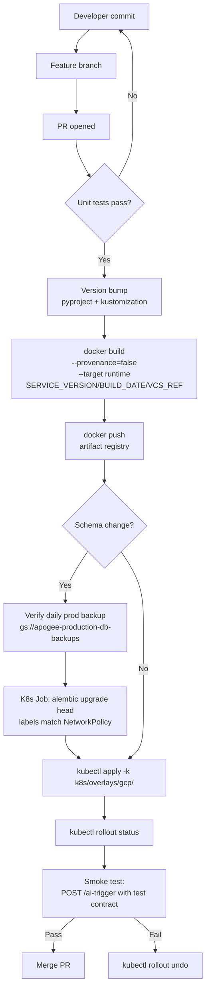
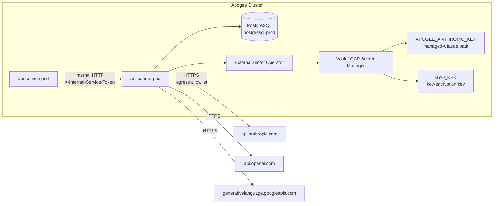

# Pipeline: ai-scanner Build & Deploy

**Phase:** 10 — BYO AI Scanning
**Status:** Planning (2026-06-20)
**Cross-reference:** `TaskDocs-BlockSecOps/phases/10-phase-10-byo-ai-scanning/PHASE-10-BYO-AI-SCANNING-PLAN.md`

The new `blocksecops-ai-scanner` service follows the same build/deploy patterns as `blocksecops-api-service` per `docs/standards/docker-image-versioning.md`. This doc captures what's different — the egress NetworkPolicy and the ExternalSecret routing for managed Claude vs BYO keys.

## End-to-end build → deploy



## Deployment topology



## NetworkPolicy — egress allowlist

This is the **GDPR-relevant policy boundary**. Per `docs/standards/networkpolicy-templates.md` archetype "internal HTTP service with external API egress":

```yaml
apiVersion: networking.k8s.io/v1
kind: NetworkPolicy
metadata:
  name: ai-scanner-to-llm-providers
  namespace: ai-scanner-prod
spec:
  podSelector:
    matchLabels:
      app: ai-scanner
  policyTypes:
    - Egress
  egress:
    # Anthropic (managed Claude + BYO Anthropic)
    - to:
        - ipBlock:
            cidr: 0.0.0.0/0
            # NOTE: Anthropic does not publish a fixed CIDR; we allow all
            # public IPs but only on the standard HTTPS port. Combined
            # with DNS validation in the adapter, this is acceptable.
            # The audit log records the resolved host per call.
      ports:
        - protocol: TCP
          port: 443
```

**Why no per-provider CIDR pin:** Anthropic, OpenAI, and Google all use cloud-front infrastructure with rotating IPs. Pinning would break weekly. Defense is in the application layer (adapter explicitly only calls known SDKs hitting known hostnames) + audit logging.

Additional egress NetworkPolicies for PostgreSQL, DNS, Vault — follow the same patterns as api-service.

## Image layout

```
blocksecops-ai-scanner/
├── Dockerfile                  # multi-stage: builder + runtime
└── ...
```

Dockerfile follows the standard pattern from `docs/standards/docker-image-versioning.md`:

```dockerfile
ARG SERVICE_VERSION=0.0.0
ARG BUILD_DATE
ARG VCS_REF

FROM python:3.13-slim@sha256:f50f56f1471fc430b394ee75fc826be2d212e35d85ed1171ac79abbba485dce9 AS builder
# ... deps install with cache mounts

FROM python:3.13-slim@sha256:f50f56f1471fc430b394ee75fc826be2d212e35d85ed1171ac79abbba485dce9 AS runtime
LABEL org.opencontainers.image.title="Apogee AI Scanner"
LABEL org.opencontainers.image.description="LLM-powered contract scanning"
LABEL org.opencontainers.image.version="${SERVICE_VERSION}"
LABEL org.opencontainers.image.created="${BUILD_DATE}"
LABEL org.opencontainers.image.revision="${VCS_REF}"
LABEL org.opencontainers.image.vendor="Apogee"
LABEL org.opencontainers.image.source="https://github.com/AdvancedBlockchainSecurity/blocksecops-ai-scanner"

USER 1000
WORKDIR /app
COPY --from=builder /app /app
EXPOSE 8000
CMD ["uvicorn", "src.main:app", "--host", "0.0.0.0", "--port", "8000"]
```

## ExternalSecret routing

Two distinct secret surfaces:

```yaml
# k8s/base/ai-scanner/external-secret.yaml
apiVersion: external-secrets.io/v1beta1
kind: ExternalSecret
metadata:
  name: ai-scanner-secret
  namespace: ai-scanner-prod
spec:
  refreshInterval: 1h
  secretStoreRef:
    name: gcp-secret-manager
    kind: SecretStore
  target:
    name: ai-scanner-secret
    creationPolicy: Owner
  data:
    - secretKey: DATABASE_URL
      remoteRef:
        key: apogee-gcp-ai-scanner-db-url
    - secretKey: INTERNAL_SERVICE_KEY
      remoteRef:
        key: apogee-gcp-internal-service-key
    - secretKey: APOGEE_ANTHROPIC_KEY  # managed Claude only
      remoteRef:
        key: apogee-gcp-anthropic-key
    - secretKey: BYO_KEK  # KEK for encrypting BYO keys at rest
      remoteRef:
        key: apogee-gcp-byo-kek
```

`APOGEE_ANTHROPIC_KEY` is the only LLM API key the service holds in env. All BYO keys are loaded on-demand from the `byo_llm_keys` table and decrypted with `BYO_KEK` per use (never cached in memory beyond the request's lifetime).

## Versioning

Standard semver per `docs/standards/docker-image-versioning.md`. Start at `0.1.0`. Each PR bumps the patch (`0.1.x`). Prompt-version (`solidity/v1`) is independent — bumps on prompt iteration so historical scans remain attributable to the exact prompt that ran.

## Deployment commands (operator)

```bash
# Bump version (manual)
sed -i 's/version = "0.1.0"/version = "0.1.1"/' pyproject.toml
sed -i 's/0.1.0/0.1.1/g' k8s/overlays/gcp/kustomization.yaml

# Build + push (from a clean git worktree to avoid build-context pollution)
git worktree add /tmp/ai-scanner-clean-0.1.1 HEAD
cd /tmp/ai-scanner-clean-0.1.1
docker build \
  --provenance=false \
  --build-arg SERVICE_VERSION=0.1.1 \
  --build-arg BUILD_DATE=$(date -u +"%Y-%m-%dT%H:%M:%SZ") \
  --build-arg VCS_REF=$(git rev-parse --short HEAD) \
  --target runtime \
  -t us-west1-docker.pkg.dev/project-8a2657b9-d96c-4c0a-a69/apogee/ai-scanner:0.1.1 .
docker push us-west1-docker.pkg.dev/project-8a2657b9-d96c-4c0a-a69/apogee/ai-scanner:0.1.1

# If schema change: apply migrations via Job FIRST
kubectl apply -f k8s/jobs/alembic-upgrade-NNN.yaml
kubectl wait --for=condition=complete --timeout=180s job/alembic-upgrade-NNN -n ai-scanner-prod

# Roll out new code
kubectl apply -k k8s/overlays/gcp/
kubectl rollout status deployment/ai-scanner -n ai-scanner-prod --timeout=180s

# Verify
curl -s https://app.0xapogee.com/api/v1/health/live | jq .  # api-service still healthy
# Internal smoke (from a debugging pod in the same namespace)
kubectl run smoke -it --rm --image=curlimages/curl --restart=Never -n ai-scanner-prod -- \
  curl -s http://ai-scanner.ai-scanner-prod:8000/health
```

Same pattern as existing service deploys; no surprises. The clean-worktree step is critical — see the lesson learned in `TaskDocs-BlockSecOps/audit-2026-06-19-bso-sec-021-resolution.md` (PR #371 leak incident).

## Rollback

```bash
# Fast rollback (single deployment)
kubectl rollout undo deployment/ai-scanner -n ai-scanner-prod

# Or kill-switch (no rollback needed if already on a version that supports it)
kubectl set env deployment/ai-scanner -n ai-scanner-prod AI_SCANNING_DISABLED=true
kubectl rollout restart deployment/ai-scanner -n ai-scanner-prod
# Existing in-flight scans abort on next provider response (<= 30s)
# New scans rejected with 503 ai_system_error

# Re-enable
kubectl set env deployment/ai-scanner -n ai-scanner-prod AI_SCANNING_DISABLED=false
```

Migrations 094 + 095 are additive — no rollback action required on the schema even if the service rolls back.

## Cross-references

- `docs/workflows/ai-scan-trigger-workflow.md`
- `docs/playbooks/ai-cost-kill-switch.md`
- `docs/standards/docker-image-versioning.md`
- `docs/standards/networkpolicy-templates.md`
- `docs/standards/encryption-standards.md`
