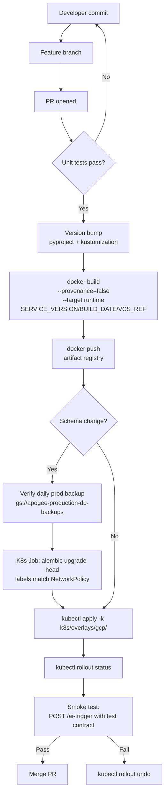
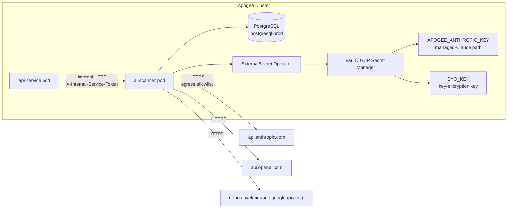

# Pipeline: ai-scanner Build & Deploy

**Phase:** 10 — BYO AI Scanning
**Status:** Production (shipped 2026-06-20) — ai-scanner v0.2.4, tier-config v1.4.0
**Cross-reference:** `TaskDocs-BlockSecOps/phases/10-phase-10-byo-ai-scanning/PHASE-10-BYO-AI-SCANNING-PLAN.md`

The `blocksecops-ai-scanner` service follows the same build/deploy patterns as `blocksecops-api-service` per `docs/standards/docker-image-versioning.md`. This doc captures what is different: the tier-config wheel bundling pattern, Workload Identity binding, ExternalSecret routing for managed Claude vs BYO keys, and the full NetworkPolicy archetype deployed in production.

## End-to-end build → deploy



## Deployment topology



## NetworkPolicy — full deployed archetype

Four NetworkPolicy objects are applied in `ai-scanner-prod`. All follow `docs/standards/networkpolicy-templates.md`.

### 1. Default deny (ingress + egress baseline)

```yaml
apiVersion: networking.k8s.io/v1
kind: NetworkPolicy
metadata:
  name: default-deny-all
  namespace: ai-scanner-prod
spec:
  podSelector: {}
  policyTypes: [Ingress, Egress]
```

### 2. Ingress — allow from api-service only

```yaml
apiVersion: networking.k8s.io/v1
kind: NetworkPolicy
metadata:
  name: allow-ingress-from-api-service
  namespace: ai-scanner-prod
spec:
  podSelector:
    matchLabels:
      app: ai-scanner
  policyTypes: [Ingress]
  ingress:
    - from:
        - namespaceSelector:
            matchLabels:
              kubernetes.io/metadata.name: api-service-prod
          podSelector:
            matchLabels:
              app: api-service
      ports:
        - protocol: TCP
          port: 8000
```

### 3. Egress — DNS (required for ExternalSecret + provider SDK hostname resolution)

```yaml
apiVersion: networking.k8s.io/v1
kind: NetworkPolicy
metadata:
  name: allow-egress-dns
  namespace: ai-scanner-prod
spec:
  podSelector:
    matchLabels:
      app: ai-scanner
  policyTypes: [Egress]
  egress:
    - ports:
        - protocol: UDP
          port: 53
        - protocol: TCP
          port: 53
```

### 4. Egress — PostgreSQL

```yaml
apiVersion: networking.k8s.io/v1
kind: NetworkPolicy
metadata:
  name: allow-egress-postgresql
  namespace: ai-scanner-prod
spec:
  podSelector:
    matchLabels:
      app: ai-scanner
  policyTypes: [Egress]
  egress:
    - to:
        - namespaceSelector:
            matchLabels:
              kubernetes.io/metadata.name: postgresql-prod
      ports:
        - protocol: TCP
          port: 5432
```

### 5. Egress — LLM providers (GDPR-relevant boundary)

```yaml
apiVersion: networking.k8s.io/v1
kind: NetworkPolicy
metadata:
  name: allow-egress-llm-providers
  namespace: ai-scanner-prod
spec:
  podSelector:
    matchLabels:
      app: ai-scanner
  policyTypes: [Egress]
  egress:
    - to:
        - ipBlock:
            cidr: 0.0.0.0/0
            # Anthropic, OpenAI, and Google use cloud-front infrastructure
            # with rotating IPs. CIDR pinning would break weekly.
            # Defense: application layer only calls known SDK hostnames + audit log
      ports:
        - protocol: TCP
          port: 443
```

**Why no per-provider CIDR pin:** Anthropic, OpenAI, and Google all use cloud-front infrastructure with rotating IPs. Pinning would break weekly. Defense is in the application layer (adapters only call known SDK hostnames) combined with audit logging of the resolved host per call.

## Tier-config wheel bundling

`blocksecops-shared` publishes `blocksecops_tier_config-1.4.0-py3-none-any.whl` as a build artifact. The ai-scanner Dockerfile copies this wheel from the repo root and installs it in the builder stage, so the container carries the correct `aiScan` block at runtime without depending on a live PyPI or network fetch.

```dockerfile
# In the builder stage — copy wheel from repo root
COPY blocksecops_tier_config-1.4.0-py3-none-any.whl /tmp/
RUN pip install /tmp/blocksecops_tier_config-1.4.0-py3-none-any.whl
```

When tier-config is bumped, update both the wheel filename and the `COPY` instruction together, then rebuild and push a new image version.

## Workload Identity

The ai-scanner pod runs under Kubernetes Service Account `ai-scanner` in namespace `ai-scanner-prod`, which is annotated to bind to GCP Service Account `apogee-ai-scanner@<project>.iam.gserviceaccount.com` (the GSA):

```yaml
# k8s/base/ai-scanner/service-account.yaml
apiVersion: v1
kind: ServiceAccount
metadata:
  name: ai-scanner
  namespace: ai-scanner-prod
  annotations:
    iam.gke.io/gcp-service-account: apogee-ai-scanner@project-8a2657b9-d96c-4c0a-a69.iam.gserviceaccount.com
```

The GSA has `roles/secretmanager.secretAccessor` scoped to the ai-scanner secrets only. ExternalSecret Operator uses the pod's Workload Identity token to read from GCP Secret Manager — no long-lived key JSON in the cluster.

## Image layout

```
blocksecops-ai-scanner/
├── Dockerfile                  # multi-stage: builder + runtime
├── blocksecops_tier_config-1.4.0-py3-none-any.whl  # bundled at build time
└── ...
```

Dockerfile follows the standard pattern from `docs/standards/docker-image-versioning.md`:

```dockerfile
ARG SERVICE_VERSION=0.0.0
ARG BUILD_DATE
ARG VCS_REF

FROM python:3.13-slim@sha256:f50f56f1471fc430b394ee75fc826be2d212e35d85ed1171ac79abbba485dce9 AS builder
# ... deps install with cache mounts

FROM python:3.13-slim@sha256:f50f56f1471fc430b394ee75fc826be2d212e35d85ed1171ac79abbba485dce9 AS runtime
LABEL org.opencontainers.image.title="Apogee AI Scanner"
LABEL org.opencontainers.image.description="LLM-powered contract scanning"
LABEL org.opencontainers.image.version="${SERVICE_VERSION}"
LABEL org.opencontainers.image.created="${BUILD_DATE}"
LABEL org.opencontainers.image.revision="${VCS_REF}"
LABEL org.opencontainers.image.vendor="Apogee"
LABEL org.opencontainers.image.source="https://github.com/AdvancedBlockchainSecurity/blocksecops-ai-scanner"

USER 1000
WORKDIR /app
COPY --from=builder /app /app
EXPOSE 8000
CMD ["uvicorn", "src.main:app", "--host", "0.0.0.0", "--port", "8000"]
```

## ExternalSecret routing

Two distinct secret surfaces:

```yaml
# k8s/base/ai-scanner/external-secret.yaml
apiVersion: external-secrets.io/v1beta1
kind: ExternalSecret
metadata:
  name: ai-scanner-secret
  namespace: ai-scanner-prod
spec:
  refreshInterval: 1h
  secretStoreRef:
    name: gcp-secret-manager
    kind: SecretStore
  target:
    name: ai-scanner-secret
    creationPolicy: Owner
  data:
    - secretKey: DATABASE_URL
      remoteRef:
        key: apogee-gcp-ai-scanner-db-url
    - secretKey: INTERNAL_SERVICE_KEY
      remoteRef:
        key: apogee-gcp-internal-service-key
    - secretKey: APOGEE_ANTHROPIC_KEY  # managed Claude only
      remoteRef:
        key: apogee-gcp-anthropic-key
    - secretKey: BYO_KEK  # KEK for encrypting BYO keys at rest
      remoteRef:
        key: apogee-gcp-byo-kek
```

`APOGEE_ANTHROPIC_KEY` is the only LLM API key the service holds in env. All BYO keys are loaded on-demand from the `byo_llm_keys` table and decrypted with `BYO_KEK` per use (never cached in memory beyond the request's lifetime).

## Versioning

Standard semver per `docs/standards/docker-image-versioning.md`. Current production version: `0.2.4`. Each PR bumps the patch (`0.2.x`). Prompt-version (`solidity/v1`) is independent of the service version — it bumps on prompt iteration so historical scans in `ai_scan_metadata.prompt_version` remain attributable to the exact prompt that produced them.

## Deployment commands (operator)

```bash
# Bump version (manual)
sed -i 's/version = "0.1.0"/version = "0.1.1"/' pyproject.toml
sed -i 's/0.1.0/0.1.1/g' k8s/overlays/gcp/kustomization.yaml

# Build + push (from a clean git worktree to avoid build-context pollution)
git worktree add /tmp/ai-scanner-clean-0.1.1 HEAD
cd /tmp/ai-scanner-clean-0.1.1
docker build \
  --provenance=false \
  --build-arg SERVICE_VERSION=0.1.1 \
  --build-arg BUILD_DATE=$(date -u +"%Y-%m-%dT%H:%M:%SZ") \
  --build-arg VCS_REF=$(git rev-parse --short HEAD) \
  --target runtime \
  -t us-west1-docker.pkg.dev/project-8a2657b9-d96c-4c0a-a69/apogee/ai-scanner:0.1.1 .
docker push us-west1-docker.pkg.dev/project-8a2657b9-d96c-4c0a-a69/apogee/ai-scanner:0.1.1

# If schema change: apply migrations via Job FIRST
kubectl apply -f k8s/jobs/alembic-upgrade-NNN.yaml
kubectl wait --for=condition=complete --timeout=180s job/alembic-upgrade-NNN -n ai-scanner-prod

# Roll out new code
kubectl apply -k k8s/overlays/gcp/
kubectl rollout status deployment/ai-scanner -n ai-scanner-prod --timeout=180s

# Verify
curl -s https://app.0xapogee.com/api/v1/health/live | jq .  # api-service still healthy
# Internal smoke (from a debugging pod in the same namespace)
kubectl run smoke -it --rm --image=curlimages/curl --restart=Never -n ai-scanner-prod -- \
  curl -s http://ai-scanner.ai-scanner-prod:8000/health
```

Same pattern as existing service deploys; no surprises. The clean-worktree step is critical — see the lesson learned in `TaskDocs-BlockSecOps/audit-2026-06-19-bso-sec-021-resolution.md` (PR #371 leak incident).

## Rollback

```bash
# Fast rollback (single deployment)
kubectl rollout undo deployment/ai-scanner -n ai-scanner-prod

# Or kill-switch (no rollback needed if already on a version that supports it)
kubectl set env deployment/ai-scanner -n ai-scanner-prod AI_SCANNING_DISABLED=true
kubectl rollout restart deployment/ai-scanner -n ai-scanner-prod
# Existing in-flight scans abort on next provider response (<= 30s)
# New scans rejected with 503 ai_system_error

# Re-enable
kubectl set env deployment/ai-scanner -n ai-scanner-prod AI_SCANNING_DISABLED=false
```

Migrations 094 + 095 are additive — no rollback action required on the schema even if the service rolls back.

## Cross-references

- `docs/workflows/ai-scan-trigger-workflow.md`
- `docs/playbooks/ai-cost-kill-switch.md`
- `docs/standards/docker-image-versioning.md`
- `docs/standards/networkpolicy-templates.md`
- `docs/standards/encryption-standards.md`
