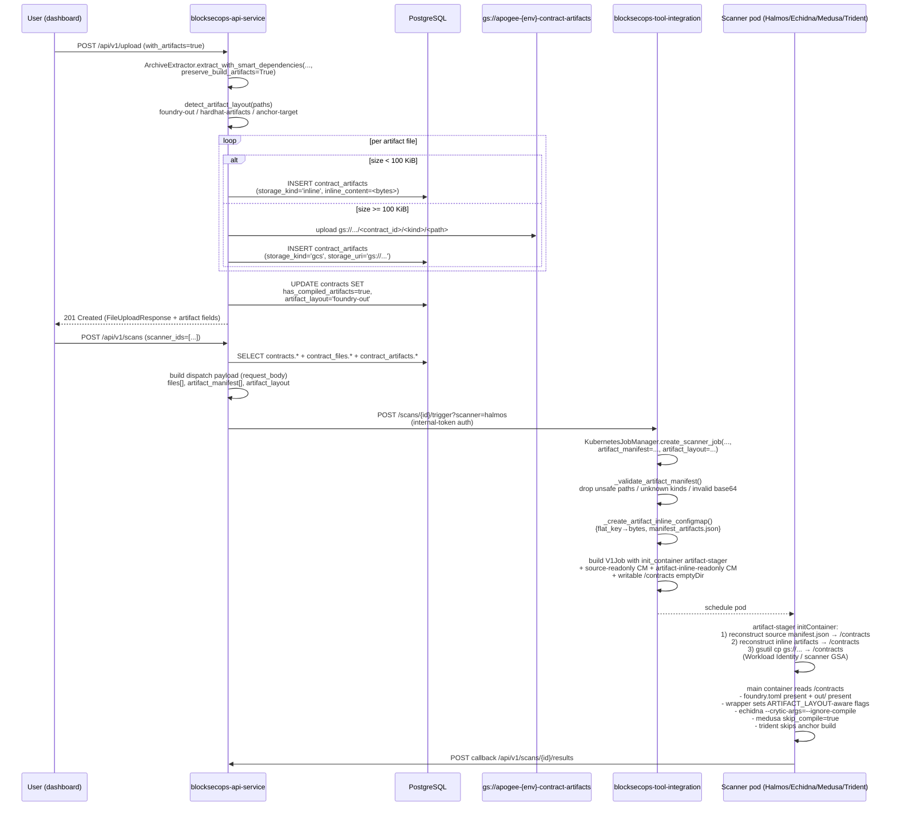

# Pipeline — Artifact-aware scan dispatch (Migration 091)

**Audience:** Apogee platform engineers
**Status:** active (2026-05-09)
**Repos touched:** `blocksecops-api-service`, `blocksecops-tool-integration`, `blocksecops-dashboard`
**Cross-links:** [End-user workflow](../workflows/contract-with-artifacts-upload.md), [Troubleshooting playbook](../playbooks/troubleshoot-fuzzer-zero-findings.md)

---

## Why this pipeline exists

Before this work, dispatching a scan on a Foundry/Hardhat/Anchor project meant the scanner pod had to **re-compile from source** on the cluster. Real-world failure modes:

- Missing `forge-std` / `@openzeppelin/contracts` → `forge build` fails → Halmos/Echidna/Medusa report **0 findings** silently.
- Hardhat needs internet for `solc` downloads → NetworkPolicy blocks the egress → 480 s wall-time wasted on retries.
- Trident `anchor build` adds 5 minutes to every Anchor scan even when the IDL is already known.

The artifact-aware pipeline lets the api-service preserve `out/`, `artifacts/`, or `target/idl/` from the user's upload, store them durably (DB inline + GCS), and inject them into the scanner pod via initContainer so the wrapper skips its build step.

---

## End-to-end sequence



---

## Storage layout

### `contract_artifacts` table (Migration 091)

| Column | Type | Notes |
|---|---|---|
| id | UUID PK | `gen_random_uuid()` |
| contract_id | UUID FK → contracts.id ON DELETE CASCADE | indexed via composite |
| artifact_path | VARCHAR(500) | relative path under project root |
| artifact_kind | VARCHAR(32) CHECK | foundry-out / hardhat-artifacts / anchor-target |
| storage_kind | VARCHAR(8) CHECK | inline / gcs |
| storage_uri | VARCHAR(500) | gs://... when storage_kind=gcs, NULL otherwise |
| inline_content | BYTEA | bytes when storage_kind=inline (< 100 KiB), NULL otherwise |
| size_bytes | INTEGER ≥ 0 | per-row |
| created_at | TIMESTAMPTZ | `now()` default |

CHECK constraints enforce `(inline XOR gcs)` so a single row can't carry both — DB-level invariant.

### GCS layout

```
gs://apogee-{env}-contract-artifacts/
  └── <contract_id>/
      └── <artifact_kind>/                # foundry-out | hardhat-artifacts | anchor-target
          └── <artifact_path>             # e.g. out/Token.sol/Token.json
```

- IAM (current bindings on `gs://apogee-production-contract-artifacts`):
  - `apogee-api-service@project-8a2657b9-d96c-4c0a-a69.iam.gserviceaccount.com` → `roles/storage.objectAdmin`
  - `apogee-tool-integration@project-8a2657b9-d96c-4c0a-a69.iam.gserviceaccount.com` → `roles/storage.objectViewer`
- Workload Identity (current bindings):
  - K8s SA `api-service-prod/api-service` → `apogee-api-service` GSA
  - K8s SA `tool-integration-prod/tool-integration` → `apogee-tool-integration` GSA
- Bucket lifecycle: 90-day delete (artifacts are reproducible from source).
- Versioning: OFF. Uniform bucket-level access: ON. Public access prevention: ENFORCED.
- Provisioned imperatively via `gcloud` on 2026-05-09 (out of Terraform state — TODO: import into the apogee-gcp-terraform-state-managed module on the next infra-as-code pass). The api-service reads the bucket name from the `ARTIFACT_BUCKET` env var (sourced from the `api-service-config` ConfigMap key `artifact_bucket` in the `gcp` overlay).

---

## Dispatch envelope (api-service → tool-integration)

`POST /scans/{scan_id}/trigger?scanner=<name>` request body:

```json
{
  "compiler_version": "0.8.20",
  "language": "solidity",
  "files": [{ "path": "src/Token.sol", "content": "..." }],
  "main_file_path": "src/Token.sol",
  "has_compiled_artifacts": true,
  "artifact_layout": "foundry-out",
  "artifact_manifest": [
    {
      "path": "out/Token.sol/Token.json",
      "kind": "foundry-out",
      "storage": "inline",
      "size": 18432,
      "content_b64": "<base64 bytes>"
    },
    {
      "path": "out/Token.sol/Token.metadata.json",
      "kind": "foundry-out",
      "storage": "gcs",
      "size": 1500000,
      "uri": "gs://apogee-production-contract-artifacts/<cid>/foundry-out/out/Token.sol/Token.metadata.json"
    }
  ]
}
```

**Versioning:** the envelope is additive. Older tool-integration releases ignore the new fields and behave as before. Newer releases ignore the absence of these fields and behave as before.

---

## KJM volume layout

| Mode | Volume layout |
|---|---|
| Today (no artifacts) | source ConfigMap mounts read-only at `/contracts`; wrappers `cp -rL /contracts /tmp/project` to a writable copy. |
| Artifact-aware | source ConfigMap mounts read-only at `/source-readonly`; artifact inline ConfigMap mounts read-only at `/artifact-inline-readonly`; writable emptyDir at `/contracts`; an `artifact-stager` initContainer reconstructs source + inline artifacts and runs `gsutil cp` for GCS-stored artifacts. |

The init container image is `gcr.io/google.com/cloudsdktool/cloud-sdk:slim` (overridable via `ARTIFACT_STAGER_IMAGE` env var). Workload Identity authenticates `gsutil cp` — no service-account JSON keys.

Security context on the initContainer (per `secure-coding.md` + `kubernetes-pod-lifecycle.md`):
- `allowPrivilegeEscalation: false`
- `readOnlyRootFilesystem: true`
- `capabilities.drop: [ALL]`
- `runAsNonRoot: true`

The shell script inside the init container re-validates each path against `is_safe_path` (no `..`, no leading `/`, no null bytes) — defense-in-depth even though api-service has already validated upstream.

---

## Wrapper behavior matrix

| Scanner | Honors `out/` / `artifacts/` / `target/idl/`? | Final wrapper image (after 2026-05-12 follow-up) |
|---|---|---|
| slither | yes (crytic-compile auto-detects) | unchanged — already works |
| aderyn | yes (reads Foundry AST directly) | unchanged — already works |
| halmos | yes (hard-fails without `out/`) | unchanged — already works (parser-side fix shipped in `tool-integration` 0.7.3 to read the wrapper's `findings` envelope; see below) |
| echidna | **hardhat-artifacts only** for `--ignore-compile`; foundry-out recompiles from source | `0.5.7` — `--ignore-compile` gated on `ARTIFACT_LAYOUT=hardhat-artifacts`. Foundry's flat per-contract JSON shape is incompatible with crytic-compile's hardhat-like parser (`KeyError: 'output'`), so foundry-out falls through to recompile. The api-service extractor now bundles `test/*.sol` alongside `src/` when `with_artifacts=true`, so `forge build` sees a complete tree. |
| medusa | same gating as echidna | `0.5.2` — same `hardhat-artifacts`-only gating |
| trident | yes (skips `anchor build`) | `0.4.4` — skips `anchor build` if `target/idl/<program>.json` present |
| mythril, soliditydefend, wake, rustdefend, sec3-xray, cargo-fuzz-solana | n/a — source-only or self-contained compile | none |

### Parser-side fixes shipped alongside wrappers (tool-integration 0.7.3 / 0.7.5)

Two pre-existing parser/wrapper schema mismatches were masked until Migration 091 produced the first real findings end-to-end. Both fixed in `src/scanners/parser.py`:

- **Halmos:** wrapper emits `{"findings": [...]}`; parser was reading `{"results": [...]}`. Parser now prefers `findings` and routes through a new `_parse_wrapper_finding()` helper.
- **Echidna:** the 2026 wrapper schema uses `{"scanner": "echidna", "vulnerabilities": [...]}` with `locations[0].{file,line}` and a top-level `call_sequence`; the parser only recognised the legacy `{"tool": "echidna", "findings": [...]}` envelope. `_parse_wrapper_format()` now accepts either schema.

---

## Observability

- KJM logs `Created artifact inline ConfigMap` with `entry_count` when inline artifacts are bundled.
- KJM logs `Dispatching scan with pre-compiled artifacts` from api-service with `artifact_layout`, `artifact_count`, `inline_count`, `gcs_count`.
- The `artifact-stager` initContainer logs reconstruction lines for source + artifacts and a `find ... | head -200` summary at the end so post-mortem tools can confirm what landed in `/contracts`.
- Failed GCS writes raise `ArtifactStorageError` with structured `error_code` (`ARTIFACT_BUCKET_UNSET`, `ARTIFACT_UPLOAD_FAILED`) — converted to HTTP 503 at the upload layer.

---

## Failure modes and how to diagnose

| Symptom | Root cause | Where to look |
|---|---|---|
| Upload returns 400 `no_artifacts_in_archive` | User checked the toggle but forgot to bundle `out/`/`artifacts/`/`target/idl/` | api-service logs |
| Upload returns 422 `artifact_layout_mismatch` | Extractor's reported layout disagrees with `detect_artifact_layout` (defense-in-depth) | api-service logs — file a bug |
| Upload returns 413 `artifacts_too_large` | Total artifact payload > 200 MB or > 5,000 files | user side; tell them to drop `out/build-info/` or split contracts |
| Upload returns 503 `artifact_storage_unavailable` | `ARTIFACT_BUCKET` env var unset OR Workload Identity binding broken | check the gcp ConfigMap, then the api-service GSA's IAM bindings on the bucket |
| Scan triggers but Halmos still reports 0 findings | Bucket binding correct on api-service side but the scanner GSA lacks `objectViewer` on the bucket | scanner pod logs from the `artifact-stager` initContainer — `gsutil` 403 |

---

## Standards compliance

- `database-management.md` — Migration 091 is additive; CHECK constraints + downgrade path; no destructive ALTERs.
- `secure-coding.md` — extension allow-list (`.json` only), per-file 10 MB cap, total 200 MB cap, 5,000 file cap, symlink rejection, defense-in-depth path validation in both api-service AND tool-integration.
- `secrets-management.md` — Workload Identity exclusively, no service-account JSON in code or images, bucket name is non-secret.
- `docker-image-versioning.md` — final shipped: echidna 0.5.5→0.5.6→**0.5.7**, medusa 0.5.0→0.5.1→**0.5.2**, trident 0.4.3→**0.4.4** (all PATCH); api-service **0.43.11→0.44.2** (MINOR for Migration 091 + PATCH parser/extractor fixes); tool-integration **0.6.30→0.7.5** (MINOR for the KJM artifact-stager initContainer + PATCHes for `jq`→`python3`, GCS-pairs JSON envelope, Foundry-aware wrapper gating, parser schema fixes). ConfigMap + KJM `default_images` synced.
- `kustomize-standards.md` — `gcp` overlay carries the `artifact_bucket` ConfigMap entry; base deployment binds it to `ARTIFACT_BUCKET` env var (`optional: true` so local-dev can boot without the bucket).
- `api-endpoint-auth.md` — `/api/v1/upload` already requires `contracts:write`; `with_artifacts` doesn't widen scope.
- `kubernetes-pod-lifecycle.md` — initContainer security context, `revisionHistoryLimit`, NetworkPolicy unchanged (artifact-stager only needs egress to `*.googleapis.com` for gsutil; on by default for cloud-sdk image).
