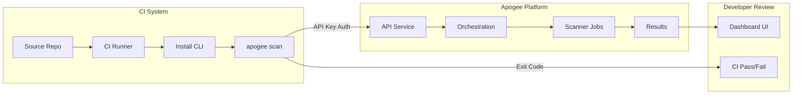

# Developer Tier: CI/CD CLI Pipeline Architecture

**Version:** 1.0.0
**Last Updated:** March 12, 2026
**Tier:** Developer (Free)
**Status:** Active

## Overview

This document describes the pipeline architecture for integrating Apogee security scanning into CI/CD systems using the CLI on the Developer (free) tier. The CLI is the sole integration method for free tier — no direct API, webhooks, or Integrations Hub dashboard access.

---

## Pipeline Architecture



### Data Flow

1. **CI Runner** installs the Apogee CLI (cached between runs for speed)
2. **CLI** authenticates with an API key stored as a CI secret
3. **CLI** submits the contract source to the Apogee API Service
4. **Orchestration** queues and executes scanner jobs (1 concurrent for free tier)
5. **CLI** polls for completion and retrieves results
6. **CLI** evaluates results against configured severity threshold
7. **CLI** returns exit code to CI system (0 = pass, 1 = fail, 2 = quota exceeded)

---

## Component Reference

| Component | Role | Free Tier Constraint |
|-----------|------|---------------------|
| Apogee CLI | Scan submission + result polling | Only CI/CD method available |
| API Key | Authentication | `write:scans`, `read:scans`, `read:vulnerabilities` scopes |
| API Service | HTTP gateway | Web request rate: 60/min |
| Orchestration | Job scheduling | 1 concurrent scan |
| Scanner Jobs | Security analysis | Standard priority (50) |
| Dashboard | Results display | 7-day retention, no export |

---

## Pipeline Templates

### GitHub Actions

```yaml
name: Security Scan
on:
  push:
    branches: [main]

jobs:
  scan:
    runs-on: ubuntu-latest
    steps:
      - uses: actions/checkout@v4

      - name: Install Apogee CLI
        run: pip install 0xapogee-cli

      - name: Check quota
        env:
          APOGEE_API_KEY: ${{ secrets.APOGEE_API_KEY }}
        run: |
          REMAINING=$(apogee quota status --format json | jq '.scansRemaining')
          if [ "$REMAINING" -eq 0 ]; then
            echo "::warning::Apogee scan quota exhausted (3/month on free tier)"
            exit 0
          fi

      - name: Run security scan
        env:
          APOGEE_API_KEY: ${{ secrets.APOGEE_API_KEY }}
        run: |
          apogee scan \
            --path ./contracts \
            --severity-threshold high \
            --wait
```

### GitLab CI

```yaml
security-scan:
  stage: test
  image: python:3.11-slim
  only:
    - main
  before_script:
    - pip install 0xapogee-cli
  script:
    - |
      REMAINING=$(apogee quota status --format json | jq '.scansRemaining')
      if [ "$REMAINING" -eq 0 ]; then
        echo "WARNING: Apogee scan quota exhausted (3/month on free tier)"
        exit 0
      fi
    - apogee scan --path ./contracts --severity-threshold high --wait
  variables:
    APOGEE_API_KEY: $APOGEE_API_KEY
  allow_failure: false
```

### Jenkins (Declarative)

```groovy
pipeline {
    agent any
    stages {
        stage('Security Scan') {
            when {
                branch 'main'
            }
            steps {
                sh 'pip install 0xapogee-cli'
                withCredentials([string(credentialsId: 'apogee-api-key', variable: 'APOGEE_API_KEY')]) {
                    sh '''
                        REMAINING=$(apogee quota status --format json | jq '.scansRemaining')
                        if [ "$REMAINING" -eq 0 ]; then
                            echo "WARNING: Apogee scan quota exhausted (3/month on free tier)"
                            exit 0
                        fi
                        apogee scan \
                            --path ./contracts \
                            --severity-threshold high \
                            --wait
                    '''
                }
            }
        }
    }
}
```

### Pre-Commit Hook (Local, No Quota Cost)

For local scanning without using quota (requires CLI Docker image):

```bash
#!/bin/bash
# .git/hooks/pre-commit
# Runs a local-only syntax check — does NOT submit to Apogee (no quota used)
echo "Running local Solidity checks..."
apogee lint --path ./contracts --local-only
```

> **Note:** `--local-only` runs basic syntax and pattern checks without submitting to the platform. This does not count against your monthly quota.

---

## Quota-Aware Pipeline Pattern

Since the free tier has only 3 scans/month, pipelines should be quota-aware:

```bash
#!/bin/bash
# quota-aware-scan.sh — wrapper for CI/CD systems

set -euo pipefail

# Check remaining quota
QUOTA_JSON=$(apogee quota status --format json)
REMAINING=$(echo "$QUOTA_JSON" | jq '.scansRemaining')
USED=$(echo "$QUOTA_JSON" | jq '.scansUsed')
LIMIT=$(echo "$QUOTA_JSON" | jq '.scanLimit')

echo "Apogee scan quota: ${USED}/${LIMIT} used, ${REMAINING} remaining"

if [ "$REMAINING" -eq 0 ]; then
    echo "::warning::Scan quota exhausted (Developer tier: ${LIMIT}/month). Upgrade at https://app.0xapogee.com/pricing"
    exit 0  # Don't fail the pipeline
fi

if [ "$REMAINING" -eq 1 ]; then
    echo "::warning::Last scan remaining this month. Next reset at month boundary."
fi

# Run the scan
apogee scan \
    --path "${SCAN_PATH:-./contracts}" \
    --severity-threshold "${SEVERITY_THRESHOLD:-high}" \
    --wait

echo "Scan complete. ${REMAINING} scans remaining this month."
```

---

## Caching the CLI

To avoid installing the CLI on every pipeline run:

### GitHub Actions

```yaml
- uses: actions/setup-python@v5
  with:
    python-version: '3.11'

- name: Cache Apogee CLI
  uses: actions/cache@v4
  with:
    path: ~/.cache/pip
    key: apogee-cli-${{ runner.os }}

- name: Install Apogee CLI
  run: pip install 0xapogee-cli
```

### GitLab CI

```yaml
variables:
  PIP_CACHE_DIR: "$CI_PROJECT_DIR/.pip-cache"

cache:
  paths:
    - .pip-cache/
```

---

## Free Tier Limitations in CI/CD

| Limitation | Impact | Workaround |
|------------|--------|-----------|
| 3 scans/month | Cannot scan every PR | Scan on merge to main only |
| 1 concurrent scan | Scans queue if overlapping | Runs are serialized |
| 7-day retention | Results expire quickly | Review immediately after scan |
| No webhooks | No scan-complete callbacks | CLI `--wait` flag polls for completion |
| No export | Cannot save reports as artifacts | Screenshot or copy from dashboard |
| No API access | Cannot build custom integrations | Use CLI exclusively |
| Standard priority | Scans may queue behind paid users | Allow longer timeout in CI |

---

## Related Documentation

- [Developer Tier CI/CD Workflow](../../../workflows/tiers/developer/cicd-cli-workflow.md) — Workflow overview
- [Developer Tier CI/CD Playbook](../../../playbooks/tiers/developer/cicd-cli-integration.md) — Step-by-step setup
- [CLI Installation](../../../playbooks/cli-installation.md) — CLI install guide
- [GitOps CI/CD Pipeline](../../gitops-ci-cd-pipeline.md) — Platform CI/CD architecture
- [Tier Standards](../../../standards/tier-standards.md) — Complete tier comparison
