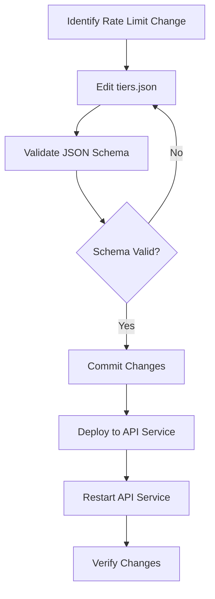

# Adjust Rate Limits

Step-by-step guide for adjusting endpoint rate limits via the centralized tier configuration.

## Overview

Endpoint rate limits are centralized in `blocksecops-shared/tier-config/tiers.json` under the `endpointRateLimits` section. Changes to rate limits require only a configuration update and API service restart - no code changes needed.

## Prerequisites

- Access to the `blocksecops-shared` repository
- Access to deploy changes to the API service
- Understanding of which endpoints need rate limit changes

## Rate Limit Categories

| Category | Endpoints | Purpose |
|----------|-----------|---------|
| `auth` | login, register, mfaVerify, walletNonce, solanaNonce | Authentication protection |
| `ai` | codeReview, codeRepair, invariants, explanations | AI token/cost control |
| `operations` | scanCreate, auditLogSearch | Resource-intensive operations |
| `general` | default | Fallback rate limit |

## Workflow Diagram



## Steps

### Step 1: Locate the Configuration

The rate limits are in `blocksecops-shared/tier-config/tiers.json`:

```json
{
  "endpointRateLimits": {
    "auth": {
      "login": { "perMinute": 5, "description": "Brute force protection" },
      "register": { "perMinute": 5, "description": "Account creation spam" },
      "mfaVerify": { "perMinute": 3, "description": "MFA brute force" },
      "walletNonce": { "perMinute": 10, "description": "Nonce flooding DoS" },
      "solanaNonce": { "perMinute": 10, "description": "Nonce flooding DoS" }
    },
    "ai": {
      "codeReview": { "perMinute": 10, "description": "AI token control" },
      "codeRepair": { "perMinute": 10, "description": "AI token control" },
      "invariants": { "perMinute": 5, "description": "Complex AI generation" },
      "explanations": { "perMinute": 20, "description": "Simple AI queries" }
    },
    "operations": {
      "scanCreate": { "perMinute": 10, "description": "Resource-intensive" },
      "auditLogSearch": { "perMinute": 30, "description": "Database-heavy" }
    },
    "general": {
      "default": { "perMinute": 60, "perHour": 1000, "description": "Default rate limit" }
    }
  }
}
```

### Step 2: Edit the Rate Limit

Update the `perMinute` (and optionally `perHour`) value for the desired endpoint:

```bash
cd blocksecops-shared/tier-config
vim tiers.json
```

**Example: Increase scan creation limit from 10 to 15 per minute**

```json
"operations": {
  "scanCreate": { "perMinute": 15, "description": "Resource-intensive" }
}
```

### Step 3: Validate JSON Schema

```bash
# Using Python
cd blocksecops-shared/tier-config/python
python -c "from blocksecops_tier_config import load_tier_config; c = load_tier_config(); print('Valid!')"

# Using jsonschema CLI (if installed)
jsonschema -i tiers.json schema/tier-config.schema.json
```

### Step 4: Commit Changes

```bash
cd blocksecops-shared
git add tier-config/tiers.json
git commit -m "chore(rate-limits): increase scanCreate limit to 15/minute

Rationale: Support higher throughput for CI/CD pipelines
Impact: Users can create more scans per minute"
```

### Step 5: Deploy to API Service

The API service reads from `blocksecops_tier_config` which loads `tiers.json` at startup.

**Option A: Rebuild and Deploy**

```bash
# If tier-config is bundled in the API service image
cd blocksecops-api-service
docker build -t blocksecops-api-service:X.Y.Z .
kubectl rollout restart deployment/api-service -n api-service-local
```

**Option B: ConfigMap/Volume Mount (Production)**

If `tiers.json` is mounted via ConfigMap:

```bash
kubectl create configmap tier-config \
  --from-file=tiers.json=blocksecops-shared/tier-config/tiers.json \
  -n api-service-local --dry-run=client -o yaml | kubectl apply -f -

kubectl rollout restart deployment/api-service -n api-service-local
```

### Step 6: Verify Changes

```bash
# Check API service logs for rate limit loading
kubectl logs -n api-service-local -l app=api-service --tail=50 | grep -i "rate"

# Test the endpoint rate limit
for i in {1..20}; do
  curl -s -o /dev/null -w "%{http_code}\n" \
    -X POST http://127.0.0.1:8000/api/v1/scans \
    -H "Authorization: Bearer $TOKEN" \
    -H "Content-Type: application/json" \
    -d '{"contract_id": "test"}'
  sleep 0.5
done
# Should see 201s until limit reached, then 429s
```

## Verification

After deployment, verify rate limits are applied:

1. **Check Loader Output**

```python
from blocksecops_tier_config import get_endpoint_rate_limit, get_rate_limit_string

# Get full rate limit info
limit = get_endpoint_rate_limit("operations", "scanCreate")
print(limit)  # {'per_minute': 15, 'per_hour': None, 'description': 'Resource-intensive'}

# Get slowapi-compatible string
rate_str = get_rate_limit_string("operations", "scanCreate")
print(rate_str)  # '15/minute'
```

2. **Test Rate Limiting**

Send requests to the endpoint and verify 429 responses after exceeding the limit.

## Troubleshooting

### Rate Limit Not Applied

1. **Check tiers.json is being loaded**
   ```bash
   kubectl exec -n api-service-local deployment/api-service -- \
     cat /app/tiers.json  # or wherever it's mounted
   ```

2. **Check for caching**
   The loader uses `@lru_cache`. Clear the cache if needed:
   ```python
   from blocksecops_tier_config import clear_tier_config_cache
   clear_tier_config_cache()
   ```

3. **Check endpoint is using centralized config**
   Verify the endpoint decorator uses `get_rate_limit_string()`:
   ```python
   @limiter.limit(get_rate_limit_string("operations", "scanCreate"))
   ```

### Invalid JSON Schema

```bash
# Check for JSON syntax errors
python -m json.tool tiers.json > /dev/null

# Check against schema
python -c "
from blocksecops_tier_config import load_tier_config
try:
    load_tier_config()
    print('Schema valid')
except Exception as e:
    print(f'Schema error: {e}')
"
```

## Checklist

- [ ] Rate limit value identified and changed in `tiers.json`
- [ ] JSON schema validation passed
- [ ] Changes committed with descriptive message
- [ ] API service redeployed/restarted
- [ ] Rate limit verified in production
- [ ] Monitoring alerts updated (if applicable)

## Related Playbooks

- [Adjust Pricing](adjust-pricing.md) - Update tier pricing, quotas, and features
- [API Key Management](api-key-management.md) - Manage API keys with rate limits
