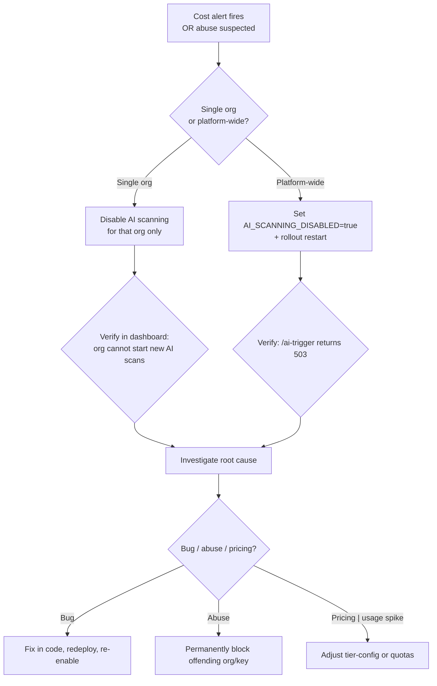

# Playbook: AI Cost Kill-Switch

**Phase:** 10 — BYO AI Scanning
**When to use:** AI spend is approaching or exceeding the operator's monthly ceiling, OR a suspected prompt-injection / abuse incident is underway.
**Time to act:** < 60 seconds.

## Decision tree



## Platform-wide kill (max blast radius — use first if uncertain)

```bash
# 1. Flip the kill switch
kubectl set env deployment/ai-scanner -n ai-scanner-prod AI_SCANNING_DISABLED=true

# 2. Trigger restart so the env var takes effect immediately
kubectl rollout restart deployment/ai-scanner -n ai-scanner-prod

# 3. Watch the rollout (should be <30s)
kubectl rollout status deployment/ai-scanner -n ai-scanner-prod --timeout=60s

# 4. Verify: new AI scans rejected with 503 ai_system_error
curl -s -X POST https://app.0xapogee.com/api/v1/scans \
  -H "Authorization: Bearer $TOKEN" \
  -H "Content-Type: application/json" \
  -d '{"contract_id":"<test-id>","scanner_ids":["ai"],"ai_provider":"managed-claude","ai_mode":"structured"}' \
  | jq -r '.detail'
# Expected: "AI scan service is temporarily unavailable"
```

**What happens to in-flight scans:** The ai-scanner pod's graceful shutdown aborts the active LLM HTTP calls (httpx connection close). Token usage is charged for whatever was consumed up to the abort point. Scans are marked `failed` with `failure_type=ai_system_error` and the partial findings (if any) are persisted.

## Per-org disable (targeted, no platform impact)

When one org is the source of cost runaway:

```bash
# 1. Identify the org
kubectl exec deployment/api-service -n api-service-prod -- python -c "
from src.infrastructure.database.connection import get_db_session
import asyncio
async def show():
    async with get_db_session() as s:
        result = await s.execute(text('''
            SELECT o.id, o.name, am.tier,
                   SUM(am.input_tokens) AS in_tok,
                   SUM(am.output_tokens) AS out_tok,
                   SUM(am.cost_usd_micros) / 1000000.0 AS cost_usd
            FROM ai_scan_metadata am
            JOIN scans s ON am.scan_id = s.id
            JOIN contracts c ON s.contract_id = c.id
            JOIN organizations o ON c.organization_id = o.id
            WHERE am.created_at > NOW() - INTERVAL '24 hours'
            GROUP BY o.id, o.name, am.tier
            ORDER BY cost_usd DESC
            LIMIT 10;
        '''))
        for row in result: print(row)
asyncio.run(show())
"

# 2. Disable AI scanning for the org (sets the same flag UI org-admin uses)
kubectl exec postgresql-0 -n postgresql-prod -- psql -U blocksecops -d solidity_security -c \
  "UPDATE organizations SET ai_scanning_enabled = false WHERE id = '<org-uuid>';"

# 3. Verify
kubectl exec postgresql-0 -n postgresql-prod -- psql -U blocksecops -d solidity_security -c \
  "SELECT id, name, ai_scanning_enabled FROM organizations WHERE id = '<org-uuid>';"
```

The org's next AI scan attempt returns `failure_type=ai_org_disabled` with a readable message. Existing in-flight scans for that org complete normally — this only blocks new ones.

## Per-key revoke (BYO incident)

If a BYO key is being abused (e.g. customer's key was compromised and an attacker is running it through Apogee):

```bash
# Soft-revoke (preserves audit trail)
kubectl exec postgresql-0 -n postgresql-prod -- psql -U blocksecops -d solidity_security -c \
  "UPDATE byo_llm_keys SET revoked_at = NOW() WHERE id = '<key-uuid>';"
```

The next scan attempt with this key fails immediately with `ai_key_invalid`. Notify the org admin.

## Post-incident

After containing the immediate spend:

1. **Audit:** `SELECT * FROM ai_scan_metadata WHERE created_at > '<window>' ORDER BY input_tokens DESC LIMIT 50;` — identify the largest scans
2. **Root cause:** Was it a hot loop in a customer's CI? A prompt-injection getting through the fence? A bug in the quota reservation? An honest tier mismatch?
3. **Cost reconciliation:** Sum charged tokens vs Anthropic/OpenAI/Gemini billing for the window
4. **Tuning:** Adjust `tiers.json` quotas, per-scan caps, or daily-ceiling alarms based on what you learned
5. **Document:** Write an incident RCA under `TaskDocs-BlockSecOps/audit-YYYY-MM-DD-ai-cost-incident.md`
6. **Re-enable:** Once root cause is fixed, `kubectl set env deployment/ai-scanner AI_SCANNING_DISABLED=false && kubectl rollout restart`

## What this kill-switch does NOT do

- It does **not** refund users who already had successful scans before the kill
- It does **not** prevent BYO keys from being used outside Apogee (those are customer-owned credentials)
- It does **not** stop billing — provider charges that already hit Anthropic/OpenAI/Gemini are committed

## Cross-references

- `docs/playbooks/ai-quota-exhausted-runbook.md`
- `docs/workflows/ai-scan-trigger-workflow.md` (cancel-mid-scan section)
- `TaskDocs-BlockSecOps/phases/10-phase-10-byo-ai-scanning/PHASE-10-BYO-AI-SCANNING-PLAN.md` (cost-protection section)
