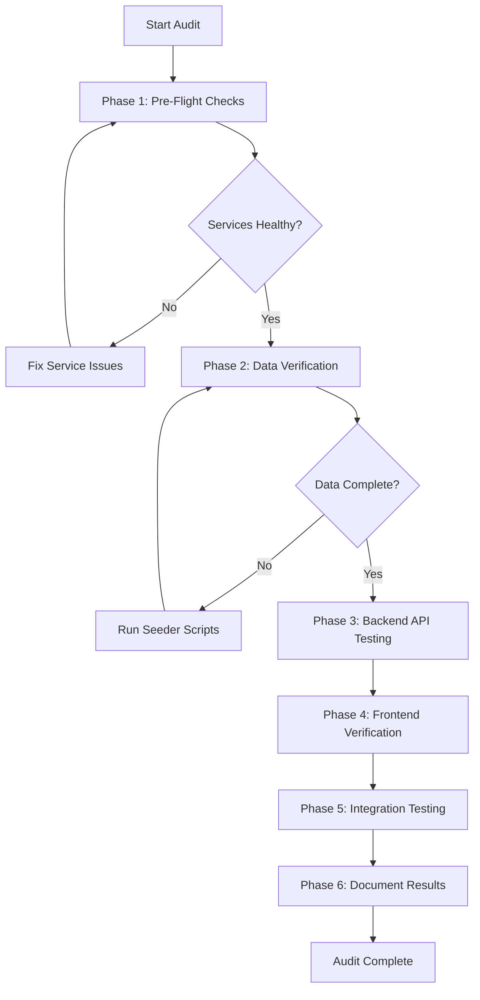

# AI/ML Comprehensive Audit Playbook

## Overview

This playbook provides a systematic audit procedure for the complete AI/ML implementation across the BlockSecOps platform. Use it to verify data workflows, backend endpoints, frontend components, deduplication systems, and vulnerability patterns.

**Last Updated:** February 2026
**Version:** 1.0.0

---

## Prerequisites

- [ ] BlockSecOps API service running
- [ ] PostgreSQL database accessible
- [ ] Redis cache accessible
- [ ] Intelligence Engine running (for semantic search)
- [ ] Access to `$TOKEN` (valid JWT for API authentication)

---

## Workflow Diagram



---

## Phase 1: Pre-Flight Checks

### 1.1 Service Health Checks

**API Service:**
```bash
curl -s http://127.0.0.1:8000/api/v1/health/ready | jq
```

Expected response:
```json
{
  "status": "healthy",
  "database": "connected",
  "redis": "connected"
}
```

**Intelligence Engine:**
```bash
curl -s http://127.0.0.1:8002/api/v1/health/ready | jq
```

Expected response:
```json
{
  "status": "healthy"
}
```

### 1.2 Database Connectivity

```bash
kubectl port-forward -n postgresql-local svc/postgresql 5432:5432 &
sleep 3
PGPASSWORD=blocksecops psql -h 127.0.0.1 -U blocksecops -d solidity_security -c "SELECT 1 as connected;"
```

### 1.3 Redis Connectivity

```bash
kubectl port-forward -n redis-local svc/redis 6379:6379 &
sleep 2
redis-cli -h 127.0.0.1 ping
```

Expected: `PONG`

---

## Phase 2: Data Verification

### 2.1 Vulnerability Patterns

**Expected:** 397 patterns (BVD codes)

```bash
curl -s http://127.0.0.1:8000/api/v1/ml/pattern-stats \
  -H "Authorization: Bearer $TOKEN" | jq '.total_patterns'
```

**Direct database check:**
```sql
SELECT COUNT(*) as pattern_count FROM vulnerability_patterns;
-- Expected: 397
```

**Verify pattern categories:**
```sql
SELECT category, COUNT(*) as count
FROM vulnerability_patterns
GROUP BY category
ORDER BY count DESC;
```

### 2.2 Pattern-Tool Mappings

**Expected:** 214+ mappings across 12 scanners

```sql
SELECT
  scanner_id,
  COUNT(*) as mapping_count
FROM pattern_tool_mappings
GROUP BY scanner_id
ORDER BY mapping_count DESC;
```

**Total mappings:**
```sql
SELECT COUNT(*) as total_mappings FROM pattern_tool_mappings;
-- Expected: 214+
```

### 2.3 Seed File Verification

**Check seed file version:**
```bash
cat /home/pwner/Git/blocksecops-api-service/seeds/vulnerability_patterns.json | jq '.version'
# Expected: "3.13"
```

**Verify seed file pattern count:**
```bash
cat /home/pwner/Git/blocksecops-api-service/seeds/vulnerability_patterns.json | jq '.patterns | length'
# Expected: 397
```

### 2.4 Deduplication Groups

```bash
curl -s http://127.0.0.1:8000/api/v1/deduplication/stats \
  -H "Authorization: Bearer $TOKEN" | jq
```

Expected response includes:
```json
{
  "total_groups": <number>,
  "total_findings": <number>,
  "avg_group_size": <number>,
  "dedup_rate": <percentage>
}
```

---

## Phase 3: Backend API Testing

### 3.1 ML Core Endpoints (26 endpoints)

| Endpoint | Method | Test Command |
|----------|--------|--------------|
| `/ml/model-stats` | GET | `curl -s http://127.0.0.1:8000/api/v1/ml/model-stats -H "Authorization: Bearer $TOKEN" \| jq` |
| `/ml/training-data-stats` | GET | `curl -s http://127.0.0.1:8000/api/v1/ml/training-data-stats -H "Authorization: Bearer $TOKEN" \| jq` |
| `/ml/scanner-quality` | GET | `curl -s http://127.0.0.1:8000/api/v1/ml/scanner-quality -H "Authorization: Bearer $TOKEN" \| jq` |
| `/ml/pattern-stats` | GET | `curl -s http://127.0.0.1:8000/api/v1/ml/pattern-stats -H "Authorization: Bearer $TOKEN" \| jq` |
| `/ml/scans/{id}/risk-score` | GET | `curl -s http://127.0.0.1:8000/api/v1/ml/scans/{scan_id}/risk-score -H "Authorization: Bearer $TOKEN" \| jq` |
| `/ml/contracts/{id}/risk-score` | GET | `curl -s http://127.0.0.1:8000/api/v1/ml/contracts/{contract_id}/risk-score -H "Authorization: Bearer $TOKEN" \| jq` |
| `/ml/scans/{id}/prioritized` | GET | `curl -s http://127.0.0.1:8000/api/v1/ml/scans/{scan_id}/prioritized -H "Authorization: Bearer $TOKEN" \| jq` |
| `/ml/predict-false-positive` | POST | `curl -s -X POST http://127.0.0.1:8000/api/v1/ml/predict-false-positive -H "Authorization: Bearer $TOKEN" -H "Content-Type: application/json" -d '{"vulnerability_id":"<uuid>"}' \| jq` |
| `/ml/label-vulnerability` | POST | `curl -s -X POST http://127.0.0.1:8000/api/v1/ml/label-vulnerability -H "Authorization: Bearer $TOKEN" -H "Content-Type: application/json" -d '{"vulnerability_id":"<uuid>","is_real_vulnerability":true}' \| jq` |
| `/ml/vulnerabilities/{id}/similar` | GET | `curl -s http://127.0.0.1:8000/api/v1/ml/vulnerabilities/{vuln_id}/similar -H "Authorization: Bearer $TOKEN" \| jq` |
| `/ml/retrain` | POST | `curl -s -X POST http://127.0.0.1:8000/api/v1/ml/retrain -H "Authorization: Bearer $TOKEN" -H "Content-Type: application/json" -d '{"min_samples":50}' \| jq` |

### 3.2 Intelligence Endpoints (12 endpoints)

| Endpoint | Method | Test Command |
|----------|--------|--------------|
| `/intelligence/stats` | GET | `curl -s http://127.0.0.1:8000/api/v1/intelligence/stats -H "Authorization: Bearer $TOKEN" \| jq` |
| `/intelligence/exploits` | GET | `curl -s http://127.0.0.1:8000/api/v1/intelligence/exploits -H "Authorization: Bearer $TOKEN" \| jq` |
| `/intelligence/exploits/{id}` | GET | `curl -s http://127.0.0.1:8000/api/v1/intelligence/exploits/{id} -H "Authorization: Bearer $TOKEN" \| jq` |
| `/intelligence/cves` | GET | `curl -s http://127.0.0.1:8000/api/v1/intelligence/cves -H "Authorization: Bearer $TOKEN" \| jq` |
| `/intelligence/cves/{id}` | GET | `curl -s http://127.0.0.1:8000/api/v1/intelligence/cves/{cve_id} -H "Authorization: Bearer $TOKEN" \| jq` |
| `/intelligence/search` | POST | `curl -s -X POST http://127.0.0.1:8000/api/v1/intelligence/search -H "Authorization: Bearer $TOKEN" -H "Content-Type: application/json" -d '{"query":"reentrancy attack","top_k":5}' \| jq` |
| `/intelligence/enrich` | POST | `curl -s -X POST http://127.0.0.1:8000/api/v1/intelligence/enrich -H "Authorization: Bearer $TOKEN" -H "Content-Type: application/json" -d '{"swc_id":"SWC-107"}' \| jq` |
| `/intelligence/nvd/{cve_id}` | GET | `curl -s http://127.0.0.1:8000/api/v1/intelligence/nvd/CVE-2021-44228 -H "Authorization: Bearer $TOKEN" \| jq` |
| `/intelligence/nvd/recent/smart-contracts` | GET | `curl -s http://127.0.0.1:8000/api/v1/intelligence/nvd/recent/smart-contracts -H "Authorization: Bearer $TOKEN" \| jq` |
| `/intelligence/swc-mapping` | GET | `curl -s http://127.0.0.1:8000/api/v1/intelligence/swc-mapping -H "Authorization: Bearer $TOKEN" \| jq` |

### 3.3 Copilot Endpoints (8 endpoints)

| Endpoint | Method | Test Command |
|----------|--------|--------------|
| `/copilot/conversations` | GET | `curl -s http://127.0.0.1:8000/api/v1/copilot/conversations -H "Authorization: Bearer $TOKEN" \| jq` |
| `/copilot/conversations` | POST | `curl -s -X POST http://127.0.0.1:8000/api/v1/copilot/conversations -H "Authorization: Bearer $TOKEN" -H "Content-Type: application/json" -d '{"title":"Test conversation"}' \| jq` |
| `/copilot/conversations/{id}` | GET | `curl -s http://127.0.0.1:8000/api/v1/copilot/conversations/{id} -H "Authorization: Bearer $TOKEN" \| jq` |
| `/copilot/conversations/{id}` | DELETE | `curl -s -X DELETE http://127.0.0.1:8000/api/v1/copilot/conversations/{id} -H "Authorization: Bearer $TOKEN"` |
| `/copilot/conversations/{id}/messages` | POST | `curl -s -X POST http://127.0.0.1:8000/api/v1/copilot/conversations/{id}/messages -H "Authorization: Bearer $TOKEN" -H "Content-Type: application/json" -d '{"content":"Explain reentrancy vulnerabilities"}' \| jq` |
| `/copilot/messages/{id}/rate` | POST | `curl -s -X POST http://127.0.0.1:8000/api/v1/copilot/messages/{id}/rate -H "Authorization: Bearer $TOKEN" -H "Content-Type: application/json" -d '{"rating":"helpful"}' \| jq` |

### 3.4 Code Review Endpoints (6 endpoints)

| Endpoint | Method | Test Command |
|----------|--------|--------------|
| `/code-review/stats` | GET | `curl -s http://127.0.0.1:8000/api/v1/code-review/stats -H "Authorization: Bearer $TOKEN" \| jq` |
| `/code-review/reviews` | GET | `curl -s http://127.0.0.1:8000/api/v1/code-review/reviews -H "Authorization: Bearer $TOKEN" \| jq` |
| `/code-review/reviews/{id}` | GET | `curl -s http://127.0.0.1:8000/api/v1/code-review/reviews/{id} -H "Authorization: Bearer $TOKEN" \| jq` |
| `/code-review/request` | POST | `curl -s -X POST http://127.0.0.1:8000/api/v1/code-review/request -H "Authorization: Bearer $TOKEN" -H "Content-Type: application/json" -d '{"contract_id":"<uuid>"}' \| jq` |
| `/code-review/suggestions/{id}/feedback` | POST | `curl -s -X POST http://127.0.0.1:8000/api/v1/code-review/suggestions/{id}/feedback -H "Authorization: Bearer $TOKEN" -H "Content-Type: application/json" -d '{"accepted":true}' \| jq` |

### 3.5 Code Repair Endpoints (8 endpoints)

| Endpoint | Method | Test Command |
|----------|--------|--------------|
| `/code-repair/stats` | GET | `curl -s http://127.0.0.1:8000/api/v1/code-repair/stats -H "Authorization: Bearer $TOKEN" \| jq` |
| `/code-repair/repairs` | GET | `curl -s http://127.0.0.1:8000/api/v1/code-repair/repairs -H "Authorization: Bearer $TOKEN" \| jq` |
| `/code-repair/repairs/{id}` | GET | `curl -s http://127.0.0.1:8000/api/v1/code-repair/repairs/{id} -H "Authorization: Bearer $TOKEN" \| jq` |
| `/code-repair/generate` | POST | `curl -s -X POST http://127.0.0.1:8000/api/v1/code-repair/generate -H "Authorization: Bearer $TOKEN" -H "Content-Type: application/json" -d '{"vulnerability_id":"<uuid>"}' \| jq` |
| `/code-repair/repairs/{id}/apply` | POST | `curl -s -X POST http://127.0.0.1:8000/api/v1/code-repair/repairs/{id}/apply -H "Authorization: Bearer $TOKEN" \| jq` |
| `/code-repair/repairs/{id}/feedback` | POST | `curl -s -X POST http://127.0.0.1:8000/api/v1/code-repair/repairs/{id}/feedback -H "Authorization: Bearer $TOKEN" -H "Content-Type: application/json" -d '{"rating":5,"feedback":"Good fix"}' \| jq` |

### 3.6 Deduplication Endpoints (7 endpoints)

| Endpoint | Method | Test Command |
|----------|--------|--------------|
| `/deduplication/stats` | GET | `curl -s http://127.0.0.1:8000/api/v1/deduplication/stats -H "Authorization: Bearer $TOKEN" \| jq` |
| `/deduplication/groups` | GET | `curl -s http://127.0.0.1:8000/api/v1/deduplication/groups -H "Authorization: Bearer $TOKEN" \| jq` |
| `/deduplication/groups/{id}` | GET | `curl -s http://127.0.0.1:8000/api/v1/deduplication/groups/{id} -H "Authorization: Bearer $TOKEN" \| jq` |
| `/deduplication/groups/{id}/canonical` | PUT | `curl -s -X PUT http://127.0.0.1:8000/api/v1/deduplication/groups/{id}/canonical -H "Authorization: Bearer $TOKEN" -H "Content-Type: application/json" -d '{"vulnerability_id":"<uuid>"}' \| jq` |
| `/deduplication/groups/merge` | POST | `curl -s -X POST http://127.0.0.1:8000/api/v1/deduplication/groups/merge -H "Authorization: Bearer $TOKEN" -H "Content-Type: application/json" -d '{"group_ids":["<uuid1>","<uuid2>"]}' \| jq` |
| `/deduplication/vulnerabilities/{id}/matches` | GET | `curl -s http://127.0.0.1:8000/api/v1/deduplication/vulnerabilities/{id}/matches -H "Authorization: Bearer $TOKEN" \| jq` |

---

## Phase 4: Frontend Verification

### 4.1 ML Components

| Component | File Location | Verification |
|-----------|---------------|--------------|
| FPPredictionBadge | `src/components/ml/FPPredictionBadge.tsx` | Renders FP probability with color coding |
| RiskScoreBadge | `src/components/ml/RiskScoreBadge.tsx` | Displays risk score 0-100 with severity level |
| ModelStatusWidget | `src/components/ml/ModelStatusWidget.tsx` | Shows model training status and metrics |
| SimilarVulnerabilitiesPanel | `src/components/ml/SimilarVulnerabilitiesPanel.tsx` | Lists similar vulnerabilities by similarity score |
| VulnerabilityLabelingPanel | `src/components/ml/VulnerabilityLabelingPanel.tsx` | UI for labeling TP/FP |

### 4.2 API Client Verification

**Check API clients exist:**
```bash
ls -la /home/pwner/Git/blocksecops-dashboard/src/lib/api/ml.ts
ls -la /home/pwner/Git/blocksecops-dashboard/src/lib/api/intelligence.ts
ls -la /home/pwner/Git/blocksecops-dashboard/src/lib/api/copilot.ts
ls -la /home/pwner/Git/blocksecops-dashboard/src/lib/api/codeRepair.ts
ls -la /home/pwner/Git/blocksecops-dashboard/src/lib/api/codeReview.ts
ls -la /home/pwner/Git/blocksecops-dashboard/src/lib/api/deduplicationApi.ts
```

**Verify exports in index.ts:**
```bash
grep -E "export.*from.*'\./(ml|intelligence|copilot|codeRepair|codeReview|deduplication)" \
  /home/pwner/Git/blocksecops-dashboard/src/lib/api/index.ts
```

### 4.3 Page Integration

| Page | ML Features | File Location |
|------|-------------|---------------|
| Vulnerability Detail | FP Badge, Similar Vulns, Labeling | `src/pages/vulnerabilities/[id].tsx` |
| Scan Results | Risk Score, Prioritized List | `src/pages/scans/[id].tsx` |
| Contract Overview | Risk Score Badge | `src/pages/contracts/[id].tsx` |
| Intelligence Dashboard | Semantic Search | `src/pages/intelligence/index.tsx` |

### 4.4 Build Verification

```bash
cd /home/pwner/Git/blocksecops-dashboard
npm run build
```

Expected: Build completes without errors.

---

## Phase 5: Integration Testing

### 5.1 FP Prediction Flow

1. Create a scan with vulnerabilities
2. Get vulnerability ID from scan results
3. Request FP prediction
4. Verify prediction response

```bash
# Get a vulnerability from recent scans
VULN_ID=$(curl -s http://127.0.0.1:8000/api/v1/vulnerabilities?limit=1 \
  -H "Authorization: Bearer $TOKEN" | jq -r '.items[0].id')

# Request FP prediction
curl -s -X POST http://127.0.0.1:8000/api/v1/ml/predict-false-positive \
  -H "Authorization: Bearer $TOKEN" \
  -H "Content-Type: application/json" \
  -d "{\"vulnerability_id\":\"$VULN_ID\"}" | jq
```

### 5.2 Labeling Flow

```bash
# Label a vulnerability
curl -s -X POST http://127.0.0.1:8000/api/v1/ml/label-vulnerability \
  -H "Authorization: Bearer $TOKEN" \
  -H "Content-Type: application/json" \
  -d "{
    \"vulnerability_id\":\"$VULN_ID\",
    \"is_real_vulnerability\": true,
    \"confidence\": 0.9,
    \"feedback\": \"Confirmed via manual review\"
  }" | jq
```

### 5.3 Deduplication Flow

```bash
# Get deduplication stats
curl -s http://127.0.0.1:8000/api/v1/deduplication/stats \
  -H "Authorization: Bearer $TOKEN" | jq

# List deduplication groups
curl -s http://127.0.0.1:8000/api/v1/deduplication/groups?limit=5 \
  -H "Authorization: Bearer $TOKEN" | jq
```

### 5.4 Semantic Search Flow

```bash
# Search for reentrancy-related content
curl -s -X POST http://127.0.0.1:8000/api/v1/intelligence/search \
  -H "Authorization: Bearer $TOKEN" \
  -H "Content-Type: application/json" \
  -d '{
    "query": "reentrancy vulnerability in withdrawal function",
    "top_k": 5,
    "include_exploits": true,
    "include_cves": true
  }' | jq
```

---

## Phase 6: Audit Checklist

### Backend (67 total endpoints)

- [ ] ML endpoints (26) - All returning valid responses
- [ ] Intelligence endpoints (12) - All returning valid responses
- [ ] Copilot endpoints (8) - All returning valid responses
- [ ] Code Review endpoints (6) - All returning valid responses
- [ ] Code Repair endpoints (8) - All returning valid responses
- [ ] Deduplication endpoints (7) - All returning valid responses

### Frontend

- [ ] All ML components exist and have no TypeScript errors
- [ ] API clients (`ml.ts`, `intelligence.ts`) properly implemented
- [ ] API clients exported from `src/lib/api/index.ts`
- [ ] Pages integrate ML features correctly
- [ ] Dashboard builds without errors

### Data

- [ ] 397 vulnerability patterns seeded
- [ ] 214+ pattern-tool mappings complete
- [ ] Seed file version is 3.13
- [ ] Deduplication groups exist (if scans have been run)

### Integration

- [ ] FP prediction returns valid probability
- [ ] Labeling creates classification record
- [ ] Deduplication stats reflect actual data
- [ ] Semantic search returns relevant results

---

## Troubleshooting

### Pattern Count Mismatch

If database shows fewer than 397 patterns:

```bash
cd /home/pwner/Git/blocksecops-api-service
source .venv/bin/activate
python scripts/seed_vulnerability_patterns.py
```

### Intelligence Engine Not Responding

Check if the service is running:

```bash
kubectl get pods -n intelligence-engine-local
kubectl logs -n intelligence-engine-local -l app=intelligence-engine --tail=50
```

### ML Model Not Trained

If `is_trained: false`:

```bash
# Check training data availability
curl -s http://127.0.0.1:8000/api/v1/ml/training-data-stats \
  -H "Authorization: Bearer $TOKEN" | jq

# Need 50+ labeled vulnerabilities to train
# Label more via UI or API, then:
curl -s -X POST http://127.0.0.1:8000/api/v1/ml/retrain \
  -H "Authorization: Bearer $TOKEN" \
  -H "Content-Type: application/json" \
  -d '{"min_samples": 50, "force": false}' | jq
```

### Frontend Build Errors

If TypeScript errors occur:

```bash
cd /home/pwner/Git/blocksecops-dashboard
npm install
npm run typecheck
```

---

## Related Playbooks

- [ML Training Playbook](../../blocksecops-dashboard/docs/playbooks/ml-training-playbook.md) - Training the FP classifier
- [Intelligence Seeding Playbook](../../blocksecops-api-service/docs/playbooks/intelligence-seeding.md) - Seeding exploit/CVE data

---

## Audit History

| Date | Auditor | Result | Notes |
|------|---------|--------|-------|
| YYYY-MM-DD | | | |

---

## Version History

| Version | Date | Changes |
|---------|------|---------|
| 1.0.0 | Feb 2026 | Initial playbook creation |
