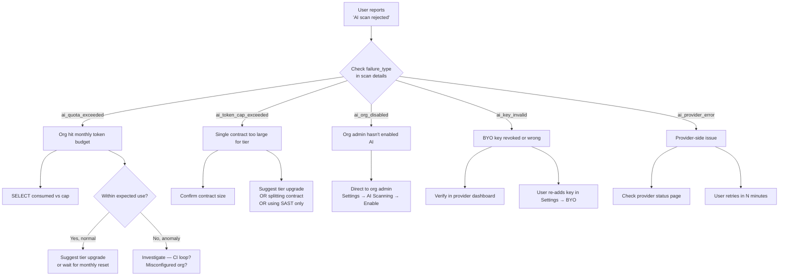

# Playbook: AI Quota Exhausted

**Phase:** 10 — BYO AI Scanning
**When to use:** A user, org admin, or support ticket reports that AI scans are returning `ai_quota_exceeded` or `ai_token_cap_exceeded`.
**Time to act:** Routine — not an incident unless the quota appears wrong.

## Quick triage



## Commands

### Check an org's AI usage vs cap (API — preferred)

As of api-service v0.46.0 the canonical quota-state inspection command is the API endpoint. This is the same data the dashboard will show the org admin:

```bash
# Requires a JWT with org-member scope (or platform admin token).
curl -s "https://app.0xapogee.com/api/v1/organizations/<org-uuid>/ai-quota" \
  -H "Authorization: Bearer $TOKEN" | jq .
# Returns:
# {
#   "tier": "enterprise",
#   "ai_scanning_enabled": true,
#   "input_tokens_used": 18544,
#   "input_tokens_cap": 10000000,
#   "output_tokens_used": 9654,
#   "output_tokens_cap": <from tiers.json>,
#   "quota_reset_at": "2026-07-01T00:00:00Z"
# }
```

### Check an org's AI usage vs cap (DB — fallback / deeper audit)

```bash
kubectl exec postgresql-0 -n postgresql-prod -- psql -U blocksecops -d solidity_security <<EOF
SELECT
  o.id, o.name, o.tier, o.ai_scanning_enabled,
  COALESCE(SUM(am.input_tokens), 0) AS input_used,
  COALESCE(SUM(am.output_tokens), 0) AS output_used,
  COALESCE(SUM(am.cost_usd_micros) / 1000000.0, 0) AS cost_usd,
  COUNT(am.scan_id) AS scan_count
FROM organizations o
LEFT JOIN contracts c ON c.organization_id = o.id
LEFT JOIN scans s ON s.contract_id = c.id
LEFT JOIN ai_scan_metadata am ON am.scan_id = s.id
WHERE o.id = '<org-uuid>'
  AND (am.created_at IS NULL OR am.created_at >= DATE_TRUNC('month', NOW()))
GROUP BY o.id, o.name, o.tier, o.ai_scanning_enabled;
EOF
```

Compare against the org's tier cap in `tiers.json` → `aiScan.{tier}.monthlyInputTokens` / `monthlyOutputTokens`.

### Reset a specific org's usage (rare — only for support-resolved overage refunds)

```bash
# DO NOT use this casually. Owner approval required per Rule 0.
# This is an audit-logged operation.
kubectl exec postgresql-0 -n postgresql-prod -- psql -U blocksecops -d solidity_security -c \
  "DELETE FROM ai_scan_metadata WHERE scan_id IN (
     SELECT s.id FROM scans s
     JOIN contracts c ON s.contract_id = c.id
     WHERE c.organization_id = '<org-uuid>'
       AND s.id = '<specific-scan-uuid>'
   );"
# Then add an audit_logs row documenting the reset reason.
```

Prefer **tier upgrade or overage purchase** over reset.

### Verify a BYO key is still valid

The nightly cron does this but support can trigger an immediate re-validation:

```bash
# Via internal endpoint (requires X-Internal-Service-Token)
curl -X POST \
  -H "X-Internal-Service-Token: $TOKEN" \
  http://ai-scanner.ai-scanner-prod:8000/internal/byo-keys/<key-id>/revalidate
# Returns: {"status": "valid"|"invalid", "checked_at": "..."}
```

## Standard user-facing responses

### "AI scan quota exceeded"

> Your organization has used all available AI scan tokens for this month. Options:
> 1. Upgrade to a higher tier (see Settings → Billing) for a larger budget
> 2. Wait until {monthly reset date}
> 3. Use SAST scanners instead — they don't count against your AI quota
>
> If you believe you've been charged for tokens you didn't consume, contact support with the scan ID.

### "Contract too large for this tier's per-scan token cap"

> This contract requires ~{N} input tokens, but your tier's per-scan limit is {cap}. Options:
> 1. Upgrade your tier for a larger per-scan budget
> 2. Split the contract into smaller modules and scan them individually
> 3. Use the SAST scanners only — they don't have a token cap

### "Your BYO API key was rejected by {provider}"

> The {provider} API key you added has been rejected. Common causes:
> - The key was revoked or rotated in your {provider} account
> - The key has insufficient permissions (needs the `messages` scope for Anthropic / `chat.completions` for OpenAI)
> - {provider} is currently rate-limiting your account
>
> Re-add the key at Settings → BYO Keys, or contact support if the issue persists.

## Anomaly investigation

If a single org is consuming an unusually large share of AI tokens:

```bash
kubectl exec postgresql-0 -n postgresql-prod -- psql -U blocksecops -d solidity_security <<EOF
SELECT
  am.created_at::date AS day,
  COUNT(*) AS scans,
  SUM(am.input_tokens) AS in_tok,
  AVG(am.input_tokens) AS avg_in_per_scan,
  MAX(am.input_tokens) AS max_in
FROM ai_scan_metadata am
JOIN scans s ON am.scan_id = s.id
JOIN contracts c ON s.contract_id = c.id
WHERE c.organization_id = '<org-uuid>'
  AND am.created_at >= NOW() - INTERVAL '7 days'
GROUP BY day
ORDER BY day;
EOF
```

If `scans` is implausibly high or `avg_in_per_scan` is near the per-scan cap consistently, suspect:
- A hot loop in customer CI (their pipeline retrying on transient failures)
- A misconfigured webhook (firing on every commit)
- Test data being scanned in prod (talk to the customer)

Mitigation: use the per-org disable from `ai-cost-kill-switch.md` if the spend is truly anomalous, then call the customer.

## Cross-references

- `docs/playbooks/ai-cost-kill-switch.md`
- `docs/workflows/ai-scan-trigger-workflow.md`
- `TaskDocs-BlockSecOps/phases/10-phase-10-byo-ai-scanning/PHASE-10-BYO-AI-SCANNING-PLAN.md`
