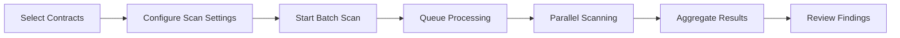

# Playbook: Batch Scanning

**Version:** 1.0.0
**Last Updated:** February 1, 2026
**Audience:** Developer | Team Lead

## Overview

This playbook guides you through scanning multiple smart contracts at once, either through the dashboard, API, or CLI. Batch scanning is useful for auditing entire projects, periodic security reviews, or CI/CD pipelines.

---

## Prerequisites

- [ ] Apogee account with Growth or Enterprise tier
- [ ] API key with `write:scans`, `read:scans`, `write:contracts` scopes (for API/CLI)
- [ ] Multiple Solidity contract files to scan
- [ ] Project created in Apogee

---

## Workflow Diagram



---

## Method 1: Dashboard Batch Scan

### Step 1: Upload Multiple Contracts

**Dashboard:**
1. Navigate to your project
2. Click **Add Contracts**
3. Drag and drop multiple `.sol` files
4. Or use **Import from GitHub** to import entire repository
5. Wait for all files to upload

### Step 2: Start Batch Scan

**Dashboard:**
1. In the project view, click **Select All** (or select specific contracts)
2. Click **Scan Selected**
3. Configure batch scan settings:
   - **Scanners:** Select scanners to run
   - **Solidity Version:** Auto-detect or specify
   - **Parallel Scans:** Max concurrent scans (default: 5)
4. Click **Start Batch Scan**

### Step 3: Monitor Progress

**Dashboard:**
1. View batch scan progress in the project overview
2. Individual contract status shown:
   - Queued, Running, Completed, Failed
3. Click on any contract to see detailed progress

---

## Method 2: API Batch Scan

### Step 1: Upload Contracts

```bash
# Upload multiple contracts
for CONTRACT in contracts/*.sol; do
  curl -X POST "https://app.0xapogee.com/api/v1/contracts" \
    -H "Authorization: Bearer $APOGEE_API_KEY" \
    -H "Content-Type: multipart/form-data" \
    -F "project_id=proj_abc123" \
    -F "file=@$CONTRACT"
done
```

### Step 2: Create Batch Scan

```bash
# Get all contract IDs in project
CONTRACT_IDS=$(curl -s "https://app.0xapogee.com/api/v1/projects/proj_abc123/contracts" \
  -H "Authorization: Bearer $APOGEE_API_KEY" | jq -r '.[].id' | tr '\n' ',' | sed 's/,$//')

# Create batch scan
curl -X POST "https://app.0xapogee.com/api/v1/scans/batch" \
  -H "Authorization: Bearer $APOGEE_API_KEY" \
  -H "Content-Type: application/json" \
  -d "{
    \"project_id\": \"proj_abc123\",
    \"contract_ids\": [$(echo $CONTRACT_IDS | sed 's/,/","/g' | sed 's/^/"/' | sed 's/$/"/')]
,
    \"scanners\": [\"soliditydefend\", \"slither\"],
    \"config\": {
      \"solc_version\": \"0.8.19\",
      \"parallel_limit\": 5
    }
  }"
```

**Response:**
```json
{
  "batch_id": "batch_xyz789",
  "scans": [
    {"id": "scan_001", "contract": "Token.sol", "status": "queued"},
    {"id": "scan_002", "contract": "Vault.sol", "status": "queued"},
    {"id": "scan_003", "contract": "Governance.sol", "status": "queued"}
  ],
  "total": 3,
  "created_at": "2026-02-01T10:00:00Z"
}
```

### Step 3: Monitor Batch Progress

```bash
# Check batch status
curl -X GET "https://app.0xapogee.com/api/v1/scans/batch/batch_xyz789" \
  -H "Authorization: Bearer $APOGEE_API_KEY"
```

**Response:**
```json
{
  "batch_id": "batch_xyz789",
  "status": "running",
  "progress": {
    "total": 3,
    "completed": 1,
    "running": 2,
    "failed": 0
  },
  "scans": [
    {"id": "scan_001", "contract": "Token.sol", "status": "completed"},
    {"id": "scan_002", "contract": "Vault.sol", "status": "running"},
    {"id": "scan_003", "contract": "Governance.sol", "status": "running"}
  ]
}
```

### Step 4: Get Aggregated Results

```bash
# Get batch results summary
curl -X GET "https://app.0xapogee.com/api/v1/scans/batch/batch_xyz789/results" \
  -H "Authorization: Bearer $APOGEE_API_KEY"
```

**Response:**
```json
{
  "batch_id": "batch_xyz789",
  "status": "completed",
  "summary": {
    "total_contracts": 3,
    "total_vulnerabilities": 47,
    "by_severity": {
      "critical": 2,
      "high": 8,
      "medium": 22,
      "low": 15
    }
  },
  "contracts": [
    {
      "name": "Token.sol",
      "scan_id": "scan_001",
      "vulnerabilities": {"critical": 0, "high": 2, "medium": 5, "low": 3}
    },
    {
      "name": "Vault.sol",
      "scan_id": "scan_002",
      "vulnerabilities": {"critical": 2, "high": 4, "medium": 10, "low": 6}
    },
    {
      "name": "Governance.sol",
      "scan_id": "scan_003",
      "vulnerabilities": {"critical": 0, "high": 2, "medium": 7, "low": 6}
    }
  ]
}
```

---

## Method 3: CLI Batch Scan

### Basic Batch Scan

```bash
# Scan entire directory
0xapogee scan --path contracts/ --project "My Project"

# Scan multiple specific files
0xapogee scan \
  --files contracts/Token.sol,contracts/Vault.sol,contracts/Governance.sol \
  --project "My Project"
```

### Batch Scan with Options

```bash
0xapogee scan \
  --path contracts/ \
  --project "Audit Q1 2026" \
  --scanners soliditydefend,slither,mythril \
  --parallel 5 \
  --fail-on critical,high \
  --output json \
  > batch-results.json
```

### Recursive Scan

```bash
# Scan all Solidity files recursively
0xapogee scan \
  --path . \
  --include "**/*.sol" \
  --exclude "**/node_modules/**,**/test/**" \
  --project "Full Project Scan"
```

---

## Batch Configuration

### Parallel Limits by Tier

| Tier | Max Parallel Scans |
|------|-------------------|
| Free | 1 |
| Growth | 5 |
| Enterprise | 20 |

### Scan Configuration File

Create `0xapogee.config.json`:

```json
{
  "project": "My Project",
  "scanners": ["soliditydefend", "slither"],
  "solc_version": "0.8.19",
  "optimizer": {
    "enabled": true,
    "runs": 200
  },
  "parallel_limit": 5,
  "include": [
    "contracts/**/*.sol"
  ],
  "exclude": [
    "contracts/mocks/**",
    "contracts/test/**",
    "node_modules/**"
  ],
  "fail_on": ["critical", "high"]
}
```

Use with CLI:
```bash
0xapogee scan --config 0xapogee.config.json
```

---

## Handling Large Projects

### Chunked Scanning

For very large projects (100+ contracts):

```bash
# Split into chunks
find contracts/ -name "*.sol" | split -l 20 - chunk_

# Scan each chunk
for CHUNK in chunk_*; do
  FILES=$(cat $CHUNK | tr '\n' ',' | sed 's/,$//')
  0xapogee scan --files "$FILES" --project "Large Project - Chunk $CHUNK"
done
```

### Priority-Based Scanning

Scan critical contracts first:

```bash
# Scan critical contracts (tokens, vaults)
0xapogee scan \
  --path contracts/core/ \
  --priority high \
  --project "Core Contracts"

# Scan peripheral contracts
0xapogee scan \
  --path contracts/periphery/ \
  --priority low \
  --project "Periphery Contracts"
```

---

## Batch Reports

### Generate Consolidated Report

**API:**
```bash
curl -X POST "https://app.0xapogee.com/api/v1/scans/batch/batch_xyz789/report" \
  -H "Authorization: Bearer $APOGEE_API_KEY" \
  -H "Content-Type: application/json" \
  -d '{
    "format": "pdf",
    "include_code_snippets": true,
    "group_by": "severity"
  }'
```

**CLI:**
```bash
0xapogee report \
  --batch batch_xyz789 \
  --format pdf \
  --output audit-report.pdf
```

### Export to CSV

```bash
blocksecops export \
  --batch batch_xyz789 \
  --format csv \
  --output vulnerabilities.csv
```

---

## Verification

Confirm batch scan completed:

**Dashboard:**
1. Navigate to project
2. Check all contracts show scan results
3. View aggregated vulnerability count

**API:**
```bash
# Verify batch completed
curl -X GET "https://app.0xapogee.com/api/v1/scans/batch/batch_xyz789" \
  -H "Authorization: Bearer $APOGEE_API_KEY" | jq '.status'
# Expected: "completed"

# Count total vulnerabilities
curl -X GET "https://app.0xapogee.com/api/v1/scans/batch/batch_xyz789/results" \
  -H "Authorization: Bearer $APOGEE_API_KEY" | jq '.summary.total_vulnerabilities'
```

---

## Troubleshooting

| Issue | Cause | Solution |
|-------|-------|----------|
| "Parallel limit exceeded" | Too many concurrent scans | Reduce `parallel_limit` |
| Some scans failed | Individual contract errors | Check failed scan logs |
| "Rate limit exceeded" | Too many API calls | Add delays between requests |
| Batch stuck on "running" | Scanner timeout | Cancel and retry with fewer contracts |
| Large file upload fails | File size limit | Split contracts or use GitHub import |
| Inconsistent results | Different Solc versions | Specify explicit version in config |

### Retry Failed Scans

```bash
# Get failed scans
FAILED=$(curl -s "https://app.0xapogee.com/api/v1/scans/batch/batch_xyz789" \
  -H "Authorization: Bearer $APOGEE_API_KEY" | jq -r '.scans[] | select(.status == "failed") | .contract_id')

# Retry failed scans
for CONTRACT_ID in $FAILED; do
  curl -X POST "https://app.0xapogee.com/api/v1/scans" \
    -H "Authorization: Bearer $APOGEE_API_KEY" \
    -H "Content-Type: application/json" \
    -d "{\"contract_id\": \"$CONTRACT_ID\"}"
done
```

---

## Checklist

- [ ] Contracts uploaded to project
- [ ] Batch scan configuration set
- [ ] Parallel limit appropriate for tier
- [ ] Scanners selected
- [ ] Batch scan started
- [ ] Progress monitored
- [ ] All scans completed successfully
- [ ] Aggregated results reviewed
- [ ] Critical/High findings identified
- [ ] Report generated (optional)

---

## Related Playbooks

- [Run First Scan](./run-first-scan.md) - Single contract scanning
- [GitHub Actions Integration](./cicd-github-actions.md) - CI/CD batch scanning
- [CLI Installation](./cli-installation.md) - Command-line scanning
- [Schedule Scans](./schedule-scans.md) - Automated recurring scans
