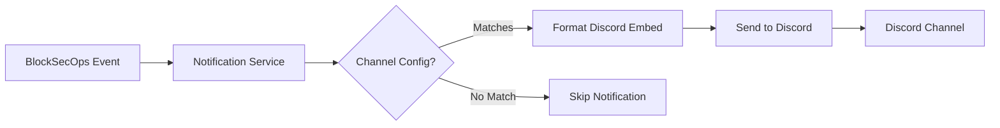

# Playbook: Discord Integration

**Version:** 1.0.0
**Last Updated:** February 1, 2026
**Audience:** Admin | Team Lead

## Overview

This playbook guides you through integrating BlockSecOps with Discord for real-time notifications about security scans, vulnerability discoveries, and platform events. Perfect for development teams using Discord for communication.

---

## Prerequisites

- [ ] BlockSecOps account with Growth or Enterprise tier
- [ ] Discord server with admin or "Manage Webhooks" permission
- [ ] Discord channel designated for security notifications
- [ ] Organization owner or admin role in BlockSecOps

---

## Workflow Diagram



---

## Steps

### Step 1: Create Discord Webhook

**Discord:**
1. Open Discord and navigate to your server
2. Right-click on the channel for notifications (e.g., #security-alerts)
3. Select **Edit Channel**
4. Click **Integrations** in the left sidebar
5. Click **Webhooks**
6. Click **New Webhook**
7. Configure:
   - **Name:** `BlockSecOps`
   - **Avatar:** Upload BlockSecOps logo (optional)
8. Click **Copy Webhook URL**
9. Click **Save Changes**

### Step 2: Add Discord Integration in BlockSecOps

**Dashboard:**
1. Navigate to **Settings > Integrations**
2. Click **Add Integration**
3. Select **Discord**
4. Enter the webhook URL from Step 1
5. Name the integration (e.g., "Security Alerts")
6. Click **Save**

**API:**
```bash
curl -X POST "https://app.0xapogee.com/api/v1/notification_channels" \
  -H "Authorization: Bearer $ACCESS_TOKEN" \
  -H "Content-Type: application/json" \
  -d '{
    "name": "Security Alerts - Discord",
    "type": "discord",
    "config": {
      "webhook_url": "https://discord.com/api/webhooks/123456789/abcdefghijklmnop..."
    },
    "enabled": true
  }'
```

### Step 3: Configure Notification Triggers

**Dashboard:**
1. After adding the integration, click **Configure**
2. Select which events trigger notifications:

| Event | Description | Recommended |
|-------|-------------|-------------|
| Scan Started | Notification when scan begins | Optional |
| Scan Completed | Summary when scan finishes | Yes |
| Critical Vulnerability Found | Immediate alert for critical issues | Yes |
| High Vulnerability Found | Alert for high-severity issues | Yes |
| Scan Failed | Alert when scan errors occur | Yes |
| Weekly Summary | Weekly vulnerability digest | Optional |

3. Click **Save Configuration**

**API:**
```bash
curl -X PATCH "https://app.0xapogee.com/api/v1/notification_channels/{channel_id}" \
  -H "Authorization: Bearer $ACCESS_TOKEN" \
  -H "Content-Type: application/json" \
  -d '{
    "triggers": [
      "scan_completed",
      "vulnerability_critical",
      "vulnerability_high",
      "scan_failed"
    ]
  }'
```

### Step 4: Test the Integration

**Dashboard:**
1. Click **Test** next to the Discord integration
2. A test message is sent to the configured channel
3. Verify the message appears in Discord

**API:**
```bash
curl -X POST "https://app.0xapogee.com/api/v1/notification_channels/{channel_id}/test" \
  -H "Authorization: Bearer $ACCESS_TOKEN"
```

---

## Message Formats (Discord Embeds)

### Scan Completed

Discord messages use rich embeds:

```json
{
  "embeds": [{
    "title": "Security Scan Completed",
    "description": "Scan finished for **MyToken** project",
    "color": 3447003,
    "fields": [
      {"name": "Status", "value": "Completed with findings", "inline": true},
      {"name": "Duration", "value": "2m 34s", "inline": true},
      {"name": "Critical", "value": "2", "inline": true},
      {"name": "High", "value": "5", "inline": true},
      {"name": "Medium", "value": "12", "inline": true},
      {"name": "Low", "value": "8", "inline": true}
    ],
    "url": "https://app.0xapogee.com/scans/abc123",
    "timestamp": "2026-02-01T10:30:00Z",
    "footer": {
      "text": "BlockSecOps Security Scanner"
    }
  }]
}
```

### Critical Vulnerability Alert

```json
{
  "content": "@here Critical vulnerability detected!",
  "embeds": [{
    "title": "Critical Vulnerability Detected",
    "description": "**Reentrancy in withdraw()**\n\nExternal call before state update allows reentrancy attack.",
    "color": 15158332,
    "fields": [
      {"name": "Contract", "value": "contracts/Vault.sol", "inline": true},
      {"name": "Line", "value": "142", "inline": true},
      {"name": "Severity", "value": "Critical", "inline": true}
    ],
    "url": "https://app.0xapogee.com/vulnerabilities/xyz789",
    "timestamp": "2026-02-01T10:30:00Z"
  }]
}
```

### Weekly Summary

```json
{
  "embeds": [{
    "title": "Weekly Security Summary",
    "description": "Security scan summary for Jan 27 - Feb 1, 2026",
    "color": 3066993,
    "fields": [
      {"name": "Scans Completed", "value": "24", "inline": true},
      {"name": "New Vulnerabilities", "value": "47", "inline": true},
      {"name": "Critical", "value": "3", "inline": true},
      {"name": "High", "value": "12", "inline": true},
      {"name": "Medium", "value": "18", "inline": true},
      {"name": "Low", "value": "14", "inline": true},
      {"name": "Top Issues", "value": "1. Reentrancy (8)\n2. Unchecked Return (6)\n3. Integer Overflow (5)", "inline": false}
    ],
    "url": "https://app.0xapogee.com/reports/weekly"
  }]
}
```

---

## Embed Colors

| Status | Color (Decimal) | Hex |
|--------|-----------------|-----|
| Success (Green) | 3066993 | #2ECC71 |
| Info (Blue) | 3447003 | #3498DB |
| Warning (Yellow) | 16776960 | #FFFF00 |
| Error (Red) | 15158332 | #E74C3C |
| Critical (Dark Red) | 10038562 | #992D22 |

---

## Advanced Configuration

### Role Mentions

Configure mentions for critical alerts:

**API:**
```bash
curl -X PATCH "https://app.0xapogee.com/api/v1/notification_channels/{channel_id}" \
  -H "Authorization: Bearer $ACCESS_TOKEN" \
  -H "Content-Type: application/json" \
  -d '{
    "config": {
      "mention_on_critical": "@here",
      "mention_role_id": "123456789012345678"
    }
  }'
```

To get a role ID in Discord:
1. Enable Developer Mode (User Settings > App Settings > Advanced)
2. Right-click on a role and select "Copy Role ID"

### Multiple Channels

```bash
# Critical alerts with @here mention
curl -X POST "https://app.0xapogee.com/api/v1/notification_channels" \
  -H "Authorization: Bearer $ACCESS_TOKEN" \
  -H "Content-Type: application/json" \
  -d '{
    "name": "Critical Alerts",
    "type": "discord",
    "config": {
      "webhook_url": "https://discord.com/api/webhooks/...",
      "mention_on_critical": "@here"
    },
    "triggers": ["vulnerability_critical"]
  }'

# Scan updates (no mentions)
curl -X POST "https://app.0xapogee.com/api/v1/notification_channels" \
  -H "Authorization: Bearer $ACCESS_TOKEN" \
  -H "Content-Type: application/json" \
  -d '{
    "name": "Scan Updates",
    "type": "discord",
    "config": {"webhook_url": "https://discord.com/api/webhooks/..."},
    "triggers": ["scan_started", "scan_completed"]
  }'
```

### Filter by Project

```bash
curl -X PATCH "https://app.0xapogee.com/api/v1/notification_channels/{channel_id}" \
  -H "Authorization: Bearer $ACCESS_TOKEN" \
  -H "Content-Type: application/json" \
  -d '{
    "filters": {
      "projects": ["proj_abc123", "proj_def456"]
    }
  }'
```

### Custom Bot Name and Avatar

```bash
curl -X PATCH "https://app.0xapogee.com/api/v1/notification_channels/{channel_id}" \
  -H "Authorization: Bearer $ACCESS_TOKEN" \
  -H "Content-Type: application/json" \
  -d '{
    "config": {
      "username": "BlockSecOps Bot",
      "avatar_url": "https://app.0xapogee.com/images/bot-avatar.png"
    }
  }'
```

---

## Verification

Confirm the integration is working:

**Dashboard:**
1. Navigate to **Settings > Integrations**
2. Check the Discord integration shows **Connected** status
3. View **Last Notification** timestamp

**API:**
```bash
# Check channel status
curl -X GET "https://app.0xapogee.com/api/v1/notification_channels/{channel_id}" \
  -H "Authorization: Bearer $ACCESS_TOKEN"
```

**Discord:**
1. Run a security scan
2. Verify notification appears in the configured channel
3. Check embed formatting and links work

---

## Troubleshooting

| Issue | Cause | Solution |
|-------|-------|----------|
| "Webhook not found" | Deleted or invalid webhook | Create new webhook in Discord |
| "Rate limited" | Too many messages (30/min limit) | Reduce trigger frequency |
| Embeds not showing | Embed permissions disabled | Enable embed links permission for webhook |
| Mentions not working | Wrong mention format | Use role ID instead of name |
| "Bad Request" | Invalid embed structure | Check embed field limits |
| Messages truncated | Exceeded Discord limits | Reduce message content |

### Discord Limits

| Limit | Value |
|-------|-------|
| Message content | 2000 characters |
| Embed title | 256 characters |
| Embed description | 4096 characters |
| Field name | 256 characters |
| Field value | 1024 characters |
| Fields per embed | 25 |
| Embeds per message | 10 |

### Debug Webhook

Test the webhook directly:
```bash
curl -X POST "https://discord.com/api/webhooks/123/abc..." \
  -H "Content-Type: application/json" \
  -d '{
    "content": "Test message from BlockSecOps",
    "embeds": [{
      "title": "Test Notification",
      "description": "If you see this, the webhook is working!",
      "color": 3066993
    }]
  }'
```

---

## Checklist

- [ ] Discord webhook created in target channel
- [ ] Webhook URL copied
- [ ] Integration added in BlockSecOps
- [ ] Notification triggers configured
- [ ] Test message received in Discord
- [ ] Embed formatting verified
- [ ] Role mentions working (if configured)
- [ ] Real scan notification verified

---

## Related Playbooks

- [Slack Integration](./chatops-slack.md) - Slack notifications
- [Microsoft Teams Integration](./chatops-teams.md) - Teams notifications
- [Email Notifications](./notifications-email.md) - Email alert configuration
- [Create Organization](./create-organization.md) - Org-level notification settings
