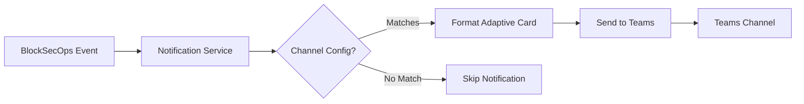

# Playbook: Microsoft Teams Integration

**Version:** 1.0.0
**Last Updated:** February 1, 2026
**Audience:** Admin | Team Lead

## Overview

This playbook guides you through integrating BlockSecOps with Microsoft Teams for real-time notifications about security scans, vulnerability discoveries, and platform events.

---

## Prerequisites

- [ ] BlockSecOps account with Growth or Enterprise tier
- [ ] Microsoft Teams workspace access
- [ ] Permission to add connectors to Teams channels
- [ ] Organization owner or admin role in BlockSecOps

---

## Workflow Diagram



---

## Steps

### Step 1: Create Incoming Webhook in Teams

**Microsoft Teams:**
1. Open Microsoft Teams
2. Navigate to the channel for notifications (e.g., "Security Alerts")
3. Click **...** (more options) next to the channel name
4. Select **Connectors**
5. Find **Incoming Webhook** and click **Configure**
6. Enter a name: `BlockSecOps Alerts`
7. Optionally upload a custom icon
8. Click **Create**
9. Copy the **Webhook URL**
10. Click **Done**

### Step 2: Add Teams Integration in BlockSecOps

**Dashboard:**
1. Navigate to **Settings > Integrations**
2. Click **Add Integration**
3. Select **Microsoft Teams**
4. Enter the webhook URL from Step 1
5. Name the integration (e.g., "Security Alerts Channel")
6. Click **Save**

**API:**
```bash
curl -X POST "https://app.blocksecops.com/api/v1/notification_channels" \
  -H "Authorization: Bearer $ACCESS_TOKEN" \
  -H "Content-Type: application/json" \
  -d '{
    "name": "Security Alerts - Teams",
    "type": "teams",
    "config": {
      "webhook_url": "https://outlook.office.com/webhook/..."
    },
    "enabled": true
  }'
```

### Step 3: Configure Notification Triggers

**Dashboard:**
1. After adding the integration, click **Configure**
2. Select which events trigger notifications:

| Event | Description | Recommended |
|-------|-------------|-------------|
| Scan Started | Notification when scan begins | Optional |
| Scan Completed | Summary when scan finishes | Yes |
| Critical Vulnerability Found | Immediate alert for critical issues | Yes |
| High Vulnerability Found | Alert for high-severity issues | Yes |
| Scan Failed | Alert when scan errors occur | Yes |
| Weekly Summary | Weekly vulnerability digest | Optional |

3. Click **Save Configuration**

**API:**
```bash
curl -X PATCH "https://app.blocksecops.com/api/v1/notification_channels/{channel_id}" \
  -H "Authorization: Bearer $ACCESS_TOKEN" \
  -H "Content-Type: application/json" \
  -d '{
    "triggers": [
      "scan_completed",
      "vulnerability_critical",
      "vulnerability_high",
      "scan_failed"
    ]
  }'
```

### Step 4: Test the Integration

**Dashboard:**
1. Click **Test** next to the Teams integration
2. A test message is sent to the configured channel
3. Verify the message appears in Teams

**API:**
```bash
curl -X POST "https://app.blocksecops.com/api/v1/notification_channels/{channel_id}/test" \
  -H "Authorization: Bearer $ACCESS_TOKEN"
```

---

## Message Formats (Adaptive Cards)

### Scan Completed

Teams messages use Adaptive Cards for rich formatting:

```json
{
  "@type": "MessageCard",
  "@context": "https://schema.org/extensions",
  "themeColor": "0076D7",
  "summary": "Scan Completed: MyToken",
  "sections": [{
    "activityTitle": "Security Scan Completed",
    "activitySubtitle": "Project: MyToken",
    "facts": [
      {"name": "Status", "value": "Completed with findings"},
      {"name": "Duration", "value": "2m 34s"},
      {"name": "Critical", "value": "2"},
      {"name": "High", "value": "5"},
      {"name": "Medium", "value": "12"},
      {"name": "Low", "value": "8"}
    ],
    "markdown": true
  }],
  "potentialAction": [{
    "@type": "OpenUri",
    "name": "View Report",
    "targets": [{
      "os": "default",
      "uri": "https://app.blocksecops.com/scans/abc123"
    }]
  }]
}
```

### Critical Vulnerability Alert

```json
{
  "@type": "MessageCard",
  "@context": "https://schema.org/extensions",
  "themeColor": "FF0000",
  "summary": "Critical Vulnerability Detected",
  "sections": [{
    "activityTitle": "Critical Vulnerability Detected",
    "activitySubtitle": "Reentrancy in withdraw()",
    "facts": [
      {"name": "Contract", "value": "contracts/Vault.sol"},
      {"name": "Line", "value": "142"},
      {"name": "Severity", "value": "Critical"}
    ],
    "text": "External call before state update allows reentrancy attack."
  }],
  "potentialAction": [{
    "@type": "OpenUri",
    "name": "View Details",
    "targets": [{
      "os": "default",
      "uri": "https://app.blocksecops.com/vulnerabilities/xyz789"
    }]
  }]
}
```

---

## Advanced Configuration

### Multiple Channels

Configure different channels for different alert types:

**API:**
```bash
# Critical alerts to main channel
curl -X POST "https://app.blocksecops.com/api/v1/notification_channels" \
  -H "Authorization: Bearer $ACCESS_TOKEN" \
  -H "Content-Type: application/json" \
  -d '{
    "name": "Critical Alerts",
    "type": "teams",
    "config": {"webhook_url": "https://outlook.office.com/webhook/..."},
    "triggers": ["vulnerability_critical"]
  }'

# All updates to security channel
curl -X POST "https://app.blocksecops.com/api/v1/notification_channels" \
  -H "Authorization: Bearer $ACCESS_TOKEN" \
  -H "Content-Type: application/json" \
  -d '{
    "name": "Security Updates",
    "type": "teams",
    "config": {"webhook_url": "https://outlook.office.com/webhook/..."},
    "triggers": ["scan_started", "scan_completed", "scan_failed"]
  }'
```

### Filter by Project

```bash
curl -X PATCH "https://app.blocksecops.com/api/v1/notification_channels/{channel_id}" \
  -H "Authorization: Bearer $ACCESS_TOKEN" \
  -H "Content-Type: application/json" \
  -d '{
    "filters": {
      "projects": ["proj_abc123", "proj_def456"]
    }
  }'
```

### Actionable Messages

Configure quick actions in Teams messages:

**API:**
```bash
curl -X PATCH "https://app.blocksecops.com/api/v1/notification_channels/{channel_id}" \
  -H "Authorization: Bearer $ACCESS_TOKEN" \
  -H "Content-Type: application/json" \
  -d '{
    "config": {
      "include_actions": true,
      "actions": ["view_report", "assign_to_me", "mark_false_positive"]
    }
  }'
```

---

## Verification

Confirm the integration is working:

**Dashboard:**
1. Navigate to **Settings > Integrations**
2. Check the Teams integration shows **Connected** status
3. View **Last Notification** timestamp

**API:**
```bash
# Check channel status
curl -X GET "https://app.blocksecops.com/api/v1/notification_channels/{channel_id}" \
  -H "Authorization: Bearer $ACCESS_TOKEN"

# View notification history
curl -X GET "https://app.blocksecops.com/api/v1/notification_channels/{channel_id}/history" \
  -H "Authorization: Bearer $ACCESS_TOKEN"
```

**Teams:**
1. Run a security scan
2. Verify notification appears in the configured channel
3. Click action buttons to verify they work

---

## Troubleshooting

| Issue | Cause | Solution |
|-------|-------|----------|
| "Webhook URL invalid" | Malformed or expired URL | Generate new webhook in Teams |
| Test message not arriving | Connector permissions | Verify connector is enabled for channel |
| "Rate limited" | Too many messages | Reduce trigger frequency |
| Cards not rendering | Invalid JSON format | Check for JSON syntax errors |
| Actions not working | Webhook doesn't support actions | Use Power Automate for advanced actions |
| Channel moved/renamed | Webhook invalidated | Create new webhook in new location |

### Debug Webhook

Test the webhook directly:
```bash
curl -X POST "https://outlook.office.com/webhook/..." \
  -H "Content-Type: application/json" \
  -d '{
    "@type": "MessageCard",
    "@context": "https://schema.org/extensions",
    "summary": "Test from BlockSecOps",
    "themeColor": "0076D7",
    "title": "Test Notification",
    "text": "If you see this message, the webhook is working correctly."
  }'
```

---

## Power Automate Integration (Advanced)

For more complex workflows, use Power Automate:

1. Create a new flow in Power Automate
2. Trigger: **When a HTTP request is received**
3. Copy the HTTP POST URL (use this as webhook in BlockSecOps)
4. Add actions:
   - Post adaptive card to Teams
   - Create task in Planner
   - Send email notification
   - Update SharePoint list

---

## Checklist

- [ ] Incoming Webhook created in Teams channel
- [ ] Webhook URL copied
- [ ] Integration added in BlockSecOps
- [ ] Notification triggers configured
- [ ] Test message received in Teams
- [ ] Adaptive cards rendering correctly
- [ ] Action buttons working (if configured)
- [ ] Real scan notification verified

---

## Related Playbooks

- [Slack Integration](./chatops-slack.md) - Slack notifications
- [Discord Integration](./chatops-discord.md) - Discord webhook alerts
- [Email Notifications](./notifications-email.md) - Email alert configuration
- [Create Organization](./create-organization.md) - Org-level notification settings
