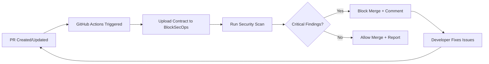

# Playbook: GitHub Actions Integration

**Version:** 1.0.0
**Last Updated:** February 1, 2026
**Audience:** Developer | DevOps

## Overview

This playbook guides you through integrating BlockSecOps security scanning into GitHub Actions workflows. Configure automated scans on pull requests, block merges on critical findings, and receive inline PR comments for vulnerabilities.

---

## Prerequisites

- [ ] BlockSecOps account with Growth or Enterprise tier
- [ ] API key with `write:scans`, `read:scans`, `read:vulnerabilities` scopes
- [ ] GitHub repository with admin access
- [ ] Solidity smart contracts in the repository

---

## Workflow Diagram



---

## Steps

### Step 1: Create API Key

**Dashboard:**
1. Navigate to **Settings > API Keys**
2. Click **Create API Key**
3. Name: `GitHub Actions - {repo-name}`
4. Scopes: `write:scans`, `read:scans`, `write:contracts`, `read:vulnerabilities`
5. Expiration: 90 days (rotate quarterly)
6. Copy the generated key

**API:**
```bash
curl -X POST "https://app.blocksecops.com/api/v1/api_keys" \
  -H "Authorization: Bearer $ACCESS_TOKEN" \
  -H "Content-Type: application/json" \
  -d '{
    "name": "GitHub Actions - my-contracts",
    "scopes": ["write:scans", "read:scans", "write:contracts", "read:vulnerabilities"],
    "expires_at": "2026-05-01T00:00:00Z"
  }'
```

### Step 2: Add Secret to GitHub Repository

**GitHub:**
1. Navigate to your repository on GitHub
2. Go to **Settings > Secrets and variables > Actions**
3. Click **New repository secret**
4. Name: `BLOCKSECOPS_API_KEY`
5. Value: Paste the API key from Step 1
6. Click **Add secret**

### Step 3: Create GitHub Actions Workflow

Create `.github/workflows/security-scan.yml`:

```yaml
name: BlockSecOps Security Scan

on:
  pull_request:
    paths:
      - 'contracts/**/*.sol'
      - '.github/workflows/security-scan.yml'
  push:
    branches:
      - main
    paths:
      - 'contracts/**/*.sol'

jobs:
  security-scan:
    name: Smart Contract Security Scan
    runs-on: ubuntu-latest

    steps:
      - name: Checkout code
        uses: actions/checkout@v4

      - name: Install BlockSecOps CLI
        run: |
          pip install blocksecops-cli
          blocksecops --version

      - name: Run Security Scan
        id: scan
        env:
          BLOCKSECOPS_API_KEY: ${{ secrets.BLOCKSECOPS_API_KEY }}
        run: |
          blocksecops scan \
            --path contracts/ \
            --project "${{ github.repository }}" \
            --output json \
            --fail-on critical,high \
            > scan-results.json

      - name: Upload Scan Results
        uses: actions/upload-artifact@v4
        with:
          name: security-scan-results
          path: scan-results.json

      - name: Comment on PR
        if: github.event_name == 'pull_request'
        uses: actions/github-script@v7
        with:
          script: |
            const fs = require('fs');
            const results = JSON.parse(fs.readFileSync('scan-results.json', 'utf8'));

            const critical = results.vulnerabilities.filter(v => v.severity === 'critical').length;
            const high = results.vulnerabilities.filter(v => v.severity === 'high').length;
            const medium = results.vulnerabilities.filter(v => v.severity === 'medium').length;
            const low = results.vulnerabilities.filter(v => v.severity === 'low').length;

            let status = ':white_check_mark: **Passed**';
            if (critical > 0 || high > 0) {
              status = ':x: **Failed**';
            }

            const body = `## BlockSecOps Security Scan Results

            ${status}

            | Severity | Count |
            |----------|-------|
            | :red_circle: Critical | ${critical} |
            | :orange_circle: High | ${high} |
            | :yellow_circle: Medium | ${medium} |
            | :white_circle: Low | ${low} |

            [View Full Report](https://app.blocksecops.com/scans/${results.scan_id})
            `;

            github.rest.issues.createComment({
              issue_number: context.issue.number,
              owner: context.repo.owner,
              repo: context.repo.repo,
              body: body
            });
```

### Step 4: Configure Branch Protection (Optional)

**GitHub:**
1. Go to **Settings > Branches**
2. Click **Add branch protection rule**
3. Branch name pattern: `main`
4. Enable: **Require status checks to pass before merging**
5. Select: `security-scan` from the list
6. Click **Create**

This ensures PRs cannot be merged if the security scan fails.

### Step 5: Configure Scan Settings

**Dashboard:**
1. Navigate to **Settings > Integrations > GitHub**
2. Click **Configure GitHub App** (if using app-based integration)
3. Or configure project-level settings:
   - **Fail on Severity:** Critical, High
   - **Auto-comment:** Enabled
   - **Inline annotations:** Enabled

**API:**
```bash
curl -X POST "https://app.blocksecops.com/api/v1/organizations/{org_id}/integrations" \
  -H "Authorization: Bearer $ACCESS_TOKEN" \
  -H "Content-Type: application/json" \
  -d '{
    "type": "github",
    "config": {
      "repository": "owner/repo-name",
      "fail_on_severity": ["critical", "high"],
      "auto_comment": true,
      "inline_annotations": true
    }
  }'
```

---

## Advanced Configuration

### Scan Specific Files

```yaml
- name: Run Security Scan
  run: |
    blocksecops scan \
      --files contracts/Token.sol,contracts/Vault.sol \
      --project "${{ github.repository }}"
```

### Exclude Files

```yaml
- name: Run Security Scan
  run: |
    blocksecops scan \
      --path contracts/ \
      --exclude "contracts/mocks/**,contracts/test/**" \
      --project "${{ github.repository }}"
```

### Custom Severity Threshold

```yaml
- name: Run Security Scan
  run: |
    # Only fail on critical vulnerabilities
    blocksecops scan \
      --path contracts/ \
      --fail-on critical
```

### Multiple Projects

```yaml
jobs:
  scan-token:
    runs-on: ubuntu-latest
    steps:
      - uses: actions/checkout@v4
      - run: blocksecops scan --path contracts/token/

  scan-governance:
    runs-on: ubuntu-latest
    steps:
      - uses: actions/checkout@v4
      - run: blocksecops scan --path contracts/governance/
```

### Scheduled Scans

```yaml
on:
  schedule:
    - cron: '0 6 * * 1'  # Every Monday at 6 AM UTC

jobs:
  weekly-scan:
    runs-on: ubuntu-latest
    steps:
      - uses: actions/checkout@v4
      - run: blocksecops scan --path contracts/ --project weekly-audit
```

---

## Verification

Confirm the integration is working:

1. **Create a test PR** with a Solidity file change
2. **Check Actions tab** for workflow execution
3. **Verify PR comment** appears with scan results
4. **Check BlockSecOps dashboard** for the scan record

**API Verification:**
```bash
# List recent scans for the project
curl -X GET "https://app.blocksecops.com/api/v1/scans?project=owner/repo-name&limit=5" \
  -H "Authorization: Bearer $BLOCKSECOPS_API_KEY"
```

---

## Troubleshooting

| Issue | Cause | Solution |
|-------|-------|----------|
| "Invalid API key" | Secret not configured or expired | Verify `BLOCKSECOPS_API_KEY` secret exists |
| "Permission denied" | API key missing required scopes | Create new key with `write:scans` scope |
| Workflow not triggering | Path filter not matching | Check `paths` matches your contract locations |
| "No contracts found" | Wrong path specified | Verify `--path` points to Solidity files |
| PR comment not appearing | Missing `pull-requests: write` permission | Add permission to workflow |
| Branch protection not working | Status check not selected | Re-select `security-scan` in branch rules |

### Common Workflow Errors

**Error: "blocksecops: command not found"**
```yaml
# Fix: Ensure CLI is installed and in PATH
- name: Install CLI
  run: |
    pip install blocksecops-cli
    echo "$HOME/.local/bin" >> $GITHUB_PATH
```

**Error: "Rate limit exceeded"**
```yaml
# Fix: Add retry logic
- name: Run Scan with Retry
  uses: nick-invision/retry@v2
  with:
    timeout_minutes: 10
    max_attempts: 3
    command: blocksecops scan --path contracts/
```

---

## Checklist

- [ ] API key created with correct scopes
- [ ] GitHub secret `BLOCKSECOPS_API_KEY` configured
- [ ] Workflow file created at `.github/workflows/security-scan.yml`
- [ ] Workflow triggers on PR and push to main
- [ ] Path filters match contract directory structure
- [ ] Test PR created and scan executed
- [ ] PR comment appears with results
- [ ] Branch protection configured (optional)
- [ ] Scan visible in BlockSecOps dashboard

---

## Related Playbooks

- [API Key Management](./api-key-management.md) - Create and manage API keys
- [GitLab CI Integration](./cicd-gitlab-ci.md) - GitLab pipeline integration
- [Run First Scan](./run-first-scan.md) - Manual scanning workflow
- [CLI Installation](./cli-installation.md) - Install BlockSecOps CLI
