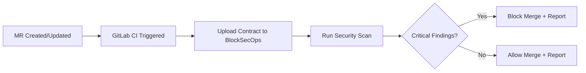

# Playbook: GitLab CI Integration

**Version:** 1.0.0
**Last Updated:** February 1, 2026
**Audience:** Developer | DevOps

## Overview

This playbook guides you through integrating BlockSecOps security scanning into GitLab CI/CD pipelines. Configure automated scans on merge requests, block merges on critical findings, and view results directly in GitLab.

---

## Prerequisites

- [ ] BlockSecOps account with Growth or Enterprise tier
- [ ] API key with `write:scans`, `read:scans`, `read:vulnerabilities` scopes
- [ ] GitLab project with maintainer access
- [ ] Solidity smart contracts in the repository

---

## Workflow Diagram



---

## Steps

### Step 1: Create API Key

**Dashboard:**
1. Navigate to **Settings > API Keys**
2. Click **Create API Key**
3. Name: `GitLab CI - {project-name}`
4. Scopes: `write:scans`, `read:scans`, `write:contracts`, `read:vulnerabilities`
5. Expiration: 90 days
6. Copy the generated key

**API:**
```bash
curl -X POST "https://app.blocksecops.com/api/v1/api_keys" \
  -H "Authorization: Bearer $ACCESS_TOKEN" \
  -H "Content-Type: application/json" \
  -d '{
    "name": "GitLab CI - smart-contracts",
    "scopes": ["write:scans", "read:scans", "write:contracts", "read:vulnerabilities"],
    "expires_at": "2026-05-01T00:00:00Z"
  }'
```

### Step 2: Add Variable to GitLab Project

**GitLab:**
1. Navigate to your project on GitLab
2. Go to **Settings > CI/CD**
3. Expand **Variables**
4. Click **Add variable**
5. Configure:
   - **Key:** `BLOCKSECOPS_API_KEY`
   - **Value:** Paste the API key
   - **Type:** Variable
   - **Protect variable:** Enable (recommended)
   - **Mask variable:** Enable
6. Click **Add variable**

### Step 3: Create GitLab CI Configuration

Create `.gitlab-ci.yml` in your repository root:

```yaml
stages:
  - security

variables:
  BLOCKSECOPS_API_URL: "https://app.blocksecops.com/api/v1"

security-scan:
  stage: security
  image: python:3.11-slim
  before_script:
    - pip install blocksecops-cli --quiet
  script:
    - |
      blocksecops scan \
        --path contracts/ \
        --project "$CI_PROJECT_PATH" \
        --output json \
        --fail-on critical,high \
        > scan-results.json
  artifacts:
    paths:
      - scan-results.json
    reports:
      dotenv: scan-results.env
    expire_in: 1 week
  rules:
    - if: '$CI_PIPELINE_SOURCE == "merge_request_event"'
      changes:
        - contracts/**/*.sol
        - .gitlab-ci.yml
    - if: '$CI_COMMIT_BRANCH == "main"'
      changes:
        - contracts/**/*.sol
  allow_failure: false
```

### Step 4: Add Merge Request Comment (Optional)

Add a job to comment on merge requests:

```yaml
security-report:
  stage: security
  image: curlimages/curl:latest
  needs:
    - job: security-scan
      artifacts: true
  script:
    - |
      # Parse results
      CRITICAL=$(cat scan-results.json | jq '.vulnerabilities | map(select(.severity == "critical")) | length')
      HIGH=$(cat scan-results.json | jq '.vulnerabilities | map(select(.severity == "high")) | length')
      MEDIUM=$(cat scan-results.json | jq '.vulnerabilities | map(select(.severity == "medium")) | length')
      LOW=$(cat scan-results.json | jq '.vulnerabilities | map(select(.severity == "low")) | length')
      SCAN_ID=$(cat scan-results.json | jq -r '.scan_id')

      # Create comment body
      BODY="## BlockSecOps Security Scan Results\n\n"
      if [ "$CRITICAL" -gt 0 ] || [ "$HIGH" -gt 0 ]; then
        BODY="${BODY}:x: **Failed**\n\n"
      else
        BODY="${BODY}:white_check_mark: **Passed**\n\n"
      fi
      BODY="${BODY}| Severity | Count |\n|----------|-------|\n"
      BODY="${BODY}| Critical | $CRITICAL |\n"
      BODY="${BODY}| High | $HIGH |\n"
      BODY="${BODY}| Medium | $MEDIUM |\n"
      BODY="${BODY}| Low | $LOW |\n\n"
      BODY="${BODY}[View Full Report](https://app.blocksecops.com/scans/$SCAN_ID)"

      # Post comment to MR
      curl --request POST \
        --header "PRIVATE-TOKEN: ${GITLAB_TOKEN}" \
        --header "Content-Type: application/json" \
        --data "{\"body\": \"$BODY\"}" \
        "${CI_API_V4_URL}/projects/${CI_PROJECT_ID}/merge_requests/${CI_MERGE_REQUEST_IID}/notes"
  rules:
    - if: '$CI_PIPELINE_SOURCE == "merge_request_event"'
```

### Step 5: Configure Merge Request Approval Rules (Optional)

**GitLab:**
1. Go to **Settings > Merge requests**
2. Under **Merge request approvals**, click **Add approval rule**
3. Name: "Security Scan Passed"
4. Approvals required: 0 (auto-approved when pipeline passes)
5. Enable: **Require pipeline to succeed**

---

## Advanced Configuration

### Multi-Project Scanning

```yaml
.security-scan-template:
  stage: security
  image: python:3.11-slim
  before_script:
    - pip install blocksecops-cli --quiet

scan-token:
  extends: .security-scan-template
  script:
    - blocksecops scan --path contracts/token/ --fail-on critical,high
  rules:
    - changes:
        - contracts/token/**/*.sol

scan-governance:
  extends: .security-scan-template
  script:
    - blocksecops scan --path contracts/governance/ --fail-on critical,high
  rules:
    - changes:
        - contracts/governance/**/*.sol
```

### Scheduled Scans

```yaml
scheduled-security-scan:
  stage: security
  image: python:3.11-slim
  before_script:
    - pip install blocksecops-cli --quiet
  script:
    - blocksecops scan --path contracts/ --project "$CI_PROJECT_PATH-weekly"
  rules:
    - if: '$CI_PIPELINE_SOURCE == "schedule"'
```

Create a schedule in GitLab:
1. Go to **CI/CD > Schedules**
2. Click **New schedule**
3. Configure: Weekly on Monday at 6:00 UTC
4. Save

### Custom Severity Thresholds

```yaml
security-scan:
  script:
    # Only fail on critical
    - blocksecops scan --path contracts/ --fail-on critical

    # Fail on critical, high, and medium
    - blocksecops scan --path contracts/ --fail-on critical,high,medium
```

### Using Docker-in-Docker for Custom Scanners

```yaml
security-scan:
  stage: security
  image: docker:latest
  services:
    - docker:dind
  variables:
    DOCKER_TLS_CERTDIR: ""
  script:
    - docker run --rm \
        -v $(pwd)/contracts:/contracts \
        -e BLOCKSECOPS_API_KEY=$BLOCKSECOPS_API_KEY \
        blocksecops/cli:latest scan --path /contracts
```

---

## Integration with GitLab Security Dashboard

BlockSecOps results can be exported in GitLab SAST format:

```yaml
security-scan:
  stage: security
  image: python:3.11-slim
  before_script:
    - pip install blocksecops-cli --quiet
  script:
    - blocksecops scan --path contracts/ --output gitlab-sast > gl-sast-report.json
  artifacts:
    reports:
      sast: gl-sast-report.json
```

This populates GitLab's Security Dashboard with vulnerability findings.

---

## Verification

Confirm the integration is working:

1. **Create a test MR** with a Solidity file change
2. **Check Pipeline tab** for job execution
3. **Verify MR comment** appears (if configured)
4. **Check BlockSecOps dashboard** for scan record

**API Verification:**
```bash
curl -X GET "https://app.blocksecops.com/api/v1/scans?project=group/project-name&limit=5" \
  -H "Authorization: Bearer $BLOCKSECOPS_API_KEY"
```

---

## Troubleshooting

| Issue | Cause | Solution |
|-------|-------|----------|
| "Variable not found" | `BLOCKSECOPS_API_KEY` not set | Add variable in CI/CD settings |
| "Permission denied" | Protected variable on unprotected branch | Unprotect variable or run on protected branch |
| Job not triggering | Rules not matching | Check `rules` configuration |
| "blocksecops: command not found" | Installation failed | Add `pip install --upgrade pip` before install |
| MR comment not appearing | Missing `GITLAB_TOKEN` | Create project access token with API scope |
| Pipeline passes despite findings | `allow_failure: true` set | Remove or set to `false` |

### Debug Mode

```yaml
security-scan:
  script:
    - blocksecops scan --path contracts/ --verbose --debug
```

---

## Checklist

- [ ] API key created with correct scopes
- [ ] GitLab CI/CD variable `BLOCKSECOPS_API_KEY` configured
- [ ] `.gitlab-ci.yml` created with security-scan job
- [ ] Rules configured for MR and main branch
- [ ] Test MR created and pipeline executed
- [ ] Scan results visible in job artifacts
- [ ] MR comment appears (if configured)
- [ ] Merge request approval rules set (optional)
- [ ] Scan visible in BlockSecOps dashboard

---

## Related Playbooks

- [API Key Management](./api-key-management.md) - Create and manage API keys
- [GitHub Actions Integration](./cicd-github-actions.md) - GitHub CI/CD
- [Jenkins Integration](./cicd-jenkins.md) - Jenkins pipeline
- [CLI Installation](./cli-installation.md) - BlockSecOps CLI setup
