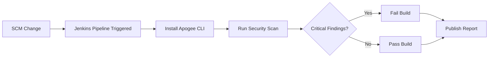

# Playbook: Jenkins Integration

**Version:** 1.0.0
**Last Updated:** February 1, 2026
**Audience:** Developer | DevOps

## Overview

This playbook guides you through integrating Apogee security scanning into Jenkins pipelines. Configure automated scans on pull requests, block builds on critical findings, and publish results to Jenkins.

---

## Prerequisites

- [ ] Apogee account with Growth or Enterprise tier
- [ ] API key with `write:scans`, `read:scans`, `read:vulnerabilities` scopes
- [ ] Jenkins server with Pipeline plugin installed
- [ ] Python 3.8+ available on Jenkins agents
- [ ] Solidity smart contracts in the repository

---

## Workflow Diagram



---

## Steps

### Step 1: Create API Key

**Dashboard:**
1. Navigate to **Settings > API Keys**
2. Click **Create API Key**
3. Name: `Jenkins - {job-name}`
4. Scopes: `write:scans`, `read:scans`, `write:contracts`, `read:vulnerabilities`
5. Expiration: 90 days
6. Copy the generated key

### Step 2: Add Credential to Jenkins

**Jenkins:**
1. Navigate to **Manage Jenkins > Credentials**
2. Select appropriate scope (global or folder)
3. Click **Add Credentials**
4. Configure:
   - **Kind:** Secret text
   - **Scope:** Global
   - **Secret:** Paste the API key
   - **ID:** `blocksecops-api-key`
   - **Description:** Apogee API Key
5. Click **OK**

### Step 3: Create Jenkinsfile

Create `Jenkinsfile` in your repository:

```groovy
pipeline {
    agent any

    environment {
        APOGEE_API_KEY = credentials('blocksecops-api-key')
    }

    stages {
        stage('Checkout') {
            steps {
                checkout scm
            }
        }

        stage('Install Apogee CLI') {
            steps {
                sh '''
                    python3 -m pip install --upgrade pip
                    pip install 0xapogee-cli
                    0xapogee --version
                '''
            }
        }

        stage('Security Scan') {
            steps {
                sh '''
                    0xapogee scan \
                        --path contracts/ \
                        --project "${JOB_NAME}" \
                        --output json \
                        --fail-on critical,high \
                        > scan-results.json
                '''
            }
            post {
                always {
                    archiveArtifacts artifacts: 'scan-results.json', allowEmptyArchive: true
                }
            }
        }

        stage('Publish Report') {
            steps {
                script {
                    def results = readJSON file: 'scan-results.json'
                    def critical = results.vulnerabilities.findAll { it.severity == 'critical' }.size()
                    def high = results.vulnerabilities.findAll { it.severity == 'high' }.size()
                    def medium = results.vulnerabilities.findAll { it.severity == 'medium' }.size()
                    def low = results.vulnerabilities.findAll { it.severity == 'low' }.size()

                    echo """
                    ======================================
                    Apogee Security Scan Results
                    ======================================
                    Critical: ${critical}
                    High:     ${high}
                    Medium:   ${medium}
                    Low:      ${low}
                    ======================================
                    View full report: https://app.0xapogee.com/scans/${results.scan_id}
                    """

                    if (critical > 0 || high > 0) {
                        currentBuild.result = 'FAILURE'
                        error("Security scan found ${critical} critical and ${high} high severity vulnerabilities")
                    }
                }
            }
        }
    }

    post {
        failure {
            echo 'Security scan failed! Review the findings before merging.'
        }
        success {
            echo 'Security scan passed!'
        }
    }
}
```

### Step 4: Configure Multibranch Pipeline (For PRs)

**Jenkins:**
1. Create **New Item** > **Multibranch Pipeline**
2. Configure branch sources (GitHub, GitLab, Bitbucket)
3. Set **Build Configuration** to use `Jenkinsfile`
4. Under **Scan Multibranch Pipeline Triggers**, enable periodic scanning

### Step 5: Configure PR Blocking (GitHub)

For GitHub integration with branch protection:

```groovy
pipeline {
    agent any

    environment {
        APOGEE_API_KEY = credentials('blocksecops-api-key')
    }

    stages {
        stage('Security Scan') {
            steps {
                script {
                    // Set GitHub commit status
                    if (env.CHANGE_ID) {
                        githubNotify context: 'Apogee Security Scan',
                                     status: 'PENDING',
                                     description: 'Running security scan...'
                    }
                }

                sh '''
                    0xapogee scan \
                        --path contracts/ \
                        --project "${JOB_NAME}" \
                        --output json \
                        > scan-results.json
                '''

                script {
                    def results = readJSON file: 'scan-results.json'
                    def critical = results.vulnerabilities.findAll { it.severity == 'critical' }.size()
                    def high = results.vulnerabilities.findAll { it.severity == 'high' }.size()

                    if (env.CHANGE_ID) {
                        if (critical > 0 || high > 0) {
                            githubNotify context: 'Apogee Security Scan',
                                         status: 'FAILURE',
                                         description: "${critical} critical, ${high} high findings"
                        } else {
                            githubNotify context: 'Apogee Security Scan',
                                         status: 'SUCCESS',
                                         description: 'No critical or high findings'
                        }
                    }

                    if (critical > 0 || high > 0) {
                        error("Security scan failed")
                    }
                }
            }
        }
    }
}
```

---

## Advanced Configuration

### Docker Agent

```groovy
pipeline {
    agent {
        docker {
            image 'python:3.11-slim'
            args '-u root'
        }
    }

    stages {
        stage('Security Scan') {
            steps {
                sh '''
                    pip install 0xapogee-cli
                    0xapogee scan --path contracts/ --fail-on critical,high
                '''
            }
        }
    }
}
```

### Parallel Scanning

```groovy
pipeline {
    agent any

    stages {
        stage('Security Scans') {
            parallel {
                stage('Scan Token Contracts') {
                    steps {
                        sh '0xapogee scan --path contracts/token/'
                    }
                }
                stage('Scan Governance Contracts') {
                    steps {
                        sh '0xapogee scan --path contracts/governance/'
                    }
                }
                stage('Scan Vault Contracts') {
                    steps {
                        sh '0xapogee scan --path contracts/vault/'
                    }
                }
            }
        }
    }
}
```

### Scheduled Scans

```groovy
pipeline {
    agent any

    triggers {
        cron('H 6 * * 1')  // Every Monday at 6 AM
    }

    stages {
        stage('Weekly Security Scan') {
            steps {
                sh '0xapogee scan --path contracts/ --project weekly-audit'
            }
        }
    }
}
```

### Email Notifications

```groovy
pipeline {
    agent any

    post {
        failure {
            emailext(
                subject: "Security Scan Failed: ${env.JOB_NAME}",
                body: """
                    Security scan found critical or high severity vulnerabilities.

                    Job: ${env.JOB_NAME}
                    Build: ${env.BUILD_NUMBER}

                    View results: ${env.BUILD_URL}artifact/scan-results.json
                """,
                to: 'security-team@company.com'
            )
        }
    }
}
```

### HTML Report Publishing

```groovy
pipeline {
    agent any

    stages {
        stage('Security Scan') {
            steps {
                sh '''
                    0xapogee scan \
                        --path contracts/ \
                        --output html \
                        > scan-report.html
                '''
            }
            post {
                always {
                    publishHTML(target: [
                        allowMissing: false,
                        alwaysLinkToLastBuild: true,
                        keepAll: true,
                        reportDir: '.',
                        reportFiles: 'scan-report.html',
                        reportName: 'Apogee Security Report'
                    ])
                }
            }
        }
    }
}
```

---

## Shared Library

Create a reusable shared library for organization-wide use:

**vars/blocksecops.groovy:**
```groovy
def scan(Map config = [:]) {
    def path = config.path ?: 'contracts/'
    def failOn = config.failOn ?: 'critical,high'
    def project = config.project ?: env.JOB_NAME

    withCredentials([string(credentialsId: 'blocksecops-api-key', variable: 'APOGEE_API_KEY')]) {
        sh """
            pip install 0xapogee-cli --quiet
            0xapogee scan \
                --path ${path} \
                --project "${project}" \
                --fail-on ${failOn} \
                --output json \
                > scan-results.json
        """
    }

    archiveArtifacts artifacts: 'scan-results.json', allowEmptyArchive: true
    return readJSON file: 'scan-results.json'
}
```

**Usage in Jenkinsfile:**
```groovy
@Library('blocksecops-library') _

pipeline {
    agent any

    stages {
        stage('Security Scan') {
            steps {
                script {
                    def results = blocksecops.scan(
                        path: 'contracts/',
                        failOn: 'critical,high'
                    )
                    echo "Found ${results.vulnerabilities.size()} vulnerabilities"
                }
            }
        }
    }
}
```

---

## Verification

Confirm the integration is working:

1. **Trigger a build** with Solidity file changes
2. **Check Console Output** for scan execution
3. **Verify artifacts** contain `scan-results.json`
4. **Check Apogee dashboard** for scan record

**API Verification:**
```bash
curl -X GET "https://app.0xapogee.com/api/v1/scans?project=jenkins-job-name&limit=5" \
  -H "Authorization: Bearer $APOGEE_API_KEY"
```

---

## Troubleshooting

| Issue | Cause | Solution |
|-------|-------|----------|
| "Credential not found" | Wrong credential ID | Verify credential ID matches |
| "blocksecops: command not found" | Not in PATH | Use full path or add to agent PATH |
| "Permission denied" | Agent user restrictions | Run as root in Docker or configure agent |
| Build hangs | Scan timeout | Add `--timeout` flag to CLI |
| "Invalid JSON" | CLI output includes extra text | Redirect stderr: `2>/dev/null` |
| GitHub status not updating | Missing GitHub plugin | Install GitHub Branch Source plugin |

### Debug Mode

```groovy
stage('Security Scan') {
    steps {
        sh '''
            export APOGEE_DEBUG=1
            0xapogee scan --path contracts/ --verbose
        '''
    }
}
```

---

## Checklist

- [ ] API key created with correct scopes
- [ ] Jenkins credential `blocksecops-api-key` configured
- [ ] Jenkinsfile created in repository
- [ ] Pipeline job configured in Jenkins
- [ ] Test build executed successfully
- [ ] Scan results archived as artifacts
- [ ] Build fails on critical/high findings
- [ ] PR integration working (if configured)
- [ ] Scan visible in Apogee dashboard

---

## Related Playbooks

- [API Key Management](./api-key-management.md) - Create and manage API keys
- [GitHub Actions Integration](./cicd-github-actions.md) - GitHub CI/CD
- [GitLab CI Integration](./cicd-gitlab-ci.md) - GitLab CI/CD
- [Generic Webhook CI/CD](./cicd-webhook-generic.md) - Custom CI systems
