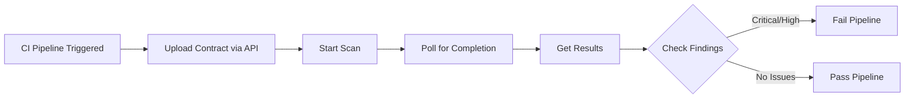

# Playbook: Generic Webhook CI/CD Integration

**Version:** 1.0.0
**Last Updated:** February 1, 2026
**Audience:** Developer | DevOps

## Overview

This playbook guides you through integrating BlockSecOps security scanning into any CI/CD system using webhooks and the REST API. This approach works with systems like CircleCI, Travis CI, Azure DevOps, Bitbucket Pipelines, TeamCity, or custom build systems.

---

## Prerequisites

- [ ] BlockSecOps account with Growth or Enterprise tier
- [ ] API key with `write:scans`, `read:scans`, `read:vulnerabilities` scopes
- [ ] CI/CD system with HTTP request capability
- [ ] Solidity smart contracts in the repository

---

## Workflow Diagram



---

## Core API Endpoints

| Endpoint | Method | Description |
|----------|--------|-------------|
| `/api/v1/contracts` | POST | Upload contract file |
| `/api/v1/scans` | POST | Create and start scan |
| `/api/v1/scans/{id}` | GET | Check scan status |
| `/api/v1/scans/{id}/vulnerabilities` | GET | Get scan findings |

---

## Steps

### Step 1: Create API Key

**Dashboard:**
1. Navigate to **Settings > API Keys**
2. Click **Create API Key**
3. Name: `CI/CD - {system-name}`
4. Scopes: `write:scans`, `read:scans`, `write:contracts`, `read:vulnerabilities`
5. Copy the generated key

### Step 2: Store API Key in CI System

Store as a secure environment variable:

| CI System | Variable Name | Method |
|-----------|---------------|--------|
| CircleCI | `APOGEE_API_KEY` | Project Settings > Environment Variables |
| Travis CI | `APOGEE_API_KEY` | Settings > Environment Variables |
| Azure DevOps | `APOGEE_API_KEY` | Pipelines > Library > Variable Groups |
| Bitbucket | `APOGEE_API_KEY` | Repository Settings > Pipelines > Variables |
| TeamCity | `env.APOGEE_API_KEY` | Build Parameters |

### Step 3: Create Scan Script

Create a reusable script `scripts/security-scan.sh`:

```bash
#!/bin/bash
set -e

# Configuration
API_URL="${APOGEE_API_URL:-https://app.0xapogee.com/api/v1}"
API_KEY="${APOGEE_API_KEY}"
CONTRACT_PATH="${1:-contracts/}"
PROJECT_NAME="${2:-$CI_PROJECT_NAME}"
FAIL_ON="${3:-critical,high}"

# Validate API key
if [ -z "$API_KEY" ]; then
  echo "Error: APOGEE_API_KEY not set"
  exit 1
fi

echo "=== BlockSecOps Security Scan ==="
echo "Path: $CONTRACT_PATH"
echo "Project: $PROJECT_NAME"

# Step 1: Find all Solidity files
FILES=$(find "$CONTRACT_PATH" -name "*.sol" -type f)
if [ -z "$FILES" ]; then
  echo "No Solidity files found in $CONTRACT_PATH"
  exit 0
fi

# Step 2: Get or create project
PROJECT_RESPONSE=$(curl -s -X GET "$API_URL/projects?name=$PROJECT_NAME" \
  -H "Authorization: Bearer $API_KEY")

PROJECT_ID=$(echo "$PROJECT_RESPONSE" | jq -r '.[0].id // empty')

if [ -z "$PROJECT_ID" ]; then
  echo "Creating project: $PROJECT_NAME"
  PROJECT_RESPONSE=$(curl -s -X POST "$API_URL/projects" \
    -H "Authorization: Bearer $API_KEY" \
    -H "Content-Type: application/json" \
    -d "{\"name\": \"$PROJECT_NAME\"}")
  PROJECT_ID=$(echo "$PROJECT_RESPONSE" | jq -r '.id')
fi

echo "Project ID: $PROJECT_ID"

# Step 3: Upload contracts
CONTRACT_IDS=""
for FILE in $FILES; do
  echo "Uploading: $FILE"
  UPLOAD_RESPONSE=$(curl -s -X POST "$API_URL/contracts" \
    -H "Authorization: Bearer $API_KEY" \
    -F "project_id=$PROJECT_ID" \
    -F "file=@$FILE")

  CONTRACT_ID=$(echo "$UPLOAD_RESPONSE" | jq -r '.id')
  CONTRACT_IDS="$CONTRACT_IDS\"$CONTRACT_ID\","
done

CONTRACT_IDS="[${CONTRACT_IDS%,}]"

# Step 4: Start scan
echo "Starting scan..."
SCAN_RESPONSE=$(curl -s -X POST "$API_URL/scans" \
  -H "Authorization: Bearer $API_KEY" \
  -H "Content-Type: application/json" \
  -d "{
    \"project_id\": \"$PROJECT_ID\",
    \"contract_ids\": $CONTRACT_IDS,
    \"scanners\": [\"soliditydefend\", \"slither\"]
  }")

SCAN_ID=$(echo "$SCAN_RESPONSE" | jq -r '.id')
echo "Scan ID: $SCAN_ID"

# Step 5: Poll for completion
echo "Waiting for scan to complete..."
MAX_WAIT=600  # 10 minutes
ELAPSED=0

while [ $ELAPSED -lt $MAX_WAIT ]; do
  STATUS_RESPONSE=$(curl -s -X GET "$API_URL/scans/$SCAN_ID" \
    -H "Authorization: Bearer $API_KEY")

  STATUS=$(echo "$STATUS_RESPONSE" | jq -r '.status')

  case $STATUS in
    "completed")
      echo "Scan completed!"
      break
      ;;
    "failed")
      echo "Scan failed!"
      exit 1
      ;;
    *)
      echo "Status: $STATUS (${ELAPSED}s elapsed)"
      sleep 10
      ELAPSED=$((ELAPSED + 10))
      ;;
  esac
done

if [ $ELAPSED -ge $MAX_WAIT ]; then
  echo "Error: Scan timed out after ${MAX_WAIT}s"
  exit 1
fi

# Step 6: Get results
RESULTS=$(curl -s -X GET "$API_URL/scans/$SCAN_ID/vulnerabilities" \
  -H "Authorization: Bearer $API_KEY")

# Step 7: Parse results
CRITICAL=$(echo "$RESULTS" | jq '[.[] | select(.severity == "critical")] | length')
HIGH=$(echo "$RESULTS" | jq '[.[] | select(.severity == "high")] | length')
MEDIUM=$(echo "$RESULTS" | jq '[.[] | select(.severity == "medium")] | length')
LOW=$(echo "$RESULTS" | jq '[.[] | select(.severity == "low")] | length')
TOTAL=$((CRITICAL + HIGH + MEDIUM + LOW))

echo ""
echo "=== Scan Results ==="
echo "Critical: $CRITICAL"
echo "High:     $HIGH"
echo "Medium:   $MEDIUM"
echo "Low:      $LOW"
echo "Total:    $TOTAL"
echo ""
echo "View report: https://app.0xapogee.com/scans/$SCAN_ID"
echo ""

# Step 8: Save results
echo "$RESULTS" > scan-results.json

# Step 9: Check failure threshold
FAILED=0
if [[ "$FAIL_ON" == *"critical"* ]] && [ $CRITICAL -gt 0 ]; then
  echo "FAIL: $CRITICAL critical vulnerabilities found"
  FAILED=1
fi
if [[ "$FAIL_ON" == *"high"* ]] && [ $HIGH -gt 0 ]; then
  echo "FAIL: $HIGH high vulnerabilities found"
  FAILED=1
fi
if [[ "$FAIL_ON" == *"medium"* ]] && [ $MEDIUM -gt 0 ]; then
  echo "FAIL: $MEDIUM medium vulnerabilities found"
  FAILED=1
fi

if [ $FAILED -eq 1 ]; then
  exit 1
fi

echo "PASS: No blocking vulnerabilities found"
exit 0
```

Make it executable:
```bash
chmod +x scripts/security-scan.sh
```

---

## CI System Examples

### CircleCI

`.circleci/config.yml`:
```yaml
version: 2.1

jobs:
  security-scan:
    docker:
      - image: cimg/base:2024.01
    steps:
      - checkout
      - run:
          name: Install dependencies
          command: |
            sudo apt-get update
            sudo apt-get install -y jq
      - run:
          name: Run Security Scan
          command: ./scripts/security-scan.sh contracts/
      - store_artifacts:
          path: scan-results.json

workflows:
  main:
    jobs:
      - security-scan:
          filters:
            branches:
              only:
                - main
                - /feature\/.*/
```

### Travis CI

`.travis.yml`:
```yaml
language: minimal

jobs:
  include:
    - stage: security
      name: "Smart Contract Security Scan"
      before_script:
        - sudo apt-get install -y jq
      script:
        - ./scripts/security-scan.sh contracts/
      after_success:
        - echo "Security scan passed"
      after_failure:
        - cat scan-results.json

stages:
  - security
  - test
  - deploy
```

### Azure DevOps

`azure-pipelines.yml`:
```yaml
trigger:
  branches:
    include:
      - main
  paths:
    include:
      - contracts/**

pool:
  vmImage: 'ubuntu-latest'

stages:
  - stage: Security
    jobs:
      - job: SecurityScan
        displayName: 'Smart Contract Security Scan'
        steps:
          - task: Bash@3
            displayName: 'Install jq'
            inputs:
              targetType: 'inline'
              script: sudo apt-get install -y jq

          - task: Bash@3
            displayName: 'Run Security Scan'
            inputs:
              targetType: 'filePath'
              filePath: './scripts/security-scan.sh'
              arguments: 'contracts/'
            env:
              APOGEE_API_KEY: $(APOGEE_API_KEY)

          - task: PublishBuildArtifacts@1
            displayName: 'Publish Results'
            inputs:
              pathToPublish: 'scan-results.json'
              artifactName: 'security-scan'
            condition: always()
```

### Bitbucket Pipelines

`bitbucket-pipelines.yml`:
```yaml
pipelines:
  default:
    - step:
        name: Security Scan
        image: atlassian/default-image:4
        script:
          - apt-get update && apt-get install -y jq
          - chmod +x scripts/security-scan.sh
          - ./scripts/security-scan.sh contracts/
        artifacts:
          - scan-results.json

  pull-requests:
    '**':
      - step:
          name: Security Scan
          script:
            - apt-get update && apt-get install -y jq
            - ./scripts/security-scan.sh contracts/ "$BITBUCKET_REPO_SLUG" "critical,high"
```

### TeamCity

Build configuration with Kotlin DSL:
```kotlin
object SecurityScan : BuildType({
    name = "Security Scan"

    vcs {
        root(DslContext.settingsRoot)
    }

    steps {
        script {
            name = "Run BlockSecOps Scan"
            scriptContent = """
                apt-get update && apt-get install -y jq
                ./scripts/security-scan.sh contracts/
            """.trimIndent()
        }
    }

    params {
        password("env.APOGEE_API_KEY", "credentialsJSON:xxxxx")
    }

    artifactRules = "scan-results.json"
})
```

---

## Webhook Notifications (Outbound)

Receive scan completion notifications:

### Register Webhook

```bash
curl -X POST "https://app.0xapogee.com/api/v1/webhooks" \
  -H "Authorization: Bearer $ACCESS_TOKEN" \
  -H "Content-Type: application/json" \
  -d '{
    "url": "https://your-ci-system.com/webhook/blocksecops",
    "events": ["scan.completed", "scan.failed"],
    "secret": "your-webhook-secret"
  }'
```

### Webhook Payload

```json
{
  "event": "scan.completed",
  "timestamp": "2026-02-01T10:30:00Z",
  "scan": {
    "id": "scan_abc123",
    "project": "MyProject",
    "status": "completed",
    "summary": {
      "critical": 2,
      "high": 5,
      "medium": 12,
      "low": 8
    }
  },
  "signature": "sha256=xxxxx"
}
```

### Verify Webhook Signature

```python
import hmac
import hashlib

def verify_signature(payload, signature, secret):
    expected = 'sha256=' + hmac.new(
        secret.encode(),
        payload.encode(),
        hashlib.sha256
    ).hexdigest()
    return hmac.compare_digest(expected, signature)
```

---

## Verification

Confirm the integration is working:

1. **Trigger a build** with Solidity file changes
2. **Check build logs** for scan execution
3. **Verify artifacts** contain `scan-results.json`
4. **Check BlockSecOps dashboard** for scan record

---

## Troubleshooting

| Issue | Cause | Solution |
|-------|-------|----------|
| "Unauthorized" | Invalid API key | Verify key is set correctly |
| "Project not found" | First run or wrong name | Let script create project |
| Scan times out | Large contracts or slow scanner | Increase MAX_WAIT |
| "jq not found" | Missing dependency | Install jq in CI image |
| No files found | Wrong path | Check CONTRACT_PATH |
| Results empty | Scan still running | Increase polling interval |

---

## Checklist

- [ ] API key created with correct scopes
- [ ] API key stored as CI secret
- [ ] Scan script created and tested
- [ ] CI configuration file created
- [ ] Test build executed
- [ ] Scan results saved as artifact
- [ ] Build fails on critical/high findings
- [ ] Scan visible in BlockSecOps dashboard

---

## Related Playbooks

- [API Key Management](./api-key-management.md) - Create and manage API keys
- [GitHub Actions Integration](./cicd-github-actions.md) - GitHub-specific integration
- [GitLab CI Integration](./cicd-gitlab-ci.md) - GitLab-specific integration
- [Jenkins Integration](./cicd-jenkins.md) - Jenkins-specific integration
