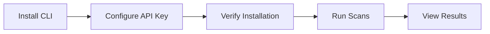

# Playbook: CLI Installation

**Version:** 1.0.0
**Last Updated:** February 1, 2026
**Audience:** Developer

## Overview

This playbook guides you through installing and configuring the BlockSecOps CLI for command-line security scanning. The CLI enables scanning from terminals, scripts, and CI/CD pipelines.

---

## Prerequisites

- [ ] BlockSecOps account (any tier)
- [ ] Python 3.8+ installed
- [ ] pip package manager
- [ ] API key with `write:scans`, `read:scans`, `read:vulnerabilities` scopes

---

## Workflow Diagram



---

## Installation Methods

### Method 1: pip (Recommended)

```bash
# Install from PyPI
pip install blocksecops-cli

# Or with pipx for isolated installation
pipx install blocksecops-cli
```

### Method 2: Homebrew (macOS/Linux)

```bash
# Add BlockSecOps tap
brew tap blocksecops/tap

# Install CLI
brew install blocksecops-cli
```

### Method 3: Docker

```bash
# Pull the CLI image
docker pull blocksecops/cli:latest

# Run CLI via Docker
docker run --rm -v $(pwd):/workspace blocksecops/cli:latest scan --path /workspace/contracts
```

### Method 4: Binary Download

Download pre-built binaries from [BlockSecOps Downloads](https://app.blocksecops.com/downloads/cli):

```bash
# Linux (x64)
curl -L https://app.blocksecops.com/downloads/cli/linux-x64/latest -o blocksecops
chmod +x blocksecops
sudo mv blocksecops /usr/local/bin/

# macOS (Apple Silicon)
curl -L https://app.blocksecops.com/downloads/cli/darwin-arm64/latest -o blocksecops
chmod +x blocksecops
sudo mv blocksecops /usr/local/bin/

# macOS (Intel)
curl -L https://app.blocksecops.com/downloads/cli/darwin-x64/latest -o blocksecops
chmod +x blocksecops
sudo mv blocksecops /usr/local/bin/
```

---

## Configuration

### Step 1: Create API Key

**Dashboard:**
1. Navigate to **Settings > API Keys**
2. Click **Create API Key**
3. Name: `CLI`
4. Scopes: `write:scans`, `read:scans`, `write:contracts`, `read:vulnerabilities`
5. Copy the generated key

### Step 2: Configure CLI

**Option A: Environment Variable (Recommended)**

```bash
# Add to ~/.bashrc, ~/.zshrc, or ~/.profile
export BLOCKSECOPS_API_KEY="bso_live_xxxxxxxxxxxxxxxxxxxxxxxxxxxx"

# Apply changes
source ~/.bashrc
```

**Option B: Configuration File**

```bash
# Create config file
blocksecops config init

# Set API key
blocksecops config set api_key bso_live_xxxxxxxxxxxxxxxxxxxxxxxxxxxx
```

Creates `~/.blocksecops/config.yaml`:
```yaml
api_key: bso_live_xxxxxxxxxxxxxxxxxxxxxxxxxxxx
api_url: https://app.blocksecops.com/api/v1
default_scanners:
  - soliditydefend
  - slither
output_format: text
```

**Option C: Command-Line Flag**

```bash
blocksecops scan --api-key bso_live_xxxx --path contracts/
```

### Step 3: Verify Installation

```bash
# Check version
blocksecops --version

# Test authentication
blocksecops auth test

# Expected output:
# ✓ Authenticated as: user@example.com
# ✓ API Key: CLI (bso_live_xxxx...xxxx)
# ✓ Scopes: write:scans, read:scans, write:contracts, read:vulnerabilities
```

---

## Basic Usage

### Scan a Directory

```bash
# Scan all Solidity files in directory
blocksecops scan --path contracts/

# Scan with specific project name
blocksecops scan --path contracts/ --project "My DeFi Project"
```

### Scan Specific Files

```bash
# Scan single file
blocksecops scan --files contracts/Token.sol

# Scan multiple files
blocksecops scan --files contracts/Token.sol,contracts/Vault.sol
```

### Select Scanners

```bash
# Use specific scanners
blocksecops scan --path contracts/ --scanners soliditydefend,slither

# Use all available scanners
blocksecops scan --path contracts/ --scanners all
```

### Output Formats

```bash
# Text output (default)
blocksecops scan --path contracts/ --output text

# JSON output
blocksecops scan --path contracts/ --output json > results.json

# SARIF output (for IDE integration)
blocksecops scan --path contracts/ --output sarif > results.sarif

# HTML report
blocksecops scan --path contracts/ --output html > report.html

# Markdown report
blocksecops scan --path contracts/ --output markdown > report.md
```

---

## Common Commands

### Scan Commands

```bash
# Basic scan
blocksecops scan --path contracts/

# Scan with failure threshold
blocksecops scan --path contracts/ --fail-on critical,high

# Exclude paths
blocksecops scan --path . --exclude "node_modules/**,test/**"

# Set Solidity version
blocksecops scan --path contracts/ --solc-version 0.8.19

# Verbose output
blocksecops scan --path contracts/ --verbose

# Quiet mode (only errors)
blocksecops scan --path contracts/ --quiet
```

### Project Commands

```bash
# List projects
blocksecops projects list

# Create project
blocksecops projects create --name "New Project" --blockchain ethereum

# Get project details
blocksecops projects get proj_abc123

# Delete project
blocksecops projects delete proj_abc123
```

### Vulnerability Commands

```bash
# List vulnerabilities from scan
blocksecops vulns list --scan scan_abc123

# Get vulnerability details
blocksecops vulns get vuln_xyz789

# Export vulnerabilities
blocksecops vulns export --scan scan_abc123 --format csv > vulns.csv

# Update vulnerability status
blocksecops vulns update vuln_xyz789 --status confirmed
```

### Configuration Commands

```bash
# Initialize config
blocksecops config init

# View current config
blocksecops config show

# Set config value
blocksecops config set api_key <key>
blocksecops config set default_scanners soliditydefend,slither

# Get config value
blocksecops config get api_key
```

---

## Advanced Options

### Global Flags

| Flag | Short | Description |
|------|-------|-------------|
| `--api-key` | `-k` | Override API key |
| `--api-url` | | Override API URL |
| `--output` | `-o` | Output format (text, json, sarif, html) |
| `--verbose` | `-v` | Verbose output |
| `--quiet` | `-q` | Quiet mode |
| `--no-color` | | Disable colored output |
| `--config` | `-c` | Path to config file |

### Scan Flags

| Flag | Short | Description |
|------|-------|-------------|
| `--path` | `-p` | Directory to scan |
| `--files` | `-f` | Specific files to scan |
| `--project` | | Project name or ID |
| `--scanners` | `-s` | Scanners to use |
| `--exclude` | `-e` | Paths to exclude |
| `--solc-version` | | Solidity compiler version |
| `--fail-on` | | Severities to fail on |
| `--timeout` | | Scan timeout in seconds |

### Exit Codes

| Code | Meaning |
|------|---------|
| 0 | Success (no findings above threshold) |
| 1 | Findings above threshold |
| 2 | Scan error or failure |
| 3 | Authentication error |
| 4 | Configuration error |

---

## Configuration File

Full `~/.blocksecops/config.yaml` example:

```yaml
# API Configuration
api_key: bso_live_xxxxxxxxxxxxxxxxxxxxxxxxxxxx
api_url: https://app.blocksecops.com/api/v1

# Default Scan Settings
default_scanners:
  - soliditydefend
  - slither
  - mythril

solc_version: auto
optimizer:
  enabled: true
  runs: 200

# Output Settings
output_format: text
colors: true
verbose: false

# Default Failure Threshold
fail_on:
  - critical
  - high

# Exclude Patterns
exclude:
  - node_modules/**
  - test/**
  - lib/**

# Timeout (seconds)
timeout: 600
```

---

## CI/CD Integration

### GitHub Actions

```yaml
- name: Install BlockSecOps CLI
  run: pip install blocksecops-cli

- name: Run Security Scan
  env:
    BLOCKSECOPS_API_KEY: ${{ secrets.BLOCKSECOPS_API_KEY }}
  run: blocksecops scan --path contracts/ --fail-on critical,high
```

### GitLab CI

```yaml
security-scan:
  script:
    - pip install blocksecops-cli
    - blocksecops scan --path contracts/ --fail-on critical,high
```

### Pre-commit Hook

Add to `.pre-commit-config.yaml`:

```yaml
repos:
  - repo: local
    hooks:
      - id: blocksecops
        name: BlockSecOps Security Scan
        entry: blocksecops scan --path . --fail-on critical
        language: system
        types: [solidity]
        pass_filenames: false
```

---

## Verification

Confirm CLI is working:

```bash
# Check installation
blocksecops --version
# Expected: blocksecops version 1.x.x

# Test authentication
blocksecops auth test
# Expected: ✓ Authenticated as: ...

# Run test scan
echo '// SPDX-License-Identifier: MIT
pragma solidity ^0.8.0;
contract Test {
    function withdraw() external {
        (bool s,) = msg.sender.call{value: 1}("");
    }
}' > /tmp/test.sol

blocksecops scan --files /tmp/test.sol
# Expected: Scan results with vulnerabilities
```

---

## Troubleshooting

| Issue | Cause | Solution |
|-------|-------|----------|
| "Command not found" | Not in PATH | Add install location to PATH |
| "API key invalid" | Wrong or expired key | Generate new API key |
| "Permission denied" | File permissions | Use `sudo` or `pipx` |
| "Python version error" | Python < 3.8 | Upgrade Python |
| "SSL certificate error" | Certificate issue | Update certificates or use `--insecure` |
| "Rate limit exceeded" | Too many requests | Wait or use `--retry` |
| "Scan timeout" | Large project | Increase `--timeout` |

### Debug Mode

```bash
# Enable debug output
BLOCKSECOPS_DEBUG=1 blocksecops scan --path contracts/

# Or use verbose flag
blocksecops scan --path contracts/ -vvv
```

### Update CLI

```bash
# pip
pip install --upgrade blocksecops-cli

# Homebrew
brew upgrade blocksecops-cli

# pipx
pipx upgrade blocksecops-cli
```

---

## Checklist

- [ ] CLI installed (pip, Homebrew, or binary)
- [ ] Version check passes (`blocksecops --version`)
- [ ] API key created with required scopes
- [ ] API key configured (env var or config file)
- [ ] Authentication test passes (`blocksecops auth test`)
- [ ] Test scan completes successfully
- [ ] Output format configured as needed
- [ ] CI/CD integration set up (optional)

---

## Related Playbooks

- [API Key Management](./api-key-management.md) - Create and manage API keys
- [GitHub Actions Integration](./cicd-github-actions.md) - CI/CD setup
- [VS Code Extension Setup](./ide-vscode.md) - IDE integration
- [Run First Scan](./run-first-scan.md) - Web-based scanning
