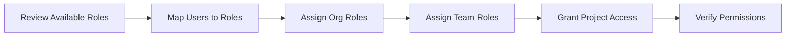

# Playbook: Configure Roles and Permissions

**Version:** 1.0.0
**Last Updated:** February 1, 2026
**Audience:** Admin | Owner

## Overview

This playbook guides administrators through configuring role-based access control (RBAC) in BlockSecOps. Learn how to assign roles, understand permission levels, and implement least-privilege access for your organization.

---

## Prerequisites

- [ ] Organization created with Enterprise tier
- [ ] Organization owner or admin role
- [ ] Understanding of team structure and access requirements
- [ ] List of users and their required access levels

---

## Workflow Diagram



---

## System Roles Reference

### Organization Roles

| Role | Key Permissions | Typical Users |
|------|-----------------|---------------|
| **Owner** | Full access, delete org, transfer ownership, billing | Founder, CTO |
| **Admin** | Manage members, teams, settings (cannot delete org) | Security lead, manager |
| **Developer** | Create/manage contracts, scans, vulnerabilities | Engineers, auditors |
| **Auditor** | Read-only access to all resources | Compliance, reviewers |
| **Guest** | Minimal read access to shared resources | External stakeholders |

### Permission Matrix

| Permission | Owner | Admin | Developer | Auditor | Guest |
|------------|:-----:|:-----:|:---------:|:-------:|:-----:|
| Delete organization | X | | | | |
| Transfer ownership | X | | | | |
| Manage billing | X | | | | |
| Manage members | X | X | | | |
| Manage teams | X | X | | | |
| Manage settings | X | X | | | |
| Create projects | X | X | X | | |
| Run scans | X | X | X | | |
| Update findings | X | X | X | | |
| View all resources | X | X | X | X | |
| View shared resources | X | X | X | X | X |

---

## Steps

### Step 1: Review Available Roles

**Dashboard:**
1. Navigate to **Organization > Settings > Roles**
2. Review the default system roles and their permissions

**API:**
```bash
# Get all roles for the organization
curl -X GET "https://app.0xapogee.com/api/v1/roles" \
  -H "Authorization: Bearer $ACCESS_TOKEN"
```

**Response:**
```json
{
  "roles": [
    {
      "id": "role_owner",
      "name": "owner",
      "description": "Full organization access",
      "permissions": ["org.*", "members.*", "roles.*", "contracts.*", "scans.*", "vulnerabilities.*", "billing.*"]
    },
    {
      "id": "role_admin",
      "name": "admin",
      "description": "Administrative access",
      "permissions": ["org.read", "org.update", "members.*", "teams.*", "contracts.*", "scans.*", "vulnerabilities.*"]
    },
    {
      "id": "role_developer",
      "name": "developer",
      "description": "Development team member",
      "permissions": ["org.read", "members.read", "contracts.*", "scans.*", "vulnerabilities.read", "vulnerabilities.update"]
    },
    {
      "id": "role_auditor",
      "name": "auditor",
      "description": "Read-only audit access",
      "permissions": ["org.read", "members.read", "contracts.read", "scans.read", "vulnerabilities.read"]
    },
    {
      "id": "role_guest",
      "name": "guest",
      "description": "Limited guest access",
      "permissions": ["org.read"]
    }
  ]
}
```

### Step 2: View Current Member Roles

**Dashboard:**
1. Navigate to **Organization > Members**
2. View the role column for each member

**API:**
```bash
# List all organization members with roles
curl -X GET "https://app.0xapogee.com/api/v1/organizations/current/users" \
  -H "Authorization: Bearer $ACCESS_TOKEN"
```

### Step 3: Assign Organization Role

**Dashboard:**
1. Navigate to **Organization > Members**
2. Click **...** menu next to the member
3. Select **Change Role**
4. Choose the new role
5. Click **Update Role**

**API:**
```bash
# Update member role (convenience endpoint)
curl -X PATCH "https://app.0xapogee.com/api/v1/organizations/current/users/{user_id}" \
  -H "Authorization: Bearer $ACCESS_TOKEN" \
  -H "Content-Type: application/json" \
  -d '{
    "role": "developer"
  }'

# Or using specific org ID
curl -X PUT "https://app.0xapogee.com/api/v1/organizations/{org_id}/members/{user_id}" \
  -H "Authorization: Bearer $ACCESS_TOKEN" \
  -H "Content-Type: application/json" \
  -d '{
    "role": "developer"
  }'
```

### Step 4: Bulk Role Assignment

**API:**
```bash
# Assign roles to multiple users
USERS=(
  '{"user_id": "user_001", "role": "developer"}'
  '{"user_id": "user_002", "role": "developer"}'
  '{"user_id": "user_003", "role": "auditor"}'
  '{"user_id": "user_004", "role": "admin"}'
)

for USER_DATA in "${USERS[@]}"; do
  USER_ID=$(echo $USER_DATA | jq -r '.user_id')
  ROLE=$(echo $USER_DATA | jq -r '.role')

  curl -X PUT "https://app.0xapogee.com/api/v1/organizations/{org_id}/members/$USER_ID" \
    -H "Authorization: Bearer $ACCESS_TOKEN" \
    -H "Content-Type: application/json" \
    -d "{\"role\": \"$ROLE\"}"
done
```

---

## Team Role Configuration

### Team Roles

| Role | Permissions |
|------|-------------|
| **Lead** | View team, assigned as team leader |
| **Member** | View team, participate in team activities |

### Assign Team Role

**Dashboard:**
1. Navigate to **Organization > Teams > [Team Name]**
2. Click **...** next to team member
3. Select **Change Role**
4. Choose Lead or Member

**API:**
```bash
curl -X PATCH "https://app.0xapogee.com/api/v1/teams/{team_id}/members/{user_id}" \
  -H "Authorization: Bearer $ACCESS_TOKEN" \
  -H "Content-Type: application/json" \
  -d '{
    "role": "lead"
  }'
```

---

## Project Access Configuration

### Project Access Levels

| Level | Description |
|-------|-------------|
| **Owner** | Full control, can grant access to others |
| **Write** | Create/edit contracts, run scans, update findings |
| **Read** | View-only access |

### Grant Project Access

**Dashboard:**
1. Navigate to **Projects > [Project Name] > Settings > Access**
2. Click **Add User** or **Add Team**
3. Select user/team and access level
4. Click **Grant Access**

**API:**
```bash
# Grant user access
curl -X POST "https://app.0xapogee.com/api/v1/projects/{project_id}/access" \
  -H "Authorization: Bearer $ACCESS_TOKEN" \
  -H "Content-Type: application/json" \
  -d '{
    "user_id": "user_abc123",
    "access_level": "write"
  }'

# Grant team access
curl -X POST "https://app.0xapogee.com/api/v1/projects/{project_id}/teams" \
  -H "Authorization: Bearer $ACCESS_TOKEN" \
  -H "Content-Type: application/json" \
  -d '{
    "team_id": "team_xyz789",
    "access_level": "read"
  }'
```

---

## Role Assignment Best Practices

### Principle of Least Privilege

| User Type | Recommended Role | Reasoning |
|-----------|------------------|-----------|
| Security Team Lead | Admin | Needs to manage team but not billing |
| Senior Auditor | Developer | Needs to run scans and update findings |
| Junior Auditor | Auditor | Read-only until trained |
| External Consultant | Guest | Limited access for specific projects |
| Compliance Officer | Auditor | Read-only for audit purposes |

### Role Progression


### Common Scenarios

**New Employee Onboarding:**
1. Start with Auditor role (read-only)
2. After training, upgrade to Developer
3. After proving expertise, consider Admin (if needed)

**External Consultant:**
1. Create as Guest
2. Grant project-level Read access to specific projects
3. Remove access when engagement ends

**Third-Party Auditor:**
1. Assign Auditor role (organization-wide read)
2. Or assign Guest + project-level Read access (limited scope)

---

## Verification

Confirm role configuration:

**Dashboard:**
1. Navigate to **Organization > Members**
2. Verify each member shows correct role
3. Test access by logging in as different users

**API:**
```bash
# Get specific member details
curl -X GET "https://app.0xapogee.com/api/v1/organizations/{org_id}/members/{user_id}" \
  -H "Authorization: Bearer $ACCESS_TOKEN"

# Verify permissions
curl -X GET "https://app.0xapogee.com/api/v1/users/{user_id}/permissions" \
  -H "Authorization: Bearer $ACCESS_TOKEN"
```

### Test Permission Enforcement

```bash
# As auditor, try to create scan (should fail)
curl -X POST "https://app.0xapogee.com/api/v1/scans" \
  -H "Authorization: Bearer $AUDITOR_TOKEN" \
  -H "Content-Type: application/json" \
  -d '{"project_id": "proj_123"}'
# Expected: 403 Forbidden

# As developer, try to manage members (should fail)
curl -X POST "https://app.0xapogee.com/api/v1/organizations/{org_id}/members" \
  -H "Authorization: Bearer $DEVELOPER_TOKEN" \
  -H "Content-Type: application/json" \
  -d '{"user_id": "user_new", "role": "developer"}'
# Expected: 403 Forbidden
```

---

## Troubleshooting

| Issue | Cause | Solution |
|-------|-------|----------|
| "Permission denied" | Wrong role assigned | Update user's role |
| Cannot change own role | Only owner can demote/promote | Contact organization owner |
| Role change not taking effect | Cached session | User should log out and back in |
| Can't assign Owner role | Only one owner allowed | Transfer ownership instead |
| Guest can't see projects | No project access granted | Grant project-level access |

---

## Checklist

- [ ] Available roles reviewed and understood
- [ ] Current member roles audited
- [ ] Role assignments match job responsibilities
- [ ] Principle of least privilege applied
- [ ] Team roles configured
- [ ] Project access granted appropriately
- [ ] Permission enforcement tested
- [ ] Role assignment documented

---

## Related Playbooks

- [Create Organization](./create-organization.md) - Organization setup
- [Create and Manage Teams](./create-team.md) - Team management
- [Invite Team Members](./invite-team-members.md) - Member invitations
- [Organization, Team, and Project Setup](./organization-team-setup.md) - Complete setup guide
