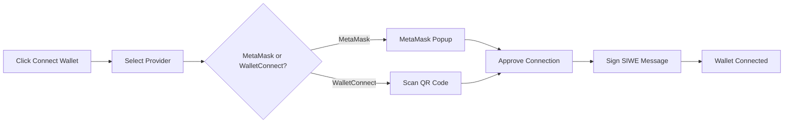

# Playbook: Connect Wallet

**Version:** 1.0.0
**Last Updated:** February 1, 2026
**Audience:** End User

## Overview

This playbook guides users through connecting a cryptocurrency wallet (MetaMask or WalletConnect) to Apogee for x402 payment authentication using Sign-In with Ethereum (SIWE).

---

## Prerequisites

- [ ] MetaMask browser extension installed, OR
- [ ] WalletConnect-compatible mobile wallet (Trust Wallet, Rainbow, etc.)
- [ ] Ethereum wallet with at least one account
- [ ] Modern browser (Chrome, Firefox, Brave, Edge)

---

## Workflow Diagram



---

## Steps

### Step 1: Navigate to Login Page

**Dashboard:**
1. Go to `https://app.0xapogee.com`
2. Click **Connect Wallet** button on the login page

### Step 2: Select Wallet Provider

**Dashboard:**
1. Choose your wallet provider:
   - **MetaMask** - Browser extension wallet
   - **WalletConnect** - Mobile wallet via QR code

### Step 3: Connect MetaMask

**If using MetaMask:**

1. MetaMask extension popup appears
2. Select the account(s) you want to connect
3. Click **Next**
4. Review the connection permissions
5. Click **Connect**

### Step 4: Connect via WalletConnect

**If using WalletConnect:**

1. QR code appears on screen
2. Open your mobile wallet app
3. Navigate to WalletConnect/Scan feature
4. Scan the QR code
5. Approve the connection request in your mobile wallet

### Step 5: Sign Authentication Message (SIWE)

After wallet connection, you'll be prompted to sign a message:

**Dashboard:**
1. A signing request appears in your wallet
2. Review the SIWE message containing:
   - Domain: `app.0xapogee.com`
   - Statement: "Sign in with Ethereum to Apogee"
   - Nonce: Unique session identifier
   - Expiration: Message validity period
3. Click **Sign** in your wallet

**API (Manual Authentication):**

```bash
# Step 1: Request nonce
NONCE_RESPONSE=$(curl -X POST "https://app.0xapogee.com/api/v1/auth/wallet/nonce" \
  -H "Content-Type: application/json" \
  -d '{
    "address": "0xYourWalletAddress"
  }')

NONCE=$(echo $NONCE_RESPONSE | jq -r '.nonce')

# Step 2: Sign the message with your wallet (done off-chain)
# The message format follows EIP-4361 (SIWE)

# Step 3: Verify signature
curl -X POST "https://app.0xapogee.com/api/v1/auth/wallet/verify" \
  -H "Content-Type: application/json" \
  -d '{
    "address": "0xYourWalletAddress",
    "signature": "0xSignedMessage...",
    "message": "app.0xapogee.com wants you to sign in with your Ethereum account..."
  }'
```

### Step 6: Authentication Complete

**Dashboard:**
1. You are redirected to the dashboard
2. Your wallet address appears in the header
3. x402 payment features are now available

---

## Verification

Confirm successful wallet connection:

**Dashboard:**
1. Check the header shows your wallet address (truncated: `0x1234...5678`)
2. Navigate to **Settings > Wallet** to see full address
3. x402 payment options are visible for premium features

**API:**
```bash
# Verify wallet is linked to account
curl -X GET "https://app.0xapogee.com/api/v1/users/me/wallets" \
  -H "Authorization: Bearer $ACCESS_TOKEN"
```

Expected response:
```json
{
  "wallets": [
    {
      "address": "0x1234567890abcdef...",
      "chain": "ethereum",
      "linked_at": "2026-02-01T10:00:00Z",
      "is_primary": true
    }
  ]
}
```

---

## Troubleshooting

| Issue | Cause | Solution |
|-------|-------|----------|
| MetaMask popup not appearing | Popup blocked or extension disabled | Enable MetaMask extension, allow popups for site |
| "User rejected request" | Cancelled connection in wallet | Retry and click Connect/Sign when prompted |
| WalletConnect QR not scanning | Camera permissions denied | Allow camera access in browser settings |
| "Signature verification failed" | Nonce expired or message modified | Refresh page and try again |
| "Wallet already linked to another account" | Address used by different user | Use a different wallet address or contact support |
| "Network mismatch" | Wallet on wrong network | Switch to Ethereum Mainnet in wallet settings |

---

## Checklist

- [ ] Wallet provider selected (MetaMask or WalletConnect)
- [ ] Wallet connected successfully
- [ ] SIWE message signed
- [ ] Redirected to dashboard
- [ ] Wallet address visible in header
- [ ] Wallet appears in Settings > Wallet

---

## Related Playbooks

- [Link Wallet to Account](./link-wallet-to-account.md) - Add wallet to existing email account
- [API Key Management](./api-key-management.md) - Create API keys after wallet auth
