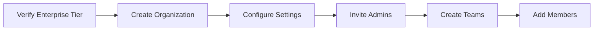

# Playbook: Create Organization

**Version:** 1.1.0
**Last Updated:** February 8, 2026
**Audience:** Admin | Enterprise User

## Overview

This playbook guides enterprise users through creating an organization in BlockSecOps. Organizations provide centralized team management, shared projects, role-based access control, and consolidated billing.

---

## Prerequisites

- [ ] Active BlockSecOps account with verified email
- [ ] Enterprise tier subscription (required for organizations)
- [ ] No existing organization owned by this account (one organization per owner)
- [ ] Organization name and purpose defined
- [ ] Initial team structure planned

> **Important:** Each user can own only one organization. This is enforced by the API (returns 400 if you already own an organization). Use teams within your organization to subdivide work. If you need to manage multiple organizations, use separate accounts or transfer ownership.

---

## Workflow Diagram



---

## Steps

### Step 1: Verify Enterprise Tier

**Dashboard:**
1. Navigate to **Settings > Subscription**
2. Confirm subscription shows **Enterprise** tier
3. If on a different tier, click **Upgrade** and select Enterprise

**API:**
```bash
# Check current tier
curl -X GET "https://app.0xapogee.com/api/v1/users/me" \
  -H "Authorization: Bearer $ACCESS_TOKEN" | jq '.subscription.tier'
```

Expected: `"enterprise"`

### Step 2: Create Organization

**Dashboard:**
1. Click your profile icon in the top-right corner
2. Select **Create Organization**
3. Enter organization details:
   - **Name:** Your company or team name (e.g., "Acme Security")
   - **Description:** Brief description of the organization's purpose
   - **Website:** Company website (optional)
   - **Industry:** Select industry type (optional)
4. Click **Create Organization**

**API:**
```bash
curl -X POST "https://app.0xapogee.com/api/v1/organizations" \
  -H "Authorization: Bearer $ACCESS_TOKEN" \
  -H "Content-Type: application/json" \
  -d '{
    "name": "Acme Security",
    "description": "Smart contract security team for Acme Corporation",
    "website": "https://acme.com",
    "industry": "defi"
  }'
```

**Response:**
```json
{
  "id": "org_abc123",
  "name": "Acme Security",
  "description": "Smart contract security team for Acme Corporation",
  "owner_id": "user_xyz789",
  "created_at": "2026-02-01T10:00:00Z",
  "settings": {
    "allow_member_invites": false,
    "default_project_visibility": "team",
    "require_2fa": false
  }
}
```

### Step 3: Configure Organization Settings

**Dashboard:**
1. Navigate to **Organization Settings** (gear icon next to org name)
2. Configure security settings:
   - **Require 2FA:** Enable for all members
   - **Allow member invites:** Control who can invite new members
   - **Default project visibility:** Team, Organization, or Private
   - **Audit logging:** Enable detailed activity logs
3. Configure notification preferences:
   - **New member notifications:** Email to admins
   - **Security alerts:** Critical vulnerability notifications
4. Click **Save Settings**

**API:**
```bash
curl -X PATCH "https://app.0xapogee.com/api/v1/organizations/{org_id}/settings" \
  -H "Authorization: Bearer $ACCESS_TOKEN" \
  -H "Content-Type: application/json" \
  -d '{
    "require_2fa": true,
    "allow_member_invites": false,
    "default_project_visibility": "team",
    "audit_logging": true,
    "notifications": {
      "new_member": true,
      "security_alerts": true
    }
  }'
```

### Step 4: Configure SSO (Optional - Enterprise Feature)

For organizations using Single Sign-On:

**Dashboard:**
1. Navigate to **Organization Settings > Authentication**
2. Click **Configure SSO**
3. Select provider:
   - **SAML 2.0** (Okta, OneLogin, Azure AD)
   - **OIDC** (Google, Auth0, custom)
4. Enter provider configuration:
   - Entity ID / Issuer URL
   - SSO URL
   - Certificate / Public Key
5. Click **Test Configuration**
6. Click **Enable SSO**

**API:**
```bash
curl -X POST "https://app.0xapogee.com/api/v1/organizations/{org_id}/sso" \
  -H "Authorization: Bearer $ACCESS_TOKEN" \
  -H "Content-Type: application/json" \
  -d '{
    "provider": "saml",
    "config": {
      "entity_id": "https://idp.acme.com/saml",
      "sso_url": "https://idp.acme.com/saml/sso",
      "certificate": "-----BEGIN CERTIFICATE-----\n...\n-----END CERTIFICATE-----"
    },
    "enforce": false
  }'
```

### Step 5: Invite Initial Admins

**Dashboard:**
1. Navigate to **Organization > Members**
2. Click **Invite Member**
3. Enter email address
4. Select role: **Admin**
5. Click **Send Invite**

**API:**
```bash
# If user exists in system
curl -X POST "https://app.0xapogee.com/api/v1/organizations/{org_id}/members" \
  -H "Authorization: Bearer $ACCESS_TOKEN" \
  -H "Content-Type: application/json" \
  -d '{
    "user_id": "user_admin123",
    "role": "admin"
  }'

# If inviting new user
curl -X POST "https://app.0xapogee.com/api/v1/organizations/{org_id}/invites" \
  -H "Authorization: Bearer $ACCESS_TOKEN" \
  -H "Content-Type: application/json" \
  -d '{
    "email": "admin@acme.com",
    "role": "admin",
    "message": "You are invited to join Acme Security on BlockSecOps."
  }'
```

---

## Organization Roles

| Role | Description | Key Permissions |
|------|-------------|-----------------|
| **Owner** | Organization creator | Full access, can delete org, transfer ownership |
| **Admin** | Organization administrator | Manage members, teams, settings (cannot delete org) |
| **Developer** | Development team member | Create/manage projects, scans, vulnerabilities |
| **Auditor** | Security auditor | Read-only access to all resources |
| **Guest** | Limited access | View-only for specific shared resources |

---

## Verification

Confirm organization is set up correctly:

**Dashboard:**
1. Click your profile icon - organization name should appear
2. Navigate to **Organization > Overview**
3. Verify settings are configured
4. Check invited admins show as "Pending" or "Active"

**API:**
```bash
# Get organization details
curl -X GET "https://app.0xapogee.com/api/v1/organizations/{org_id}" \
  -H "Authorization: Bearer $ACCESS_TOKEN"

# List organization members
curl -X GET "https://app.0xapogee.com/api/v1/organizations/{org_id}/members" \
  -H "Authorization: Bearer $ACCESS_TOKEN"

# Check available roles
curl -X GET "https://app.0xapogee.com/api/v1/roles" \
  -H "Authorization: Bearer $ACCESS_TOKEN"
```

---

## Troubleshooting

| Issue | Cause | Solution |
|-------|-------|----------|
| "Organizations not available" | Not on Enterprise tier | Upgrade subscription to Enterprise |
| "You already own an organization" | One org per owner limit | Use teams within your existing org, or transfer ownership first |
| "Organization name already exists" | Name taken by another org | Choose a different unique name |
| "Cannot invite member" | User already in different org | User must leave current org first |
| Invite email not received | Email delivery issue | Check spam folder, resend invite |
| "Permission denied" for settings | Not owner or admin | Contact organization owner |
| SSO configuration failed | Invalid certificate/URL | Verify provider configuration details |

---

## Checklist

- [ ] Enterprise tier subscription confirmed
- [ ] Organization created successfully
- [ ] Organization name and description set
- [ ] Security settings configured (2FA, audit logging)
- [ ] Notification preferences set
- [ ] SSO configured (if applicable)
- [ ] Initial admins invited
- [ ] Admin invites accepted
- [ ] Organization visible in profile dropdown

---

## Next Steps

After creating your organization:

1. **Create Teams** - Organize members into functional teams
2. **Configure Roles** - Set up role-based permissions
3. **Create Projects** - Set up scanning projects
4. **Invite Members** - Add remaining team members
5. **Configure Integrations** - Set up Slack, CI/CD, etc.

---

## Related Playbooks

- [Create and Manage Teams](./create-team.md) - Team creation and management
- [Configure Roles and Permissions](./configure-roles.md) - RBAC setup
- [Invite Team Members](./invite-team-members.md) - Member invitation workflow
- [Slack Integration](./chatops-slack.md) - Organization notifications
