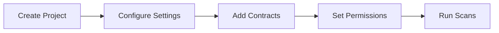

# Playbook: Create Project

**Version:** 1.0.0
**Last Updated:** February 1, 2026
**Audience:** End User | Developer

## Overview

This playbook guides you through creating a project in Apogee. Projects organize your smart contracts, scans, and findings into logical groups for better management and collaboration.

---

## Prerequisites

- [ ] Active Apogee account
- [ ] Understanding of project structure (which contracts belong together)
- [ ] Optional: Team or organization membership

---

## Workflow Diagram



---

## Steps

### Step 1: Navigate to Projects

**Dashboard:**
1. Log in to Apogee
2. Click **Projects** in the left sidebar
3. Or navigate to `https://app.0xapogee.com/projects`

### Step 2: Create New Project

**Dashboard:**
1. Click **New Project** button
2. Enter project details:
   - **Name:** Descriptive project name (e.g., "Uniswap V4 Audit")
   - **Description:** Brief description of the project
   - **Blockchain:** Select target blockchain
   - **Visibility:** Private, Team, or Organization
3. Click **Create Project**

**API:**
```bash
curl -X POST "https://app.0xapogee.com/api/v1/projects" \
  -H "Authorization: Bearer $ACCESS_TOKEN" \
  -H "Content-Type: application/json" \
  -d '{
    "name": "Uniswap V4 Audit",
    "description": "Security audit for Uniswap V4 core contracts",
    "blockchain": "ethereum",
    "visibility": "team"
  }'
```

**Response:**
```json
{
  "id": "proj_abc123",
  "name": "Uniswap V4 Audit",
  "description": "Security audit for Uniswap V4 core contracts",
  "blockchain": "ethereum",
  "visibility": "team",
  "user_id": "user_xyz789",
  "created_at": "2026-02-01T10:00:00Z",
  "contract_count": 0,
  "scan_count": 0
}
```

### Step 3: Configure Project Settings

**Dashboard:**
1. In the project view, click **Settings** (gear icon)
2. Configure options:
   - **Default Scanners:** Scanners to use for all scans
   - **Solidity Version:** Default compiler version
   - **Optimizer Settings:** Enable/disable, runs count
   - **Scan Triggers:** Auto-scan on contract upload
3. Click **Save Settings**

**API:**
```bash
curl -X PATCH "https://app.0xapogee.com/api/v1/projects/{project_id}/settings" \
  -H "Authorization: Bearer $ACCESS_TOKEN" \
  -H "Content-Type: application/json" \
  -d '{
    "default_scanners": ["soliditydefend", "slither"],
    "solc_version": "0.8.19",
    "optimizer": {
      "enabled": true,
      "runs": 200
    },
    "auto_scan": true
  }'
```

### Step 4: Add Contracts to Project

**Dashboard:**
1. In the project, click **Add Contracts**
2. Choose upload method:
   - **File Upload:** Drag and drop `.sol` files
   - **Paste Code:** Copy and paste source code
   - **GitHub Import:** Import from repository
3. Wait for upload and parsing to complete

**API:**
```bash
# File upload
curl -X POST "https://app.0xapogee.com/api/v1/contracts" \
  -H "Authorization: Bearer $ACCESS_TOKEN" \
  -H "Content-Type: multipart/form-data" \
  -F "project_id=proj_abc123" \
  -F "file=@contracts/Token.sol"

# Source code upload
curl -X POST "https://app.0xapogee.com/api/v1/contracts" \
  -H "Authorization: Bearer $ACCESS_TOKEN" \
  -H "Content-Type: application/json" \
  -d '{
    "project_id": "proj_abc123",
    "name": "Token.sol",
    "source_code": "// SPDX-License-Identifier: MIT\npragma solidity ^0.8.0;\n\ncontract Token { ... }"
  }'
```

### Step 5: Connect GitHub Repository (Optional)

**Dashboard:**
1. In project settings, click **Integrations**
2. Click **Connect GitHub**
3. Authorize Apogee GitHub App
4. Select repository and branch
5. Configure sync options:
   - **Auto-sync:** Automatically import on push
   - **Contract Path:** Path to Solidity files
   - **Exclude Paths:** Patterns to ignore

**API:**
```bash
curl -X POST "https://app.0xapogee.com/api/v1/projects/{project_id}/github" \
  -H "Authorization: Bearer $ACCESS_TOKEN" \
  -H "Content-Type: application/json" \
  -d '{
    "repository": "owner/repo-name",
    "branch": "main",
    "contract_path": "contracts/",
    "exclude_paths": ["contracts/mocks/**", "contracts/test/**"],
    "auto_sync": true
  }'
```

---

## Project Visibility Options

| Visibility | Who Can Access |
|------------|----------------|
| **Private** | Only project owner |
| **Team** | Members of assigned teams |
| **Organization** | All organization members |
| **Public** | Anyone (read-only) |

---

## Managing Project Access

### Grant User Access

**Dashboard:**
1. In project, click **Settings > Access**
2. Click **Add User**
3. Search for user by email
4. Select access level:
   - **Owner:** Full control
   - **Write:** Create/edit/scan
   - **Read:** View only
5. Click **Grant Access**

**API:**
```bash
curl -X POST "https://app.0xapogee.com/api/v1/projects/{project_id}/access" \
  -H "Authorization: Bearer $ACCESS_TOKEN" \
  -H "Content-Type: application/json" \
  -d '{
    "user_id": "user_def456",
    "access_level": "write"
  }'
```

### Grant Team Access

**Dashboard:**
1. In project, click **Settings > Access**
2. Click **Add Team**
3. Select team from list
4. Select access level
5. Click **Grant Access**

**API:**
```bash
curl -X POST "https://app.0xapogee.com/api/v1/projects/{project_id}/teams" \
  -H "Authorization: Bearer $ACCESS_TOKEN" \
  -H "Content-Type: application/json" \
  -d '{
    "team_id": "team_xyz789",
    "access_level": "write"
  }'
```

---

## Project Templates

### DeFi Protocol Audit

```bash
curl -X POST "https://app.0xapogee.com/api/v1/projects" \
  -H "Authorization: Bearer $ACCESS_TOKEN" \
  -H "Content-Type: application/json" \
  -d '{
    "name": "DeFi Protocol Audit",
    "description": "Comprehensive security audit for DeFi protocol",
    "blockchain": "ethereum",
    "settings": {
      "default_scanners": ["soliditydefend", "slither", "mythril"],
      "solc_version": "0.8.19"
    },
    "tags": ["defi", "audit", "q1-2026"]
  }'
```

### NFT Collection

```bash
curl -X POST "https://app.0xapogee.com/api/v1/projects" \
  -H "Authorization: Bearer $ACCESS_TOKEN" \
  -H "Content-Type: application/json" \
  -d '{
    "name": "NFT Collection",
    "description": "ERC-721 NFT collection contracts",
    "blockchain": "ethereum",
    "settings": {
      "default_scanners": ["soliditydefend"],
      "solc_version": "0.8.17"
    },
    "tags": ["nft", "erc721"]
  }'
```

### Cross-Chain Bridge

```bash
curl -X POST "https://app.0xapogee.com/api/v1/projects" \
  -H "Authorization: Bearer $ACCESS_TOKEN" \
  -H "Content-Type: application/json" \
  -d '{
    "name": "Cross-Chain Bridge",
    "description": "Bridge contracts for multi-chain deployment",
    "blockchain": "multi",
    "settings": {
      "default_scanners": ["soliditydefend", "slither", "mythril", "aderyn"],
      "extra_analysis": ["cross-chain-risks"]
    },
    "tags": ["bridge", "multi-chain", "high-risk"]
  }'
```

---

## Verification

Confirm project is set up correctly:

**Dashboard:**
1. Navigate to **Projects**
2. Click on your new project
3. Verify settings are configured
4. Check contracts are uploaded
5. Confirm access permissions are set

**API:**
```bash
# Get project details
curl -X GET "https://app.0xapogee.com/api/v1/projects/{project_id}" \
  -H "Authorization: Bearer $ACCESS_TOKEN"

# List project contracts
curl -X GET "https://app.0xapogee.com/api/v1/projects/{project_id}/contracts" \
  -H "Authorization: Bearer $ACCESS_TOKEN"

# List project access
curl -X GET "https://app.0xapogee.com/api/v1/projects/{project_id}/access" \
  -H "Authorization: Bearer $ACCESS_TOKEN"
```

---

## Troubleshooting

| Issue | Cause | Solution |
|-------|-------|----------|
| "Project name exists" | Duplicate name in your account | Choose a unique name |
| Can't add contracts | Not project owner | Request write access |
| GitHub sync failing | Authorization expired | Re-authorize GitHub app |
| Wrong Solidity version | Auto-detect failed | Manually set version in settings |
| Team can't access | Team access not granted | Grant team access in settings |
| Contract upload fails | File too large or invalid | Check file size and format |

---

## Checklist

- [ ] Project created with name and description
- [ ] Blockchain type selected
- [ ] Visibility configured appropriately
- [ ] Default scanners set
- [ ] Solidity version configured
- [ ] Contracts uploaded
- [ ] GitHub connected (optional)
- [ ] User/team access granted
- [ ] Settings verified

---

## Related Playbooks

- [Run First Scan](./run-first-scan.md) - Scan your contracts
- [Batch Scanning](./batch-scanning.md) - Scan multiple contracts
- [Create and Manage Teams](./create-team.md) - Team management
- [GitHub Actions Integration](./cicd-github-actions.md) - CI/CD setup
