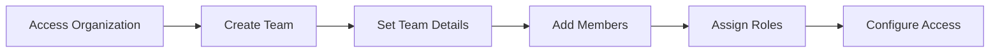

# Playbook: Create and Manage Teams

**Version:** 1.0.0
**Last Updated:** February 1, 2026
**Audience:** Admin | Team Lead

## Overview

This playbook covers creating teams within your organization, adding members to teams, assigning team roles, and managing team-level permissions. Teams provide logical groupings for project collaboration and notification routing.

---

## Prerequisites

- [ ] Organization created with Enterprise tier
- [ ] Organization owner or admin role
- [ ] Team structure and purpose defined
- [ ] Members already added to organization (or ready to invite)

---

## Workflow Diagram



---

## Steps

### Step 1: Navigate to Team Management

**Dashboard:**
1. Click your organization name in the top navigation
2. Select **Teams** from the dropdown
3. Or navigate directly to **Organization > Teams**

### Step 2: Create New Team

**Dashboard:**
1. Click **Create Team** button
2. Enter team details:
   - **Name:** Descriptive team name (e.g., "DeFi Audit Team")
   - **Description:** Team purpose and responsibilities
   - **Visibility:** Organization-wide or private
3. Click **Create Team**

**API:**
```bash
curl -X POST "https://app.blocksecops.com/api/v1/organizations/{org_id}/teams" \
  -H "Authorization: Bearer $ACCESS_TOKEN" \
  -H "Content-Type: application/json" \
  -d '{
    "name": "DeFi Audit Team",
    "description": "Team responsible for DeFi protocol security audits",
    "visibility": "organization"
  }'
```

**Response:**
```json
{
  "id": "team_abc123",
  "name": "DeFi Audit Team",
  "description": "Team responsible for DeFi protocol security audits",
  "organization_id": "org_xyz789",
  "visibility": "organization",
  "member_count": 0,
  "created_at": "2026-02-01T10:00:00Z"
}
```

### Step 3: Add Members to Team

**Dashboard:**
1. Click on the team name to open team details
2. Click **Add Members**
3. Search for organization members by name or email
4. Select member(s) to add
5. Choose team role:
   - **Lead** - Team leadership role
   - **Member** - Standard team member
6. Click **Add to Team**

**API:**
```bash
curl -X POST "https://app.blocksecops.com/api/v1/teams/{team_id}/members" \
  -H "Authorization: Bearer $ACCESS_TOKEN" \
  -H "Content-Type: application/json" \
  -d '{
    "user_id": "user_def456",
    "role": "member"
  }'
```

**Add Multiple Members:**
```bash
# Add team lead
curl -X POST "https://app.blocksecops.com/api/v1/teams/{team_id}/members" \
  -H "Authorization: Bearer $ACCESS_TOKEN" \
  -H "Content-Type: application/json" \
  -d '{"user_id": "user_lead123", "role": "lead"}'

# Add team members
for USER_ID in user_001 user_002 user_003; do
  curl -X POST "https://app.blocksecops.com/api/v1/teams/{team_id}/members" \
    -H "Authorization: Bearer $ACCESS_TOKEN" \
    -H "Content-Type: application/json" \
    -d "{\"user_id\": \"$USER_ID\", \"role\": \"member\"}"
done
```

### Step 4: Configure Team Notifications

**Dashboard:**
1. In team settings, click **Notifications**
2. Configure notification channels:
   - **Slack channel:** Select linked Slack channel
   - **Email list:** Team email distribution list
   - **Teams channel:** Microsoft Teams channel
3. Select notification triggers:
   - Scan completed
   - Critical vulnerability found
   - Weekly summary
4. Click **Save**

**API:**
```bash
curl -X PATCH "https://app.blocksecops.com/api/v1/teams/{team_id}/settings" \
  -H "Authorization: Bearer $ACCESS_TOKEN" \
  -H "Content-Type: application/json" \
  -d '{
    "notifications": {
      "channels": ["slack_channel_abc123"],
      "triggers": ["scan_completed", "vulnerability_critical", "weekly_summary"]
    }
  }'
```

### Step 5: Grant Team Access to Projects

**Dashboard:**
1. Navigate to the project you want to share
2. Click **Settings > Access**
3. Click **Add Team**
4. Select the team
5. Choose access level:
   - **Read** - View-only access
   - **Write** - Can run scans, update findings
   - **Admin** - Full project control
6. Click **Grant Access**

**API:**
```bash
curl -X POST "https://app.blocksecops.com/api/v1/projects/{project_id}/teams" \
  -H "Authorization: Bearer $ACCESS_TOKEN" \
  -H "Content-Type: application/json" \
  -d '{
    "team_id": "team_abc123",
    "access_level": "write"
  }'
```

---

## Managing Team Members

### Update Member Role

**Dashboard:**
1. Go to team details
2. Click **...** menu next to member name
3. Select **Change Role**
4. Choose new role
5. Click **Update**

**API:**
```bash
curl -X PATCH "https://app.blocksecops.com/api/v1/teams/{team_id}/members/{user_id}" \
  -H "Authorization: Bearer $ACCESS_TOKEN" \
  -H "Content-Type: application/json" \
  -d '{
    "role": "lead"
  }'
```

### Remove Member from Team

**Dashboard:**
1. Go to team details
2. Click **...** menu next to member name
3. Select **Remove from Team**
4. Confirm removal

**API:**
```bash
curl -X DELETE "https://app.blocksecops.com/api/v1/teams/{team_id}/members/{user_id}" \
  -H "Authorization: Bearer $ACCESS_TOKEN"
```

### Transfer Team Ownership

**Dashboard:**
1. Go to **Team Settings**
2. Click **Transfer Ownership**
3. Select new owner (must be current team lead)
4. Confirm transfer

---

## Team Roles

| Role | Description | Permissions |
|------|-------------|-------------|
| **Lead** | Team leader | View team, manage team members*, access team projects |
| **Member** | Standard member | View team, access team projects |

*Note: Team leads currently require organization Admin role to manage team membership. See [Known Issues](#known-issues).

---

## Team Templates

### Security Audit Team

```bash
curl -X POST "https://app.blocksecops.com/api/v1/organizations/{org_id}/teams" \
  -H "Authorization: Bearer $ACCESS_TOKEN" \
  -H "Content-Type: application/json" \
  -d '{
    "name": "Security Audit Team",
    "description": "Conducts comprehensive smart contract security audits",
    "visibility": "organization"
  }'
```

### Development Security Team

```bash
curl -X POST "https://app.blocksecops.com/api/v1/organizations/{org_id}/teams" \
  -H "Authorization: Bearer $ACCESS_TOKEN" \
  -H "Content-Type: application/json" \
  -d '{
    "name": "Dev Security",
    "description": "Integrates security into development workflow",
    "visibility": "organization"
  }'
```

### External Auditors Team

```bash
curl -X POST "https://app.blocksecops.com/api/v1/organizations/{org_id}/teams" \
  -H "Authorization: Bearer $ACCESS_TOKEN" \
  -H "Content-Type: application/json" \
  -d '{
    "name": "External Auditors",
    "description": "Third-party security auditors with limited access",
    "visibility": "private"
  }'
```

---

## Verification

Confirm team setup is complete:

**Dashboard:**
1. Navigate to **Organization > Teams**
2. Click on the team name
3. Verify all members are listed with correct roles
4. Check project access is configured

**API:**
```bash
# List all teams
curl -X GET "https://app.blocksecops.com/api/v1/organizations/{org_id}/teams" \
  -H "Authorization: Bearer $ACCESS_TOKEN"

# Get team members
curl -X GET "https://app.blocksecops.com/api/v1/teams/{team_id}/members" \
  -H "Authorization: Bearer $ACCESS_TOKEN"

# Get team project access
curl -X GET "https://app.blocksecops.com/api/v1/teams/{team_id}/projects" \
  -H "Authorization: Bearer $ACCESS_TOKEN"
```

---

## Troubleshooting

| Issue | Cause | Solution |
|-------|-------|----------|
| "Cannot create team" | Not organization owner/admin | Request admin role from org owner |
| "User not found" | User not in organization | Add user to org first, then team |
| "Team already exists" | Duplicate team name | Choose a different team name |
| Team lead can't add members | Team leads lack management permissions | Use org Admin to manage, or grant Admin role |
| Project access not working | Team access not granted | Grant team access to specific project |
| Members not receiving notifications | Notification channel not configured | Configure team notification settings |

---

## Known Issues

### Team Leads Cannot Manage Their Teams

**Status:** Open

Team leads (`role: "lead"`) currently cannot add or remove team members. All team management must be performed by organization Owners or Admins.

**Workaround:** Grant team leads the organization Admin role, or have an Admin handle team management.

---

## Checklist

- [ ] Organization access confirmed
- [ ] Team created with name and description
- [ ] Team visibility set appropriately
- [ ] Team members added
- [ ] Team roles assigned (lead, members)
- [ ] Team notifications configured
- [ ] Project access granted to team
- [ ] Team members verified correct access

---

## Related Playbooks

- [Create Organization](./create-organization.md) - Organization setup
- [Configure Roles and Permissions](./configure-roles.md) - RBAC configuration
- [Invite Team Members](./invite-team-members.md) - Invite external users
- [Create Project](./create-project.md) - Project setup
