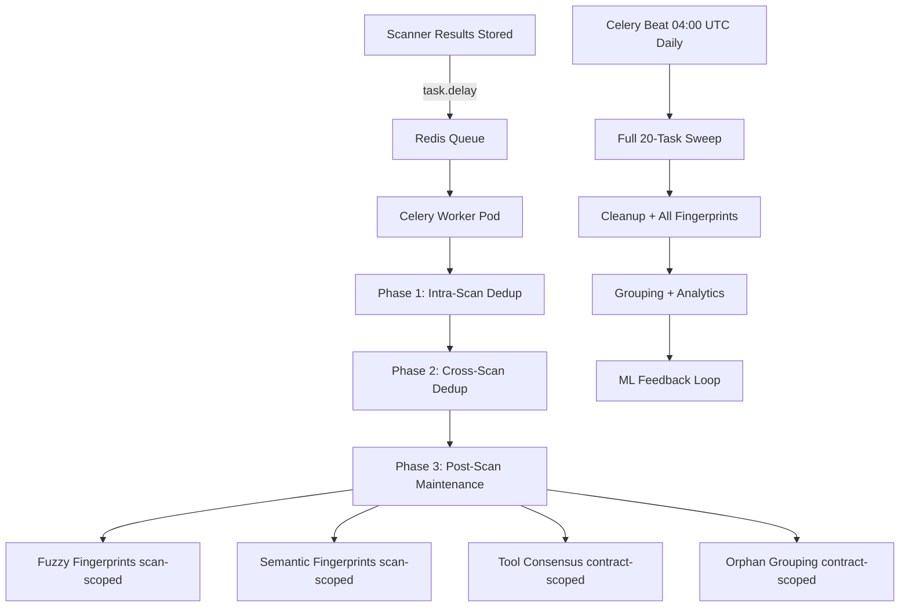

# Playbook: Deduplication Maintenance

**Version:** 3.0.0
**Last Updated:** March 19, 2026
**Audience:** Platform Operator | Developer

## Overview

Monitor and troubleshoot the hybrid deduplication maintenance system. Deduplication runs via three paths:

1. **Celery worker dedup** — All 3 dedup phases dispatched to isolated worker pod via Redis (v0.29.13+)
2. **Post-scan maintenance** — 5 scoped tasks run in the Celery worker after dedup phases (includes fingerprint backfill)
3. **Daily Celery Beat** — Full 20-task sweep runs at 04:00 UTC daily via `dedup.daily_maintenance` (replaced weekly K8s CronJob in v0.35.0)

**Manual re-trigger**: `POST /api/v1/internal/dedup/maintenance` (requires `X-Internal-Service-Key`)

---

## Prerequisites

- [ ] `kubectl` access to `api-service-local` namespace
- [ ] API service running (v0.29.19+)
- [ ] Celery worker pod running (`celery-worker` deployment)
- [ ] Redis running (broker for Celery tasks)

---

## Workflow Diagram



---

## Monitoring the Celery Worker

### Verify worker is running

```bash
# Check worker pod status
kubectl get pods -n api-service-local -l app.kubernetes.io/name=celery-worker

# Check worker logs for recent task processing
kubectl logs -n api-service-local -l app.kubernetes.io/name=celery-worker --tail=50

# Verify worker image matches API service
kubectl get deployment -n api-service-local celery-worker \
  -o jsonpath='{.spec.template.spec.containers[0].image}'
```

### Verify dedup runs after a scan

After uploading a contract and receiving scan results, check **worker** logs (not API logs):

```bash
# Check worker processed the dedup task
kubectl logs -n api-service-local -l app.kubernetes.io/name=celery-worker --tail=100 | \
  grep -i "celery-dedup\|Intra-scan\|Cross-scan\|Maintenance"
```

Then verify DB state:

```sql
-- Check that new vulnerabilities have fingerprints and groups
SELECT title, severity,
       fingerprint_location_fuzzy IS NOT NULL as has_fuzzy,
       fingerprint_semantic IS NOT NULL as has_semantic,
       tool_consensus_score,
       deduplication_group_id IS NOT NULL as has_group,
       is_primary
FROM vulnerabilities
WHERE scan_id = '<scan-uuid>'
ORDER BY severity;
```

**Expected:** All rows should have `has_fuzzy = true` and `has_semantic = true`.

### Check API pod dispatched the task

```bash
kubectl logs -n api-service-local deploy/api-service --tail=100 | \
  grep -i "Dedup task dispatched"
```

---

## Monitoring the Daily Celery Beat Task

The daily 20-task maintenance sweep runs at 04:00 UTC via `dedup.daily_maintenance` Celery Beat task in the orchestration service. This replaced the weekly K8s CronJob in v0.35.0.

### Verify Beat is scheduling

```bash
# Check orchestration pod logs for Beat scheduling
kubectl logs -n orchestration-prod deploy/orchestration --tail=50 | \
  grep -i "daily-dedup-maintenance\|dedup.daily_maintenance"
```

### Manual trigger

```bash
# Via internal service endpoint
curl -X POST https://app.0xapogee.com/api/v1/internal/dedup/maintenance \
  -H "X-Internal-Service-Key: $SERVICE_KEY"
```

---

## Liveness Probe Configuration (v0.29.27+)

The celery worker liveness probe uses `celery inspect ping`, which spawns a subprocess with 4-5s Python/Celery import overhead. Probe settings must account for this:

| Setting | Value | Rationale |
|---------|-------|-----------|
| `--timeout=10` | Celery subprocess timeout | 4-5s import + 2-3s ping + headroom |
| `timeoutSeconds: 15` | Kubernetes probe timeout | Must exceed celery --timeout |
| `periodSeconds: 120` | Probe frequency | Dedup tasks are long-running; 2 min sufficient |
| `failureThreshold: 3` | Failures before kill | 3 failures = 6 min tolerance |
| CPU request: 250m | Baseline CPU | 3 prefork workers + probe subprocess |

### Check for probe failures

```bash
# Recent probe events
kubectl get events -n api-service-local --field-selector type=Warning \
  --sort-by='.lastTimestamp' | grep -i "liveness\|celery-worker"

# Verify probe config on running pod
kubectl get pod -n api-service-local -l app.kubernetes.io/name=celery-worker \
  -o jsonpath='{.items[0].spec.containers[0].livenessProbe}' | python3 -m json.tool
```

If probe failures recur at these settings, investigate CPU throttling or worker deadlocks — do **not** simply increase timeouts further.

---

## Troubleshooting

### Celery worker not processing tasks

1. Check worker pod is running:
   ```bash
   kubectl get pods -n api-service-local -l app.kubernetes.io/name=celery-worker
   ```

2. Check Redis is running (Celery broker):
   ```bash
   kubectl get pods -n redis-local -l app.kubernetes.io/name=redis
   ```

3. Check worker can connect to Redis:
   ```bash
   kubectl logs -n api-service-local -l app.kubernetes.io/name=celery-worker --tail=20 | \
     grep -i "connected\|error\|refused"
   ```

4. Verify CELERY_BROKER_URL in worker env:
   ```bash
   kubectl exec -n api-service-local deployment/celery-worker -- env | grep CELERY
   ```

### Celery worker restarting due to liveness probe

If the worker pod shows restarts with `Liveness probe failed` events:

1. Check CPU throttling (most common cause):
   ```bash
   kubectl top pod -n api-service-local -l app.kubernetes.io/name=celery-worker
   ```

2. If CPU usage is near the limit (500m), the probe subprocess can't start in time. Consider increasing the CPU request or reducing `--concurrency`.

3. Check if the worker is deadlocked (no task progress):
   ```bash
   kubectl logs -n api-service-local -l app.kubernetes.io/name=celery-worker --tail=50
   ```

4. If tasks are progressing and only the probe is slow, the issue is resource contention — not a worker health problem.

### Findings missing fingerprints after scan

1. Check if worker processed the task (look for errors in **worker** logs):
   ```bash
   kubectl logs -n api-service-local -l app.kubernetes.io/name=celery-worker --tail=200 | \
     grep -i "warning\|error\|celery-dedup"
   ```

2. Check Intelligence Engine is running (required for semantic fingerprints):
   ```bash
   kubectl get pods -n intelligence-engine-local
   ```

3. Manual fix — trigger maintenance via internal endpoint:
   ```bash
   curl -X POST https://app.0xapogee.com/api/v1/internal/dedup/maintenance \
     -H "X-Internal-Service-Key: $SERVICE_KEY"
   ```

### GCP: Semantic fingerprints failing

Intelligence Engine URL must point to the GCP namespace:

```bash
# Verify IE is running in GCP namespace
kubectl get pods -n intelligence-engine-gcp
```

---

## CLI Interface

```bash
# From inside the pod or locally with correct DATABASE_URL:

# Full 20-task sweep (what the daily Celery Beat task runs)
python -m src.infrastructure.tasks.deduplication_maintenance --weekly

# Post-scan for specific scan (manual testing)
python -m src.infrastructure.tasks.deduplication_maintenance \
  --scan-id <scan-uuid> --contract-id <contract-uuid>

# Full sweep (legacy default)
python -m src.infrastructure.tasks.deduplication_maintenance
```

---

## Pre-Deployment Checklist

- [ ] All dedup tests pass:
  ```bash
  pytest tests/unit/infrastructure/test_deduplication_maintenance.py \
         tests/unit/infrastructure/test_celery_dedup.py \
         tests/unit/infrastructure/test_dedup_data_model.py \
         tests/unit/infrastructure/test_dedup_pipeline_regression.py \
         tests/unit/ml/test_semantic_deduplicator*.py \
         tests/unit/ml/test_ie_url_resolution.py \
         tests/unit/presentation/test_scans_phase3.py -v -o "addopts="
  ```
- [ ] Image tag in kustomization matches pyproject.toml
- [ ] GCP: IE URL points to `-gcp` namespace (not `-local`)

---

## Post-Deployment Smoke Test

1. Verify Celery Beat is running in orchestration:
   ```bash
   kubectl logs -n orchestration-prod deploy/orchestration --tail=20 | grep -i "beat"
   ```
2. Trigger maintenance manually:
   ```bash
   curl -X POST https://app.0xapogee.com/api/v1/internal/dedup/maintenance \
     -H "X-Internal-Service-Key: $SERVICE_KEY"
   ```
3. Verify maintenance completed in Celery worker logs:
   ```bash
   kubectl logs -n api-service-prod -l app.kubernetes.io/name=celery-worker --tail=50 | \
     grep -i "maintenance"
   ```

---

## Rollback Procedures

### Semantic fingerprints all failing

**Cause:** INTELLIGENCE_ENGINE_URL pointing to wrong namespace or IE service down.

**Fix:**
1. Check IE pods: `kubectl get pods -n intelligence-engine-gcp`
2. Verify IE URL in api-service ConfigMap

### Redis connection exhaustion (dedup tasks failing)

**Symptoms:** Celery worker logs show `Retry limit exceeded` or `ConnectionError: Error connecting to Redis`. Dedup tasks are dispatched but never complete.

**Cause:** Redis broker connections exhausted. This occurred on scan `412debbe` (March 2026) when multiple concurrent dedup tasks saturated the default connection pool.

**Fix (v0.29.82):** Redis resilience settings were added to `celery_app.py`:
- `broker_pool_limit=10` — caps broker connection pool
- `broker_transport_options.max_retries=5` — retries Redis connection with backoff
- `broker_connection_retry_on_startup=True` — recovers from Redis restarts
- `redis_backend_health_check_interval=30` — detects stale connections

**Verification:**
```bash
# Check worker can reach Redis
kubectl exec -n api-service-prod deployment/celery-worker -- \
  python3 -c "from src.infrastructure.celery_app import celery_app; print(celery_app.control.ping())"

# Check Redis connection count
kubectl exec -n redis-prod deployment/redis-master -- redis-cli info clients | grep connected
```

**Recovery for dead-lettered results:**
If scanner results were stranded during the outage, recover them from tool-integration pods:
```bash
# Copy stranded results
kubectl cp tool-integration-prod/<pod>:/app/results/<file>.json /tmp/<file>.json

# Re-POST to API service
curl -X POST https://app.0xapogee.com/api/v1/scans/<scan-id>/results \
  -H "Authorization: Bearer $TOKEN" \
  -H "Content-Type: application/json" \
  -d @/tmp/<file>.json
```

---

## Operational Checklist

- [ ] Celery worker pod running (`celery-worker` deployment), 0 recent restarts
- [ ] Celery worker image matches api-service image version
- [ ] No `Liveness probe failed` warning events in last 30 min
- [ ] Redis running (Celery broker, db 1)
- [ ] New scan findings have fingerprints after worker processes
- [ ] Celery Beat `daily-dedup-maintenance` task fires at 04:00 UTC
- [ ] Intelligence Engine running (for semantic fingerprints)
- [ ] Redis broker healthy (no `ConnectionError` in worker logs)
- [ ] `broker_pool_limit` configured in celery_app.py (prevents connection exhaustion)

---

## Related Playbooks

- [Deploy New Image](deploy-new-image.md)
- [AI/ML Comprehensive Audit](ai-ml-audit-playbook.md)
- [Scanner Pipeline Troubleshooting](scanner-pipeline-troubleshooting.md)
