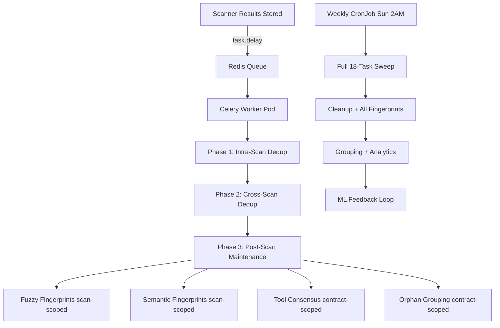

# Playbook: Deduplication Maintenance

**Version:** 2.1.0
**Last Updated:** February 24, 2026
**Audience:** Platform Operator | Developer

## Overview

Monitor and troubleshoot the hybrid deduplication maintenance system. Deduplication runs via three paths:

1. **Celery worker dedup** — All 3 dedup phases dispatched to isolated worker pod via Redis (v0.29.13+)
2. **Post-scan maintenance** — 4 scoped tasks run in the Celery worker after dedup phases
3. **Weekly CronJob** — Full 18-task sweep runs Sunday 2 AM UTC

---

## Prerequisites

- [ ] `kubectl` access to `api-service-local` namespace
- [ ] API service running (v0.29.19+)
- [ ] Celery worker pod running (`celery-worker` deployment)
- [ ] Redis running (broker for Celery tasks)

---

## Workflow Diagram



---

## Monitoring the Celery Worker

### Verify worker is running

```bash
# Check worker pod status
kubectl get pods -n api-service-local -l app.kubernetes.io/name=celery-worker

# Check worker logs for recent task processing
kubectl logs -n api-service-local -l app.kubernetes.io/name=celery-worker --tail=50

# Verify worker image matches API service
kubectl get deployment -n api-service-local celery-worker \
  -o jsonpath='{.spec.template.spec.containers[0].image}'
```

### Verify dedup runs after a scan

After uploading a contract and receiving scan results, check **worker** logs (not API logs):

```bash
# Check worker processed the dedup task
kubectl logs -n api-service-local -l app.kubernetes.io/name=celery-worker --tail=100 | \
  grep -i "celery-dedup\|Intra-scan\|Cross-scan\|Maintenance"
```

Then verify DB state:

```sql
-- Check that new vulnerabilities have fingerprints and groups
SELECT title, severity,
       fingerprint_location_fuzzy IS NOT NULL as has_fuzzy,
       fingerprint_semantic IS NOT NULL as has_semantic,
       tool_consensus_score,
       deduplication_group_id IS NOT NULL as has_group,
       is_primary
FROM vulnerabilities
WHERE scan_id = '<scan-uuid>'
ORDER BY severity;
```

**Expected:** All rows should have `has_fuzzy = true` and `has_semantic = true`.

### Check API pod dispatched the task

```bash
kubectl logs -n api-service-local deploy/api-service --tail=100 | \
  grep -i "Dedup task dispatched"
```

---

## Monitoring the Weekly CronJob

### Check CronJob status

```bash
# CronJob schedule and last run
kubectl get cronjob -n api-service-local

# Recent jobs
kubectl get jobs -n api-service-local | grep dedup

# Job logs
kubectl logs -n api-service-local job/<job-name> --tail=50
```

### Manual trigger (for testing)

```bash
kubectl create job --from=cronjob/deduplication-maintenance \
  dedup-manual-$(date +%s) -n api-service-local
```

### Verify CronJob configuration

```bash
# Should show: schedule "0 2 * * 0", --weekly flag, v0.29.11 image
kubectl get cronjob deduplication-maintenance -n api-service-local -o yaml | \
  grep -E "schedule|image|command|activeDeadline"
```

---

## Liveness Probe Configuration (v0.29.27+)

The celery worker liveness probe uses `celery inspect ping`, which spawns a subprocess with 4-5s Python/Celery import overhead. Probe settings must account for this:

| Setting | Value | Rationale |
|---------|-------|-----------|
| `--timeout=10` | Celery subprocess timeout | 4-5s import + 2-3s ping + headroom |
| `timeoutSeconds: 15` | Kubernetes probe timeout | Must exceed celery --timeout |
| `periodSeconds: 120` | Probe frequency | Dedup tasks are long-running; 2 min sufficient |
| `failureThreshold: 3` | Failures before kill | 3 failures = 6 min tolerance |
| CPU request: 250m | Baseline CPU | 3 prefork workers + probe subprocess |

### Check for probe failures

```bash
# Recent probe events
kubectl get events -n api-service-local --field-selector type=Warning \
  --sort-by='.lastTimestamp' | grep -i "liveness\|celery-worker"

# Verify probe config on running pod
kubectl get pod -n api-service-local -l app.kubernetes.io/name=celery-worker \
  -o jsonpath='{.items[0].spec.containers[0].livenessProbe}' | python3 -m json.tool
```

If probe failures recur at these settings, investigate CPU throttling or worker deadlocks — do **not** simply increase timeouts further.

---

## Troubleshooting

### Celery worker not processing tasks

1. Check worker pod is running:
   ```bash
   kubectl get pods -n api-service-local -l app.kubernetes.io/name=celery-worker
   ```

2. Check Redis is running (Celery broker):
   ```bash
   kubectl get pods -n redis-local -l app.kubernetes.io/name=redis
   ```

3. Check worker can connect to Redis:
   ```bash
   kubectl logs -n api-service-local -l app.kubernetes.io/name=celery-worker --tail=20 | \
     grep -i "connected\|error\|refused"
   ```

4. Verify CELERY_BROKER_URL in worker env:
   ```bash
   kubectl exec -n api-service-local deployment/celery-worker -- env | grep CELERY
   ```

### Celery worker restarting due to liveness probe

If the worker pod shows restarts with `Liveness probe failed` events:

1. Check CPU throttling (most common cause):
   ```bash
   kubectl top pod -n api-service-local -l app.kubernetes.io/name=celery-worker
   ```

2. If CPU usage is near the limit (500m), the probe subprocess can't start in time. Consider increasing the CPU request or reducing `--concurrency`.

3. Check if the worker is deadlocked (no task progress):
   ```bash
   kubectl logs -n api-service-local -l app.kubernetes.io/name=celery-worker --tail=50
   ```

4. If tasks are progressing and only the probe is slow, the issue is resource contention — not a worker health problem.

### Findings missing fingerprints after scan

1. Check if worker processed the task (look for errors in **worker** logs):
   ```bash
   kubectl logs -n api-service-local -l app.kubernetes.io/name=celery-worker --tail=200 | \
     grep -i "warning\|error\|celery-dedup"
   ```

2. Check Intelligence Engine is running (required for semantic fingerprints):
   ```bash
   kubectl get pods -n intelligence-engine-local
   ```

3. Manual fix — trigger the weekly job to backfill:
   ```bash
   kubectl create job --from=cronjob/deduplication-maintenance \
     dedup-backfill-$(date +%s) -n api-service-local
   ```

### CronJob not running

1. Check schedule:
   ```bash
   kubectl get cronjob -n api-service-local
   ```

2. Check for failed jobs:
   ```bash
   kubectl get jobs -n api-service-local --field-selector status.successful=0
   ```

3. Check `concurrencyPolicy: Forbid` isn't blocking (previous job still running):
   ```bash
   kubectl get jobs -n api-service-local | grep dedup | grep -v Completed
   ```

### CronJob exceeds deadline

The weekly full sweep processes all 6,300+ vulnerabilities. If it exceeds the 2-hour deadline:

1. Check for slow tasks in job logs
2. Consider if data volume has grown significantly
3. The inline path handles new data — the weekly sweep is for maintenance only

### GCP: CronJob can't connect to database

In GCP, the CronJob uses a Cloud SQL Proxy sidecar. If the job fails with database connection errors:

1. Check Cloud SQL Proxy sidecar logs:
   ```bash
   kubectl logs -n api-service-gcp job/<job-name> -c cloud-sql-proxy
   ```

2. Verify Workload Identity is configured:
   ```bash
   kubectl get serviceaccount api-service -n api-service-gcp -o yaml | grep iam.gke.io
   ```

3. Check the Cloud SQL Proxy has `--quitquitquit` flag (required for Job/CronJob support):
   ```bash
   kubectl get cronjob deduplication-maintenance -n api-service-gcp -o yaml | grep quitquitquit
   ```

### GCP: Semantic fingerprints failing

Intelligence Engine URL must point to the GCP namespace:

```bash
# Check the IE URL in the CronJob env
kubectl get cronjob deduplication-maintenance -n api-service-gcp -o yaml | grep -A2 INTELLIGENCE_ENGINE_URL

# Verify IE is running in GCP namespace
kubectl get pods -n intelligence-engine-gcp
```

---

## CLI Interface

```bash
# From inside the pod or locally with correct DATABASE_URL:

# Weekly housekeeping (what the CronJob runs)
python -m src.infrastructure.tasks.deduplication_maintenance --weekly

# Post-scan for specific scan (manual testing)
python -m src.infrastructure.tasks.deduplication_maintenance \
  --scan-id <scan-uuid> --contract-id <contract-uuid>

# Full sweep (legacy default)
python -m src.infrastructure.tasks.deduplication_maintenance
```

---

## Pre-Deployment Checklist

- [ ] All dedup tests pass:
  ```bash
  pytest tests/unit/infrastructure/test_deduplication_maintenance.py \
         tests/unit/infrastructure/test_cronjob_manifest.py \
         tests/unit/infrastructure/test_cronjob_gcp_overlay.py \
         tests/unit/ml/test_semantic_deduplicator*.py \
         tests/unit/ml/test_ie_url_resolution.py \
         tests/unit/presentation/test_scans_phase3.py -v -o "addopts="
  ```
- [ ] Image tag in kustomization matches pyproject.toml
- [ ] GCP: `kustomize build` renders CronJob with Cloud SQL Proxy
- [ ] GCP: IE URL points to `-gcp` namespace (not `-local`)

---

## Post-Deployment Smoke Test

### Local

1. Verify CronJob exists:
   ```bash
   kubectl get cronjob deduplication-maintenance -n api-service-local
   ```
2. Trigger smoke test:
   ```bash
   kubectl create job --from=cronjob/deduplication-maintenance smoke-$(date +%s) -n api-service-local
   ```
3. Watch logs:
   ```bash
   kubectl logs job/smoke-<id> -n api-service-local --follow
   ```
4. Verify "Maintenance completed" appears in logs

### GCP

1-4 same as local but with `-n api-service-gcp` and `-c deduplication-job`

5. Verify Cloud SQL Proxy sidecar exits cleanly:
   ```bash
   kubectl logs job/smoke-<id> -c cloud-sql-proxy -n api-service-gcp
   ```

---

## Rollback Procedures

### CronJob pod stuck Running (GCP)

**Cause:** Missing `--quitquitquit` on Cloud SQL Proxy sidecar.

**Fix:**
```bash
kubectl delete job <job-name> -n api-service-gcp
# Redeploy with corrected sidecar args in cronjob-deduplication.yaml
```

### All tasks fail with DB connection error

**Cause:** DATABASE_URL secret missing or Cloud SQL Proxy not connecting.

**Fix:**
1. Check Cloud SQL Proxy logs: `kubectl logs job/<name> -c cloud-sql-proxy -n api-service-gcp`
2. Verify Workload Identity: `kubectl get sa api-service -n api-service-gcp -o yaml | grep iam.gke.io`
3. Check secret exists: `kubectl get secret api-service-secret -n api-service-gcp`

### Semantic fingerprints all failing

**Cause:** INTELLIGENCE_ENGINE_URL pointing to wrong namespace or IE service down.

**Fix:**
1. Verify IE URL: `kubectl get cronjob deduplication-maintenance -n api-service-gcp -o yaml | grep -A2 INTELLIGENCE_ENGINE_URL`
2. Check IE pods: `kubectl get pods -n intelligence-engine-gcp`

### CronJob not scheduling

**Cause:** `concurrencyPolicy: Forbid` blocking because a previous job is still running.

**Fix:**
```bash
kubectl get jobs -n api-service-local | grep dedup | grep -v Completed
kubectl delete job <stuck-job-name> -n api-service-local
```

---

## Operational Checklist

- [ ] Celery worker pod running (`celery-worker` deployment), 0 recent restarts
- [ ] Celery worker image matches api-service image version
- [ ] No `Liveness probe failed` warning events in last 30 min
- [ ] Redis running (Celery broker, db 1)
- [ ] New scan findings have fingerprints after worker processes
- [ ] Weekly CronJob: Scheduled `0 2 * * 0` with `--weekly` flag
- [ ] CronJob image matches api-service image version
- [ ] Intelligence Engine running (for semantic fingerprints)
- [ ] No stale/stuck jobs blocking CronJob

---

## Related Playbooks

- [Deploy New Image](deploy-new-image.md)
- [AI/ML Comprehensive Audit](ai-ml-audit-playbook.md)
- [Scanner Pipeline Troubleshooting](scanner-pipeline-troubleshooting.md)
