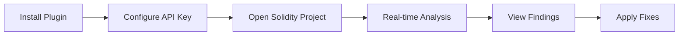

# Playbook: JetBrains Plugin Setup

**Version:** 1.0.0
**Last Updated:** February 1, 2026
**Audience:** Developer

## Overview

This playbook guides you through installing and configuring the BlockSecOps plugin for JetBrains IDEs (IntelliJ IDEA, WebStorm, PhpStorm, etc.) for real-time smart contract security scanning.

---

## Prerequisites

- [ ] JetBrains IDE installed (version 2023.3+)
- [ ] BlockSecOps account (any tier)
- [ ] API key with `write:scans`, `read:scans`, `read:vulnerabilities` scopes
- [ ] Solidity smart contract project

---

## Supported IDEs

| IDE | Version | Status |
|-----|---------|--------|
| IntelliJ IDEA | 2023.3+ | Supported |
| WebStorm | 2023.3+ | Supported |
| PhpStorm | 2023.3+ | Supported |
| PyCharm | 2023.3+ | Supported |
| Rider | 2023.3+ | Supported |
| GoLand | 2023.3+ | Supported |

---

## Workflow Diagram



---

## Steps

### Step 1: Install Plugin

**JetBrains IDE:**
1. Open your JetBrains IDE
2. Go to **Settings/Preferences** (`Ctrl+Alt+S` / `Cmd+,`)
3. Navigate to **Plugins**
4. Click **Marketplace** tab
5. Search for `BlockSecOps`
6. Click **Install** on "BlockSecOps Security Scanner"
7. Click **Restart IDE** when prompted

**Alternative: Install from Disk**
1. Download plugin from [BlockSecOps Downloads](https://app.blocksecops.com/downloads/jetbrains)
2. Go to **Settings > Plugins**
3. Click gear icon > **Install Plugin from Disk...**
4. Select downloaded `.zip` file
5. Restart IDE

### Step 2: Create API Key

**Dashboard:**
1. Navigate to **Settings > API Keys**
2. Click **Create API Key**
3. Name: `JetBrains Plugin`
4. Scopes: `write:scans`, `read:scans`, `read:vulnerabilities`
5. Copy the generated key

### Step 3: Configure Plugin

**JetBrains IDE:**
1. Go to **Settings/Preferences**
2. Navigate to **Tools > BlockSecOps**
3. Enter your API key
4. Configure options:
   - **API URL:** `https://app.blocksecops.com/api/v1` (default)
   - **Enable Auto-Scan:** Toggle on for real-time scanning
   - **Scan on Save:** Trigger scan when file saved
   - **Severity Filter:** Select severities to display
5. Click **Apply**, then **OK**

**Settings File (Alternative):**

Edit `~/.config/JetBrains/<IDE>/options/blocksecops.xml`:
```xml
<application>
  <component name="BlockSecOpsSettings">
    <option name="apiKey" value="bso_live_xxxxxxxxxxxx" />
    <option name="apiUrl" value="https://app.blocksecops.com/api/v1" />
    <option name="autoScan" value="true" />
    <option name="scanOnSave" value="true" />
    <option name="severityFilter" value="critical,high,medium" />
  </component>
</application>
```

### Step 4: Verify Installation

**JetBrains IDE:**
1. Open a Solidity project
2. Check the status bar shows "BlockSecOps: Ready"
3. Look for BlockSecOps tool window in the sidebar
4. Open a `.sol` file and verify scanning starts

---

## Using the Plugin

### Real-Time Scanning

The plugin scans as you type:

1. **Gutter Icons:** Warning/error icons in the editor gutter
2. **Inline Highlights:** Underlined code with severity colors
3. **Hover Details:** Hover over highlighted code for details
4. **Problems Tool Window:** All findings listed

### Manual Scan

**Trigger a scan:**
- **Menu:** Tools > BlockSecOps > Scan Current File
- **Keyboard:** `Ctrl+Alt+Shift+S` (customizable)
- **Right-click:** Context menu > BlockSecOps > Scan

### Scan Entire Project

**Menu:** Tools > BlockSecOps > Scan Project

Or use the tool window:
1. Open BlockSecOps tool window (View > Tool Windows > BlockSecOps)
2. Click **Scan Project** button

### View Results

**BlockSecOps Tool Window:**
1. Click BlockSecOps in the tool window bar (usually bottom or right)
2. View findings organized by:
   - File
   - Severity
   - Category
3. Double-click to navigate to code

**Inspection Results:**
- Findings also appear in standard **Inspections** results
- Run **Analyze > Inspect Code** to include in full inspection

### Apply Quick Fixes

For supported vulnerability types:

1. Click on the warning in the gutter
2. Press `Alt+Enter` for intentions
3. Select available fix:
   - **Apply recommended fix**
   - **Suppress for line/file**
   - **Mark as false positive**
   - **Open in BlockSecOps**

---

## Plugin Settings Reference

| Setting | Default | Description |
|---------|---------|-------------|
| `apiKey` | - | Your BlockSecOps API key |
| `apiUrl` | `https://app.blocksecops.com/api/v1` | API endpoint |
| `autoScan` | `true` | Enable real-time scanning |
| `scanOnSave` | `true` | Scan when file saved |
| `scanDelay` | `1500` | Delay (ms) before auto-scan |
| `severityFilter` | `critical,high,medium,low` | Severities to show |
| `showGutterIcons` | `true` | Show icons in gutter |
| `highlightCode` | `true` | Highlight vulnerable code |
| `ignorePaths` | `node_modules/**,test/**` | Paths to ignore |

### Configure via Settings UI

1. Go to **Settings > Tools > BlockSecOps**
2. Modify settings as needed
3. Click **Apply**

---

## Project-Level Configuration

Create `.blocksecops.xml` in project root:

```xml
<?xml version="1.0" encoding="UTF-8"?>
<blocksecops>
  <solc-version>0.8.19</solc-version>
  <optimizer enabled="true" runs="200"/>
  <exclude>
    <path>contracts/mocks/**</path>
    <path>contracts/test/**</path>
  </exclude>
  <scanners>
    <scanner>soliditydefend</scanner>
    <scanner>slither</scanner>
  </scanners>
  <severity-threshold>medium</severity-threshold>
</blocksecops>
```

---

## Tool Window Features

### Findings Tab

- List of all vulnerabilities
- Filter by severity, category, file
- Sort by severity, location, scanner
- Search findings

### Scan History Tab

- Recent scan results
- Scan duration and status
- Click to view past results

### Statistics Tab

- Vulnerability trends
- Most common issues
- Risk score over time

---

## Keyboard Shortcuts

| Action | Default Shortcut |
|--------|------------------|
| Scan Current File | `Ctrl+Alt+Shift+S` |
| Scan Project | `Ctrl+Alt+Shift+P` |
| Open BlockSecOps Tool Window | `Alt+B` |
| Go to Next Finding | `F2` (in tool window) |
| Apply Quick Fix | `Alt+Enter` |
| Show Finding Details | `Ctrl+Q` |

### Customize Shortcuts

1. Go to **Settings > Keymap**
2. Search for "BlockSecOps"
3. Right-click action > Add Keyboard Shortcut

---

## Integration with Existing Inspections

BlockSecOps integrates with JetBrains inspection system:

### Enable/Disable Inspections

1. Go to **Settings > Editor > Inspections**
2. Navigate to **Solidity > BlockSecOps**
3. Enable/disable individual inspections:
   - BlockSecOps: Reentrancy
   - BlockSecOps: Unchecked Return
   - BlockSecOps: Integer Overflow
   - etc.

### Inspection Profile

Create a custom inspection profile for BlockSecOps:

1. Go to **Settings > Editor > Inspections**
2. Click gear icon > **Copy to Project**
3. Name: "BlockSecOps Security"
4. Enable only BlockSecOps inspections
5. Use this profile for security-focused inspections

---

## Verification

Confirm plugin is working:

1. **Status Bar:** Shows "BlockSecOps: Ready"
2. **Test File:** Create a vulnerable contract:

```solidity
// SPDX-License-Identifier: MIT
pragma solidity ^0.8.0;

contract Vulnerable {
    mapping(address => uint) public balances;

    function withdraw() external {
        uint amount = balances[msg.sender];
        (bool success,) = msg.sender.call{value: amount}("");
        require(success);
        balances[msg.sender] = 0; // Warning should appear
    }
}
```

3. **Check Gutter:** Red/yellow icon appears on vulnerable line
4. **Check Tool Window:** Finding listed

---

## Troubleshooting

| Issue | Cause | Solution |
|-------|-------|----------|
| "Plugin not compatible" | Old IDE version | Update to 2023.3+ |
| Status shows "Disconnected" | Invalid API key | Re-enter API key in settings |
| No warnings appearing | Scanning disabled | Enable auto-scan in settings |
| Slow performance | Large project | Increase scan delay, exclude paths |
| "Rate limit exceeded" | Too many scans | Disable auto-scan, use manual scan |
| Conflicts with Solidity plugin | Both providing diagnostics | Configure severity filter |
| Findings not clearing | Cache issue | Invalidate caches (File > Invalidate Caches) |

### View Plugin Logs

1. **Help > Show Log in Explorer/Finder**
2. Search for "BlockSecOps" in `idea.log`

### Enable Debug Mode

Add to IDE VM options:
```
-Dblocksecops.debug=true
```

---

## Checklist

- [ ] Plugin installed from JetBrains Marketplace
- [ ] IDE restarted after installation
- [ ] API key created with required scopes
- [ ] Plugin configured with API key
- [ ] Status bar shows "BlockSecOps: Ready"
- [ ] Auto-scan enabled (optional)
- [ ] Severity filter configured
- [ ] Test file scanned successfully
- [ ] Gutter icons appearing
- [ ] Tool window showing findings
- [ ] Quick fixes working (if available)

---

## Related Playbooks

- [API Key Management](./api-key-management.md) - Create and manage API keys
- [VS Code Extension Setup](./ide-vscode.md) - VS Code integration
- [CLI Installation](./cli-installation.md) - Command-line scanning
- [Run First Scan](./run-first-scan.md) - Web-based scanning
