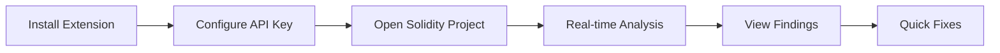

# Playbook: VS Code Extension Setup

**Version:** 1.0.0
**Last Updated:** February 1, 2026
**Audience:** Developer

## Overview

This playbook guides you through installing and configuring the BlockSecOps VS Code extension for real-time smart contract security scanning directly in your editor.

---

## Prerequisites

- [ ] Visual Studio Code installed (version 1.80+)
- [ ] BlockSecOps account (any tier)
- [ ] API key with `write:scans`, `read:scans`, `read:vulnerabilities` scopes
- [ ] Solidity smart contract project

---

## Workflow Diagram



---

## Steps

### Step 1: Install Extension

**VS Code:**
1. Open VS Code
2. Click the **Extensions** icon in the sidebar (or press `Ctrl+Shift+X`)
3. Search for `BlockSecOps`
4. Click **Install** on "BlockSecOps Security Scanner"
5. Wait for installation to complete
6. Click **Reload** if prompted

**Command Line:**
```bash
code --install-extension blocksecops.blocksecops-vscode
```

### Step 2: Create API Key

**Dashboard:**
1. Navigate to **Settings > API Keys**
2. Click **Create API Key**
3. Name: `VS Code Extension`
4. Scopes: `write:scans`, `read:scans`, `read:vulnerabilities`
5. Copy the generated key

**API:**
```bash
curl -X POST "https://app.blocksecops.com/api/v1/api_keys" \
  -H "Authorization: Bearer $ACCESS_TOKEN" \
  -H "Content-Type: application/json" \
  -d '{
    "name": "VS Code Extension",
    "scopes": ["write:scans", "read:scans", "read:vulnerabilities"]
  }'
```

### Step 3: Configure Extension

**VS Code:**
1. Open Command Palette (`Ctrl+Shift+P` or `Cmd+Shift+P`)
2. Type `BlockSecOps: Configure`
3. Enter your API key when prompted
4. Or manually edit settings:

**settings.json:**
```json
{
  "blocksecops.apiKey": "bso_live_xxxxxxxxxxxx",
  "blocksecops.apiUrl": "https://app.blocksecops.com/api/v1",
  "blocksecops.autoScan": true,
  "blocksecops.scanOnSave": true,
  "blocksecops.showInlineWarnings": true,
  "blocksecops.severityFilter": ["critical", "high", "medium"]
}
```

### Step 4: Verify Installation

**VS Code:**
1. Open a Solidity file (`.sol`)
2. Check the status bar shows "BlockSecOps: Ready"
3. Look for the BlockSecOps icon in the Activity Bar

---

## Using the Extension

### Real-Time Scanning

The extension automatically scans as you type:

1. **Inline Warnings:** Vulnerabilities highlighted in the editor
2. **Hover Info:** Hover over highlighted code for details
3. **Problems Panel:** All findings listed in Problems view (`Ctrl+Shift+M`)

### Manual Scan

Trigger a full scan:

1. Open Command Palette (`Ctrl+Shift+P`)
2. Type `BlockSecOps: Scan Current File`
3. Or use keyboard shortcut: `Ctrl+Alt+S` (customizable)

### Scan Entire Workspace

1. Open Command Palette
2. Type `BlockSecOps: Scan Workspace`
3. Progress shown in status bar

### View Results

**Problems Panel:**
- Shows all vulnerabilities with severity icons
- Click to navigate to affected code
- Filter by severity

**BlockSecOps Panel:**
1. Click the BlockSecOps icon in Activity Bar
2. View findings grouped by:
   - Severity
   - File
   - Category
3. Click to navigate to code

### Quick Fixes

For supported vulnerability types:

1. Hover over the warning
2. Click **Quick Fix** or press `Ctrl+.`
3. Select from available fixes:
   - Apply recommended fix
   - Mark as false positive
   - View in BlockSecOps dashboard

---

## Extension Commands

| Command | Shortcut | Description |
|---------|----------|-------------|
| `BlockSecOps: Scan Current File` | `Ctrl+Alt+S` | Scan active file |
| `BlockSecOps: Scan Workspace` | `Ctrl+Alt+Shift+S` | Scan all Solidity files |
| `BlockSecOps: Configure` | - | Set API key and preferences |
| `BlockSecOps: Clear Diagnostics` | - | Clear all warnings |
| `BlockSecOps: View Report` | - | Open scan report in browser |
| `BlockSecOps: Toggle Auto-Scan` | - | Enable/disable auto-scan |

---

## Extension Settings

| Setting | Default | Description |
|---------|---------|-------------|
| `blocksecops.apiKey` | - | Your BlockSecOps API key |
| `blocksecops.apiUrl` | `https://app.blocksecops.com/api/v1` | API endpoint |
| `blocksecops.autoScan` | `true` | Enable real-time scanning |
| `blocksecops.scanOnSave` | `true` | Scan when file saved |
| `blocksecops.scanDelay` | `1000` | Delay (ms) before auto-scan |
| `blocksecops.showInlineWarnings` | `true` | Show inline decorations |
| `blocksecops.severityFilter` | `["critical", "high", "medium", "low"]` | Severities to show |
| `blocksecops.ignorePaths` | `["node_modules/**", "test/**"]` | Paths to ignore |
| `blocksecops.maxConcurrentScans` | `3` | Parallel scan limit |

### Configure Settings

**VS Code Settings UI:**
1. Open Settings (`Ctrl+,`)
2. Search for "BlockSecOps"
3. Modify settings as needed

**settings.json:**
```json
{
  "blocksecops.autoScan": true,
  "blocksecops.scanOnSave": true,
  "blocksecops.severityFilter": ["critical", "high"],
  "blocksecops.ignorePaths": [
    "node_modules/**",
    "lib/**",
    "test/**",
    "scripts/**"
  ]
}
```

---

## Workspace Configuration

Create `.blocksecops.json` in project root for project-specific settings:

```json
{
  "solcVersion": "0.8.19",
  "optimizer": {
    "enabled": true,
    "runs": 200
  },
  "exclude": [
    "contracts/mocks/**",
    "contracts/test/**"
  ],
  "scanners": ["soliditydefend", "slither"],
  "severityThreshold": "medium"
}
```

---

## Verification

Confirm extension is working:

1. **Status Bar:** Shows "BlockSecOps: Ready"
2. **Create Test File:**

```solidity
// SPDX-License-Identifier: MIT
pragma solidity ^0.8.0;

contract Vulnerable {
    mapping(address => uint) public balances;

    function withdraw() external {
        uint amount = balances[msg.sender];
        (bool success,) = msg.sender.call{value: amount}("");
        require(success);
        balances[msg.sender] = 0; // Reentrancy warning should appear
    }
}
```

3. **Verify Warning:** Yellow/red underline on reentrancy issue
4. **Check Problems Panel:** Finding listed with details

---

## Troubleshooting

| Issue | Cause | Solution |
|-------|-------|----------|
| "Extension not active" | No Solidity file open | Open a `.sol` file |
| "API key invalid" | Wrong or expired key | Generate new API key |
| "Scan failed" | Network error | Check internet connection |
| No warnings appearing | Severity filter too strict | Include more severities |
| Slow scanning | Large project | Increase `scanDelay`, exclude paths |
| "Rate limit exceeded" | Too many scans | Disable `autoScan`, use manual scan |
| Conflicts with Solidity extension | Both extensions diagnosing | Disable one or configure exclusions |

### Debug Mode

Enable debug logging:

```json
{
  "blocksecops.logLevel": "debug"
}
```

View logs: **Output** panel > Select "BlockSecOps"

### Reset Extension

1. Open Command Palette
2. Type `BlockSecOps: Reset Configuration`
3. Re-enter API key

---

## Integration with Other Extensions

### Solidity (Juan Blanco)

Compatible - BlockSecOps adds security diagnostics alongside syntax highlighting.

### Hardhat

Compatible - Use BlockSecOps for security, Hardhat for compilation/testing.

### Foundry

Compatible - Both tools work independently.

### Prettier

Add to `.prettierignore`:
```
# BlockSecOps config
.blocksecops.json
```

---

## Keyboard Shortcuts

Customize shortcuts in `keybindings.json`:

```json
[
  {
    "key": "ctrl+shift+b",
    "command": "blocksecops.scanFile",
    "when": "editorLangId == solidity"
  },
  {
    "key": "ctrl+shift+alt+b",
    "command": "blocksecops.scanWorkspace"
  }
]
```

---

## Checklist

- [ ] Extension installed from marketplace
- [ ] API key created with required scopes
- [ ] Extension configured with API key
- [ ] Status bar shows "BlockSecOps: Ready"
- [ ] Auto-scan enabled (optional)
- [ ] Severity filter configured
- [ ] Test file scanned successfully
- [ ] Warnings appearing inline
- [ ] Problems panel showing findings
- [ ] Quick fixes working (if available)

---

## Related Playbooks

- [API Key Management](./api-key-management.md) - Create and manage API keys
- [JetBrains Plugin Setup](./ide-jetbrains.md) - IntelliJ/WebStorm plugin
- [CLI Installation](./cli-installation.md) - Command-line scanning
- [Run First Scan](./run-first-scan.md) - Web-based scanning
