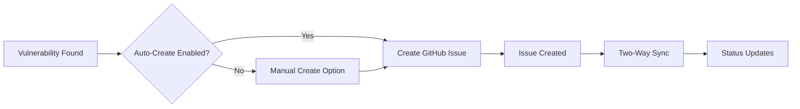

# Playbook: GitHub Issues Integration

**Version:** 1.0.0
**Last Updated:** February 1, 2026
**Audience:** Developer | Team Lead

## Overview

This playbook guides you through integrating BlockSecOps with GitHub Issues to automatically create issues from security vulnerabilities. Track remediation in your existing GitHub workflow and keep findings synchronized.

---

## Prerequisites

- [ ] BlockSecOps account with Growth or Enterprise tier
- [ ] GitHub repository with write access
- [ ] GitHub personal access token or GitHub App installation
- [ ] Organization admin role in BlockSecOps (for org-wide integration)

---

## Workflow Diagram



---

## Steps

### Step 1: Create GitHub Personal Access Token

**GitHub:**
1. Go to [GitHub Settings > Developer settings > Personal access tokens](https://github.com/settings/tokens)
2. Click **Generate new token (classic)**
3. Configure:
   - **Note:** `BlockSecOps Integration`
   - **Expiration:** 90 days (or longer)
   - **Scopes:** Select:
     - `repo` (Full control of private repositories)
     - Or `public_repo` (for public repos only)
4. Click **Generate token**
5. Copy the token immediately

### Step 2: Configure GitHub Integration in BlockSecOps

**Dashboard:**
1. Navigate to **Settings > Integrations**
2. Click **Add Integration**
3. Select **GitHub Issues**
4. Enter configuration:
   - **GitHub Token:** Token from Step 1
   - **Default Repository:** `owner/repo-name`
   - **Default Labels:** `security`, `vulnerability`
5. Click **Test Connection**
6. Click **Save**

**API:**
```bash
curl -X POST "https://app.0xapogee.com/api/v1/organizations/{org_id}/integrations" \
  -H "Authorization: Bearer $ACCESS_TOKEN" \
  -H "Content-Type: application/json" \
  -d '{
    "type": "github_issues",
    "name": "GitHub Issues",
    "config": {
      "token": "ghp_xxxxxxxxxxxxxxxxxxxx",
      "default_repository": "owner/repo-name",
      "default_labels": ["security", "vulnerability"]
    }
  }'
```

### Step 3: Configure Issue Templates

**Dashboard:**
1. In GitHub integration settings, click **Issue Templates**
2. Configure the default template:

**Template Variables:**

| Variable | Description |
|----------|-------------|
| `{{title}}` | Vulnerability title |
| `{{severity}}` | Severity level |
| `{{description}}` | Full description |
| `{{location}}` | File and line number |
| `{{recommendation}}` | Fix recommendation |
| `{{code_snippet}}` | Vulnerable code |
| `{{scanner}}` | Scanner that found it |
| `{{blocksecops_url}}` | Link to BlockSecOps |

**Default Template:**

```markdown
## Security Vulnerability: {{title}}

**Severity:** {{severity}}
**Scanner:** {{scanner}}

### Location
- **File:** `{{location.file}}`
- **Line:** {{location.line}}
- **Function:** `{{location.function}}`

### Description
{{description}}

### Recommendation
{{recommendation}}

### Code Snippet
```solidity
{{code_snippet}}
```

---
**BlockSecOps:** [View Details]({{blocksecops_url}})

<!-- blocksecops:vuln_id={{id}} -->
```

**API:**
```bash
curl -X PATCH "https://app.0xapogee.com/api/v1/integrations/{integration_id}/template" \
  -H "Authorization: Bearer $ACCESS_TOKEN" \
  -H "Content-Type: application/json" \
  -d '{
    "title_template": "[{{severity}}] {{title}}",
    "body_template": "..."
  }'
```

### Step 4: Configure Auto-Create Rules

**Dashboard:**
1. In GitHub integration settings, click **Auto-Create Rules**
2. Configure:
   - **Create on Critical:** Yes
   - **Create on High:** Yes
   - **Create on Medium:** Optional
   - **Create on Low:** No
   - **Repository per Project:** Map projects to repos
3. Configure deduplication:
   - **Dedupe by:** File + Line + Vulnerability Type
   - **Update existing:** Yes
4. Click **Save**

**API:**
```bash
curl -X PATCH "https://app.0xapogee.com/api/v1/integrations/{integration_id}/settings" \
  -H "Authorization: Bearer $ACCESS_TOKEN" \
  -H "Content-Type: application/json" \
  -d '{
    "auto_create": {
      "enabled": true,
      "severities": ["critical", "high"],
      "dedupe_key": ["file", "line", "vulnerability_type"],
      "update_existing": true
    },
    "repository_mapping": {
      "proj_abc123": "owner/repo-1",
      "proj_def456": "owner/repo-2"
    }
  }'
```

### Step 5: Create Issues from Vulnerabilities

**Dashboard (Manual):**
1. Navigate to a vulnerability
2. Click **Create GitHub Issue**
3. Select repository (if not default)
4. Review and edit title/body
5. Add labels, assignees, milestone
6. Click **Create Issue**

**API:**
```bash
curl -X POST "https://app.0xapogee.com/api/v1/vulnerabilities/{vuln_id}/github" \
  -H "Authorization: Bearer $ACCESS_TOKEN" \
  -H "Content-Type: application/json" \
  -d '{
    "repository": "owner/repo-name",
    "labels": ["security", "critical", "audit-q1"],
    "assignees": ["developer1"],
    "milestone": 1
  }'
```

**Response:**
```json
{
  "issue_number": 42,
  "issue_url": "https://github.com/owner/repo-name/issues/42",
  "html_url": "https://github.com/owner/repo-name/issues/42",
  "state": "open",
  "created_at": "2026-02-01T10:00:00Z"
}
```

### Step 6: Enable Two-Way Sync

**Dashboard:**
1. In GitHub integration settings, click **Sync Settings**
2. Enable:
   - **Sync status to GitHub:** Update issue when BlockSecOps status changes
   - **Sync status from GitHub:** Update BlockSecOps when issue closed
3. Map statuses:

| BlockSecOps Status | GitHub Action |
|-------------------|---------------|
| Open | Issue open |
| Confirmed | Add "confirmed" label |
| Fixed | Close issue |
| False Positive | Close issue + "wontfix" label |
| Accepted Risk | Close issue + "accepted-risk" label |

**API:**
```bash
curl -X PATCH "https://app.0xapogee.com/api/v1/integrations/{integration_id}/sync" \
  -H "Authorization: Bearer $ACCESS_TOKEN" \
  -H "Content-Type: application/json" \
  -d '{
    "bidirectional": true,
    "status_mapping": {
      "fixed": {"action": "close"},
      "false_positive": {"action": "close", "labels": ["wontfix"]},
      "accepted_risk": {"action": "close", "labels": ["accepted-risk"]}
    },
    "sync_comments": true
  }'
```

---

## GitHub Webhook Setup (For Two-Way Sync)

### Create Webhook in GitHub

**GitHub:**
1. Go to repository **Settings > Webhooks**
2. Click **Add webhook**
3. Configure:
   - **Payload URL:** `https://app.0xapogee.com/api/v1/webhooks/github/{integration_id}`
   - **Content type:** `application/json`
   - **Secret:** Generate and save a secret
   - **Events:** Select:
     - Issues
     - Issue comments
4. Click **Add webhook**

**Configure Secret in BlockSecOps:**

```bash
curl -X PATCH "https://app.0xapogee.com/api/v1/integrations/{integration_id}" \
  -H "Authorization: Bearer $ACCESS_TOKEN" \
  -H "Content-Type: application/json" \
  -d '{
    "config": {
      "webhook_secret": "your-webhook-secret"
    }
  }'
```

---

## Issue Labels

### Recommended Label Structure

| Label | Color | Description |
|-------|-------|-------------|
| `security` | `#d73a4a` | Security-related issue |
| `vulnerability` | `#b60205` | Vulnerability finding |
| `critical` | `#b60205` | Critical severity |
| `high` | `#d93f0b` | High severity |
| `medium` | `#fbca04` | Medium severity |
| `low` | `#0e8a16` | Low severity |
| `reentrancy` | `#5319e7` | Reentrancy vulnerability |
| `access-control` | `#5319e7` | Access control issue |
| `audit` | `#1d76db` | Part of security audit |

### Auto-Create Labels

**API:**
```bash
curl -X POST "https://app.0xapogee.com/api/v1/integrations/{integration_id}/setup-labels" \
  -H "Authorization: Bearer $ACCESS_TOKEN" \
  -H "Content-Type: application/json" \
  -d '{
    "repository": "owner/repo-name"
  }'
```

---

## Bulk Operations

### Create Issues for All Critical Findings

**API:**
```bash
# Get all critical vulnerabilities
VULNS=$(curl -s "https://app.0xapogee.com/api/v1/vulnerabilities?severity=critical&status=open" \
  -H "Authorization: Bearer $ACCESS_TOKEN" | jq -r '.[].id')

# Create issues for each
for VULN_ID in $VULNS; do
  curl -X POST "https://app.0xapogee.com/api/v1/vulnerabilities/$VULN_ID/github" \
    -H "Authorization: Bearer $ACCESS_TOKEN" \
    -H "Content-Type: application/json" \
    -d '{"repository": "owner/repo-name", "labels": ["security", "critical"]}'
done
```

### Sync All Linked Issues

**API:**
```bash
curl -X POST "https://app.0xapogee.com/api/v1/integrations/{integration_id}/sync-all" \
  -H "Authorization: Bearer $ACCESS_TOKEN"
```

---

## Verification

Confirm the integration is working:

**Dashboard:**
1. Navigate to **Settings > Integrations**
2. Check GitHub Issues shows **Connected** status
3. View linked issues count

**API:**
```bash
# Check integration status
curl -X GET "https://app.0xapogee.com/api/v1/integrations/{integration_id}" \
  -H "Authorization: Bearer $ACCESS_TOKEN"

# List linked issues
curl -X GET "https://app.0xapogee.com/api/v1/integrations/{integration_id}/issues" \
  -H "Authorization: Bearer $ACCESS_TOKEN"
```

**GitHub:**
1. Navigate to repository Issues
2. Filter by `security` label
3. Verify issues were created correctly

---

## Troubleshooting

| Issue | Cause | Solution |
|-------|-------|----------|
| "Bad credentials" | Invalid or expired token | Generate new GitHub token |
| "Repository not found" | Wrong repo name or no access | Check repo name and token permissions |
| "Resource not accessible" | Token lacks required scopes | Add `repo` scope to token |
| Duplicate issues created | Deduplication not working | Check dedupe key configuration |
| Sync not working | Webhook not configured | Set up GitHub webhook |
| Labels not created | No label creation permission | Manually create labels or grant permission |
| Issue closed but vuln open | Sync delay or error | Check webhook delivery in GitHub |

### Test GitHub API

```bash
# Test token works
curl -H "Authorization: token ghp_xxxx" \
  https://api.github.com/repos/owner/repo/issues

# Test issue creation
curl -X POST -H "Authorization: token ghp_xxxx" \
  -H "Content-Type: application/json" \
  https://api.github.com/repos/owner/repo/issues \
  -d '{"title": "Test Issue", "body": "Testing BlockSecOps integration"}'
```

---

## Checklist

- [ ] GitHub personal access token created
- [ ] Token has `repo` scope
- [ ] Integration added in BlockSecOps
- [ ] Connection tested successfully
- [ ] Issue template configured
- [ ] Auto-create rules set (optional)
- [ ] Test issue created successfully
- [ ] Two-way sync enabled (optional)
- [ ] GitHub webhook configured (for sync)
- [ ] Labels created in repository

---

## Related Playbooks

- [JIRA Integration](./integration-jira.md) - JIRA issue tracking
- [GitHub Actions Integration](./cicd-github-actions.md) - CI/CD scanning
- [Run First Scan](./run-first-scan.md) - Create vulnerabilities
- [Configure Roles](./configure-roles.md) - Permission management
