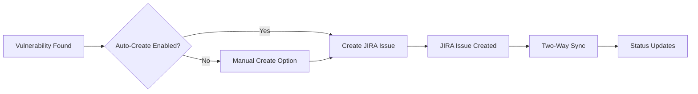

# Playbook: JIRA Integration

**Version:** 1.0.0
**Last Updated:** February 1, 2026
**Audience:** Admin | Team Lead

## Overview

This playbook guides you through integrating BlockSecOps with Atlassian JIRA to automatically create issues from security vulnerabilities. Track remediation progress, assign findings to team members, and sync status between platforms.

---

## Prerequisites

- [ ] BlockSecOps account with Enterprise tier
- [ ] JIRA Cloud or Data Center instance
- [ ] JIRA admin access (for API token and project configuration)
- [ ] Organization owner or admin role in BlockSecOps
- [ ] JIRA project created for security issues

---

## Workflow Diagram



---

## Steps

### Step 1: Generate JIRA API Token

**JIRA Cloud:**
1. Go to [Atlassian Account Settings](https://id.atlassian.com/manage-profile/security/api-tokens)
2. Click **Create API token**
3. Label: `BlockSecOps Integration`
4. Click **Create**
5. Copy the token immediately (shown only once)

**JIRA Data Center:**
1. Navigate to your profile (click avatar > Profile)
2. Go to **Personal Access Tokens**
3. Click **Create token**
4. Name: `BlockSecOps Integration`
5. Set expiry (recommend 1 year)
6. Copy the token

### Step 2: Configure JIRA Integration in BlockSecOps

**Dashboard:**
1. Navigate to **Settings > Integrations**
2. Click **Add Integration**
3. Select **JIRA**
4. Enter configuration:
   - **Instance URL:** `https://your-company.atlassian.net` (Cloud) or `https://jira.your-company.com` (DC)
   - **Email:** Your JIRA account email
   - **API Token:** Token from Step 1
   - **Default Project Key:** e.g., `SEC`
5. Click **Test Connection**
6. Click **Save**

**API:**
```bash
curl -X POST "https://app.blocksecops.com/api/v1/organizations/{org_id}/integrations" \
  -H "Authorization: Bearer $ACCESS_TOKEN" \
  -H "Content-Type: application/json" \
  -d '{
    "type": "jira",
    "name": "JIRA Cloud",
    "config": {
      "instance_url": "https://your-company.atlassian.net",
      "email": "security@your-company.com",
      "api_token": "ATATT3xFfGF0...",
      "default_project_key": "SEC"
    }
  }'
```

### Step 3: Map Issue Types and Fields

**Dashboard:**
1. In JIRA integration settings, click **Configure Mappings**
2. Map BlockSecOps severities to JIRA priorities:

| BlockSecOps Severity | JIRA Priority |
|---------------------|---------------|
| Critical | Highest |
| High | High |
| Medium | Medium |
| Low | Low |

3. Map to issue type: **Bug** or custom type (e.g., "Security Vulnerability")
4. Configure field mappings:

| BlockSecOps Field | JIRA Field |
|-------------------|------------|
| Title | Summary |
| Description | Description |
| Contract File | Custom field or component |
| Line Number | Custom field or label |
| Severity | Priority |
| Category | Labels |

**API:**
```bash
curl -X PATCH "https://app.blocksecops.com/api/v1/integrations/{integration_id}/mappings" \
  -H "Authorization: Bearer $ACCESS_TOKEN" \
  -H "Content-Type: application/json" \
  -d '{
    "severity_to_priority": {
      "critical": "Highest",
      "high": "High",
      "medium": "Medium",
      "low": "Low"
    },
    "issue_type": "Bug",
    "field_mappings": {
      "title": "summary",
      "description": "description",
      "severity": "priority",
      "category": "labels"
    }
  }'
```

### Step 4: Configure Auto-Create Rules (Optional)

**Dashboard:**
1. In JIRA integration settings, click **Auto-Create Rules**
2. Enable automatic issue creation:
   - **Create on Critical:** Yes
   - **Create on High:** Yes
   - **Create on Medium:** Optional
   - **Create on Low:** No
3. Configure deduplication:
   - **Dedupe by:** Contract + Line + Vulnerability Type
   - **Link duplicates:** Yes
4. Click **Save**

**API:**
```bash
curl -X PATCH "https://app.blocksecops.com/api/v1/integrations/{integration_id}/settings" \
  -H "Authorization: Bearer $ACCESS_TOKEN" \
  -H "Content-Type: application/json" \
  -d '{
    "auto_create": {
      "enabled": true,
      "severities": ["critical", "high"],
      "dedupe_key": ["contract_path", "line_number", "vulnerability_type"]
    }
  }'
```

### Step 5: Create Issues from Vulnerabilities

**Dashboard (Manual):**
1. Navigate to a vulnerability
2. Click **Create JIRA Issue**
3. Review pre-filled fields
4. Select project and issue type
5. Add additional labels or assignee
6. Click **Create**

**API:**
```bash
# Create JIRA issue from vulnerability
curl -X POST "https://app.blocksecops.com/api/v1/vulnerabilities/{vuln_id}/jira" \
  -H "Authorization: Bearer $ACCESS_TOKEN" \
  -H "Content-Type: application/json" \
  -d '{
    "project_key": "SEC",
    "issue_type": "Bug",
    "assignee": "john.doe@company.com",
    "labels": ["smart-contract", "audit-q1-2026"]
  }'
```

### Step 6: Enable Two-Way Sync

**Dashboard:**
1. In JIRA integration settings, click **Sync Settings**
2. Enable:
   - **Sync status to JIRA:** Update JIRA when BlockSecOps status changes
   - **Sync status from JIRA:** Update BlockSecOps when JIRA status changes
3. Map statuses:

| BlockSecOps Status | JIRA Status |
|-------------------|-------------|
| Open | To Do / Open |
| Confirmed | In Progress |
| Fixed | Done / Resolved |
| False Positive | Won't Do |
| Accepted Risk | Closed |

**API:**
```bash
curl -X PATCH "https://app.blocksecops.com/api/v1/integrations/{integration_id}/sync" \
  -H "Authorization: Bearer $ACCESS_TOKEN" \
  -H "Content-Type: application/json" \
  -d '{
    "bidirectional": true,
    "status_mapping": {
      "open": ["To Do", "Open"],
      "confirmed": ["In Progress"],
      "fixed": ["Done", "Resolved"],
      "false_positive": ["Wont Do"],
      "accepted_risk": ["Closed"]
    },
    "sync_comments": true
  }'
```

---

## JIRA Issue Template

Created issues include:

```
Summary: [Critical] Reentrancy Vulnerability in withdraw()

Description:
h2. Vulnerability Details

*Severity:* Critical
*Category:* Reentrancy
*Scanner:* SolidityDefend

h3. Location
* *Contract:* contracts/Vault.sol
* *Function:* withdraw()
* *Line:* 142-150

h3. Description
External call made before state update allows reentrancy attack.
An attacker can recursively call withdraw() before the balance is updated.

h3. Recommendation
Follow the checks-effects-interactions pattern. Update state before making external calls.

h3. Code Snippet
{code:solidity}
function withdraw() external {
    uint amount = balances[msg.sender];
    (bool success,) = msg.sender.call{value: amount}("");  // External call
    require(success);
    balances[msg.sender] = 0;  // State update AFTER external call
}
{code}

h3. References
* [BlockSecOps Vulnerability|https://app.blocksecops.com/vulnerabilities/xyz789]
* [SWC-107: Reentrancy|https://swcregistry.io/docs/SWC-107]

----
_Created automatically by BlockSecOps_
```

---

## Verification

Confirm the integration is working:

**Dashboard:**
1. Navigate to **Settings > Integrations**
2. Check JIRA integration shows **Connected** status
3. View recent sync activity

**API:**
```bash
# Check integration status
curl -X GET "https://app.blocksecops.com/api/v1/integrations/{integration_id}" \
  -H "Authorization: Bearer $ACCESS_TOKEN"

# List created issues
curl -X GET "https://app.blocksecops.com/api/v1/integrations/{integration_id}/issues" \
  -H "Authorization: Bearer $ACCESS_TOKEN"
```

**JIRA:**
1. Navigate to your security project
2. Filter by label "blocksecops"
3. Verify issues are created correctly

---

## Troubleshooting

| Issue | Cause | Solution |
|-------|-------|----------|
| "Authentication failed" | Invalid token or email | Regenerate API token |
| "Project not found" | Wrong project key | Verify project key in JIRA |
| "Issue type not found" | Type doesn't exist | Check available issue types |
| Duplicate issues created | Deduplication not configured | Enable deduplication settings |
| Status not syncing | Webhook not configured | Set up JIRA webhook for sync |
| "Permission denied" | User lacks create permission | Grant create issue permission |
| Custom fields missing | Fields not mapped | Map custom fields in settings |

### Test JIRA Connection

```bash
# Test JIRA API directly
curl -X GET "https://your-company.atlassian.net/rest/api/3/project/SEC" \
  -u "email@company.com:API_TOKEN" \
  -H "Content-Type: application/json"
```

### Debug Sync Issues

```bash
# View sync logs
curl -X GET "https://app.blocksecops.com/api/v1/integrations/{integration_id}/logs?type=sync" \
  -H "Authorization: Bearer $ACCESS_TOKEN"
```

---

## JIRA Webhook Setup (For Two-Way Sync)

To enable sync from JIRA to BlockSecOps:

**JIRA:**
1. Go to **Settings > System > WebHooks**
2. Click **Create a WebHook**
3. Configure:
   - **Name:** BlockSecOps Sync
   - **URL:** `https://app.blocksecops.com/api/v1/webhooks/jira/{integration_id}`
   - **Events:** Issue updated, Issue deleted
4. Save

---

## Checklist

- [ ] JIRA API token generated
- [ ] Integration added in BlockSecOps
- [ ] Connection tested successfully
- [ ] Severity-to-priority mapping configured
- [ ] Issue type selected
- [ ] Field mappings configured
- [ ] Auto-create rules set (optional)
- [ ] Test issue created successfully
- [ ] Two-way sync enabled (optional)
- [ ] JIRA webhook configured (for sync)
- [ ] Status mapping verified

---

## Related Playbooks

- [GitHub Issues Integration](./integration-github-issues.md) - GitHub Issues sync
- [Run First Scan](./run-first-scan.md) - Create vulnerabilities to track
- [Configure Roles](./configure-roles.md) - Permission management
- [Create Organization](./create-organization.md) - Org-level integrations
