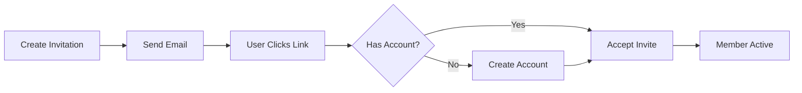

# Playbook: Invite Team Members

**Version:** 1.0.0
**Last Updated:** February 1, 2026
**Audience:** Admin | Team Lead

## Overview

This playbook guides you through inviting external users to your BlockSecOps organization. Learn how to send invitations, manage pending invites, and onboard new team members.

---

## Prerequisites

- [ ] Organization created with Enterprise tier
- [ ] Organization owner or admin role
- [ ] Email addresses of users to invite
- [ ] Understanding of roles to assign

---

## Workflow Diagram



---

## Steps

### Step 1: Navigate to Member Management

**Dashboard:**
1. Click your organization name in the top navigation
2. Select **Members** from the dropdown
3. Or navigate to **Organization > Members**

### Step 2: Send Invitation

**Dashboard:**
1. Click **Invite Members** button
2. Enter email address(es) - one per line or comma-separated
3. Select the role for invited members:
   - **Admin** - Full organization management
   - **Developer** - Create/manage scans and projects
   - **Auditor** - Read-only access
   - **Guest** - Limited access
4. Optionally add to team(s)
5. Add a personal message (optional)
6. Click **Send Invitations**

**API:**
```bash
# Invite single user
curl -X POST "https://app.blocksecops.com/api/v1/organizations/{org_id}/invites" \
  -H "Authorization: Bearer $ACCESS_TOKEN" \
  -H "Content-Type: application/json" \
  -d '{
    "email": "newuser@company.com",
    "role": "developer",
    "teams": ["team_abc123"],
    "message": "Welcome to our security team!"
  }'

# Invite multiple users
curl -X POST "https://app.blocksecops.com/api/v1/organizations/{org_id}/invites/batch" \
  -H "Authorization: Bearer $ACCESS_TOKEN" \
  -H "Content-Type: application/json" \
  -d '{
    "invites": [
      {"email": "alice@company.com", "role": "developer"},
      {"email": "bob@company.com", "role": "developer"},
      {"email": "carol@company.com", "role": "auditor"}
    ],
    "teams": ["team_abc123"],
    "message": "You are invited to join our security team on BlockSecOps."
  }'
```

**Response:**
```json
{
  "invites": [
    {
      "id": "invite_001",
      "email": "alice@company.com",
      "role": "developer",
      "status": "pending",
      "expires_at": "2026-02-08T10:00:00Z",
      "created_at": "2026-02-01T10:00:00Z"
    }
  ],
  "sent": 3,
  "failed": 0
}
```

### Step 3: What the Invitee Receives

**Email Content:**
```
Subject: You've been invited to join [Organization Name] on BlockSecOps

Hi,

[Inviter Name] has invited you to join [Organization Name] on BlockSecOps.

You've been assigned the Developer role.

Personal message:
"Welcome to our security team!"

Click the button below to accept the invitation:

[Accept Invitation]

This invitation expires in 7 days.

If you don't have a BlockSecOps account, you'll be able to create one.

---
BlockSecOps - Smart Contract Security Platform
```

### Step 4: Invitee Accepts Invitation

**New Users:**
1. Click the invitation link in email
2. Redirected to BlockSecOps signup page
3. Create account with email/password or wallet
4. Automatically added to organization with assigned role

**Existing Users:**
1. Click the invitation link in email
2. Log in if not already authenticated
3. Confirm acceptance of invitation
4. Added to organization with assigned role

---

## Managing Invitations

### View Pending Invitations

**Dashboard:**
1. Navigate to **Organization > Members**
2. Click **Pending Invitations** tab
3. View all pending invites with expiration dates

**API:**
```bash
curl -X GET "https://app.blocksecops.com/api/v1/organizations/{org_id}/invites?status=pending" \
  -H "Authorization: Bearer $ACCESS_TOKEN"
```

### Resend Invitation

**Dashboard:**
1. In pending invitations, click **...** menu
2. Select **Resend Invitation**

**API:**
```bash
curl -X POST "https://app.blocksecops.com/api/v1/organizations/{org_id}/invites/{invite_id}/resend" \
  -H "Authorization: Bearer $ACCESS_TOKEN"
```

### Cancel Invitation

**Dashboard:**
1. In pending invitations, click **...** menu
2. Select **Cancel Invitation**
3. Confirm cancellation

**API:**
```bash
curl -X DELETE "https://app.blocksecops.com/api/v1/organizations/{org_id}/invites/{invite_id}" \
  -H "Authorization: Bearer $ACCESS_TOKEN"
```

### Update Invitation Role

Before acceptance, you can change the assigned role:

**API:**
```bash
curl -X PATCH "https://app.blocksecops.com/api/v1/organizations/{org_id}/invites/{invite_id}" \
  -H "Authorization: Bearer $ACCESS_TOKEN" \
  -H "Content-Type: application/json" \
  -d '{
    "role": "admin"
  }'
```

---

## Bulk Invitations

### CSV Import

**Dashboard:**
1. Click **Invite Members > Import CSV**
2. Upload CSV file with format:

```csv
email,role,teams
alice@company.com,developer,"DeFi Team"
bob@company.com,developer,"DeFi Team"
carol@company.com,auditor,
```

3. Review mapped fields
4. Click **Send Invitations**

### API Batch Invite

```bash
curl -X POST "https://app.blocksecops.com/api/v1/organizations/{org_id}/invites/batch" \
  -H "Authorization: Bearer $ACCESS_TOKEN" \
  -H "Content-Type: application/json" \
  -d '{
    "invites": [
      {"email": "user1@company.com", "role": "developer"},
      {"email": "user2@company.com", "role": "developer"},
      {"email": "user3@company.com", "role": "developer"},
      {"email": "user4@company.com", "role": "auditor"},
      {"email": "user5@company.com", "role": "auditor"}
    ],
    "teams": ["team_abc123"],
    "expires_in_days": 14
  }'
```

---

## Invitation Settings

### Organization-Level Settings

**Dashboard:**
1. Navigate to **Organization > Settings > Invitations**
2. Configure:
   - **Expiration period:** 7, 14, or 30 days
   - **Allow member invites:** Let non-admins invite
   - **Domain restriction:** Only allow specific email domains
   - **Auto-add to teams:** Default teams for new members

**API:**
```bash
curl -X PATCH "https://app.blocksecops.com/api/v1/organizations/{org_id}/settings" \
  -H "Authorization: Bearer $ACCESS_TOKEN" \
  -H "Content-Type: application/json" \
  -d '{
    "invite_settings": {
      "expiration_days": 14,
      "allow_member_invites": false,
      "allowed_domains": ["company.com", "contractor.com"],
      "default_teams": ["team_abc123"]
    }
  }'
```

### Domain Restrictions

Restrict invitations to specific email domains:

```bash
curl -X PATCH "https://app.blocksecops.com/api/v1/organizations/{org_id}/settings" \
  -H "Authorization: Bearer $ACCESS_TOKEN" \
  -H "Content-Type: application/json" \
  -d '{
    "invite_settings": {
      "allowed_domains": ["company.com"],
      "block_personal_emails": true
    }
  }'
```

---

## Verification

Confirm invitations are working:

**Dashboard:**
1. Navigate to **Organization > Members**
2. Check **Pending Invitations** for sent invites
3. Verify **Active Members** after acceptance

**API:**
```bash
# List all invites
curl -X GET "https://app.blocksecops.com/api/v1/organizations/{org_id}/invites" \
  -H "Authorization: Bearer $ACCESS_TOKEN"

# Check specific invite status
curl -X GET "https://app.blocksecops.com/api/v1/organizations/{org_id}/invites/{invite_id}" \
  -H "Authorization: Bearer $ACCESS_TOKEN"
```

---

## Troubleshooting

| Issue | Cause | Solution |
|-------|-------|----------|
| "Email already in use" | User already member of org | Check existing members |
| Invitation email not received | Spam filter or wrong address | Check spam, verify email, resend |
| "Domain not allowed" | Domain restriction active | Add domain to allowed list |
| "Invitation expired" | Past expiration date | Send new invitation |
| User can't find organization | Accepted with wrong account | Remove and re-invite |
| "Maximum members reached" | Tier limit exceeded | Upgrade subscription or remove members |
| Invite link broken | Multiple clicks or expired | Resend invitation |

### Check Email Delivery

**API:**
```bash
# Get invitation email status
curl -X GET "https://app.blocksecops.com/api/v1/organizations/{org_id}/invites/{invite_id}/status" \
  -H "Authorization: Bearer $ACCESS_TOKEN"
```

**Response:**
```json
{
  "invite_id": "invite_001",
  "email_status": "delivered",
  "delivered_at": "2026-02-01T10:01:00Z",
  "opened_at": "2026-02-01T10:15:00Z",
  "clicked_at": null
}
```

---

## Onboarding New Members

After invitation acceptance, help new members get started:

### Recommended First Steps

1. **Set up 2FA** - Security requirement
2. **Create API key** - For CLI/integrations
3. **Join team Slack/Teams** - Communication
4. **Review documentation** - Platform overview
5. **Run first scan** - Hands-on experience

### Onboarding Checklist

Share with new members:

- [ ] Accept invitation and create account
- [ ] Set up two-factor authentication
- [ ] Complete profile (name, avatar)
- [ ] Create API key (for developers)
- [ ] Join assigned teams
- [ ] Review project access
- [ ] Run first security scan
- [ ] Install VS Code extension (for developers)

---

## Checklist

- [ ] Email addresses collected
- [ ] Roles determined for each invitee
- [ ] Invitations sent
- [ ] Delivery confirmed (check email status)
- [ ] Pending invitations visible in dashboard
- [ ] Invitees accepted and appear as active members
- [ ] Team assignments confirmed
- [ ] New members onboarded

---

## Related Playbooks

- [Create Organization](./create-organization.md) - Organization setup
- [Create and Manage Teams](./create-team.md) - Team management
- [Configure Roles and Permissions](./configure-roles.md) - RBAC configuration
- [Run First Scan](./run-first-scan.md) - Getting started for new members
