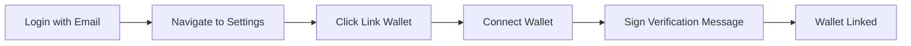

# Playbook: Link Wallet to Account

**Version:** 1.0.0
**Last Updated:** February 1, 2026
**Audience:** End User

## Overview

This playbook guides users through linking an Ethereum wallet to an existing BlockSecOps account. This enables x402 payment support and wallet-based authentication while keeping your email as the primary login method.

---

## Prerequisites

- [ ] Existing BlockSecOps account (email/password)
- [ ] MetaMask browser extension OR WalletConnect-compatible mobile wallet
- [ ] Ethereum wallet with at least one account
- [ ] Access to the wallet you want to link

---

## Workflow Diagram



---

## Steps

### Step 1: Log In to Your Account

**Dashboard:**
1. Go to `https://app.0xapogee.com`
2. Log in with your email and password
3. Complete 2FA if enabled

### Step 2: Navigate to Wallet Settings

**Dashboard:**
1. Click your profile icon in the top-right corner
2. Select **Settings**
3. Click **Wallet** in the left sidebar
4. Or navigate directly to `https://app.0xapogee.com/settings/wallet`

### Step 3: Link New Wallet

**Dashboard:**
1. Click **Link Wallet** button
2. Select wallet provider:
   - **MetaMask** - Browser extension
   - **WalletConnect** - Mobile wallet

### Step 4: Connect and Verify

**If using MetaMask:**
1. MetaMask popup appears
2. Select the account to link
3. Click **Next**, then **Connect**

**If using WalletConnect:**
1. QR code appears
2. Scan with your mobile wallet
3. Approve connection

### Step 5: Sign Verification Message

After connecting, sign a verification message:

**Dashboard:**
1. Signing request appears in your wallet
2. Review the message:
   ```
   Link wallet to BlockSecOps account

   Account: user@example.com
   Wallet: 0x1234...5678
   Nonce: abc123xyz

   This signature proves you own this wallet.
   ```
3. Click **Sign** in your wallet

**API:**
```bash
# Step 1: Request linking nonce
NONCE_RESPONSE=$(curl -X POST "https://app.0xapogee.com/api/v1/users/me/wallets/link" \
  -H "Authorization: Bearer $ACCESS_TOKEN" \
  -H "Content-Type: application/json" \
  -d '{
    "address": "0xYourWalletAddress"
  }')

NONCE=$(echo $NONCE_RESPONSE | jq -r '.nonce')
MESSAGE=$(echo $NONCE_RESPONSE | jq -r '.message')

# Step 2: Sign the message with your wallet (done off-chain)

# Step 3: Confirm the link
curl -X POST "https://app.0xapogee.com/api/v1/users/me/wallets/confirm" \
  -H "Authorization: Bearer $ACCESS_TOKEN" \
  -H "Content-Type: application/json" \
  -d '{
    "address": "0xYourWalletAddress",
    "signature": "0xSignedMessage..."
  }'
```

### Step 6: Configure Wallet Settings

**Dashboard:**
1. After linking, configure wallet preferences:
   - **Primary Wallet:** Set as primary for x402 payments
   - **Login Method:** Enable wallet login
   - **Notification Wallet Events:** Receive alerts for wallet activity
2. Click **Save Settings**

---

## Managing Linked Wallets

### View Linked Wallets

**Dashboard:**
1. Navigate to **Settings > Wallet**
2. View all linked wallets with details:
   - Address
   - Chain
   - Link date
   - Primary status

**API:**
```bash
curl -X GET "https://app.0xapogee.com/api/v1/users/me/wallets" \
  -H "Authorization: Bearer $ACCESS_TOKEN"
```

**Response:**
```json
{
  "wallets": [
    {
      "id": "wallet_abc123",
      "address": "0x1234567890abcdef...",
      "chain": "ethereum",
      "linked_at": "2026-02-01T10:00:00Z",
      "is_primary": true,
      "ens_name": "myname.eth"
    }
  ]
}
```

### Set Primary Wallet

**Dashboard:**
1. Click **...** next to the wallet
2. Select **Set as Primary**

**API:**
```bash
curl -X PATCH "https://app.0xapogee.com/api/v1/users/me/wallets/{wallet_id}" \
  -H "Authorization: Bearer $ACCESS_TOKEN" \
  -H "Content-Type: application/json" \
  -d '{
    "is_primary": true
  }'
```

### Unlink Wallet

**Dashboard:**
1. Click **...** next to the wallet
2. Select **Unlink Wallet**
3. Confirm unlinking

**API:**
```bash
curl -X DELETE "https://app.0xapogee.com/api/v1/users/me/wallets/{wallet_id}" \
  -H "Authorization: Bearer $ACCESS_TOKEN"
```

### Link Additional Wallets

You can link multiple wallets:

**Dashboard:**
1. Navigate to **Settings > Wallet**
2. Click **Link Another Wallet**
3. Follow the connection process

---

## Login with Linked Wallet

After linking, you can log in with your wallet:

**Dashboard:**
1. Go to login page
2. Click **Connect Wallet** instead of entering email
3. Select your linked wallet
4. Sign the SIWE message
5. You're logged into your email account

---

## x402 Payment Setup

With a linked wallet, enable x402 payments:

### Enable x402

**Dashboard:**
1. Navigate to **Settings > Payments**
2. Toggle **Enable x402 Payments**
3. Select your primary wallet
4. Configure spending limits (optional)

**API:**
```bash
curl -X PATCH "https://app.0xapogee.com/api/v1/users/me/settings" \
  -H "Authorization: Bearer $ACCESS_TOKEN" \
  -H "Content-Type: application/json" \
  -d '{
    "x402_enabled": true,
    "x402_wallet_id": "wallet_abc123",
    "x402_spending_limit": "100.00"
  }'
```

### Check x402 Status

**API:**
```bash
curl -X GET "https://app.0xapogee.com/api/v1/users/me/x402/status" \
  -H "Authorization: Bearer $ACCESS_TOKEN"
```

---

## Verification

Confirm wallet is linked correctly:

**Dashboard:**
1. Navigate to **Settings > Wallet**
2. Verify wallet address is displayed
3. Check "Primary" badge if set
4. Test wallet login (log out, use wallet to log in)

**API:**
```bash
# List linked wallets
curl -X GET "https://app.0xapogee.com/api/v1/users/me/wallets" \
  -H "Authorization: Bearer $ACCESS_TOKEN"

# Verify wallet login works
curl -X POST "https://app.0xapogee.com/api/v1/auth/wallet/verify" \
  -H "Content-Type: application/json" \
  -d '{
    "address": "0xYourWalletAddress",
    "signature": "...",
    "message": "..."
  }'
```

---

## Troubleshooting

| Issue | Cause | Solution |
|-------|-------|----------|
| "Wallet already linked" | Address linked to another account | Use different wallet or contact support |
| "Signature verification failed" | Wrong account signed | Ensure correct account selected in wallet |
| MetaMask not detecting | Extension disabled | Enable MetaMask extension |
| "Network mismatch" | Wallet on wrong network | Switch to Ethereum Mainnet |
| Can't unlink last wallet | Wallet is only login method | Keep email login enabled before unlinking |
| "Connection rejected" | User cancelled in wallet | Retry and approve connection |
| ENS name not showing | ENS not resolved | Wait for resolution or manually add |

---

## Security Considerations

### Best Practices

1. **Only link wallets you control:** Never link shared or compromised wallets
2. **Verify the domain:** Ensure you're on `app.0xapogee.com`
3. **Read the message:** Check the signing message is correct
4. **Use hardware wallet:** For high-value accounts, use Ledger/Trezor
5. **Enable 2FA:** Keep 2FA enabled even with wallet login
6. **Audit linked wallets:** Periodically review and remove unused wallets

### What the Signature Authorizes

The linking signature ONLY:
- Proves you own the wallet address
- Links the address to your account

It does NOT:
- Transfer funds
- Approve token spending
- Grant access to your assets

---

## Checklist

- [ ] Logged in with email/password
- [ ] Navigated to Settings > Wallet
- [ ] Clicked Link Wallet
- [ ] Connected wallet (MetaMask/WalletConnect)
- [ ] Signed verification message
- [ ] Wallet appears in settings
- [ ] Set as primary (if desired)
- [ ] Tested wallet login (optional)
- [ ] Enabled x402 payments (optional)

---

## Related Playbooks

- [Connect Wallet](./connect-wallet.md) - Initial wallet authentication
- [API Key Management](./api-key-management.md) - API access setup
- [Run First Scan](./run-first-scan.md) - Getting started with scanning
