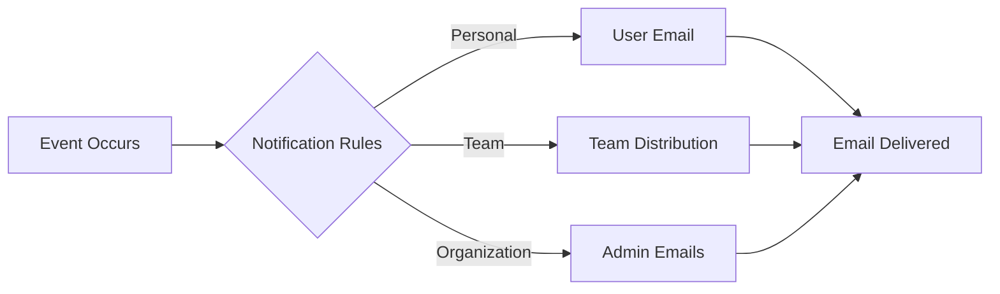

# Playbook: Email Notifications

**Version:** 1.0.0
**Last Updated:** February 1, 2026
**Audience:** End User | Admin

## Overview

This playbook guides you through configuring email notifications for BlockSecOps security events. Set up personal notifications, team digests, and organization-wide alerts.

---

## Prerequisites

- [ ] Active BlockSecOps account
- [ ] Verified email address
- [ ] Organization admin role (for organization-wide settings)

---

## Workflow Diagram



---

## Steps

### Step 1: Configure Personal Notifications

**Dashboard:**
1. Click your profile icon in the top-right corner
2. Select **Settings**
3. Click **Notifications** in the left sidebar
4. Configure email preferences:

| Notification | Description | Default |
|--------------|-------------|---------|
| Scan Completed | Email when your scans finish | On |
| Critical Vulnerability | Immediate alert for critical findings | On |
| High Vulnerability | Alert for high-severity findings | On |
| Weekly Summary | Weekly digest of all findings | On |
| Scan Failed | Alert when scans error | On |
| Project Shared | Notification when project shared with you | On |
| Team Invite | Notification for team invitations | On |

5. Click **Save Preferences**

**API:**
```bash
curl -X PATCH "https://app.blocksecops.com/api/v1/users/me/notifications" \
  -H "Authorization: Bearer $ACCESS_TOKEN" \
  -H "Content-Type: application/json" \
  -d '{
    "email": {
      "scan_completed": true,
      "vulnerability_critical": true,
      "vulnerability_high": true,
      "weekly_summary": true,
      "scan_failed": true,
      "project_shared": true,
      "team_invite": true
    }
  }'
```

### Step 2: Configure Email Frequency

**Dashboard:**
1. In Notification settings, scroll to **Email Frequency**
2. Configure:
   - **Immediate:** Send emails as events occur
   - **Hourly Digest:** Batch notifications hourly
   - **Daily Digest:** Single email per day
3. Set quiet hours (optional): No emails between specified times

**API:**
```bash
curl -X PATCH "https://app.blocksecops.com/api/v1/users/me/notifications" \
  -H "Authorization: Bearer $ACCESS_TOKEN" \
  -H "Content-Type: application/json" \
  -d '{
    "email_frequency": "immediate",
    "quiet_hours": {
      "enabled": true,
      "start": "22:00",
      "end": "07:00",
      "timezone": "America/New_York"
    }
  }'
```

### Step 3: Add Additional Email Addresses

**Dashboard:**
1. In Settings, click **Email Addresses**
2. Click **Add Email**
3. Enter the additional email address
4. Click **Send Verification**
5. Verify via email link
6. Select which notifications go to each address

**API:**
```bash
# Add secondary email
curl -X POST "https://app.blocksecops.com/api/v1/users/me/emails" \
  -H "Authorization: Bearer $ACCESS_TOKEN" \
  -H "Content-Type: application/json" \
  -d '{
    "email": "alerts@mycompany.com",
    "notifications": ["vulnerability_critical", "vulnerability_high"]
  }'
```

---

## Organization Email Notifications

### Configure Organization Alerts (Admin Only)

**Dashboard:**
1. Navigate to **Organization > Settings > Notifications**
2. Configure organization-wide email settings:

| Setting | Description |
|---------|-------------|
| Security Alerts | Critical/High findings to all admins |
| Weekly Digest | Weekly summary to org admins |
| Member Activity | New member joins, role changes |
| Billing Alerts | Payment issues, tier limits |

**API:**
```bash
curl -X PATCH "https://app.blocksecops.com/api/v1/organizations/{org_id}/notifications" \
  -H "Authorization: Bearer $ACCESS_TOKEN" \
  -H "Content-Type: application/json" \
  -d '{
    "email": {
      "security_alerts": true,
      "weekly_digest": true,
      "member_activity": true,
      "billing_alerts": true
    },
    "recipients": {
      "security_alerts": ["admin1@company.com", "admin2@company.com"],
      "billing_alerts": ["finance@company.com"]
    }
  }'
```

### Configure Team Email Notifications

**Dashboard:**
1. Navigate to **Organization > Teams > [Team Name] > Settings**
2. Configure team notifications:
   - **Team Digest:** Weekly summary for team
   - **New Findings:** Alert when new vulnerabilities found
3. Add team distribution email (optional)

**API:**
```bash
curl -X PATCH "https://app.blocksecops.com/api/v1/teams/{team_id}/notifications" \
  -H "Authorization: Bearer $ACCESS_TOKEN" \
  -H "Content-Type: application/json" \
  -d '{
    "email": {
      "team_digest": true,
      "new_findings": true
    },
    "distribution_email": "security-team@company.com"
  }'
```

---

## Email Templates

### Scan Completed

```
Subject: [BlockSecOps] Scan Completed: Token.sol

Hi [Name],

Your security scan has completed.

Project: My DeFi Project
Contract: Token.sol
Status: Completed with findings

Vulnerability Summary:
- Critical: 0
- High: 2
- Medium: 5
- Low: 3

Top Findings:
1. Reentrancy in withdraw() [High]
2. Unchecked return value in transfer() [High]
3. Missing input validation [Medium]

[View Full Report]

---
BlockSecOps - Smart Contract Security Platform
Manage notifications: https://app.blocksecops.com/settings/notifications
```

### Critical Vulnerability Alert

```
Subject: [CRITICAL] Vulnerability Found: Reentrancy in Vault.sol

CRITICAL SECURITY ALERT

A critical vulnerability has been detected in your smart contract.

Details:
- Contract: Vault.sol
- Line: 142
- Type: Reentrancy
- Severity: CRITICAL

Description:
External call made before state update allows reentrancy attack.
Attackers can drain contract funds by recursively calling withdraw().

Immediate Action Required:
1. Review the finding in BlockSecOps
2. Apply the recommended fix
3. Re-scan after fixing

[View Vulnerability] [View Recommended Fix]

---
This is an automated security alert from BlockSecOps.
```

### Weekly Summary

```
Subject: [BlockSecOps] Weekly Security Summary - Jan 27-Feb 1

Weekly Security Summary
January 27 - February 1, 2026

Organization: Acme Security

Scan Activity:
- Scans completed: 24
- New vulnerabilities: 47
- Fixed vulnerabilities: 12

Vulnerability Breakdown:
| Severity | New | Fixed | Open |
|----------|-----|-------|------|
| Critical | 2   | 1     | 3    |
| High     | 8   | 4     | 15   |
| Medium   | 22  | 5     | 45   |
| Low      | 15  | 2     | 28   |

Top Projects by Risk:
1. Vault-v2 (12 critical/high)
2. Token-upgrade (8 critical/high)
3. Governance (3 critical/high)

[View Dashboard] [Configure Notifications]

---
BlockSecOps - Smart Contract Security Platform
```

---

## Verification

Confirm email notifications are working:

**Dashboard:**
1. Navigate to **Settings > Notifications**
2. Click **Send Test Email**
3. Check your inbox for test message

**API:**
```bash
curl -X POST "https://app.blocksecops.com/api/v1/users/me/notifications/test" \
  -H "Authorization: Bearer $ACCESS_TOKEN" \
  -H "Content-Type: application/json" \
  -d '{
    "type": "scan_completed"
  }'
```

**Check Notification History:**
```bash
curl -X GET "https://app.blocksecops.com/api/v1/users/me/notifications/history" \
  -H "Authorization: Bearer $ACCESS_TOKEN"
```

---

## Troubleshooting

| Issue | Cause | Solution |
|-------|-------|----------|
| Not receiving emails | Email in spam folder | Add no-reply@blocksecops.com to contacts |
| "Email not verified" | Secondary email not confirmed | Check inbox for verification email |
| Too many emails | Frequency set to immediate | Change to digest mode |
| Missing critical alerts | Notifications disabled | Re-enable in settings |
| Quiet hours not working | Wrong timezone | Verify timezone setting |
| Team email not delivering | Invalid distribution list | Verify team email address |
| Unsubscribe not working | Cookie/session issue | Log in and update settings |

### Email Deliverability

If emails are not arriving:

1. **Check spam/junk folder**
2. **Add to safe senders:**
   - `no-reply@blocksecops.com`
   - `alerts@blocksecops.com`
3. **Check corporate email filters**
4. **Verify email address is correct**
5. **Check notification history** for delivery status

---

## Unsubscribe Options

### Unsubscribe from Specific Notifications

**Dashboard:**
1. Navigate to **Settings > Notifications**
2. Toggle off unwanted notification types
3. Click **Save**

### Unsubscribe via Email Link

Each email contains an unsubscribe link:
1. Click "Unsubscribe" in email footer
2. Select notifications to disable
3. Confirm changes

### Unsubscribe from All Emails

**Dashboard:**
1. Navigate to **Settings > Notifications**
2. Click **Unsubscribe from All**
3. Confirm (note: critical security alerts cannot be disabled for admins)

---

## Checklist

- [ ] Personal notification preferences configured
- [ ] Email frequency set appropriately
- [ ] Quiet hours configured (optional)
- [ ] Additional email addresses added (optional)
- [ ] Organization notifications configured (admin)
- [ ] Team notifications configured (team lead)
- [ ] Test email received successfully
- [ ] Safe sender list updated

---

## Related Playbooks

- [Slack Integration](./chatops-slack.md) - Slack notifications
- [Microsoft Teams Integration](./chatops-teams.md) - Teams notifications
- [Discord Integration](./chatops-discord.md) - Discord notifications
- [Create Organization](./create-organization.md) - Organization settings
