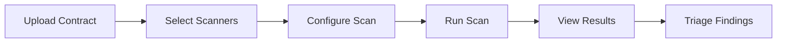

# Playbook: Run First Scan

**Version:** 1.0.0
**Last Updated:** February 1, 2026
**Audience:** End User | Developer

## Overview

This playbook guides new users through running their first security scan on BlockSecOps. Learn how to upload a smart contract, configure scan settings, run the scan, and interpret the results.

---

## Prerequisites

- [ ] Active BlockSecOps account (any tier)
- [ ] Solidity smart contract file(s) to scan
- [ ] Project created (or create during this workflow)

---

## Workflow Diagram



---

## Steps

### Step 1: Create or Select Project

**Dashboard:**
1. Navigate to **Projects**
2. Click **Create Project** (or select existing project)
3. Enter project details:
   - **Name:** Descriptive project name (e.g., "Token V2 Audit")
   - **Description:** Brief project description
   - **Blockchain:** Ethereum, Polygon, BSC, etc.
4. Click **Create Project**

**API:**
```bash
# Create new project
curl -X POST "https://app.0xapogee.com/api/v1/projects" \
  -H "Authorization: Bearer $ACCESS_TOKEN" \
  -H "Content-Type: application/json" \
  -d '{
    "name": "Token V2 Audit",
    "description": "Security audit for Token V2 contracts",
    "blockchain": "ethereum"
  }'
```

### Step 2: Upload Contract

**Dashboard:**
1. In your project, click **Add Contract**
2. Choose upload method:
   - **File Upload:** Drag and drop `.sol` files
   - **Paste Code:** Copy/paste contract source
   - **GitHub Import:** Connect GitHub repo
3. If uploading multiple files, include all dependencies
4. Click **Upload**

**API:**
```bash
# Upload contract file
curl -X POST "https://app.0xapogee.com/api/v1/contracts" \
  -H "Authorization: Bearer $ACCESS_TOKEN" \
  -H "Content-Type: multipart/form-data" \
  -F "project_id=proj_abc123" \
  -F "file=@contracts/Token.sol" \
  -F "name=Token.sol"

# Or upload source code directly
curl -X POST "https://app.0xapogee.com/api/v1/contracts" \
  -H "Authorization: Bearer $ACCESS_TOKEN" \
  -H "Content-Type: application/json" \
  -d '{
    "project_id": "proj_abc123",
    "name": "Token.sol",
    "source_code": "// SPDX-License-Identifier: MIT\npragma solidity ^0.8.0;\n\ncontract Token {\n    // ...\n}"
  }'
```

### Step 3: Configure Scan Settings

**Dashboard:**
1. Click **New Scan** on the contract or project page
2. Configure scan options:
   - **Contract(s):** Select which contracts to scan
   - **Scanners:** Choose security scanners to run
   - **Solidity Version:** Auto-detected or manual (e.g., 0.8.19)
   - **Optimization:** Enable if contracts use optimizer
3. Advanced options (optional):
   - **Timeout:** Maximum scan duration
   - **Severity threshold:** Minimum severity to report

**Scanner Selection Guide:**

| Scanner | Strengths | Best For |
|---------|-----------|----------|
| SolidityDefend | Comprehensive SAST, 287+ detectors | All contracts |
| Slither | Fast static analysis | Quick checks |
| Mythril | Symbolic execution | Complex logic bugs |
| Aderyn | Rust-based, fast | Modern contracts |

**API:**
```bash
# Create scan with specific scanners
curl -X POST "https://app.0xapogee.com/api/v1/scans" \
  -H "Authorization: Bearer $ACCESS_TOKEN" \
  -H "Content-Type: application/json" \
  -d '{
    "project_id": "proj_abc123",
    "contract_ids": ["contract_def456"],
    "scanners": ["soliditydefend", "slither", "mythril"],
    "config": {
      "solc_version": "0.8.19",
      "optimizer_enabled": true,
      "optimizer_runs": 200
    }
  }'
```

### Step 4: Run the Scan

**Dashboard:**
1. Review scan configuration
2. Click **Start Scan**
3. You'll be redirected to the scan progress page
4. Watch real-time progress as each scanner runs

**Scan Status:**
| Status | Description |
|--------|-------------|
| Queued | Waiting for available scanner |
| Running | Scan in progress |
| Completed | Scan finished successfully |
| Failed | Error during scan |
| Cancelled | User cancelled scan |

**API:**
```bash
# Start scan (if created without auto-start)
curl -X POST "https://app.0xapogee.com/api/v1/scans/{scan_id}/start" \
  -H "Authorization: Bearer $ACCESS_TOKEN"

# Check scan status
curl -X GET "https://app.0xapogee.com/api/v1/scans/{scan_id}" \
  -H "Authorization: Bearer $ACCESS_TOKEN"
```

### Step 5: View Scan Results

**Dashboard:**
1. Once scan completes, click **View Results**
2. Review the vulnerability summary:
   - Critical, High, Medium, Low counts
   - Scanner breakdown
3. Click on individual findings for details

**Results Overview:**
| Section | Information |
|---------|-------------|
| Summary | Severity breakdown, scan duration |
| Findings | List of vulnerabilities found |
| Contracts | Per-contract results |
| Scanners | Per-scanner results |

**API:**
```bash
# Get scan results
curl -X GET "https://app.0xapogee.com/api/v1/scans/{scan_id}" \
  -H "Authorization: Bearer $ACCESS_TOKEN"

# Get vulnerabilities for scan
curl -X GET "https://app.0xapogee.com/api/v1/scans/{scan_id}/vulnerabilities" \
  -H "Authorization: Bearer $ACCESS_TOKEN"
```

### Step 6: Review Findings

**Dashboard:**
1. Click on a finding to view details:
   - **Title:** Vulnerability type
   - **Severity:** Critical, High, Medium, Low
   - **Location:** File, line number, function
   - **Description:** What the vulnerability is
   - **Recommendation:** How to fix it
   - **Code Snippet:** Affected code highlighted
2. Use the code viewer to see the vulnerability in context

**Finding Details:**
```json
{
  "id": "vuln_xyz789",
  "title": "Reentrancy Vulnerability",
  "severity": "high",
  "category": "reentrancy",
  "location": {
    "file": "Vault.sol",
    "line_start": 142,
    "line_end": 150,
    "function": "withdraw"
  },
  "description": "External call made before state update allows reentrancy attack.",
  "recommendation": "Follow checks-effects-interactions pattern. Update state before external call.",
  "code_snippet": "function withdraw() external {\n    uint amount = balances[msg.sender];\n    (bool success,) = msg.sender.call{value: amount}(\"\");\n    require(success);\n    balances[msg.sender] = 0; // State update after external call\n}"
}
```

### Step 7: Triage Findings

**Dashboard:**
1. For each finding, set the status:
   - **Open:** Needs investigation
   - **Confirmed:** Valid finding, needs fix
   - **Fixed:** Issue has been resolved
   - **False Positive:** Not a real vulnerability
   - **Accepted Risk:** Known issue, accepted
2. Add notes or comments for context
3. Assign to team member (if using teams)

**API:**
```bash
# Update finding status
curl -X PATCH "https://app.0xapogee.com/api/v1/vulnerabilities/{vuln_id}" \
  -H "Authorization: Bearer $ACCESS_TOKEN" \
  -H "Content-Type: application/json" \
  -d '{
    "status": "confirmed",
    "notes": "Verified reentrancy vulnerability in withdraw function. Priority fix.",
    "assignee_id": "user_dev123"
  }'
```

---

## Understanding Severity Levels

| Severity | Color | Meaning | Action |
|----------|-------|---------|--------|
| **Critical** | Red | Immediate exploitation risk, fund loss | Fix immediately |
| **High** | Orange | Significant security risk | Fix before deployment |
| **Medium** | Yellow | Moderate risk, conditional exploit | Fix recommended |
| **Low** | Blue | Minor issue, best practice | Consider fixing |
| **Informational** | Gray | Code quality, gas optimization | Optional |

---

## Verification

Confirm your first scan was successful:

1. **Scan Completed:** Status shows "Completed"
2. **Results Available:** Vulnerability count displayed
3. **Findings Visible:** Can click into individual findings
4. **Actions Work:** Can update finding status

**API:**
```bash
# Verify scan completed
curl -X GET "https://app.0xapogee.com/api/v1/scans/{scan_id}" \
  -H "Authorization: Bearer $ACCESS_TOKEN" | jq '.status'
# Expected: "completed"

# Verify findings exist
curl -X GET "https://app.0xapogee.com/api/v1/scans/{scan_id}/vulnerabilities" \
  -H "Authorization: Bearer $ACCESS_TOKEN" | jq '.total'
```

---

## Troubleshooting

| Issue | Cause | Solution |
|-------|-------|----------|
| "Compilation failed" | Invalid Solidity syntax | Fix syntax errors in contract |
| "Import not found" | Missing dependencies | Upload all imported contracts |
| "Solc version not supported" | Unsupported compiler version | Use supported version (0.6.x - 0.8.x) |
| Scan stuck on "Running" | Scanner timeout | Cancel and retry with fewer scanners |
| No vulnerabilities found | Clean code or scanner limitations | Run additional scanners |
| "Rate limit exceeded" | Too many scans | Wait or upgrade tier |

### Common Compilation Errors

**Missing Import:**
```
Error: Source "OpenZeppelin/openzeppelin-contracts@4.9.0/contracts/token/ERC20/ERC20.sol" not found
```
**Solution:** Upload the imported contract files or use flattened source.

**Wrong Solc Version:**
```
Error: Source file requires different compiler version
```
**Solution:** Select correct Solidity version in scan config.

---

## Checklist

- [ ] Project created (or selected existing)
- [ ] Contract(s) uploaded successfully
- [ ] Scanners selected
- [ ] Scan configuration reviewed
- [ ] Scan started and completed
- [ ] Results reviewed
- [ ] Findings triaged (status updated)
- [ ] Critical/High findings documented

---

## Next Steps

After your first scan:

1. **Fix Critical Issues:** Address critical and high findings
2. **Re-scan After Fixes:** Verify issues are resolved
3. **Set Up CI/CD:** Automate scanning in your pipeline
4. **Configure Notifications:** Get alerts for new findings
5. **Schedule Regular Scans:** Set up recurring scans

---

## Related Playbooks

- [Create Project](./create-project.md) - Detailed project setup
- [Batch Scanning](./batch-scanning.md) - Scan multiple contracts
- [GitHub Actions Integration](./cicd-github-actions.md) - Automate scans
- [CLI Installation](./cli-installation.md) - Scan from command line
