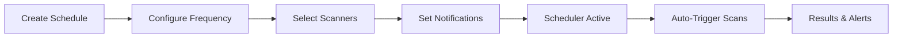

# Playbook: Schedule Recurring Scans

**Version:** 1.0.0
**Last Updated:** February 1, 2026
**Audience:** Developer | Team Lead

## Overview

This playbook guides you through setting up automated recurring scans for your smart contract projects. Schedule daily, weekly, or custom interval scans to maintain continuous security monitoring.

---

## Prerequisites

- [ ] BlockSecOps account with Growth or Enterprise tier
- [ ] Project created with contracts uploaded
- [ ] Understanding of desired scan frequency
- [ ] Notification channels configured (recommended)

---

## Workflow Diagram



---

## Steps

### Step 1: Navigate to Schedules

**Dashboard:**
1. Navigate to your project
2. Click **Scans** in the project menu
3. Click **Schedules** tab
4. Or go to **Settings > Scan Schedules**

### Step 2: Create New Schedule

**Dashboard:**
1. Click **Create Schedule** button
2. Enter schedule details:
   - **Name:** Descriptive name (e.g., "Weekly Security Scan")
   - **Description:** Purpose of this schedule
   - **Enabled:** Toggle to activate

**API:**
```bash
curl -X POST "https://app.0xapogee.com/api/v1/schedules" \
  -H "Authorization: Bearer $ACCESS_TOKEN" \
  -H "Content-Type: application/json" \
  -d '{
    "name": "Weekly Security Scan",
    "description": "Automated weekly security scan of all contracts",
    "project_id": "proj_abc123",
    "enabled": true
  }'
```

### Step 3: Configure Frequency

**Dashboard:**
1. Select frequency type:
   - **Hourly:** Every X hours
   - **Daily:** Once per day at specified time
   - **Weekly:** Specific day(s) of the week
   - **Monthly:** Specific day of the month
   - **Custom Cron:** Advanced cron expression
2. Set the schedule time (in your timezone)

**Common Schedules:**

| Schedule | Cron Expression | Description |
|----------|-----------------|-------------|
| Daily at midnight | `0 0 * * *` | Every day at 00:00 |
| Daily at 6 AM | `0 6 * * *` | Every day at 06:00 |
| Weekly Monday | `0 6 * * 1` | Monday at 06:00 |
| Bi-weekly | `0 6 * * 1/2` | Every other Monday |
| First of month | `0 6 1 * *` | 1st of each month |

**API:**
```bash
curl -X PATCH "https://app.0xapogee.com/api/v1/schedules/{schedule_id}" \
  -H "Authorization: Bearer $ACCESS_TOKEN" \
  -H "Content-Type: application/json" \
  -d '{
    "frequency": "weekly",
    "cron": "0 6 * * 1",
    "timezone": "America/New_York"
  }'
```

### Step 4: Select Contracts and Scanners

**Dashboard:**
1. In schedule configuration, select **Scope**:
   - **All Contracts:** Scan every contract in project
   - **Selected Contracts:** Choose specific contracts
   - **Path Pattern:** Match by file path (e.g., `contracts/core/*`)
2. Select scanners to run:
   - SolidityDefend
   - Slither
   - Mythril
   - Aderyn
3. Configure scan options:
   - **Solidity Version:** Auto or specify
   - **Fail Threshold:** Severity level to mark as failed

**API:**
```bash
curl -X PATCH "https://app.0xapogee.com/api/v1/schedules/{schedule_id}" \
  -H "Authorization: Bearer $ACCESS_TOKEN" \
  -H "Content-Type: application/json" \
  -d '{
    "scope": {
      "type": "all",
      "contracts": null,
      "path_pattern": null
    },
    "scanners": ["soliditydefend", "slither", "mythril"],
    "config": {
      "solc_version": "auto",
      "fail_threshold": "high"
    }
  }'
```

### Step 5: Configure Notifications

**Dashboard:**
1. In schedule settings, click **Notifications**
2. Configure alert settings:
   - **Always Notify:** Send notification for every scheduled scan
   - **Notify on Findings:** Only when vulnerabilities found
   - **Notify on Critical/High:** Only for serious findings
   - **Notify on Failure:** When scan errors occur
3. Select notification channels:
   - Email
   - Slack
   - Microsoft Teams
   - Discord

**API:**
```bash
curl -X PATCH "https://app.0xapogee.com/api/v1/schedules/{schedule_id}" \
  -H "Authorization: Bearer $ACCESS_TOKEN" \
  -H "Content-Type: application/json" \
  -d '{
    "notifications": {
      "on_complete": false,
      "on_findings": true,
      "on_critical": true,
      "on_failure": true,
      "channels": ["email", "slack_channel_abc123"]
    }
  }'
```

### Step 6: Activate Schedule

**Dashboard:**
1. Review schedule configuration
2. Toggle **Enabled** to ON
3. Click **Save Schedule**

**API:**
```bash
curl -X PATCH "https://app.0xapogee.com/api/v1/schedules/{schedule_id}" \
  -H "Authorization: Bearer $ACCESS_TOKEN" \
  -H "Content-Type: application/json" \
  -d '{
    "enabled": true
  }'
```

---

## Managing Schedules

### View All Schedules

**Dashboard:**
1. Navigate to **Settings > Scan Schedules**
2. View all schedules with:
   - Name and frequency
   - Last run time
   - Next run time
   - Status (enabled/disabled)

**API:**
```bash
curl -X GET "https://app.0xapogee.com/api/v1/schedules" \
  -H "Authorization: Bearer $ACCESS_TOKEN"
```

### Pause Schedule

**Dashboard:**
1. Click **...** menu on the schedule
2. Select **Pause Schedule**

**API:**
```bash
curl -X PATCH "https://app.0xapogee.com/api/v1/schedules/{schedule_id}" \
  -H "Authorization: Bearer $ACCESS_TOKEN" \
  -H "Content-Type: application/json" \
  -d '{
    "enabled": false
  }'
```

### Run Schedule Manually

Trigger a scheduled scan immediately:

**Dashboard:**
1. Click **...** menu on the schedule
2. Select **Run Now**

**API:**
```bash
curl -X POST "https://app.0xapogee.com/api/v1/schedules/{schedule_id}/run" \
  -H "Authorization: Bearer $ACCESS_TOKEN"
```

### View Schedule History

**Dashboard:**
1. Click on a schedule
2. View **History** tab for past runs

**API:**
```bash
curl -X GET "https://app.0xapogee.com/api/v1/schedules/{schedule_id}/history" \
  -H "Authorization: Bearer $ACCESS_TOKEN"
```

### Delete Schedule

**Dashboard:**
1. Click **...** menu on the schedule
2. Select **Delete Schedule**
3. Confirm deletion

**API:**
```bash
curl -X DELETE "https://app.0xapogee.com/api/v1/schedules/{schedule_id}" \
  -H "Authorization: Bearer $ACCESS_TOKEN"
```

---

## Schedule Templates

### Daily Development Check

```bash
curl -X POST "https://app.0xapogee.com/api/v1/schedules" \
  -H "Authorization: Bearer $ACCESS_TOKEN" \
  -H "Content-Type: application/json" \
  -d '{
    "name": "Daily Development Check",
    "project_id": "proj_abc123",
    "frequency": "daily",
    "cron": "0 6 * * *",
    "timezone": "America/New_York",
    "scanners": ["soliditydefend", "slither"],
    "notifications": {
      "on_critical": true,
      "on_failure": true
    },
    "enabled": true
  }'
```

### Weekly Comprehensive Audit

```bash
curl -X POST "https://app.0xapogee.com/api/v1/schedules" \
  -H "Authorization: Bearer $ACCESS_TOKEN" \
  -H "Content-Type: application/json" \
  -d '{
    "name": "Weekly Comprehensive Audit",
    "project_id": "proj_abc123",
    "frequency": "weekly",
    "cron": "0 2 * * 1",
    "timezone": "UTC",
    "scanners": ["soliditydefend", "slither", "mythril", "aderyn"],
    "notifications": {
      "on_complete": true,
      "channels": ["email", "slack_security"]
    },
    "enabled": true
  }'
```

### Pre-Deployment Check

```bash
curl -X POST "https://app.0xapogee.com/api/v1/schedules" \
  -H "Authorization: Bearer $ACCESS_TOKEN" \
  -H "Content-Type: application/json" \
  -d '{
    "name": "Pre-Deployment Check",
    "project_id": "proj_abc123",
    "frequency": "custom",
    "trigger": "github_push",
    "branch": "main",
    "scanners": ["soliditydefend", "slither"],
    "config": {
      "fail_threshold": "high"
    },
    "notifications": {
      "on_failure": true,
      "on_critical": true
    },
    "enabled": true
  }'
```

---

## Verification

Confirm schedule is working:

**Dashboard:**
1. Navigate to **Settings > Scan Schedules**
2. Verify schedule shows "Enabled"
3. Check "Next Run" shows correct time
4. Wait for scheduled time or click "Run Now"
5. Verify scan appears in project scans

**API:**
```bash
# Check schedule status
curl -X GET "https://app.0xapogee.com/api/v1/schedules/{schedule_id}" \
  -H "Authorization: Bearer $ACCESS_TOKEN" | jq '.enabled, .next_run'

# Check recent history
curl -X GET "https://app.0xapogee.com/api/v1/schedules/{schedule_id}/history?limit=5" \
  -H "Authorization: Bearer $ACCESS_TOKEN"
```

---

## Troubleshooting

| Issue | Cause | Solution |
|-------|-------|----------|
| Schedule not running | Disabled or invalid config | Check enabled status and cron |
| Wrong time | Timezone mismatch | Verify timezone setting |
| "No contracts found" | Scope filter too strict | Check contract selection |
| Notifications not sending | Channel not configured | Add notification channels |
| Scan failing | Contract compilation error | Fix contract issues |
| Rate limit exceeded | Too frequent scheduling | Increase interval |
| Missing scans in history | Scan still queued | Wait for completion |

### Check Scheduler Logs

**API:**
```bash
curl -X GET "https://app.0xapogee.com/api/v1/schedules/{schedule_id}/logs" \
  -H "Authorization: Bearer $ACCESS_TOKEN"
```

---

## Best Practices

1. **Development Projects:** Daily scans during active development
2. **Production Contracts:** Weekly comprehensive scans
3. **High-Risk Projects:** More frequent + all scanners
4. **Quiet Hours:** Schedule during low-traffic periods
5. **Notification Balance:** Avoid alert fatigue with smart thresholds
6. **Review Results:** Regularly review scheduled scan results
7. **Cleanup Old Schedules:** Remove unused schedules

---

## Checklist

- [ ] Schedule created with descriptive name
- [ ] Frequency configured appropriately
- [ ] Timezone set correctly
- [ ] Contracts/scope selected
- [ ] Scanners chosen
- [ ] Notifications configured
- [ ] Schedule enabled
- [ ] Test run completed successfully
- [ ] Notifications received
- [ ] History shows correct runs

---

## Related Playbooks

- [Run First Scan](./run-first-scan.md) - Manual scanning
- [Batch Scanning](./batch-scanning.md) - Scan multiple contracts
- [Slack Integration](./chatops-slack.md) - Notification setup
- [Create Project](./create-project.md) - Project configuration
