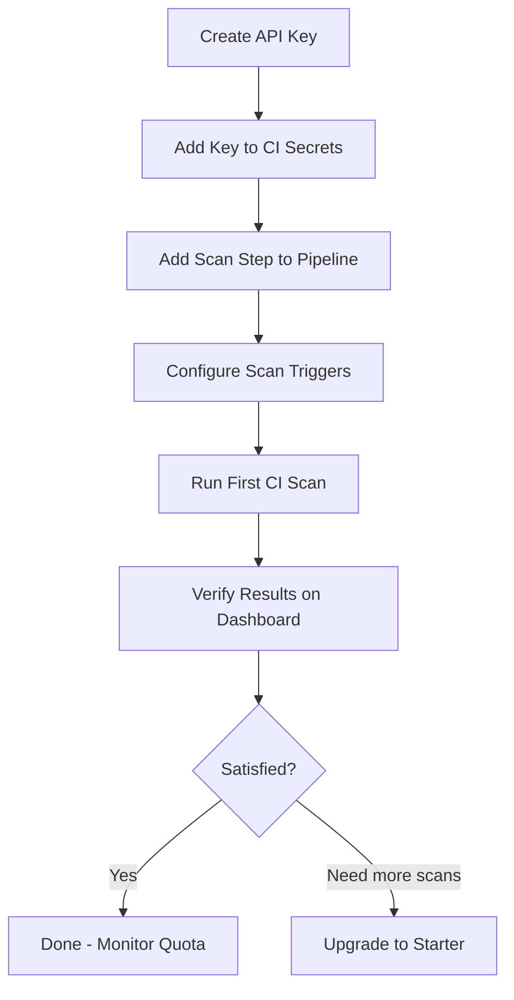

# Playbook: CI/CD Integration for Developer Tier (Free)

**Version:** 1.0.0
**Last Updated:** March 13, 2026
**Audience:** Developer (free tier users)
**Tier:** Developer (Free — $0/mo)

## Overview

This playbook walks you through setting up automated smart contract security scanning in your CI/CD pipeline using the Apogee CLI on the **Developer (free) tier**. The free tier supports CLI-based CI/CD integration with a 3-scan/month quota.

> **Free tier users:** The Integrations Hub dashboard, direct REST API access, and webhook notifications are not available. All CI/CD integration uses the CLI. Upgrade to [Starter ($199/mo)](https://app.0xapogee.com/pricing) for dashboard-based CI/CD configuration and 25 contracts/month.

---

## Prerequisites

- [ ] Apogee account with **Developer tier** (free)
- [ ] API key with `write:scans`, `read:scans`, `read:vulnerabilities` scopes
- [ ] Python 3.8+ on CI runner (for pip install) or Docker
- [ ] Solidity/Vyper contracts in your repository
- [ ] CI/CD system with secret management (GitHub Actions, GitLab CI, Jenkins, etc.)

---

## Workflow Diagram



---

## Step 1: Create an API Key

### Dashboard Method

1. Log in to [https://app.0xapogee.com](https://app.0xapogee.com)
2. Navigate to **Settings** in the sidebar
3. Select **API Keys** (note: this page requires Growth tier for full management — free tier users can create keys during onboarding or via the CLI)
4. Create a key with these scopes:
   - `write:scans` — Submit scans
   - `read:scans` — Check scan status
   - `read:vulnerabilities` — Read findings

### CLI Method (Alternative)

```bash
# If you already have the CLI installed with a session token:
apogee auth login
apogee apikey create --name "ci-cd" --scopes write:scans,read:scans,read:vulnerabilities
```

> **Save the key securely.** It is shown only once. You will add it to your CI/CD system in the next step.

---

## Step 2: Add API Key to CI Secrets

### GitHub Actions

```bash
# Using GitHub CLI
gh secret set APOGEE_API_KEY --body "apogee_ak_your_key_here"
```

Or: Repository Settings → Secrets and variables → Actions → New repository secret → Name: `APOGEE_API_KEY`

### GitLab CI

Project Settings → CI/CD → Variables → Add variable:
- Key: `APOGEE_API_KEY`
- Value: your API key
- Masked: Yes
- Protected: Yes (if scanning only protected branches)

### Jenkins

Manage Jenkins → Credentials → Add Credentials:
- Kind: Secret text
- Secret: your API key
- ID: `apogee-api-key`

---

## Step 3: Add Scan Step to Pipeline

### GitHub Actions (Recommended for Free Tier)

Create `.github/workflows/security-scan.yml`:

```yaml
name: Apogee Security Scan

# Free tier: scan on main merges only to conserve quota (3/month)
on:
  push:
    branches: [main]
    paths:
      - 'contracts/**'  # Only scan when contracts change

jobs:
  security-scan:
    runs-on: ubuntu-latest
    steps:
      - name: Checkout code
        uses: actions/checkout@v4

      - name: Set up Python
        uses: actions/setup-python@v5
        with:
          python-version: '3.11'

      - name: Cache Apogee CLI
        uses: actions/cache@v4
        with:
          path: ~/.cache/pip
          key: apogee-cli-${{ runner.os }}

      - name: Install Apogee CLI
        run: pip install 0xapogee-cli

      - name: Check scan quota
        id: quota
        env:
          APOGEE_API_KEY: ${{ secrets.APOGEE_API_KEY }}
        run: |
          QUOTA=$(apogee quota status --format json)
          REMAINING=$(echo "$QUOTA" | jq '.scansRemaining')
          echo "remaining=$REMAINING" >> "$GITHUB_OUTPUT"
          echo "Scan quota: $(echo "$QUOTA" | jq '.scansUsed')/$(echo "$QUOTA" | jq '.scanLimit') used"
          if [ "$REMAINING" -eq 0 ]; then
            echo "::warning::Scan quota exhausted (Developer tier: 3/month). Skipping scan."
          fi

      - name: Run security scan
        if: steps.quota.outputs.remaining != '0'
        env:
          APOGEE_API_KEY: ${{ secrets.APOGEE_API_KEY }}
        run: |
          apogee scan \
            --path ./contracts \
            --severity-threshold high \
            --wait \
            --timeout 300

      - name: Post scan summary
        if: always() && steps.quota.outputs.remaining != '0'
        env:
          APOGEE_API_KEY: ${{ secrets.APOGEE_API_KEY }}
        run: |
          echo "## Apogee Security Scan Results" >> "$GITHUB_STEP_SUMMARY"
          echo "" >> "$GITHUB_STEP_SUMMARY"
          echo "View full results: https://app.0xapogee.com/scans" >> "$GITHUB_STEP_SUMMARY"
          echo "" >> "$GITHUB_STEP_SUMMARY"
          echo "> Results retained for 7 days (Developer tier)" >> "$GITHUB_STEP_SUMMARY"
```

### GitLab CI

Add to `.gitlab-ci.yml`:

```yaml
security-scan:
  stage: test
  image: python:3.11-slim
  only:
    refs:
      - main
    changes:
      - contracts/**
  before_script:
    - pip install 0xapogee-cli
  script:
    - |
      REMAINING=$(apogee quota status --format json | jq '.scansRemaining')
      if [ "$REMAINING" -eq 0 ]; then
        echo "WARNING: Scan quota exhausted (Developer tier: 3/month). Skipping."
        exit 0
      fi
    - apogee scan --path ./contracts --severity-threshold high --wait --timeout 300
  variables:
    APOGEE_API_KEY: $APOGEE_API_KEY
  allow_failure: false
```

### Jenkins

Add to `Jenkinsfile`:

```groovy
pipeline {
    agent any

    stages {
        stage('Security Scan') {
            when {
                branch 'main'
                changeset 'contracts/**'
            }
            steps {
                sh 'pip install 0xapogee-cli'
                withCredentials([string(credentialsId: 'apogee-api-key', variable: 'APOGEE_API_KEY')]) {
                    sh '''
                        REMAINING=$(apogee quota status --format json | jq '.scansRemaining')
                        if [ "$REMAINING" -eq 0 ]; then
                            echo "WARNING: Scan quota exhausted (Developer tier: 3/month)"
                            exit 0
                        fi
                        apogee scan \
                            --path ./contracts \
                            --severity-threshold high \
                            --wait \
                            --timeout 300
                    '''
                }
            }
        }
    }
}
```

### Docker-Based (Any CI System)

```bash
# Run scan using Docker (no Python required on runner)
docker run --rm \
  -e APOGEE_API_KEY="${APOGEE_API_KEY}" \
  -v "$(pwd)/contracts:/workspace/contracts" \
  blocksecops/cli:latest \
  scan --path /workspace/contracts --severity-threshold high --wait
```

---

## Step 4: Configure Scan Triggers

### Recommended for Free Tier (3 Scans/Month)

| Trigger | Configuration | Monthly Usage |
|---------|--------------|---------------|
| Main branch only | `on: push: branches: [main]` | ~2-4 scans |
| Path filter | `paths: ['contracts/**']` | Reduces wasted scans |
| Manual dispatch | `on: workflow_dispatch` | On-demand |

### Trigger Combinations

```yaml
# Best for free tier: main + path filter + manual dispatch
on:
  push:
    branches: [main]
    paths:
      - 'contracts/**'
  workflow_dispatch:  # Manual trigger for on-demand scanning
```

> **Avoid** triggering on every PR push — this will exhaust your 3-scan quota within days.

---

## Step 5: Verify First CI Scan

After your first push to `main` with contract changes:

1. Check CI pipeline logs for scan output
2. Verify the exit code:
   - `0` = No high/critical findings
   - `1` = Findings above threshold (pipeline should fail)
   - `2` = Quota exceeded (pipeline continues with warning)
3. Visit [https://app.0xapogee.com/scans](https://app.0xapogee.com/scans) to view full results
4. Check remaining quota: `apogee quota status`

---

## Verification

```bash
# Verify CLI is working
apogee --version

# Verify API key authentication
apogee auth verify

# Check current quota
apogee quota status

# Test scan locally before enabling in CI
apogee scan --path ./contracts --severity-threshold high --wait --dry-run
```

---

## Troubleshooting

| Issue | Cause | Solution |
|-------|-------|---------|
| `Exit code 3` — Auth error | Invalid or expired API key | Regenerate key and update CI secret |
| `Exit code 2` — Quota exceeded | 3/month limit reached | Wait for monthly reset or upgrade to Starter |
| Scan takes >5 minutes | Free tier has standard priority (50) | Increase `--timeout` flag; paid tiers get higher priority |
| No results on dashboard | 7-day retention expired | Re-run scan; upgrade for longer retention |
| CLI not found in CI | Python not on runner | Use Docker method or add Python setup step |
| Pipeline runs on every PR | Trigger too broad | Add `branches: [main]` and `paths:` filter |
| Rate limited (429) | Too many requests | Free tier: 60 web requests/min; space out retries |

---

## Quota Management Tips

1. **Check before scanning:** Always check `apogee quota status` in your pipeline before submitting
2. **Path filters:** Only trigger scans when contract files actually change
3. **Main branch only:** Don't scan feature branches — scan the merge result
4. **Monthly planning:** 3 scans = ~1 per week; plan around your release cadence
5. **Local linting:** Use `apogee lint --local-only` for pre-commit checks (free, no quota)
6. **Dry run:** Use `--dry-run` to test pipeline config without using quota

---

## Free Tier Limitations Summary

| Feature | Developer (Free) | Starter ($199/mo) |
|---------|-----------------|-------------------|
| Monthly contracts | 3 | 25 |
| CI/CD method | CLI only | CLI + Integrations Hub |
| Concurrent scans | 1 | 2 |
| Result retention | 7 days | 90 days |
| Webhooks | No | Yes |
| Export reports | No | Yes |
| AI explanations | No | 50/month |
| Support | Community | Email (24hr) |

> Upgrade at [https://app.0xapogee.com/pricing](https://app.0xapogee.com/pricing)

---

## Checklist

- [ ] Apogee CLI installed and verified
- [ ] API key created with correct scopes
- [ ] API key stored as CI secret
- [ ] Pipeline configured with quota check
- [ ] Trigger set to `main` branch + path filter
- [ ] Severity threshold configured (`high` recommended)
- [ ] First scan completed successfully
- [ ] Results verified on dashboard
- [ ] Quota usage confirmed

---

## Related Playbooks

- [CLI Installation](../../cli-installation.md) — Detailed CLI setup guide
- [Run First Scan](../../run-first-scan.md) — Manual scanning walkthrough
- [API Key Management](../../api-key-management.md) — Key creation and scoping
- [Developer Tier CI/CD Workflow](../../../workflows/tiers/developer/cicd-cli-workflow.md) — Workflow overview
- [Developer Tier CI/CD Pipeline](../../../pipelines/tiers/developer/cicd-cli-pipeline.md) — Pipeline architecture
- [GitHub Actions Integration](../../cicd-github-actions.md) — Full GitHub Actions guide (Growth+ tier)
- [Tier Standards](../../../standards/tier-standards.md) — Complete tier comparison
