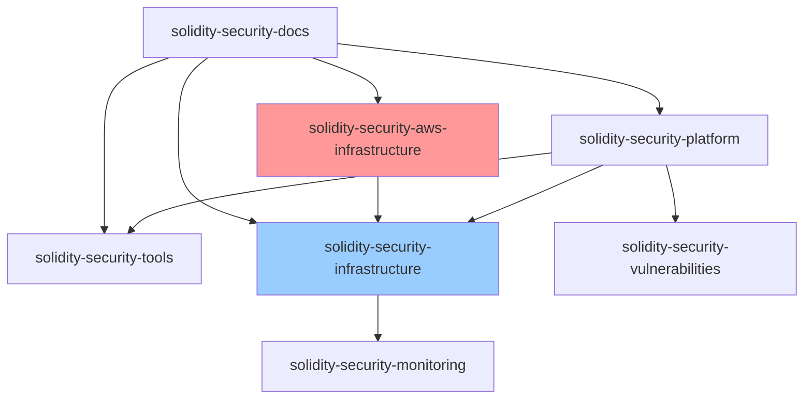

# Sprint 1 (Week 1) Repository Structure

Based on your cloud-first infrastructure foundation requirements, here are the repositories you need to create:

## Core Repositories (7 repos)

### 1. **`solidity-security-platform`** 
**Main monorepo for the entire platform**
```
Purpose: Core platform code and orchestration
Tech Stack: Python, FastAPI, React, TypeScript
Contains: API services, frontend, shared libraries
```

### 2. **`solidity-security-aws-infrastructure`** (NEW)
**AWS Infrastructure as Code repository**
```
Purpose: AWS cloud resource provisioning and management
Tech Stack: Terraform, AWS CLI, CloudFormation
Contains: VPC, EKS, RDS, ElastiCache, Route53, IAM, KMS configurations
```

### 3. **`solidity-security-infrastructure`**
**Kubernetes Infrastructure as Code repository**
```
Purpose: Kubernetes service definitions and deployment scripts
Tech Stack: Helm, Kubernetes manifests, ArgoCD, GitHub Actions
Contains: K8s manifests, ArgoCD applications, CI/CD pipelines
```

### 4. **`solidity-security-tools`**
**Security tool integrations and adapters**
```
Purpose: Tool adapters, wrappers, and integration logic
Tech Stack: Python, Rust, Node.js (for different tool requirements)
Contains: Slither, Aderyn, MythX, Solidity-Metrics adapters
```

### 5. **`solidity-security-docs`**
**Documentation and knowledge base**
```
Purpose: Technical documentation, API docs, user guides
Tech Stack: Markdown, Docusaurus/GitBook
Contains: Architecture docs, setup guides, API documentation
```

### 6. **`solidity-security-monitoring`**
**Observability and monitoring configurations**
```
Purpose: Monitoring, alerting, and observability setup
Tech Stack: Prometheus, Grafana, custom dashboards
Contains: Grafana dashboards, Prometheus rules, alerting configs
```

### 7. **`solidity-security-vulnerabilities`**
**Vulnerability database and intelligence**
```
Purpose: Vulnerability data, patterns, and intelligence
Tech Stack: JSON/YAML schemas, Python scripts
Contains: Vulnerability definitions, patterns, threat intelligence
```

## Repository Structure Details

### 📦 **solidity-security-platform**
```
solidity-security-platform/
├── backend/
│   ├── api-service/              # FastAPI application
│   ├── intelligence-engine/      # Risk scoring and correlation
│   ├── orchestration-service/    # Analysis workflow management
│   ├── data-service/             # Database and caching layer
│   ├── notification-service/     # WebSocket and integrations
│   └── shared/                   # Shared libraries and utilities
├── frontend/
│   ├── src/                      # React application
│   ├── public/                   # Static assets
│   └── packages/                 # Shared UI components
├── docker/                       # Dockerfiles for all services
├── scripts/                      # Development and deployment scripts
├── tests/                        # Integration and E2E tests
└── docs/                         # Basic README and setup guides
```

### ☁️ **solidity-security-aws-infrastructure** (NEW)
```
solidity-security-aws-infrastructure/
├── terraform/
│   ├── environments/
│   │   ├── dev/
│   │   │   ├── main.tf
│   │   │   ├── variables.tf
│   │   │   ├── terraform.tfvars
│   │   │   └── outputs.tf
│   │   ├── staging/
│   │   │   ├── main.tf
│   │   │   ├── variables.tf
│   │   │   ├── terraform.tfvars
│   │   │   └── outputs.tf
│   │   └── production/
│   │       ├── main.tf
│   │       ├── variables.tf
│   │       ├── terraform.tfvars
│   │       └── outputs.tf
│   ├── modules/
│   │   ├── vpc/
│   │   │   ├── main.tf
│   │   │   ├── variables.tf
│   │   │   ├── outputs.tf
│   │   │   └── README.md
│   │   ├── eks/
│   │   │   ├── main.tf
│   │   │   ├── variables.tf
│   │   │   ├── outputs.tf
│   │   │   └── README.md
│   │   ├── rds/
│   │   │   ├── main.tf
│   │   │   ├── variables.tf
│   │   │   ├── outputs.tf
│   │   │   └── README.md
│   │   ├── elasticache/
│   │   │   ├── main.tf
│   │   │   ├── variables.tf
│   │   │   ├── outputs.tf
│   │   │   └── README.md
│   │   ├── route53/
│   │   │   ├── main.tf
│   │   │   ├── variables.tf
│   │   │   ├── outputs.tf
│   │   │   └── README.md
│   │   ├── iam/
│   │   │   ├── main.tf
│   │   │   ├── variables.tf
│   │   │   ├── outputs.tf
│   │   │   └── README.md
│   │   └── kms/
│   │       ├── main.tf
│   │       ├── variables.tf
│   │       ├── outputs.tf
│   │       └── README.md
│   └── shared/
│       ├── backend.tf            # S3 + DynamoDB backend config
│       ├── providers.tf          # AWS provider configuration
│       └── versions.tf           # Terraform version constraints
├── .github/
│   └── workflows/
│       ├── terraform-plan.yml    # Terraform plan workflow
│       ├── terraform-apply.yml   # Terraform apply workflow
│       └── destroy-env.yml       # Environment destruction workflow
├── .gitignore                    # Terraform and AWS-specific ignores
└── README.md                     # Repository overview and usage
```

### 🏗️ **solidity-security-infrastructure**
```
solidity-security-infrastructure/
├── argocd/
│   ├── installation/
│   │   ├── argocd-install.yaml
│   │   ├── argocd-rbac.yaml
│   │   └── argocd-ingress.yaml
│   ├── applications/
│   │   ├── app-of-apps.yaml
│   │   ├── vault-application.yaml
│   │   ├── monitoring-application.yaml
│   │   ├── api-service-application.yaml
│   │   ├── frontend-application.yaml
│   │   ├── tool-integration-application.yaml
│   │   ├── orchestration-application.yaml
│   │   ├── intelligence-engine-application.yaml
│   │   ├── data-service-application.yaml
│   │   └── notification-application.yaml
│   └── projects/
│       ├── dev-project.yaml
│       ├── staging-project.yaml
│       └── prod-project.yaml
├── vault/
│   ├── deployment/
│   │   ├── vault-cluster.yaml
│   │   ├── consul-storage.yaml
│   │   ├── vault-injector.yaml
│   │   └── vault-ui-ingress.yaml
│   ├── policies/
│   │   ├── api-service-policy.hcl
│   │   ├── data-service-policy.hcl
│   │   ├── tool-integration-policy.hcl
│   │   ├── orchestration-policy.hcl
│   │   ├── intelligence-engine-policy.hcl
│   │   ├── notification-policy.hcl
│   │   ├── frontend-policy.hcl
│   │   └── base-policies.hcl
│   ├── auth-methods/
│   │   ├── kubernetes-auth.yaml
│   │   └── aws-iam-auth.yaml
│   └── secret-engines/
│       ├── kv-engine.yaml
│       ├── pki-engine.yaml
│       └── database-engine.yaml
├── external-secrets/
│   ├── operator-install.yaml
│   ├── cluster-secret-store.yaml
│   └── secret-templates/
│       ├── api-service-external-secret.yaml
│       ├── data-service-external-secret.yaml
│       ├── tool-integration-external-secret.yaml
│       ├── orchestration-external-secret.yaml
│       ├── intelligence-engine-external-secret.yaml
│       ├── notification-external-secret.yaml
│       └── frontend-external-secret.yaml
├── cert-manager/
│   ├── install.yaml
│   ├── cluster-issuer-letsencrypt.yaml
│   └── route53-credentials.yaml
├── aws-load-balancer-controller/
│   ├── install.yaml
│   ├── service-account.yaml
│   └── iam-policy.yaml
├── monitoring/
│   ├── prometheus/
│   │   ├── prometheus-install.yaml
│   │   ├── prometheus-config.yaml
│   │   └── service-monitor.yaml
│   ├── grafana/
│   │   ├── grafana-install.yaml
│   │   ├── grafana-config.yaml
│   │   └── grafana-ingress.yaml
│   ├── jaeger/
│   │   ├── jaeger-install.yaml
│   │   └── jaeger-config.yaml
│   └── alertmanager/
│       ├── alertmanager-install.yaml
│       └── alertmanager-config.yaml
├── helm/
│   ├── charts/                   # Custom Helm charts
│   │   ├── api-service/
│   │   ├── frontend/
│   │   ├── tool-integration/
│   │   ├── orchestration/
│   │   ├── intelligence-engine/
│   │   ├── data-service/
│   │   └── notification/
│   └── values/                   # Environment-specific values
│       ├── dev/
│       ├── staging/
│       └── production/
└── .github/
    └── workflows/
        ├── deploy-dev.yml         # Deploy to development
        ├── deploy-staging.yml     # Deploy to staging
        ├── deploy-prod.yml        # Deploy to production
        └── validate-manifests.yml # Validate Kubernetes manifests
```

### 🔧 **solidity-security-tools**
```
solidity-security-tools/
├── adapters/
│   ├── slither/                  # Slither integration
│   │   ├── adapter.py
│   │   ├── config.py
│   │   ├── normalizer.py
│   │   └── tests/
│   ├── aderyn/                   # Aderyn integration
│   │   ├── adapter.py
│   │   ├── rust_wrapper.py
│   │   ├── config.py
│   │   ├── normalizer.py
│   │   └── tests/
│   ├── mythx/                    # MythX integration
│   │   ├── adapter.py
│   │   ├── async_client.py
│   │   ├── config.py
│   │   ├── normalizer.py
│   │   └── tests/
│   ├── solidity-metrics/         # Solidity-Metrics integration
│   │   ├── adapter.py
│   │   ├── nodejs_wrapper.py
│   │   ├── config.py
│   │   ├── normalizer.py
│   │   └── tests/
│   └── certora/                  # Future Certora integration
│       ├── adapter.py
│       ├── config.py
│       ├── normalizer.py
│       └── tests/
├── common/
│   ├── schemas/                  # Common vulnerability schemas
│   │   ├── vulnerability.json
│   │   ├── finding.json
│   │   └── tool_result.json
│   ├── normalizers/              # Result normalization
│   │   ├── base_normalizer.py
│   │   ├── swc_mapper.py
│   │   └── severity_mapper.py
│   └── utils/                    # Shared utilities
│       ├── file_utils.py
│       ├── crypto_utils.py
│       └── validation.py
├── tests/
│   ├── fixtures/                 # Test contracts
│   │   ├── vulnerable_contracts/
│   │   ├── safe_contracts/
│   │   └── complex_contracts/
│   └── integration/              # Tool integration tests
│       ├── test_slither.py
│       ├── test_aderyn.py
│       ├── test_mythx.py
│       └── test_solidity_metrics.py
├── k8s/                          # Kubernetes manifests for tools
│   ├── base/
│   │   ├── deployment.yaml
│   │   ├── service.yaml
│   │   ├── configmap.yaml
│   │   ├── external-secret.yaml
│   │   ├── vault-policy.yaml
│   │   ├── service-account.yaml
│   │   ├── pvc.yaml
│   │   └── ingress.yaml
│   └── overlays/
│       ├── dev/
│       ├── staging/
│       └── production/
├── scripts/
│   ├── install-tools.sh          # Install all security tools
│   ├── test-integrations.sh      # Test tool integrations
│   ├── setup-vault-secrets.sh    # Configure Vault secrets for tools
│   └── performance-test.sh       # Performance testing
└── README.md
```

### 📚 **solidity-security-docs**
```
solidity-security-docs/
├── architecture/
│   ├── system-overview.md
│   ├── microservices.md
│   ├── aws-infrastructure.md     # NEW: AWS architecture documentation
│   ├── kubernetes-services.md    # NEW: K8s services documentation
│   ├── vault-integration.md      # NEW: Vault secret management
│   ├── data-flow.md
│   └── security-model.md
├── development/
│   ├── getting-started.md
│   ├── cloud-setup.md            # Updated: Cloud development setup
│   ├── aws-prerequisites.md      # NEW: AWS account and domain setup
│   ├── contributing.md
│   └── troubleshooting.md
├── deployment/
│   ├── aws-infrastructure.md     # NEW: AWS infrastructure deployment
│   ├── kubernetes.md
│   ├── argocd-setup.md           # NEW: ArgoCD configuration
│   ├── vault-setup.md            # NEW: Vault deployment and config
│   ├── monitoring.md
│   └── ssl-certificates.md       # NEW: Let's Encrypt and cert-manager
├── api/
│   ├── openapi-specs/
│   ├── integration-guides/
│   └── webhook-documentation.md
├── operations/
│   ├── runbooks/                 # NEW: Operational procedures
│   │   ├── vault-operations.md
│   │   ├── argocd-operations.md
│   │   ├── aws-operations.md
│   │   └── incident-response.md
│   ├── monitoring/
│   │   ├── alerts.md
│   │   ├── dashboards.md
│   │   └── troubleshooting.md
│   └── backup-recovery.md
└── user-guides/
    ├── dashboard-usage.md
    ├── tool-configuration.md
    ├── compliance-reports.md
    └── team-collaboration.md
```

### 📊 **solidity-security-monitoring**
```
solidity-security-monitoring/
├── prometheus/
│   ├── rules/                    # Alerting rules
│   │   ├── infrastructure.yml
│   │   ├── applications.yml
│   │   ├── vault.yml             # NEW: Vault monitoring rules
│   │   └── aws.yml               # NEW: AWS service monitoring
│   ├── config/                   # Prometheus configuration
│   │   ├── prometheus.yml
│   │   ├── scrape-configs.yml
│   │   └── remote-write.yml
│   └── targets/                  # Service discovery configs
│       ├── kubernetes-sd.yml
│       ├── aws-sd.yml            # NEW: AWS service discovery
│       └── vault-sd.yml          # NEW: Vault service discovery
├── grafana/
│   ├── dashboards/               # Dashboard JSON files
│   │   ├── infrastructure.json
│   │   ├── applications.json
│   │   ├── vault.json            # NEW: Vault monitoring dashboard
│   │   ├── aws-services.json     # NEW: AWS services dashboard
│   │   ├── argocd.json           # NEW: ArgoCD dashboard
│   │   └── security-metrics.json
│   ├── datasources/              # Data source configurations
│   │   ├── prometheus.yml
│   │   ├── cloudwatch.yml        # NEW: CloudWatch integration
│   │   └── vault-metrics.yml     # NEW: Vault metrics
│   └── provisioning/             # Automated provisioning
│       ├── dashboards.yml
│       ├── datasources.yml
│       └── notifiers.yml
├── alertmanager/
│   ├── config/                   # Alert routing configuration
│   │   ├── alertmanager.yml
│   │   ├── routes.yml
│   │   └── receivers.yml
│   └── templates/                # Notification templates
│       ├── slack.tmpl
│       ├── email.tmpl
│       └── pagerduty.tmpl
├── jaeger/
│   ├── config/                   # Distributed tracing setup
│   │   ├── jaeger.yml
│   │   └── storage.yml
│   └── collectors/
│       ├── kubernetes.yml
│       └── aws.yml               # NEW: AWS X-Ray integration
├── cloudwatch/                   # NEW: CloudWatch configuration
│   ├── dashboards/
│   │   ├── eks-cluster.json
│   │   ├── rds-monitoring.json
│   │   ├── elasticache.json
│   │   └── alb-monitoring.json
│   ├── alarms/
│   │   ├── infrastructure.yml
│   │   ├── applications.yml
│   │   └── cost-alerts.yml
│   └── log-groups/
│       ├── application-logs.yml
│       ├── infrastructure-logs.yml
│       └── audit-logs.yml
```

### 🛡️ **solidity-security-vulnerabilities**
```
solidity-security-vulnerabilities/
├── vulnerabilities/
│   ├── swc/                      # SWC-based vulnerability definitions
│   ├── custom/                   # Custom vulnerability patterns
│   └── cve/                      # CVE mappings
├── patterns/
│   ├── detection/                # Vulnerability detection patterns
│   ├── mitigation/               # Remediation suggestions
│   └── classification/           # Risk scoring rules
├── schemas/
│   ├── vulnerability.json        # Vulnerability data schema
│   ├── finding.json              # Security finding schema
│   └── risk-score.json           # Risk scoring schema
├── data/
│   ├── threat-intelligence/      # Real-time threat data
│   └── statistics/               # Vulnerability statistics
└── tools/
    ├── import-scripts/           # Data import utilities
    └── validation/               # Schema validation tools
```

## Week 1 Repository Setup Checklist

### Day 1: Repository Creation & Domain Setup
- [ ] Create all 7 repositories on GitHub
- [ ] Set up branch protection rules (main branch)
- [ ] Configure repository templates and README files
- [ ] Add team members with appropriate permissions
- [ ] **Purchase production domain** (e.g., solidity-platform.com)
- [ ] **Configure Route53 hosted zone**

### Day 2: AWS Infrastructure Repository Setup
- [ ] **Create Terraform modules for AWS infrastructure**
- [ ] **Set up environment-specific configurations (dev/staging/prod)**
- [ ] **Configure GitHub Actions for Terraform workflows**
- [ ] **Add domain and DNS configuration scripts**
- [ ] **Document AWS setup prerequisites**

### Day 3: Kubernetes Infrastructure Repository Setup
- [ ] **Create ArgoCD installation manifests**
- [ ] **Set up Vault deployment configurations**
- [ ] **Configure AWS Load Balancer Controller manifests**
- [ ] **Create External Secrets Operator configurations**
- [ ] **Set up cert-manager with Let's Encrypt**

### Day 4: Platform Repository Foundation
- [ ] Set up monorepo structure with service directories
- [ ] Create basic FastAPI application skeleton
- [ ] Set up React application with TypeScript
- [ ] Configure Docker build files for AWS ECR

### Day 5: Tools & Documentation
- [ ] Create adapter structure for each security tool
- [ ] Set up tool installation scripts
- [ ] Configure test fixtures with sample contracts
- [ ] Set up documentation site structure with AWS and cloud information
- [ ] Configure monitoring dashboards for AWS services

## Repository Permissions & Settings

### **Team Access Levels:**
- **Admin**: Core team leads (you + CTO)
- **Write**: All engineers
- **Read**: Stakeholders, contractors

### **Branch Protection Rules:**
- Require PR reviews (minimum 1 reviewer)
- Require status checks (CI/CD pipelines)
- Require branches to be up to date
- Restrict pushes to main branch

### **GitHub Actions Secrets:**
- `AWS_ACCESS_KEY_ID` / `AWS_SECRET_ACCESS_KEY`
- `TERRAFORM_CLOUD_TOKEN` (if using Terraform Cloud)
- `DOCKER_REGISTRY_TOKEN` (for ECR)
- `SLACK_WEBHOOK_URL`
- `ROUTE53_ACCESS_KEY` (for DNS management)
- `VAULT_TOKEN` (for Vault management)

## Repository Dependencies



**Key Dependencies:**
- **AWS Infrastructure** provides the foundation for all cloud resources
- **Kubernetes Infrastructure** depends on AWS Infrastructure being deployed first
- Platform depends on tools and Kubernetes infrastructure
- Infrastructure includes monitoring configurations
- Documentation references all other repos
- Vulnerabilities database is consumed by platform

## Infrastructure Deployment Order

1. **AWS Infrastructure** (`solidity-security-aws-infrastructure`)
   - Deploy VPC, EKS, RDS, ElastiCache, Route53
   - Configure IAM roles and KMS keys
   - Set up domain and DNS

2. **Kubernetes Services** (`solidity-security-infrastructure`)
   - Install ArgoCD, Vault, AWS Load Balancer Controller
   - Configure cert-manager and External Secrets Operator
   - Set up monitoring stack

3. **Platform Applications** (`solidity-security-platform`)
   - Deploy microservices via ArgoCD
   - Configure applications with Vault secrets
   - Test end-to-end functionality

This repository structure supports your cloud-first microservices architecture while maintaining clear separation between AWS infrastructure provisioning and Kubernetes service deployment, enabling independent development workflows and proper infrastructure management.
