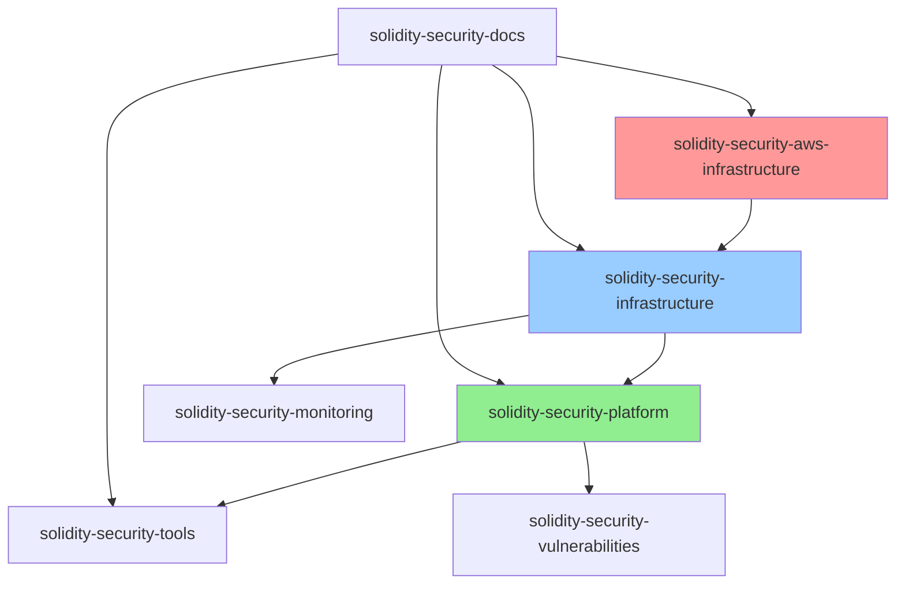

# Sprint 1 (Week 1) Repository Structure

Based on your cloud-first infrastructure foundation requirements, here are the repositories you need to create:

## Core Repositories (7 repos)

### 1. **`solidity-security-platform`** 
**Main monorepo for the entire platform**
```
Purpose: Core platform code and orchestration
Tech Stack: Python, FastAPI, React, TypeScript
Contains: API services, frontend, shared libraries
```

### 2. **`solidity-security-aws-infrastructure`**
**AWS Infrastructure as Code repository**
```
Purpose: AWS cloud resource provisioning and management
Tech Stack: Terraform, AWS CLI, CloudFormation
Contains: VPC, EKS, RDS, ElastiCache, IAM, Secrets Manager configurations
```

### 3. **`solidity-security-infrastructure`**
**Kubernetes Infrastructure as Code repository**
```
Purpose: Kubernetes service definitions and deployment scripts
Tech Stack: Helm, Kubernetes manifests, ArgoCD, GitHub Actions
Contains: K8s manifests, ArgoCD applications, CI/CD pipelines
```

### 4. **`solidity-security-tools`**
**Security tool integrations and adapters**
```
Purpose: Tool adapters, wrappers, and integration logic
Tech Stack: Python, Rust, Node.js (for different tool requirements)
Contains: Slither, Aderyn, MythX, Solidity-Metrics adapters
```

### 5. **`solidity-security-docs`**
**Documentation and knowledge base**
```
Purpose: Technical documentation, API docs, user guides
Tech Stack: Markdown, Docusaurus/GitBook
Contains: Architecture docs, setup guides, API documentation
```

### 6. **`solidity-security-monitoring`**
**Observability and monitoring configurations**
```
Purpose: Monitoring, alerting, and observability setup
Tech Stack: Prometheus, Grafana, custom dashboards
Contains: Grafana dashboards, Prometheus rules, alerting configs
```

### 7. **`solidity-security-vulnerabilities`**
**Vulnerability database and intelligence**
```
Purpose: Vulnerability data, patterns, and intelligence
Tech Stack: JSON/YAML schemas, Python scripts
Contains: Vulnerability definitions, patterns, threat intelligence
```

## Repository Structure Details

### 📦 **solidity-security-platform**
```
solidity-security-platform/
├── backend/
│   ├── api-service/              # FastAPI application
│   ├── intelligence-engine/      # Risk scoring and correlation
│   ├── orchestration-service/    # Analysis workflow management
│   ├── data-service/             # Database and caching layer
│   ├── notification-service/     # WebSocket and integrations
│   └── shared/                   # Shared libraries and utilities
├── frontend/
│   ├── src/                      # React application
│   ├── public/                   # Static assets
│   └── packages/                 # Shared UI components
├── docker/                       # Dockerfiles for all services
├── scripts/                      # Development and deployment scripts
├── tests/                        # Integration and E2E tests
└── docs/                         # Basic README and setup guides
```

### ☁️ **solidity-security-aws-infrastructure**
```
solidity-security-aws-infrastructure/
├── terraform/
│   ├── environments/
│   │   ├── dev/
│   │   │   ├── main.tf
│   │   │   ├── variables.tf
│   │   │   ├── terraform.tfvars
│   │   │   ├── outputs.tf
│   │   │   └── README.md
│   │   ├── staging/
│   │   │   ├── main.tf
│   │   │   ├── variables.tf
│   │   │   ├── terraform.tfvars
│   │   │   └── outputs.tf
│   │   └── production/
│   │       ├── main.tf
│   │       ├── variables.tf
│   │       ├── terraform.tfvars
│   │       └── outputs.tf
│   ├── modules/
│   │   ├── vpc/
│   │   │   ├── main.tf
│   │   │   ├── variables.tf
│   │   │   ├── outputs.tf
│   │   │   └── README.md
│   │   ├── eks/
│   │   │   ├── main.tf
│   │   │   ├── variables.tf
│   │   │   ├── outputs.tf
│   │   │   └── README.md
│   │   ├── rds/
│   │   │   ├── main.tf
│   │   │   ├── variables.tf
│   │   │   ├── outputs.tf
│   │   │   └── README.md
│   │   ├── elasticache/
│   │   │   ├── main.tf
│   │   │   ├── variables.tf
│   │   │   ├── outputs.tf
│   │   │   └── README.md
│   │   ├── iam/
│   │   │   ├── main.tf
│   │   │   ├── variables.tf
│   │   │   ├── outputs.tf
│   │   │   └── README.md
│   │   ├── secrets-manager/
│   │   │   ├── main.tf
│   │   │   ├── variables.tf
│   │   │   ├── outputs.tf
│   │   │   └── README.md
│   │   ├── security-groups/
│   │   │   ├── main.tf
│   │   │   ├── variables.tf
│   │   │   ├── outputs.tf
│   │   │   └── README.md
│   │   ├── ecr/
│   │   │   ├── main.tf
│   │   │   ├── variables.tf
│   │   │   ├── outputs.tf
│   │   │   └── README.md
│   │   ├── vpc-endpoints/
│   │   │   ├── main.tf
│   │   │   ├── variables.tf
│   │   │   ├── outputs.tf
│   │   │   └── README.md
│   │   ├── waf/
│   │   │   ├── main.tf
│   │   │   ├── variables.tf
│   │   │   ├── outputs.tf
│   │   │   └── README.md
│   │   └── kms/
│   │       ├── main.tf
│   │       ├── variables.tf
│   │       ├── outputs.tf
│   │       └── README.md
│   └── shared/
│       ├── backend.tf            # S3 + DynamoDB backend config
│       ├── providers.tf          # AWS provider configuration
│       └── versions.tf           # Terraform version constraints
├── .github/
│   └── workflows/
│       ├── terraform-plan.yml    # Terraform plan workflow
│       ├── terraform-apply.yml   # Terraform apply workflow
│       └── destroy-env.yml       # Environment destruction workflow
├── scripts/
│   ├── setup-backend.sh          # Initialize Terraform backend
│   ├── deploy-env.sh             # Deploy environment
│   └── destroy-env.sh            # Destroy environment
├── .gitignore                    # Terraform and AWS-specific ignores
└── README.md                     # Repository overview and usage
```

### 🏗️ **solidity-security-infrastructure**
```
solidity-security-infrastructure/
├── argocd/
│   ├── installation/
│   │   ├── argocd-install.yaml
│   │   ├── argocd-rbac.yaml
│   │   └── argocd-ingress.yaml
│   ├── applications/
│   │   ├── app-of-apps.yaml
│   │   ├── monitoring-application.yaml
│   │   ├── api-service-application.yaml
│   │   ├── frontend-application.yaml
│   │   ├── tool-integration-application.yaml
│   │   ├── orchestration-application.yaml
│   │   ├── intelligence-engine-application.yaml
│   │   ├── data-service-application.yaml
│   │   └── notification-application.yaml
│   └── projects/
│       ├── dev-project.yaml
│       ├── staging-project.yaml
│       └── prod-project.yaml
├── external-secrets/
│   ├── operator-install.yaml
│   ├── cluster-secret-store.yaml
│   └── secret-templates/
│       ├── api-service-external-secret.yaml
│       ├── data-service-external-secret.yaml
│       ├── tool-integration-external-secret.yaml
│       ├── orchestration-external-secret.yaml
│       ├── intelligence-engine-external-secret.yaml
│       ├── notification-external-secret.yaml
│       └── frontend-external-secret.yaml
├── secrets-store-csi/
│   ├── install.yaml
│   ├── aws-provider.yaml
│   └── secret-provider-classes/
│       ├── api-service-spc.yaml
│       ├── data-service-spc.yaml
│       ├── tool-integration-spc.yaml
│       ├── orchestration-spc.yaml
│       ├── intelligence-engine-spc.yaml
│       ├── notification-spc.yaml
│       └── frontend-spc.yaml
├── cert-manager/
│   ├── install.yaml
│   ├── cluster-issuer-letsencrypt.yaml
├── aws-load-balancer-controller/
│   ├── install.yaml
│   ├── service-account.yaml
│   └── iam-policy.yaml
├── monitoring/
│   ├── prometheus/
│   │   ├── prometheus-install.yaml
│   │   ├── prometheus-config.yaml
│   │   └── service-monitor.yaml
│   ├── grafana/
│   │   ├── grafana-install.yaml
│   │   ├── grafana-config.yaml
│   │   └── grafana-ingress.yaml
│   ├── jaeger/
│   │   ├── jaeger-install.yaml
│   │   └── jaeger-config.yaml
│   └── alertmanager/
│       ├── alertmanager-install.yaml
│       └── alertmanager-config.yaml
├── helm/
│   ├── charts/                   # Custom Helm charts
│   │   ├── api-service/
│   │   ├── frontend/
│   │   ├── tool-integration/
│   │   ├── orchestration/
│   │   ├── intelligence-engine/
│   │   ├── data-service/
│   │   └── notification/
│   └── values/                   # Environment-specific values
│       ├── dev/
│       ├── staging/
│       └── production/
└── .github/
    └── workflows/
        ├── deploy-dev.yml         # Deploy to development
        ├── deploy-staging.yml     # Deploy to staging
        ├── deploy-prod.yml        # Deploy to production
        └── validate-manifests.yml # Validate Kubernetes manifests
```

### 🔧 **solidity-security-tools**
```
solidity-security-tools/
├── adapters/
│   ├── slither/                  # Slither integration
│   │   ├── adapter.py
│   │   ├── config.py
│   │   ├── normalizer.py
│   │   ├── detector_configs/
│   │   └── tests/
│   ├── aderyn/                   # Aderyn integration
│   │   ├── adapter.py
│   │   ├── rust_wrapper.py
│   │   ├── config.py
│   │   ├── normalizer.py
│   │   ├── detector_configs/
│   │   └── tests/
│   ├── mythx/                    # MythX integration
│   │   ├── adapter.py
│   │   ├── async_client.py
│   │   ├── config.py
│   │   ├── normalizer.py
│   │   ├── rate_limiter.py
│   │   └── tests/
│   ├── solidity-metrics/         # Solidity-Metrics integration
│   │   ├── adapter.py
│   │   ├── nodejs_wrapper.py
│   │   ├── config.py
│   │   ├── normalizer.py
│   │   └── tests/
│   ├── certora/                  # Future Certora integration
│   │   ├── adapter.py
│   │   ├── config.py
│   │   ├── normalizer.py
│   │   └── tests/
│   └── custom/                   # Custom tool adapters
│       ├── base_adapter.py
│       ├── plugin_loader.py
│       └── registry.py
├── common/
│   ├── schemas/                  # Common vulnerability schemas
│   │   ├── vulnerability.json
│   │   ├── finding.json
│   │   ├── tool_result.json
│   │   └── swc_mapping.json
│   ├── normalizers/              # Result normalization
│   │   ├── base_normalizer.py
│   │   ├── swc_mapper.py
│   │   ├── severity_mapper.py
│   │   └── location_mapper.py
│   └── utils/                    # Shared utilities
│       ├── file_utils.py
│       ├── crypto_utils.py
│       ├── validation.py
│       └── performance_utils.py
├── tests/
│   ├── fixtures/                 # Test contracts
│   │   ├── vulnerable_contracts/
│   │   ├── safe_contracts/
│   │   ├── complex_contracts/
│   │   └── benchmark_contracts/
│   ├── integration/              # Tool integration tests
│   │   ├── test_slither.py
│   │   ├── test_aderyn.py
│   │   ├── test_mythx.py
│   │   ├── test_solidity_metrics.py
│   │   └── test_parallel_execution.py
│   └── performance/              # Performance tests
│       ├── test_throughput.py
│       └── test_memory_usage.py
├── scripts/
│   ├── install-tools.sh          # Install all security tools
│   ├── test-integrations.sh      # Test tool integrations
│   ├── performance-test.sh       # Performance testing
│   ├── update-tools.sh           # Update tool versions
│   └── benchmark.sh              # Benchmark tool performance
├── configs/
│   ├── tool-versions.yaml        # Tool version configurations
│   ├── default-configs/          # Default tool configurations
│   └── environment-configs/      # Environment-specific configs
└── README.md
```

### 📚 **solidity-security-docs**
```
solidity-security-docs/
├── architecture/
│   ├── system-overview.md
│   ├── microservices.md
│   ├── aws-infrastructure.md
│   ├── kubernetes-services.md
│   ├── secrets-manager-integration.md
│   ├── data-flow.md
│   ├── security-model.md
│   └── deployment-patterns.md
├── development/
│   ├── getting-started.md
│   ├── cloud-setup.md
│   ├── aws-prerequisites.md
│   ├── local-development.md
│   ├── testing-guide.md
│   ├── contributing.md
│   └── troubleshooting.md
├── deployment/
│   ├── aws-infrastructure.md
│   ├── kubernetes.md
│   ├── argocd-setup.md
│   ├── secrets-manager-setup.md
│   ├── monitoring.md
│   ├── ssl-certificates.md
│   ├── multi-environment.md
│   └── disaster-recovery.md
├── api/
│   ├── openapi-specs/
│   │   ├── api-service.yaml
│   │   ├── tool-integration.yaml
│   │   └── notification.yaml
│   ├── integration-guides/
│   │   ├── github-integration.md
│   │   ├── gitlab-integration.md
│   │   └── jenkins-integration.md
│   └── webhook-documentation.md
├── operations/
│   ├── runbooks/
│   │   ├── secrets-manager-operations.md
│   │   ├── argocd-operations.md
│   │   ├── aws-operations.md
│   │   ├── database-operations.md
│   │   └── incident-response.md
│   ├── monitoring/
│   │   ├── alerts.md
│   │   ├── dashboards.md
│   │   ├── metrics.md
│   │   └── troubleshooting.md
│   ├── security/
│   │   ├── security-procedures.md
│   │   ├── compliance.md
│   │   └── audit-logging.md
│   └── backup-recovery.md
├── user-guides/
│   ├── dashboard-usage.md
│   ├── tool-configuration.md
│   ├── compliance-reports.md
│   ├── team-collaboration.md
│   └── api-usage.md
└── tutorials/
    ├── first-analysis.md
    ├── custom-rules.md
    ├── ci-cd-integration.md
    └── advanced-features.md
```

### 📊 **solidity-security-monitoring**
```
solidity-security-monitoring/
├── prometheus/
│   ├── rules/                    # Alerting rules
│   │   ├── infrastructure.yml
│   │   ├── applications.yml
│   │   ├── secrets-manager.yml
│   │   ├── aws.yml
│   │   └── business-metrics.yml
│   ├── config/                   # Prometheus configuration
│   │   ├── prometheus.yml
│   │   ├── scrape-configs.yml
│   │   └── remote-write.yml
│   └── targets/                  # Service discovery configs
│       ├── kubernetes-sd.yml
│       ├── aws-sd.yml
│       └── secrets-manager-sd.yml
├── grafana/
│   ├── dashboards/               # Dashboard JSON files
│   │   ├── infrastructure.json
│   │   ├── applications.json
│   │   ├── secrets-manager.json
│   │   ├── aws-services.json
│   │   ├── argocd.json
│   │   ├── security-metrics.json
│   │   └── business-kpis.json
│   ├── datasources/              # Data source configurations
│   │   ├── prometheus.yml
│   │   ├── cloudwatch.yml
│   │   └── secrets-manager-metrics.yml
│   └── provisioning/             # Automated provisioning
│       ├── dashboards.yml
│       ├── datasources.yml
│       └── notifiers.yml
├── alertmanager/
│   ├── config/                   # Alert routing configuration
│   │   ├── alertmanager.yml
│   │   ├── routes.yml
│   │   └── receivers.yml
│   └── templates/                # Notification templates
│       ├── slack.tmpl
│       ├── email.tmpl
│       ├── pagerduty.tmpl
│       └── teams.tmpl
├── jaeger/
│   ├── config/                   # Distributed tracing setup
│   │   ├── jaeger.yml
│   │   └── storage.yml
│   └── collectors/
│       ├── kubernetes.yml
│       └── aws.yml
├── cloudwatch/
│   ├── dashboards/
│   │   ├── eks-cluster.json
│   │   ├── rds-monitoring.json
│   │   ├── elasticache.json
│   │   ├── secrets-manager.json
│   │   └── alb-monitoring.json
│   ├── alarms/
│   │   ├── infrastructure.yml
│   │   ├── applications.yml
│   │   ├── secrets-manager.yml
│   │   └── cost-alerts.yml
│   └── log-groups/
│       ├── application-logs.yml
│       ├── infrastructure-logs.yml
│       └── audit-logs.yml
└── scripts/
    ├── setup-monitoring.sh
    ├── import-dashboards.sh
    └── configure-alerts.sh
```

### 🛡️ **solidity-security-vulnerabilities**
```
solidity-security-vulnerabilities/
├── vulnerabilities/
│   ├── swc/                      # SWC-based vulnerability definitions
│   │   ├── swc-100/
│   │   ├── swc-101/
│   │   └── ...
│   ├── custom/                   # Custom vulnerability patterns
│   │   ├── reentrancy-patterns/
│   │   ├── access-control/
│   │   └── arithmetic-patterns/
│   ├── cve/                      # CVE mappings
│   │   └── solidity-cves.json
│   └── owasp/                    # OWASP Top 10 mappings
│       └── smart-contract-top10.json
├── patterns/
│   ├── detection/                # Vulnerability detection patterns
│   │   ├── regex-patterns/
│   │   ├── ast-patterns/
│   │   └── behavioral-patterns/
│   ├── mitigation/               # Remediation suggestions
│   │   ├── fix-templates/
│   │   ├── best-practices/
│   │   └── code-examples/
│   └── classification/           # Risk scoring rules
│       ├── severity-rules/
│       ├── complexity-weights/
│       └── context-adjustments/
├── schemas/
│   ├── vulnerability.json        # Vulnerability data schema
│   ├── finding.json              # Security finding schema
│   ├── risk-score.json           # Risk scoring schema
│   └── remediation.json          # Remediation schema
├── data/
│   ├── threat-intelligence/      # Real-time threat data
│   │   ├── trending-attacks/
│   │   └── exploit-databases/
│   ├── statistics/               # Vulnerability statistics
│   │   ├── frequency-data/
│   │   └── impact-analysis/
│   └── benchmarks/               # Security benchmarks
│       ├── industry-standards/
│       └── comparative-analysis/
├── tools/
│   ├── import-scripts/           # Data import utilities
│   │   ├── swc-importer.py
│   │   ├── cve-importer.py
│   │   └── custom-importer.py
│   ├── validation/               # Schema validation tools
│   │   ├── schema-validator.py
│   │   └── data-validator.py
│   └── analysis/                 # Data analysis tools
│       ├── trend-analyzer.py
│       └── pattern-extractor.py
└── README.md
```

## Week 1 Repository Setup Checklist

### Day 1: Repository Creation & Domain Setup
- [ ] Create all 7 repositories on GitHub with branch protection
  - [ ] `solidity-security-platform`
  - [ ] `solidity-security-aws-infrastructure` 
  - [ ] `solidity-security-infrastructure`
  - [ ] `solidity-security-tools`
  - [ ] `solidity-security-docs`
  - [ ] `solidity-security-monitoring`
  - [ ] `solidity-security-vulnerabilities`
- [ ] Set up branch protection rules (main branch)
- [ ] Configure repository templates and README files
- [ ] Add team members with appropriate permissions
- [ ] **Purchase production domain** (e.g., advancedblockchainsecurity.com)
- [ ] **Configure Cloudflare hosted zone**

### Day 2: AWS Infrastructure Repository Setup
- [ ] **Create Terraform modules for AWS infrastructure in `solidity-security-aws-infrastructure`**
- [ ] **Set up environment-specific configurations (dev/staging/prod)**
- [ ] **Configure GitHub Actions for Terraform workflows**
- [ ] **Add domain and DNS configuration scripts**
- [ ] **Document AWS setup prerequisites**
- [ ] **Create AWS Secrets Manager Terraform module**

### Day 3: Platform Repository Foundation
- [ ] **Set up service-based structure in `solidity-security-platform`**
- [ ] **Create K8s manifests for each service in their respective directories**
- [ ] **Set up Helm charts for each service**
- [ ] **Configure AWS Secrets Manager templates for each service**
- [ ] **Create basic service code skeletons**
- [ ] **Configure Docker build files for AWS ECR**

### Day 4: Infrastructure Repository Setup
- [ ] **Create ArgoCD application manifests in `solidity-security-infrastructure`**
- [ ] **Set up External Secrets Operator deployment configurations**
- [ ] **Configure AWS Load Balancer Controller manifests**
- [ ] **Create AWS Secrets Store CSI Driver configurations**
- [ ] **Set up cert-manager with Let's Encrypt**

### Day 5: Tools & Documentation
- [ ] **Create adapter structure for each security tool in `solidity-security-tools`**
- [ ] **Set up tool installation scripts**
- [ ] **Configure test fixtures with sample contracts**
- [ ] **Set up documentation site structure with AWS and cloud information in `solidity-security-docs`**
- [ ] **Configure monitoring dashboards for AWS services in `solidity-security-monitoring`**

## Repository Permissions & Settings

### **Team Access Levels:**
- **Admin**: Core team leads (you + CTO)
- **Write**: All engineers
- **Read**: Stakeholders, contractors

### **Branch Protection Rules:**
- Require PR reviews (minimum 1 reviewer)
- Require status checks (CI/CD pipelines)
- Require branches to be up to date
- Restrict pushes to main branch

### **GitHub Actions Secrets:**
- `AWS_ACCESS_KEY_ID` / `AWS_SECRET_ACCESS_KEY`
- `TERRAFORM_CLOUD_TOKEN` (if using Terraform Cloud)
- `DOCKER_REGISTRY_TOKEN` (for ECR)
- `SLACK_WEBHOOK_URL`

## Repository Dependencies



**Key Dependencies:**
- **AWS Infrastructure** provides the foundation for all cloud resources
- **Kubernetes Infrastructure** depends on AWS Infrastructure and manages ArgoCD apps pointing to Platform repo
- **Platform** contains all service code with integrated K8s manifests and Helm charts
- **Tools** are consumed by Platform services
- **Monitoring** configurations apply to all services
- **Documentation** references all other repos
- **Vulnerabilities** database is consumed by Platform services

## Infrastructure Deployment Order

1. **AWS Infrastructure** (`solidity-security-aws-infrastructure`)
   - Deploy VPC, EKS, RDS, ElastiCache
   - Configure IAM roles and AWS Secrets Manager
   - Set up domain and DNS

2. **Kubernetes Services** (`solidity-security-infrastructure`)
   - Install ArgoCD, External Secrets Operator, AWS Load Balancer Controller
   - Configure cert-manager and AWS Secrets Store CSI Driver
   - Set up monitoring stack

3. **Platform Applications** (`solidity-security-platform`)
   - Deploy microservices via ArgoCD (pointing to Platform repo)
   - Configure applications with AWS Secrets Manager secrets
   - Test end-to-end functionality
