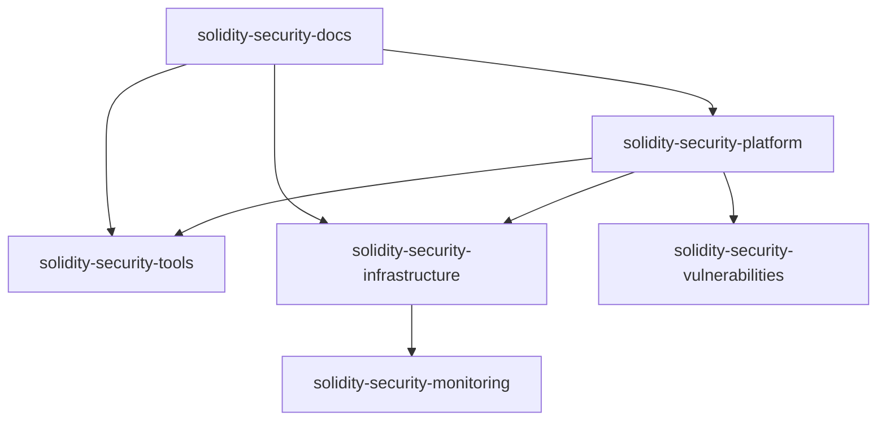

# Sprint 1 (Week 1) Repository Structure

Based on your infrastructure foundation requirements, here are the repositories you need to create:

## Core Repositories (6 repos)

### 1. **`solidity-security-platform`** 
**Main monorepo for the entire platform**
```
Purpose: Core platform code and orchestration
Tech Stack: Python, FastAPI, React, TypeScript
Contains: API services, frontend, shared libraries
```

### 2. **`solidity-security-infrastructure`**
**Infrastructure as Code repository**
```
Purpose: All infrastructure definitions and deployment scripts
Tech Stack: Terraform, Helm, Docker Compose, GitHub Actions
Contains: K8s manifests, cloud infrastructure, CI/CD pipelines
```

### 3. **`solidity-security-tools`**
**Security tool integrations and adapters**
```
Purpose: Tool adapters, wrappers, and integration logic
Tech Stack: Python, Rust, Node.js (for different tool requirements)
Contains: Slither, Aderyn, MythX, Solidity-Metrics adapters
```

### 4. **`solidity-security-docs`**
**Documentation and knowledge base**
```
Purpose: Technical documentation, API docs, user guides
Tech Stack: Markdown, Docusaurus/GitBook
Contains: Architecture docs, setup guides, API documentation
```

### 5. **`solidity-security-monitoring`**
**Observability and monitoring configurations**
```
Purpose: Monitoring, alerting, and observability setup
Tech Stack: Prometheus, Grafana, custom dashboards
Contains: Grafana dashboards, Prometheus rules, alerting configs
```

### 6. **`solidity-security-vulnerabilities`**
**Vulnerability database and intelligence**
```
Purpose: Vulnerability data, patterns, and intelligence
Tech Stack: JSON/YAML schemas, Python scripts
Contains: Vulnerability definitions, patterns, threat intelligence
```

## Repository Structure Details

### 📦 **solidity-security-platform**
```
solidity-security-platform/
├── backend/
│   ├── api-service/              # FastAPI application
│   ├── intelligence-engine/      # Risk scoring and correlation
│   ├── orchestration-service/    # Analysis workflow management
│   ├── data-service/             # Database and caching layer
│   ├── notification-service/     # WebSocket and integrations
│   └── shared/                   # Shared libraries and utilities
├── frontend/
│   ├── src/                      # React application
│   ├── public/                   # Static assets
│   └── packages/                 # Shared UI components
├── docker/                       # Dockerfiles for all services
├── scripts/                      # Development and deployment scripts
├── tests/                        # Integration and E2E tests
└── docs/                         # Basic README and setup guides
```

### 🏗️ **solidity-security-infrastructure**
```
solidity-security-infrastructure/
├── local/
│   ├── docker-compose.yml        # Local development stack
│   ├── k8s/                      # Local Kubernetes manifests
│   └── scripts/                  # Local setup scripts
├── terraform/
│   ├── modules/                  # Reusable Terraform modules
│   │   ├── eks-cluster/
│   │   ├── networking/
│   │   ├── databases/
│   │   └── monitoring/
│   └── environments/
│       ├── staging/
│       └── production/
├── helm/
│   ├── charts/                   # Helm charts for applications
│   └── values/                   # Environment-specific values
├── github-actions/
│   └── workflows/                # CI/CD pipeline definitions
└── scripts/
    ├── setup-local.sh
    ├── deploy-staging.sh
    └── deploy-production.sh
```

### 🔧 **solidity-security-tools**
```
solidity-security-tools/
├── adapters/
│   ├── slither/                  # Slither integration
│   ├── aderyn/                   # Aderyn integration
│   ├── mythx/                    # MythX integration
│   ├── solidity-metrics/         # Solidity-Metrics integration
│   └── certora/                  # Future Certora integration
├── common/
│   ├── schemas/                  # Common vulnerability schemas
│   ├── normalizers/              # Result normalization
│   └── utils/                    # Shared utilities
├── tests/
│   ├── fixtures/                 # Test contracts
│   └── integration/              # Tool integration tests
└── scripts/
    ├── install-tools.sh
    └── test-integrations.sh
```

### 📚 **solidity-security-docs**
```
solidity-security-docs/
├── architecture/
│   ├── system-overview.md
│   ├── microservices.md
│   └── data-flow.md
├── development/
│   ├── getting-started.md
│   ├── local-setup.md
│   └── contributing.md
├── deployment/
│   ├── infrastructure.md
│   ├── kubernetes.md
│   └── monitoring.md
├── api/
│   ├── openapi-specs/
│   └── integration-guides/
└── user-guides/
    ├── dashboard-usage.md
    ├── tool-configuration.md
    └── compliance-reports.md
```

### 📊 **solidity-security-monitoring**
```
solidity-security-monitoring/
├── prometheus/
│   ├── rules/                    # Alerting rules
│   ├── config/                   # Prometheus configuration
│   └── targets/                  # Service discovery configs
├── grafana/
│   ├── dashboards/               # Dashboard JSON files
│   ├── datasources/              # Data source configurations
│   └── provisioning/             # Automated provisioning
├── alertmanager/
│   ├── config/                   # Alert routing configuration
│   └── templates/                # Notification templates
├── jaeger/
│   └── config/                   # Distributed tracing setup
└── scripts/
    ├── import-dashboards.sh
    └── setup-monitoring.sh
```

### 🛡️ **solidity-security-vulnerabilities**
```
solidity-security-vulnerabilities/
├── vulnerabilities/
│   ├── swc/                      # SWC-based vulnerability definitions
│   ├── custom/                   # Custom vulnerability patterns
│   └── cve/                      # CVE mappings
├── patterns/
│   ├── detection/                # Vulnerability detection patterns
│   ├── mitigation/               # Remediation suggestions
│   └── classification/           # Risk scoring rules
├── schemas/
│   ├── vulnerability.json        # Vulnerability data schema
│   ├── finding.json              # Security finding schema
│   └── risk-score.json           # Risk scoring schema
├── data/
│   ├── threat-intelligence/      # Real-time threat data
│   └── statistics/               # Vulnerability statistics
└── tools/
    ├── import-scripts/           # Data import utilities
    └── validation/               # Schema validation tools
```

## Week 1 Repository Setup Checklist

### Day 1: Repository Creation
- [ ] Create all 6 repositories on GitHub
- [ ] Set up branch protection rules (main branch)
- [ ] Configure repository templates and README files
- [ ] Add team members with appropriate permissions

### Day 2: Infrastructure Repository Setup
- [ ] Create `docker-compose.yml` for local development
- [ ] Set up basic Kubernetes manifests
- [ ] Configure GitHub Actions workflows
- [ ] Add setup scripts for local environment

### Day 3: Platform Repository Foundation
- [ ] Set up monorepo structure with service directories
- [ ] Create basic FastAPI application skeleton
- [ ] Set up React application with TypeScript
- [ ] Configure Docker build files

### Day 4: Tools Repository Setup
- [ ] Create adapter structure for each security tool
- [ ] Set up tool installation scripts
- [ ] Configure test fixtures with sample contracts
- [ ] Document tool integration patterns

### Day 5: Documentation & Monitoring
- [ ] Set up documentation site structure
- [ ] Create basic architecture documentation
- [ ] Configure Prometheus and Grafana setups
- [ ] Set up vulnerability database schema

## Repository Permissions & Settings

### **Team Access Levels:**
- **Admin**: Core team leads (you + CTO)
- **Write**: All engineers
- **Read**: Stakeholders, contractors

### **Branch Protection Rules:**
- Require PR reviews (minimum 1 reviewer)
- Require status checks (CI/CD pipelines)
- Require branches to be up to date
- Restrict pushes to main branch

### **GitHub Actions Secrets:**
- `AWS_ACCESS_KEY_ID` / `AWS_SECRET_ACCESS_KEY`
- `DOCKER_REGISTRY_TOKEN`
- `SLACK_WEBHOOK_URL`
- `DATABASE_PASSWORD`

## Repository Dependencies



**Key Dependencies:**
- Platform depends on tools and infrastructure
- Infrastructure includes monitoring configurations
- Documentation references all other repos
- Vulnerabilities database is consumed by platform

This repository structure supports your microservices architecture while maintaining clear separation of concerns and enabling independent development workflows.
