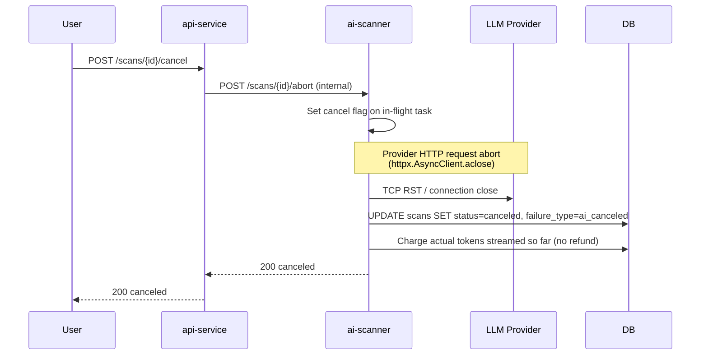

# Workflow: AI Scan Trigger

**Phase:** 10 — BYO AI Scanning
**Status:** Production (updated 2026-06-22) — api-service v0.46.8, ai-scanner v0.2.7, dashboard v0.55.5
**Cross-reference:** `TaskDocs-BlockSecOps/phases/10-phase-10-byo-ai-scanning/PHASE-10-BYO-AI-SCANNING-PLAN.md`

The end-to-end flow when a user triggers an AI scan. AI scanning is a scanner-type that slots into the existing scan dispatch pipeline alongside the 17 SAST scanners; this doc focuses on what is different from a standard SAST scanner trigger.

**Phase 1 constraints (as of api-service v0.46.8, ai-scanner v0.2.7):**
- Only `managed-claude` is live. BYO adapters (`anthropic`, `openai`, `gemini`) are wired but return `ai_provider_error` and are displayed as "Phase 2" in the dashboard.
- `scanner_ids=["ai-anthropic"]` in a batch scan request is silently skipped with a server-side warning log; AI must be triggered as a standalone scan. The dashboard displays an amber notice in the batch scan modal explaining this.
- The per-org `ai_scanning_enabled` flag can now be toggled via `PATCH /api/v1/organizations/{id}/ai-scanning` (org-admin only) — no longer requires a direct DB UPDATE.
- BYO_KEK is not yet mounted in the ai-scanner ExternalSecret (deferred to Phase 2); the `externalsecret.yaml` `BYO_KEK` entry has been removed until the BYO live-wiring ships.
- Multi-file Hardhat/Foundry projects are supported: when `contract.source_code` is empty and `is_multi_file=true`, the orchestrator queries `contract_files` for all `.sol` files and fences each with its `file_path`. The output validator's `allowed_files` map accepts per-file findings.

## High-level sequence

```mermaid
sequenceDiagram
    autonumber
    participant U as User (Dashboard / CI)
    participant API as api-service
    participant DB as PostgreSQL
    participant AI as ai-scanner
    participant V as Vault
    participant LLM as LLM Provider<br/>(Anthropic / OpenAI / Gemini)

    U->>API: POST /api/v1/scans<br/>{scanner_ids: ["ai-anthropic"], ai_mode: "structured",<br/>ai_provider: "managed-claude",<br/>ai_sensitivity_acknowledged: true}
    API->>DB: SELECT organizations.ai_scanning_enabled
    alt Org has not opted in
        API-->>U: 400 ai_org_disabled<br/>"Org admin must enable AI scanning"
    end
    API->>DB: SELECT contracts.ai_processing_disabled
    alt Contract is sensitivity-tagged
        API-->>U: 400 ai_contract_blocked<br/>"This contract is flagged 'no AI processing'"
    end
    API->>DB: INSERT scans (status=queued, scanners_used=[ai])
    Note over API,AI: Fire-and-forget: asyncio.create_task dispatches<br/>to ai-scanner; api-service returns scan_id immediately
    API-->>U: 202 {scan_id, status: "queued"}
    API->>AI: POST /scans/{scan_id}/ai-trigger (async task)<br/>X-Internal-Service-Token
    AI->>DB: Atomic reserve token budget<br/>UPDATE orgs SET tokens_used += est WHERE tokens_used + est <= cap
    alt Reservation failed — over per-scan cap
        AI->>DB: UPDATE scans SET status=failed, failure_type=ai_token_cap_exceeded
    end
    alt Reservation failed — monthly quota
        AI->>DB: UPDATE scans SET status=failed, failure_type=ai_quota_exceeded
    end
    alt Provider = managed-claude (Phase 1 — only live path)
        AI->>V: Read APOGEE_ANTHROPIC_KEY (cached 5min)
    else Provider = byo (Phase 2 — returns ai_provider_error today)
        AI->>DB: SELECT byo_llm_keys WHERE org_id + provider
        AI->>AI: AES-256-GCM decrypt with KEK from Vault
    end
    AI->>AI: Load prompt (solidity/v1/structured.md)
    AI->>AI: Build context<br/>(source + imports + SAST findings + dedup fingerprint)
    AI->>AI: Apply prompt-injection fence<br/>(XML+CDATA wrap)
    AI->>LLM: HTTPS messages.create()<br/>system + user prompt + contract context
    LLM-->>AI: Response (JSON findings)
    AI->>AI: Output schema validator<br/>(reject malformed; line-number sanity check)
    alt Validation failed
        AI->>DB: UPDATE scans SET status=failed, failure_type=ai_output_invalid
        AI->>DB: Refund unused output tokens
    end
    AI->>DB: INSERT vulnerabilities (one row per finding)<br/>scanner_id="ai-anthropic"
    AI->>DB: UPDATE scans SET {critical,high,medium,low}_count (GAP 1)
    AI->>DB: INSERT ai_scan_metadata (tokens, cost, provider, model, prompt_version)
    AI->>DB: UPDATE scans SET status=completed

    loop User polls (existing scan-status endpoint)
        U->>API: GET /api/v1/scans/{id}
        API->>DB: SELECT scans + JOIN ai_scan_metadata
        API-->>U: scan + findings + AI metadata
    end
```

## Permissions gates (in order)

1. **JWT auth** — standard for all `/scans` POSTs
2. **Tier check** — `tiers.json` `aiScan.{tier}.managedClaudeAllowed` or `byoAllowed`
3. **AI tier gate (api-service v0.46.6+, ADV-16 defense-in-depth)** — `get_ai_scan_tier(current_user.tier)` must return a non-None tier. This is the 5th gate in the dispatch loop and rejects with `failure_type=ai_tier_gated` + message *"AI scanning requires Starter tier or higher. Upgrade your plan to enable ai-anthropic."* Belt-and-suspenders alongside gate #2 to ensure no AI scan dispatches without tier-config evaluation in scope.
4. **Org opt-in** — `organizations.ai_scanning_enabled = true`
5. **Per-contract sensitivity** — `contracts.ai_processing_disabled = false`
6. **User consent** — `users.ai_consent_at IS NOT NULL` (DPA acknowledged)
7. **Sub-processor acknowledgment** — `ai_sensitivity_acknowledged: true` must be present in the request body. As of dashboard v0.55.4, the client always sends `true` when AI is in `scanner_ids`; selecting the AI scanner and clicking Start Scan constitutes consent (implicit-by-use model). The backend gate (BSO-SEC-031) remains unchanged — it still rejects `false` or absent values as defense in depth. `ai_scan_metadata.sensitivity_acknowledged` is always recorded as `true` after this dashboard change.
8. **Token budget available** — atomic reservation per `quota_service.py`

Any gate failure short-circuits with a structured `failure_type` + readable `error_message` that surfaces in the scan list via the failure-label-renderer shipped in PR #225. Per-scanner failures are now also collected in a `failure_details` map (ADV-16, api-service v0.46.6) so the dashboard can render a precise reason per scanner instead of a single aggregate string.

## Failure-mode summary

| `failure_type` | When | User-visible label | Tokens charged? |
|---|---|---|---|
| `ai_org_disabled` | Org has not opted in (`ai_scanning_enabled=false`) | "AI scanning not enabled for your organization" | No |
| `ai_contract_blocked` | Contract has `ai_processing_disabled=true` | "This contract is flagged 'no AI processing'" | No |
| `ai_token_cap_exceeded` | Estimated input exceeds per-scan cap for tier | "Contract too large for your tier's per-scan token cap" | No |
| `ai_quota_exceeded` | Atomic monthly-budget reservation failed | "AI scan quota exceeded — upgrade or wait for reset" | No |
| `ai_safety_blocked` | Provider safety filter triggered | "AI provider refused the request (safety filter)" | Charged (input only) |
| `ai_output_invalid` | Output JSON schema validation failed (hallucinated fields or line numbers out of range) | "AI returned malformed output — no findings recorded" | Charged |
| `ai_provider_error` | Provider returned 5xx, network error, or BYO adapter returned error (Phase 2 adapters) | "AI provider returned an error" | Refunded |
| `ai_key_invalid` | BYO key rejected by provider on initial validation or at call time | "Your BYO API key was rejected by the provider" | No |
| `ai_system_error` | ai-scanner internal unhandled exception, or `AI_SCANNING_DISABLED=true` kill-switch active | "AI scan service is temporarily unavailable" | Refunded |
| `ai_tier_gated` | (v0.46.6+, ADV-16) Caller's tier resolves to `None` via `get_ai_scan_tier` — typically Trial or unauthenticated | "AI scanning requires Starter tier or higher. Upgrade your plan to enable ai-anthropic." | No |
| `ai_consent_missing` | (v0.46.6+, ADV-16) `ai_sensitivity_acknowledged` was absent or false on the request body | "AI scans require explicit sub-processor consent. Set ai_sensitivity_acknowledged=true on the scan request." | No |
| `ai_canceled` | User canceled mid-scan via `POST /scans/{id}/cancel`, OR the `cleanup_stuck_ai_scans` task (BSO-SEC-040) transitions a stuck scan; see cleanup task note below | "Scan canceled" | Charged for tokens streamed up to abort |

## Cancel-mid-scan flow



Cancel = abort, prioritising budget over completeness. Partial findings already persisted (if any) remain.

## New AI management endpoints (api-service v0.46.x)

The following endpoints were added as part of the Phase 1 gap-closure pass (PRs #379–#382, api-service v0.46.0–v0.46.2):

| Endpoint | Auth | Purpose |
|---|---|---|
| `POST /api/v1/users/me/ai-consent` | JWT (self) | Set `users.ai_consent_at = NOW()` — records DPA acknowledgment; required before first AI scan |
| `PATCH /api/v1/contracts/{id}/ai-sensitivity` | JWT (contract owner or org-admin) | Toggle `contracts.ai_processing_disabled`; `true` causes all subsequent AI scans for that contract to fail with `ai_contract_blocked` |
| `PATCH /api/v1/organizations/{id}/ai-scanning` | JWT (org-admin role only) | Toggle `organizations.ai_scanning_enabled`; replaces the prior DB-UPDATE-only workflow for org opt-in |
| `GET /api/v1/organizations/{id}/ai-quota` | JWT (org member) | Returns `{tier, ai_scanning_enabled, input_tokens_used, input_tokens_cap, output_tokens_used, output_tokens_cap, quota_reset_at}` from `blocksecops_tier_config` |

`UserResponse` now includes `ai_consent_at` (nullable ISO timestamp). `ContractResponse` now includes `ai_processing_disabled` (boolean).

## BSO-SEC-040: Stale AI scan cleanup

The `cleanup_stuck_ai_scans` Celery beat task (api-service v0.46.x) runs every 5 minutes and transitions any scan that:
- Has `status = 'running'`
- Has `scanners_used` containing `'ai-anthropic'`
- Has `updated_at < NOW() - INTERVAL '10 minutes'`

to `status = 'failed'`, `failure_type = 'ai_system_error'` with `error_message = 'AI scan timed out — no response received within 10 minutes'`.

A corresponding CronJob (`ai-scan-cleanup`) is deployed in `api-service-prod` as a belt-and-suspenders companion in case the Celery worker is down.

This closes the gap where a pod crash mid-scan left scans permanently in `running` state (previously documented as sub-case B9b/B9c in the feature test).

## Idempotency

The `POST /scans/{scan_id}/ai-trigger` endpoint is idempotent on `scan_id`: a repeated call against an already-in-flight or terminal scan returns the current state, never starts a second LLM call.

## CI/CD parity

CI clients trigger AI scans via the same `POST /api/v1/scans` endpoint with `scanner_ids: ["ai-anthropic"]` — no new API surface. Returns the same scan object; the client polls `GET /api/v1/scans/{id}` to completion.

## Recent fixes (2026-06-22)

### ADV-16 — `failure_details` map (api-service v0.46.6)

The dispatch loop in `src/presentation/api/v1/endpoints/scans.py:create_scan` previously surfaced one aggregate error string for an entire batch. When AI dispatch was blocked by a specific gate (e.g. consent), the response read *"Failed to trigger any scanners. Tool-integration service may be unavailable"* — both misleading (tool-integration was fine) and unactionable.

Fix: each per-scanner reject now writes into a `failure_details: Dict[scanner_id, {failure_type, message, status_code}]` map. The final HTTP status is chosen based on whether every failure is caller-fixable (4xx) or any are infra (503). Includes the new tier gate (`ai_tier_gated`) and a dedicated consent failure type (`ai_consent_missing`). Source-inspection regression tests in `tests/regression/test_scan_dispatch_error_messages.py` pin the load-bearing strings.

### ADV-17 — `/scans/{id}/vulnerabilities` empty-result fix (api-service v0.46.7)

Per-scan vulnerability endpoint defaulted `include_duplicates=False`, which combined with cross-scan dedup (every row flipped to `is_primary=False` after a re-scan) returned `{"total": 0, "items": []}` even when `scans.critical_count + high_count + ...` were non-zero. Fix: flipped `Query(True)` as the default for both `get_scan_vulnerabilities` and `get_scan_vulnerabilities_breakdown` — the per-scan endpoint now returns all of that scan's findings by default; callers wanting dedup-filtered behavior pass `include_duplicates=False` explicitly. Regression covered by `tests/unit/infrastructure/test_scan_vulnerabilities_include_duplicates.py`.

### ADV-18 — error-message sweep (api-service v0.46.8)

Seven HTTPException sites in `scans.py` were upgraded to follow the new [Customer-Facing Error Message Style Guide](../standards/error-message-style-guide.md): quota-not-found, batch-scan-unauth, contract-scan-unauth (org vs personal split), contract-access-unauth, store-results contract-not-found, bulk-delete-unauth. Each carries a `# ADV-18:` annotation for future-refactor visibility. Regression covered by `tests/regression/test_scan_endpoint_error_messages.py`.

## Cross-references

- `docs/standards/error-message-style-guide.md` (new 2026-06-22)
- `docs/pipelines/ai-scanner-build-pipeline.md`
- `docs/playbooks/ai-cost-kill-switch.md`
- `docs/playbooks/ai-quota-exhausted-runbook.md`
- `docs/workflows/scanner-execution-architecture.md` (existing SAST flow this parallels)
