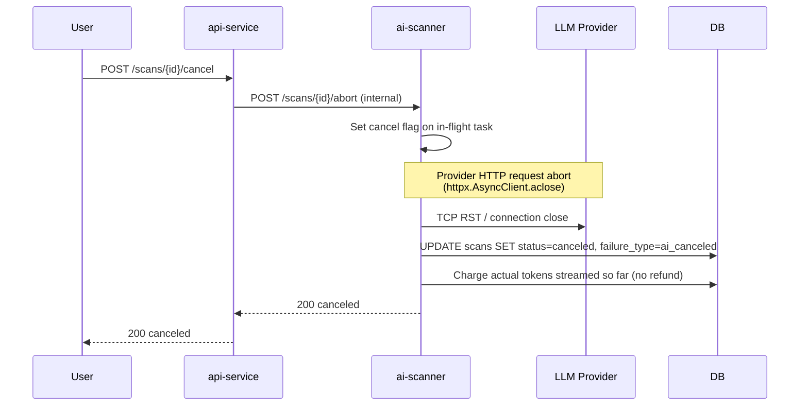

# Workflow: AI Scan Trigger

**Phase:** 10 — BYO AI Scanning
**Status:** Production (shipped 2026-06-20) — api-service v0.45.1, ai-scanner v0.2.4
**Cross-reference:** `TaskDocs-BlockSecOps/phases/10-phase-10-byo-ai-scanning/PHASE-10-BYO-AI-SCANNING-PLAN.md`

The end-to-end flow when a user triggers an AI scan. AI scanning is a scanner-type that slots into the existing scan dispatch pipeline alongside the 17 SAST scanners; this doc focuses on what is different from a standard SAST scanner trigger.

**Phase 1 constraints (as shipped):**
- Only `managed-claude` is live. BYO adapters (`anthropic`, `openai`, `gemini`) are wired but return `ai_provider_error` and are displayed as "Phase 2" in the dashboard.
- `scanner_ids=["ai"]` in a batch scan request is silently skipped with a server-side warning log; AI must be triggered as a standalone scan.
- The per-org `ai_scanning_enabled` flag must be set via direct DB UPDATE until the org-admin UI toggle ships in Phase 2.

## High-level sequence

```mermaid
sequenceDiagram
    autonumber
    participant U as User (Dashboard / CI)
    participant API as api-service
    participant DB as PostgreSQL
    participant AI as ai-scanner
    participant V as Vault
    participant LLM as LLM Provider<br/>(Anthropic / OpenAI / Gemini)

    U->>API: POST /api/v1/scans<br/>{scanner_ids: ["ai"], ai_mode: "structured",<br/>ai_provider: "managed-claude",<br/>ai_sensitivity_acknowledged: true}
    API->>DB: SELECT organizations.ai_scanning_enabled
    alt Org has not opted in
        API-->>U: 400 ai_org_disabled<br/>"Org admin must enable AI scanning"
    end
    API->>DB: SELECT contracts.ai_processing_disabled
    alt Contract is sensitivity-tagged
        API-->>U: 400 ai_contract_blocked<br/>"This contract is flagged 'no AI processing'"
    end
    API->>DB: INSERT scans (status=queued, scanners_used=[ai])
    Note over API,AI: Fire-and-forget: asyncio.create_task dispatches<br/>to ai-scanner; api-service returns scan_id immediately
    API-->>U: 202 {scan_id, status: "queued"}
    API->>AI: POST /scans/{scan_id}/ai-trigger (async task)<br/>X-Internal-Service-Token
    AI->>DB: Atomic reserve token budget<br/>UPDATE orgs SET tokens_used += est WHERE tokens_used + est <= cap
    alt Reservation failed — over per-scan cap
        AI->>DB: UPDATE scans SET status=failed, failure_type=ai_token_cap_exceeded
    end
    alt Reservation failed — monthly quota
        AI->>DB: UPDATE scans SET status=failed, failure_type=ai_quota_exceeded
    end
    alt Provider = managed-claude (Phase 1 — only live path)
        AI->>V: Read APOGEE_ANTHROPIC_KEY (cached 5min)
    else Provider = byo (Phase 2 — returns ai_provider_error today)
        AI->>DB: SELECT byo_llm_keys WHERE org_id + provider
        AI->>AI: AES-256-GCM decrypt with KEK from Vault
    end
    AI->>AI: Load prompt (solidity/v1/structured.md)
    AI->>AI: Build context<br/>(source + imports + SAST findings + dedup fingerprint)
    AI->>AI: Apply prompt-injection fence<br/>(XML+CDATA wrap)
    AI->>LLM: HTTPS messages.create()<br/>system + user prompt + contract context
    LLM-->>AI: Response (JSON findings)
    AI->>AI: Output schema validator<br/>(reject malformed; line-number sanity check)
    alt Validation failed
        AI->>DB: UPDATE scans SET status=failed, failure_type=ai_output_invalid
        AI->>DB: Refund unused output tokens
    end
    AI->>DB: INSERT vulnerabilities (one row per finding)
    AI->>DB: INSERT ai_scan_metadata (tokens, cost, provider, model, prompt_version)
    AI->>DB: UPDATE scans SET status=completed

    loop User polls (existing scan-status endpoint)
        U->>API: GET /api/v1/scans/{id}
        API->>DB: SELECT scans + JOIN ai_scan_metadata
        API-->>U: scan + findings + AI metadata
    end
```

## Permissions gates (in order)

1. **JWT auth** — standard for all `/scans` POSTs
2. **Tier check** — `tiers.json` `aiScan.{tier}.managedClaudeAllowed` or `byoAllowed`
3. **Org opt-in** — `organizations.ai_scanning_enabled = true`
4. **Per-contract sensitivity** — `contracts.ai_processing_disabled = false`
5. **User consent** — `users.ai_consent_at IS NOT NULL` (DPA acknowledged)
6. **Token budget available** — atomic reservation per `quota_service.py`

Any gate failure short-circuits with a structured `failure_type` + readable `error_message` that surfaces in the scan list via the failure-label-renderer shipped in PR #225.

## Failure-mode summary

| `failure_type` | When | User-visible label | Tokens charged? |
|---|---|---|---|
| `ai_org_disabled` | Org has not opted in (`ai_scanning_enabled=false`) | "AI scanning not enabled for your organization" | No |
| `ai_contract_blocked` | Contract has `ai_processing_disabled=true` | "This contract is flagged 'no AI processing'" | No |
| `ai_token_cap_exceeded` | Estimated input exceeds per-scan cap for tier | "Contract too large for your tier's per-scan token cap" | No |
| `ai_quota_exceeded` | Atomic monthly-budget reservation failed | "AI scan quota exceeded — upgrade or wait for reset" | No |
| `ai_safety_blocked` | Provider safety filter triggered | "AI provider refused the request (safety filter)" | Charged (input only) |
| `ai_output_invalid` | Output JSON schema validation failed (hallucinated fields or line numbers out of range) | "AI returned malformed output — no findings recorded" | Charged |
| `ai_provider_error` | Provider returned 5xx, network error, or BYO adapter returned error (Phase 2 adapters) | "AI provider returned an error" | Refunded |
| `ai_key_invalid` | BYO key rejected by provider on initial validation or at call time | "Your BYO API key was rejected by the provider" | No |
| `ai_system_error` | ai-scanner internal unhandled exception, or `AI_SCANNING_DISABLED=true` kill-switch active | "AI scan service is temporarily unavailable" | Refunded |
| `ai_canceled` | User canceled mid-scan via `POST /scans/{id}/cancel` | "Scan canceled" | Charged for tokens streamed up to abort |

## Cancel-mid-scan flow



Cancel = abort, prioritising budget over completeness. Partial findings already persisted (if any) remain.

## Idempotency

The `POST /scans/{scan_id}/ai-trigger` endpoint is idempotent on `scan_id`: a repeated call against an already-in-flight or terminal scan returns the current state, never starts a second LLM call.

## CI/CD parity

CI clients trigger AI scans via the same `POST /api/v1/scans` endpoint with `scanner_ids: ["ai"]` — no new API surface. Returns the same scan object; the client polls `GET /api/v1/scans/{id}` to completion.

## Cross-references

- `docs/pipelines/ai-scanner-build-pipeline.md`
- `docs/playbooks/ai-cost-kill-switch.md`
- `docs/playbooks/ai-quota-exhausted-runbook.md`
- `docs/workflows/scanner-execution-architecture.md` (existing SAST flow this parallels)
