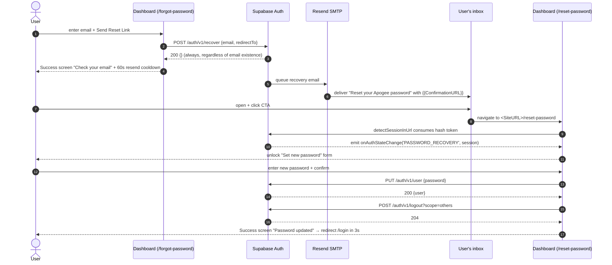
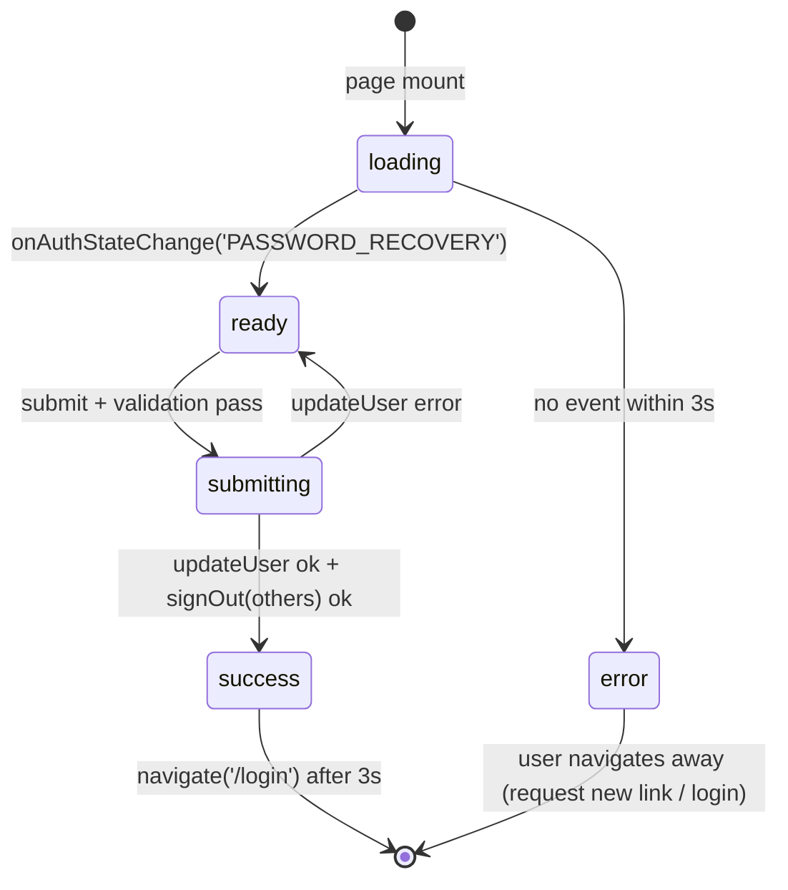
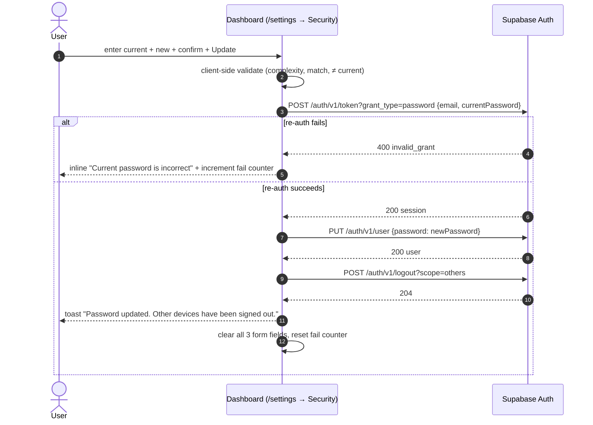
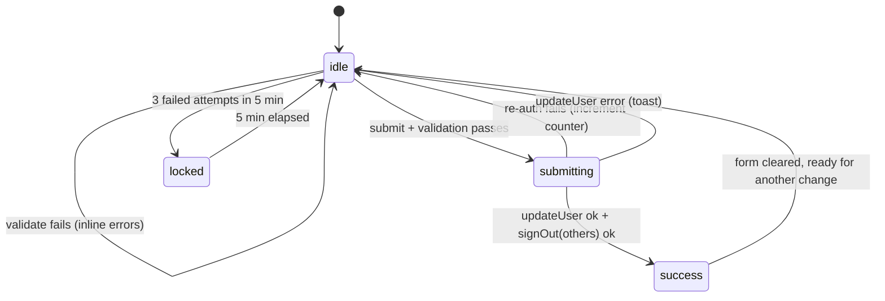

# Password Management Workflow

Covers both user-facing password flows on the Apogee platform: **password reset by email** (for users who can't log in) and **in-app password change** (for users who can). Both terminate with global session invalidation across all the user's other devices.

**Owner**: dashboard team
**Implementation surface**: `blocksecops-dashboard` v0.55.5+ (frontend-only — Supabase Auth handles tokens, hashing, and email dispatch)
**Standards**: [`encryption-standards.md`](../standards/encryption-standards.md), [`secure-coding.md`](../standards/secure-coding.md), [`api-endpoint-auth.md`](../standards/api-endpoint-auth.md)
**Feature tests**: [`docs/feature-tests/96-password-reset-and-change.md`](../feature-tests/96-password-reset-and-change.md)
**Playbook**: [`docs/playbooks/password-reset-customer-support.md`](../playbooks/password-reset-customer-support.md)
**Audit**: [`docs/audit/AUDIT-2026-06-21-password-reset-hardening.md`](../audit/AUDIT-2026-06-21-password-reset-hardening.md)

---

## 1. Forgot Password (email-link flow)

For unauthenticated users.

### State machine — `ResetPassword.tsx`

---

## 2. Change Password (in-app, /settings → Security)

For already-authenticated users.

### State machine — `ChangePasswordCard.tsx`

---

## Security properties enforced

| Property | Where enforced | Reference |
|---|---|---|
| Recovery token single-use, server-validated | Supabase Auth | Supabase managed |
| Recovery token 1-hour expiry | Supabase Auth config | OTP expiry 3600s |
| Password hashed bcrypt cost ≥12 | Supabase Auth | `encryption-standards.md` |
| Email-enumeration resistance | Supabase `/auth/v1/recover` returns 200 regardless | OWASP ASVS 2.5.1 |
| Session invalidation on password change | `supabase.auth.signOut({scope:'others'})` after every update | OWASP ASVS 3.3.1 |
| Verify-identity-before-sensitive-op (in-app change) | Re-auth via `signInWithPassword` before `updateUser` | OWASP ASVS 4.2.1 |
| Rate limit on recovery request | Supabase server-side (default 4/hr per address) + dashboard 60s UI cooldown | OWASP ASVS 2.2.1 |
| Rate limit on re-auth attempts (in-app) | Dashboard client-side 3-in-5min lock + Supabase server-side | OWASP ASVS 11.1.1 |
| No plaintext credentials persisted client-side | Form state cleared on success; passwords only held in component state during submit | — |
| Transport encryption | HTTPS-only Supabase + Resend | `encryption-standards.md` |
| DKIM/SPF/DMARC on sender domain | Resend domain verification | Email deliverability standard |

---

## What this workflow is NOT

- **NOT api-service mediated.** The dashboard talks to Supabase Auth directly using the anon key. api-service only validates JWTs presented by already-authenticated requests via `get_current_user` in `src/infrastructure/auth/middleware.py`.
- **NOT a custom token store.** No `password_reset_tokens` table in our DB; Supabase manages the recovery token internally. Migration `097` is therefore NOT introduced for this work.
- **NOT a place for MFA.** Second-factor enforcement is a separate feature; password change does not currently require an MFA challenge (logged in + current password is the gate).
