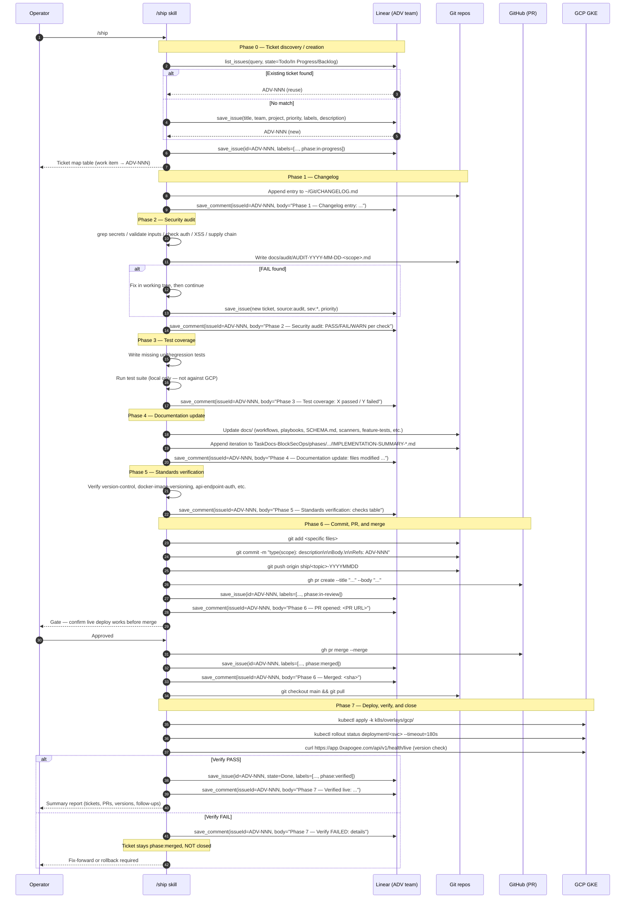
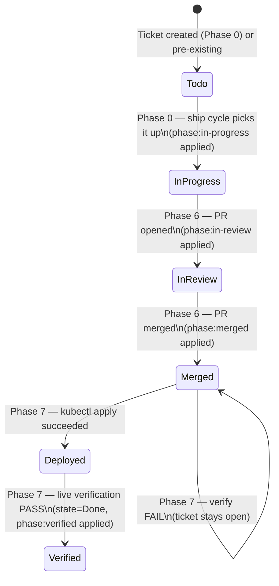

# Workflow: /ship Cycle (Linear-Integrated)

**Version:** 2.0.0
**Last Updated:** 2026-06-21
**Status:** Active
**Cross-reference:** `/home/pwner/Git/.claude/commands/ship.md` (runtime skill), `TaskDocs-BlockSecOps/DOCUMENTATION-UPDATE-2026-06-21-LINEAR-INTEGRATION-AND-SHIP-V2.md`

The end-to-end flow when a developer runs `/ship` to move a set of changes from working tree to production with a Linear audit trail.

---

## Trigger

The operator runs `/ship` in a Claude Code session with pending changes in one or more repos under `~/Git/`. The skill executes phases 0 through 7 in strict sequence; no phase runs in parallel with another, and no phase is skipped unless the change is provably zero-impact (see Phase 4 skip condition in the runtime skill).

---

## Phase Overview

| Phase | Name | Produces |
|-------|------|---------|
| 0 | Linear ticket discovery / creation | Ticket map printed to operator; all work items have ADV-NNN IDs |
| 1 | Changelog | Entry appended to `~/Git/CHANGELOG.md`; Linear comment posted |
| 2 | Security audit | Dated audit report in `docs/audit/`; all FAILs fixed before Phase 3 |
| 3 | Test coverage | Unit + regression tests written or confirmed present; suite run; Linear comment posted |
| 4 | Documentation update | All drifted docs corrected; TaskDocs entry appended; Linear comment posted |
| 5 | Standards verification | All standards checks PASS or FIXED; Linear comment posted |
| 6 | Commit, PR, and merge | Feature branch pushed; PR opened; owner confirms live deploy; PR merged |
| 7 | Deploy, verify, and close | Deployed to GCP; live verification run; Linear tickets closed as Done |

---

## Sequence Diagram



---

## Linear Ticket Lifecycle



---

## Required Ticket Fields

Every Linear ticket created or updated by /ship must have:

| Field | Rule |
|-------|------|
| `title` | One-line imperative: "Fix X" / "Add Y" / "Close BSO-SEC-NNN" |
| `team` | `Advanced Blockchain Security` (id `83f0063d-fc9c-4e23-a2f1-1a3ade496494`) |
| `project` | One of the five Apogee projects (Core Platform / Scanner Library / Infrastructure / Documentation / Websites) |
| `priority` | REQUIRED. `1`=Urgent, `2`=High, `3`=Medium, `4`=Low. No ticket may be created without one. |
| `labels` | At minimum: one `type:*` + one `repo:*` + `source:ship-cycle`. Add `sev:*` for security findings. |
| `phase label` | Applied and updated at each phase transition (see lifecycle above). |

---

## Commit Footer Convention

All commit bodies must end with the Linear ticket ID on its own line:

```
Refs: ADV-NNN
```

or, when the commit fully closes the ticket:

```
Closes: ADV-NNN
```

This is the bidirectional link between the Git commit and the Linear ticket. See `docs/standards/version-control-standards.md` — Linear Ticket Reference section.

---

## Merge Gate

Per `feedback_test_before_merge.md`, the PR is opened in Phase 6 but the merge is gated on operator confirmation that the live deploy works. The skill surfaces this gate explicitly in chat before calling `gh pr merge`. The skill does not auto-merge without operator acknowledgment.

---

## Anti-Patterns the Skill Refuses

- Creating a ticket without a Priority.
- Creating a ticket without at least one `type:*` + `repo:*` label.
- Closing a ticket before live verification passes.
- Hardcoding `TestPass123` or any literal password anywhere (BSO-SEC-048 precedent).
- Mentioning Claude, Claude Code, or Anthropic in commits, PRs, or ticket comments.
- Running phases in parallel.
- Skipping Phase 0 because "it's a small change."

---

## Related Documents

- `/home/pwner/Git/.claude/commands/ship.md` — runtime skill (authoritative)
- `docs/playbooks/ship-with-linear-playbook.md` — operator how-to, gate handling, partial-failure recovery
- `docs/standards/version-control-standards.md` — commit format, PR requirements, Linear ticket reference
- `TaskDocs-BlockSecOps/DOCUMENTATION-UPDATE-2026-06-21-LINEAR-INTEGRATION-AND-SHIP-V2.md` — dated change record
