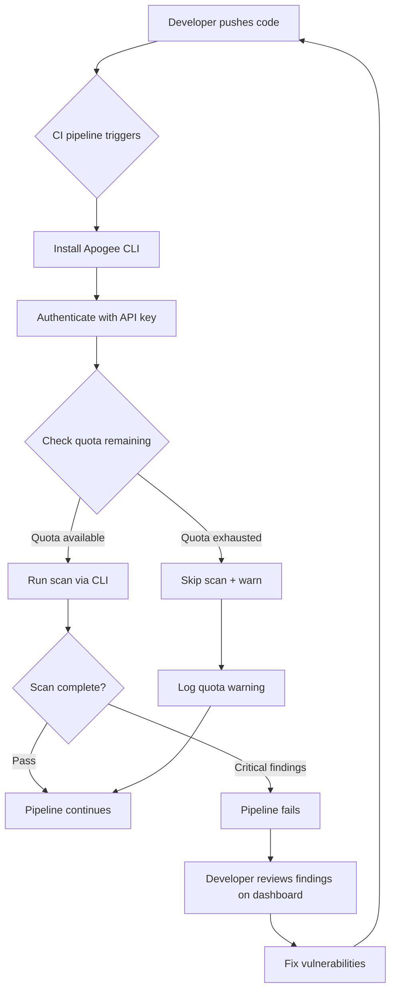

# Developer Tier: CI/CD Integration Workflow (CLI)

**Version:** 1.0.0
**Last Updated:** March 12, 2026
**Tier:** Developer (Free)
**Status:** Active

## Overview

Developer (free) tier users integrate smart contract security scanning into CI/CD pipelines using the **Apogee CLI**. The CLI is the only CI/CD integration method available on the free tier — the Integrations Hub dashboard UI and direct REST API access require Starter ($299/mo) or higher.

This workflow documents how scanning fits into a typical development pipeline for free tier users, including quota management and upgrade paths.

---

## Tier Constraints

| Constraint | Developer (Free) Limit |
|------------|----------------------|
| Monthly contracts | 3 |
| Concurrent scans | 1 |
| Result retention | 7 days |
| API access | CLI only (no direct REST API) |
| Webhooks | Not available |
| Export reports | Not available |
| Integrations Hub | Not available |
| AI explanations | Not available |
| Support | Community |

> **Note:** The CLI authenticates via API key internally but does not count against the `monthlyApiCallsLimit` (which is 0 for developer tier). CLI scan operations use the web request path.

---

## Workflow Diagram

---

## Workflow Phases

### Phase 1: Pipeline Setup (One-Time)

1. Install the Apogee CLI in your CI environment
2. Store your API key as a CI secret (e.g., `APOGEE_API_KEY`)
3. Configure scan thresholds (which severities block the pipeline)

### Phase 2: Per-Commit Scanning

1. CI pipeline triggers on push/PR
2. CLI checks available quota before scanning
3. If quota is available, CLI submits the scan and waits for results
4. CLI exits with non-zero code if critical/high vulnerabilities are found
5. Pipeline passes or fails based on exit code

### Phase 3: Results Review

1. Developer views scan results on the Apogee dashboard (`https://app.0xapogee.com`)
2. Results are retained for **7 days** on the free tier
3. No export or AI explanation features available — review raw findings only

### Phase 4: Quota Management

1. Track monthly usage: `apogee quota status`
2. Plan scans strategically — 3 per month means ~1 per week on key branches
3. Consider scanning only on `main` branch merges, not every PR
4. Upgrade to Starter ($299/mo) for 15 contracts/month and 90-day retention

---

## Recommended CI/CD Strategy for Free Tier

With only 3 scans per month, scan strategically:

| Strategy | When to Scan | Scans/Month |
|----------|-------------|-------------|
| **Main-only** (recommended) | On merge to `main` | ~2-4 |
| **Weekly scheduled** | Cron schedule (e.g., Mondays) | ~4 |
| **Manual trigger** | Developer triggers manually | Variable |
| **PR-on-every-push** | Not recommended | Exhausts quickly |

> **Best practice for free tier:** Scan on merge to `main` only. Use `apogee quota status` before scanning to avoid wasting scans on intermediate commits.

---

## Exit Codes

The CLI returns structured exit codes for CI/CD integration:

| Exit Code | Meaning | CI/CD Action |
|-----------|---------|-------------|
| `0` | Scan passed (no findings above threshold) | Pipeline continues |
| `1` | Scan failed (findings above threshold) | Pipeline fails |
| `2` | Quota exceeded | Pipeline continues with warning |
| `3` | Authentication error | Pipeline fails |
| `4` | Network/service error | Pipeline fails |

---

## Upgrade Path

When you outgrow the free tier:

| Need | Upgrade To | Price |
|------|-----------|-------|
| More than 3 contracts/month | Starter | $299/mo |
| CI/CD dashboard configuration | Starter | $299/mo |
| Webhook notifications | Starter | $299/mo |
| Direct REST API access | Growth | $699/mo |
| Concurrent scans (5) | Growth | $699/mo |
| AI vulnerability explanations | Starter (50/mo) | $299/mo |

---

## Related Documentation

- [CLI Installation Playbook](../../../playbooks/cli-installation.md) — Install and configure the CLI
- [Developer Tier CI/CD Pipeline](../../../pipelines/tiers/developer/cicd-cli-pipeline.md) — Pipeline architecture
- [Developer Tier CI/CD Playbook](../../../playbooks/tiers/developer/cicd-cli-integration.md) — Step-by-step setup
- [Smart Contract Scanning Workflow](../../smart-contract-scanning-workflow.md) — Full scanning workflow
- [Tier Standards](../../../standards/tier-standards.md) — Complete tier comparison
